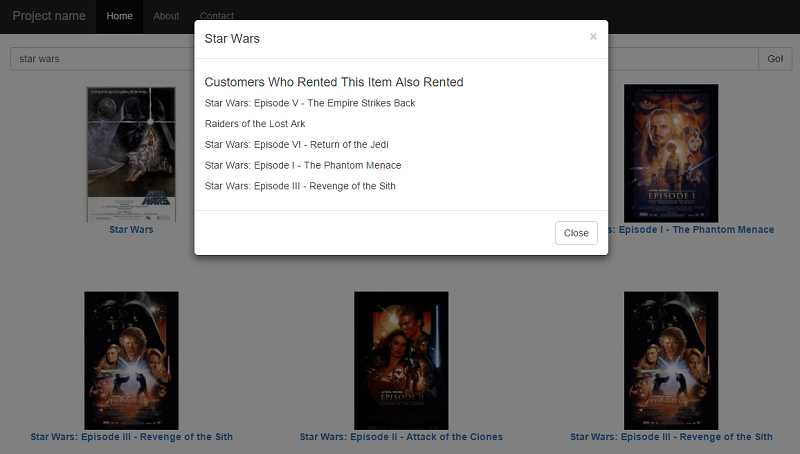

<properties
   pageTitle="Azure Search "Frequently Bought Together" recommendations | Microsoft Azure | Apache Mahout | Azure Machine Learning"
   description="Sample code for adding Frequently Bought Together, New For You, or Also Bought recommendations to an Azure Search application using Apache Mahout or Azure Machine Learning"
   services="search"
   documentationCenter=""
   authors="liamca"
   manager="pablocas"
   editor=""
   tags="machine learning"/>

<tags
   ms.service="search"
   ms.devlang="dotnet"
   ms.workload="search"
   ms.topic="article"
   ms.tgt_pltfrm="na"
   ms.date="11/12/2015"
   ms.author="liamca"/>

# Azure Search "Frequently Bought Together" recommendations

If you've shopped online, you've probably noticed 'Frequently Bought Together' or 'Customers Who Bought This Item Also Bought' or even a 'New For You' list that presents additional goods or services for your consideration. Generally, this data is compiled by online retailers based on the purchasing history of many customers, or just the consumer preference data that's unique to you. The ability to offer relevant, consumer-directed recommendations via search is a powerful addition to not only commercial applications, but also sites that provide multi-media content or information.

In Azure Search applications, you can implement recommendations by writing some extra code that brings in data and services used to identify patterns and relationships in the data, and then transform it into recommendations relevant to your users. 

[This sample demonstrates how](https://github.com/liamca/azure-search-recommendations), using [Apache Mahout]() for the recommendations engine.

In the rest of this article, I'll walk you through the sample code that adds 'Frequently Rented Together' recommendations using sample data about movie rentals.

## What is a Recommendation?

*Recommendations* is a technique for surfacing more items from a catalog based on existing search User activity (such as web logs) used to recommend items and improve conversion.  

Recommendation engines are often trained using past customer activity or by collecting data directly from a digital store. in this sample, I use Apache Mahout to compile recommendations data.

Common recommendations include: 
- Frequently Bought Together: a customer who bought this also bought that
- Customer to Item recommendations: a customer like you also bought that

## Creating the Azure Search Index

- Open the solution AzureSearchMovieRecommendations.sln and set ImportAzureSearchIndexData as the Default Project.  
- Open Program.cs within ImportAzureSearchIndexData and alter SearchServiceName and SearchApiKey to point to your Azure Search service
- Download hetrec2011-movielens-2k.zip from http://grouplens.org/datasets/hetrec-2011/ and copy the files Movies.dat & user_ratedmovies.dat to the \ImportAzureSearchIndexData\data
- Run the project to create an index and load Movie data 
- At the end, the application will execute a test search

## Create a simple HTML application to Search Movies

A completed JavaScript web application that allows you to query the Azure Search index can be found at: 
\WebSite\starter-template-complete

If you would like to walk through the demo from scratch, the original CSS can be found here:
\WebSite\starter-template

Open the search.js file within \WebSite\starter-template-complete and update the apiKey and azureSearchService with your Azure Search service details.

You should be able to open this file in a browser such as Chrome to now view movies by typing into the search box.

## Command for executing Creating Recommendations using Mahout

- Upload the file data\movie_usage.txt to Azure Blob Storage 
- Create an HDInsight instance (enabling Remote Desktop) and connect to the machine through Remote Desktop (available from the Azure Classic Portal)
- From the HDInsight machine, open the "Hadoop Command Line"
- Change to the Mahout bin directory under c:\apps\dist. Mine looks like this, but you can get a more recent version of Mahout
	C:\apps\dist\mahout-1.0.0.2.3.3.0-2992\bin
- Execute the following command line where you replace the [CONTAINER] & [STORAGEACT] with your Azure Storage details (where you placed the movie_usage.txt file):

    mahout itemsimilarity -s SIMILARITY_COSINE --input "wasb://[CONTAINER]@[STORAGEACT].blob.core.windows.net/movie_usage.txt" --output "wasb://[CONTAINER]@[STORAGEACT].blob.core.windows.net/output/" --tempDir "wasb://[CONTAINER]@[STORAGEACT].blob.core.windows.net/temp" -m 5

This should take quite a few minutes to complete, but when it does, your storage container should contain the following file which will include your movie recommendations:
/movies/output/part-r-00000

This file has 3 columns: [Item ID of Movie], [Item ID of Recommendations related to this Movie], [Similarity Percentage]

## Importing Data from Mahout to Azure Search

The program that created the Azure Search index also created a field called `Recommendations` which is of type Collection (which is like a comma-separated set of strings). We will merge the data created in the previous step with this Azure Search index.  

- From the Visual Studio solution AzureSearchMovieRecommendations.sln, open Program.cs within MahoutOutputLoader.
- Update SearchServiceName and SearchApiKey with your Azure Search service details
- Update StorageApiKey and StorageAccountName with your Azure Storage account details for which you stored your Mahout product recommendations file
- Run the application to merge the data
 
## Visualizing the Recommendations
At this point you should be able to go back to the web application and click on any of the movies to see recommendations.

If you want to see how the recommendations were returned when you clicked on this image, open Search.js and look at the openMovieDetails() function.

## Credit

Data was provided by GroupLens (http://grouplens.org/datasets/hetrec-2011/)

Please refer to this page for details on the licensing of this data: http://files.grouplens.org/datasets/hetrec2011/hetrec2011-movielens-readme.txt

