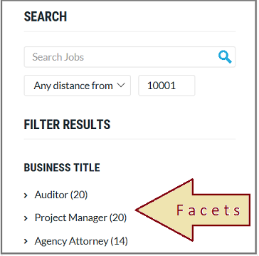

# How to build a facet filter in Azure Search 

Faceted navigation is used for self-directed filtering on query results in a search app, where your application offers UI controls for scoping search to groups of documents (for example, categories or brands), and Azure Search provides the data structure to back the experience. In this article, quickly review the basic steps for creating a faceted navigation structure backing the search experience you want to provide. 

> [!div class="checklist"]
> * Choose fields for filtering and faceting
> * Set attributes on the field
> * Build the index and load data
> * Add facet filters to a query
> * Handle results

Facets are dynamic and returned on a query. Search responses bring with them the facet categories used to navigate the results. If you aren't familiar with facets, the following example is an illustration of a facet navigation structure.

  

New to faceted navigation and want more detail? See [How to implement faceted navigation in Azure Search](search-faceted-navigation.md).

## Choose fields

Facets can be calculated over single value fields as well as collections. Fields that work best in faceted navigation have low cardinality: a small number of distinct values that repeat throughout documents in your search corpus (for example, a list of colors, countries/regions, or brand names). 

Faceting is enabled on a field-by-field basis when you create the index by setting the `facetable` attribute to `true`. You should generally also set the `filterable` attribute to `true` for such fields so that your search application can filter on those fields based on facets that the end user selects. 

When creating an index using the REST API, any [field type](https://docs.microsoft.com/rest/api/searchservice/supported-data-types) that could possibly be used in faceted navigation is marked as `facetable` by default:

+ `Edm.String`
+ `Edm.DateTimeOffset`
+ `Edm.Boolean`
+ Numeric field types: `Edm.Int32`, `Edm.Int64`, `Edm.Double`
+ Collections of the above types (for example, `Collection(Edm.String)` or `Collection(Edm.Double)`)

You cannot use `Edm.GeographyPoint` or `Collection(Edm.GeographyPoint)` fields in faceted navigation. Facets work best on fields with low cardinality. Due to the resolution of geo-coordinates, it is rare that any two sets of co-ordinates will be equal in a given dataset. As such, facets are not supported for geo-coordinates. You would need a city or region field to facet by location.

## Set attributes

Index attributes that control how a field is used are added to individual field definitions in the index. In the following example, fields with low cardinality, useful for faceting, consist of: `category` (hotel, motel, hostel), `tags`, and `rating`. These fields have the `filterable` and `facetable` attributes set explicitly in the following example for illustrative purposes. 

> [!Tip]
> As a best practice for performance and storage optimization, turn faceting off for fields that should never be used as a facet. In particular, string fields for unique values, such as an ID or product name, should be set to `"facetable": false` to prevent their accidental (and ineffective) use in faceted navigation.


```json
{
  "name": "hotels",  
  "fields": [
    { "name": "hotelId", "type": "Edm.String", "key": true, "searchable": false, "sortable": false, "facetable": false },
    { "name": "baseRate", "type": "Edm.Double" },
    { "name": "description", "type": "Edm.String", "filterable": false, "sortable": false, "facetable": false },
    { "name": "description_fr", "type": "Edm.String", "filterable": false, "sortable": false, "facetable": false, "analyzer": "fr.lucene" },
    { "name": "hotelName", "type": "Edm.String", "facetable": false },
    { "name": "category", "type": "Edm.String", "filterable": true, "facetable": true },
    { "name": "tags", "type": "Collection(Edm.String)", "filterable": true, "facetable": true },
    { "name": "parkingIncluded", "type": "Edm.Boolean",  "filterable": true, "facetable": true, "sortable": false },
    { "name": "smokingAllowed", "type": "Edm.Boolean", "filterable": true, "facetable": true, "sortable": false },
    { "name": "lastRenovationDate", "type": "Edm.DateTimeOffset" },
    { "name": "rating", "type": "Edm.Int32", "filterable": true, "facetable": true },
    { "name": "location", "type": "Edm.GeographyPoint" }
  ]
}
```

> [!Note]
> This index definition is copied from [Create an Azure Search index using the REST API](https://docs.microsoft.com/azure/search/search-create-index-rest-api). It is identical except for superficial differences in the field definitions. The `filterable` and `facetable` attributes are explicitly added on `category`, `tags`, `parkingIncluded`, `smokingAllowed`, and `rating` fields. In practice, `filterable` and `facetable` would be enabled by default on these fields when using the REST API. When using the .NET SDK, these attributes must be enabled explicitly.

## Build and load an index

An intermediate (and perhaps obvious) step is that you have to [build and populate the index](https://docs.microsoft.com/azure/search/search-get-started-dotnet#1---create-index) before formulating a query. We mention this step here for completeness. One way to determine whether the index is available is by checking the indexes list in the [portal](https://portal.azure.com).

## Add facet filters to a query

In application code, construct a query that specifies all parts of a valid query, including search expressions, facets, filters, scoring profiles– anything used to formulate a request. The following example builds a request that creates facet navigation based on the type of accommodation, rating, and other amenities.

```csharp
var sp = new SearchParameters()
{
    ...
    // Add facets
    Facets = new[] { "category", "rating", "parkingIncluded", "smokingAllowed" }.ToList()
};
```

### Return filtered results on click events

When the end user clicks on a facet value, the handler for the click event should use a filter expression to realize the user's intent. Given a `category` facet, clicking the category "motel" is implemented with a `$filter` expression that selects accommodations of that type. When a user clicks "motel" to indicate that only motels should be shown, the next query the application sends includes `$filter=category eq 'motel'`.

The following code snippet adds category to the filter if a user selects a value from the category facet.

```csharp
if (!String.IsNullOrEmpty(categoryFacet))
    filter = $"category eq '{categoryFacet}'";
```

If the user clicks on a facet value for a collection field like `tags`, for example the value "pool", your application should use the following filter syntax: `$filter=tags/any(t: t eq 'pool')`

## Tips and workarounds

### Initialize a page with facets in place

If you want to initialize a page with facets in place, you can send a query as part of page initialization to seed the page with an initial facet structure.

### Preserve a facet navigation structure asynchronously of filtered results

One of the challenges with facet navigation in Azure Search is that facets exist for current results only. In practice, it's common to retain a static set of facets so that the user can navigate in reverse, retracing steps to explore alternative paths through search content. 

Although this is a common use case, it's not something the facet navigation structure currently provides out-of-the-box. Developers who want static facets typically work around the limitation by issuing two filtered queries: one scoped to the results, the other used to create a static list of facets for navigation purposes.

## See also

+ [Filters in Azure Search](search-filters.md)
+ [Create Index REST API](https://docs.microsoft.com/rest/api/searchservice/create-index)
+ [Search Documents REST API](https://docs.microsoft.com/rest/api/searchservice/search-documents)
