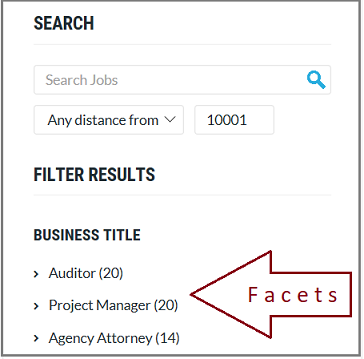

# How to build a facet filter in Azure Search 

Faceted navigation is used for self-directed filtering on query results in a search app, where your application offers UI controls for scoping search to groups of dcuments (for example, categories or brands), and Azure Search provides the data stucture to back the experience. In this article, quickly review the basic steps for creating a faceted navigation structure backing the search experience you want to provide. 

> [!div class="checklist"]
> * Choose fields for filtering and faceting
> * Set attributes on the field
> * Build the index and load data
> * Add facet filters to a query
> * Handle results

Facets are dynamic and returned on a query. Search responses bring with them the facet categories used to navigate the results. If you aren't familiar with facets, the following example is an illustration of a facet navigation structure.

  

New to faceted navigation and want more detail? See [How to implement faceted navigation in Azure Search](search-faceted-navigation.md).

## Choose fields

Facets can be based on simple or complex field types in Azure Search. Fields that work best in faceted navigation have low cardinality: a small number of distinct values that repeat throughout documents in your search corpus (for example, a list of colors, countries, or brand names). 

Faceting is enabled on a field-by-field basis when you create the index, by setting the following attributes to TRUE: `filterable`, `facetable`. Only filterable fields can be faceted.

Any [field type](https://docs.microsoft.com/rest/api/searchservice/supported-data-types) that could possibly be used in faceted navigation is marked as "facetable" by default:

+ Edm.String
+ Edm.DateTimeOffset
+ Edm.Boolean
+ Edm.Collections (see [How to facet complex data types](#facet-complex-fields) later in this article.)
+ Numeric field types: Edm.Int32, Edm.Int64, Edm.Double

You cannot use Edm.GeographyPoint in faceted navigation. Facets are constructed from human readable text or numbers. As such, facets are not supported for geo-coordinates. You would need a city or region field to facet by location.

## Set attributes

Index attributes that control how a field is used are added to individual field definitions in the index. In the following example, fields with low cardinality, useful for faceting, consist of: category (hotel, motel, hostel), amenities, and ratings. 

In the REST API, faceting and filtering are enabled by default, which means you only need to explicitly set the attributes when you want to turn them off. Although it is not technically required, we show the attributions in the following example for instructional purposes.

> [!Tip]
> As a best practice for performance and storage optimization, turn faceting off for fields that should never be used as a facet. In particular, string fields for singleton values, such as an ID or product name, should be set to "Facetable": false to prevent their accidental (and ineffective) use in faceted navigation.


```http
{
    "name": "hotels",  
    "fields": [
        {"name": "hotelId", "type": "Edm.String", "key": true, "searchable": false, "sortable": false, "facetable": false},
        {"name": "baseRate", "type": "Edm.Double"},
        {"name": "description", "type": "Edm.String", "filterable": false, "sortable": false, "facetable": false},
        {"name": "description_fr", "type": "Edm.String", "filterable": false, "sortable": false, "facetable": false, "analyzer": "fr.lucene"},
        {"name": "hotelName", "type": "Edm.String", "facetable": false},
        {"name": "category", "type": "Edm.String", "filterable": true, "facetable": true},
        {"name": "tags", "type": "Collection(Edm.String)", "filterable": true, "facetable": true},
        {"name": "parkingIncluded", "type": "Edm.Boolean",  "filterable": true, "facetable": true, "sortable": false},
        {"name": "smokingAllowed", "type": "Edm.Boolean", "filterable": true, "facetable": true, "sortable": false},
        {"name": "lastRenovationDate", "type": "Edm.DateTimeOffset"},
        {"name": "rating", "type": "Edm.Int32", "filterable": true, "facetable": true},
        {"name": "location", "type": "Edm.GeographyPoint"}
    ]
}
```

> [!Note]
> This index definition is copied from [Create an Azure Search index using the REST API](https://docs.microsoft.com/azure/search/search-create-index-rest-api). It is identical except for superficial differences in the field definitions. Filterable and facetable attributes are explicitly added on category, tags, parkingIncluded, smokingAllowed, and rating fields. In practice, you get filterable and facetable for free on Edm.String, Edm.Boolean, and Edm.Int32 field types. The .NET SDK follows different rules for filters and facets. If you are using the .NET SDK, filters and facets have to be explicitly included in the field definition.

## Build and load an index

An intermediate (and perhaps obvious) step is that you have to [build and populate the index](https://docs.microsoft.com/azure/search/search-create-index-dotnet#create-the-index) on your Azure Search service as a prerequisite to submitting the query. We mention this step here for completeness. If you can see your index in the [Azure portal](https://portal.azure.com) and view the index definition, you can accept that as proof this step is complete.

## Add facet filters to a query

In application code, construct a query that returns a faceted navigation data structure. Build the UI to visualize the structure. Add logic to filter or trim results when a user clicks a facet.

MULTI-SELECT
https://social.msdn.microsoft.com/Forums/azure/en-US/4b68aeb2-396a-45fd-b433-49cb92d37324/how-can-you-handle-multiselects-with-azure-search?forum=azuresearch

(1)
By searching within a facet do you mean searching within say only those documents where category is "c1"? If so, then you can add &$filter=category eq 'c1' to your URL. If category is a multi-value field then do $filter=category/any(c: c eq 'c1')

(2)
To assign multiple categories to a document, you need the category field to be of type "Collection(Edm.String)". It is still possible to facet on such fields.

The syntax for uploading a string collection is pretty straightforward in JSON:

{
    "value": [
        {
            "@search.action": "upload",
            "id": "123",
            "categories": ["a", "b", "c"]
        }
    }
}

(3) Trim the results via "select"


### Return a faceted navigation structure

One of the challenges with facet navigation in Azure Search is that facets exist for current results only. In practice, it's common to retain a static set of facets so that the user can navigate in reverse, retracing steps to explore alternative paths through search content. 

Although this is a common use case, it's not something the facet navigation structure currently provides out-of-the-box. Developers who want static facets typically work around the limitation by issuing two filtered queries: one scoped to the results, the other used to create a static list of facets for navigation purposes.


> [!Tip]
> If you want to initialize a page with facets in place, you can send a query as part of page initialization to seed the page with an initial facet structure.


### Add visualization

### Return filtered results on click events

The filter expression handles the click event on the facet value. Given a Category facet, clicking the category "motel" is implemented through a `$filter` expression that selects accommodations of that type.


## See also

+ [Filters in Azure Search](search-filters.md)
+ [How full text search works in Azure Search](search-lucene-query-architecture.md)
+ [Search Documents REST API](https://docs.microsoft.com/rest/api/searchservice/search-documents)

