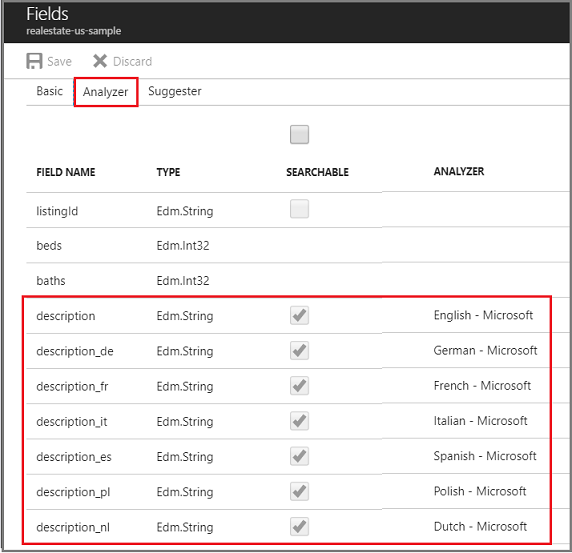

# How to filter by language in Azure Cognitive Search 

A key requirement in a multilingual search application is the ability to search over and retrieve results in the user's own language. In Azure Cognitive Search, one way to meet the language requirements of a multilingual app is to create a series of fields dedicated to storing strings in a specific language, and then constrain full text search to just those fields at query time.

Query parameters on the request are used to both scope the search operation, and then trim the results of any fields that don't provide content compatible with the search experience you want to deliver.

| Parameters | Purpose |
|-----------|--------------|
| **searchFields** | Limits full text search to the list of named fields. |
| **$select** | Trims the response to include only the fields you specify. By default, all retrievable fields are returned. The **$select** parameter lets you choose which ones to return. |

The success of this technique hinges on the integrity of field contents. Azure Cognitive Search does not translate strings or perform language detection. It is up to you to make sure that fields contain the strings you expect.

## Define fields for content in different languages

In Azure Cognitive Search, queries target a single index. Developers who want to provide language-specific strings in a single search experience typically define dedicated fields to store the values: one field for English strings, one for French, and so on. 

The following example is from the [real-estate sample](search-get-started-portal.md) which has several string fields containing content in different languages. Notice the language analyzer assignments for the fields in this index. Fields that contain strings perform better in full text search when paired with an analyzer engineered to handle the linguistic rules of the target language.

  

> [!Note]
> For code examples showing field definitions with languages analyzers, see [Define an index (.NET)](https://docs.microsoft.com/azure/search/search-create-index-dotnet) and [Define an index (REST)](search-create-index-rest-api.md).

## Build and load an index

An intermediate (and perhaps obvious) step is that you have to [build and populate the index](https://docs.microsoft.com/azure/search/search-create-index-dotnet) before formulating a query. We mention this step here for completeness. One way to determine whether the index is available is by checking the indexes list in the [portal](https://portal.azure.com).

## Constrain the query and trim results

Parameters on the query are used to limit search to specific fields and then trim the results of any fields not helpful to your scenario. Given a goal of constraining search to fields containing French strings, you would use **searchFields** to target the query at fields containing strings in that language. 

By default, a search returns all fields that are marked as retrievable. As such, you might want to exclude fields that don't conform to the language-specific search experience you want to provide. Specifically, if you limited search to a field with French strings, you probably want to exclude fields with English strings from your results. Using the **$select** query parameter gives you control over which fields are returned to the calling application.

```csharp
parameters =
    new SearchParameters()
    {
        searchFields = "description_fr" 
        Select = new[] { "description_fr"  }
    };
```
> [!Note]
> Although there is no $filter argument on the query, this use case is strongly affiliated with filter concepts, so it's presented as a filtering scenario.

## See also

+ [Filters in Azure Cognitive Search](search-filters.md)
+ [Language analyzers](https://docs.microsoft.com/rest/api/searchservice/language-support)
+ [How full text search works in Azure Cognitive Search](search-lucene-query-architecture.md)
+ [Search Documents REST API](https://docs.microsoft.com/rest/api/searchservice/search-documents)

