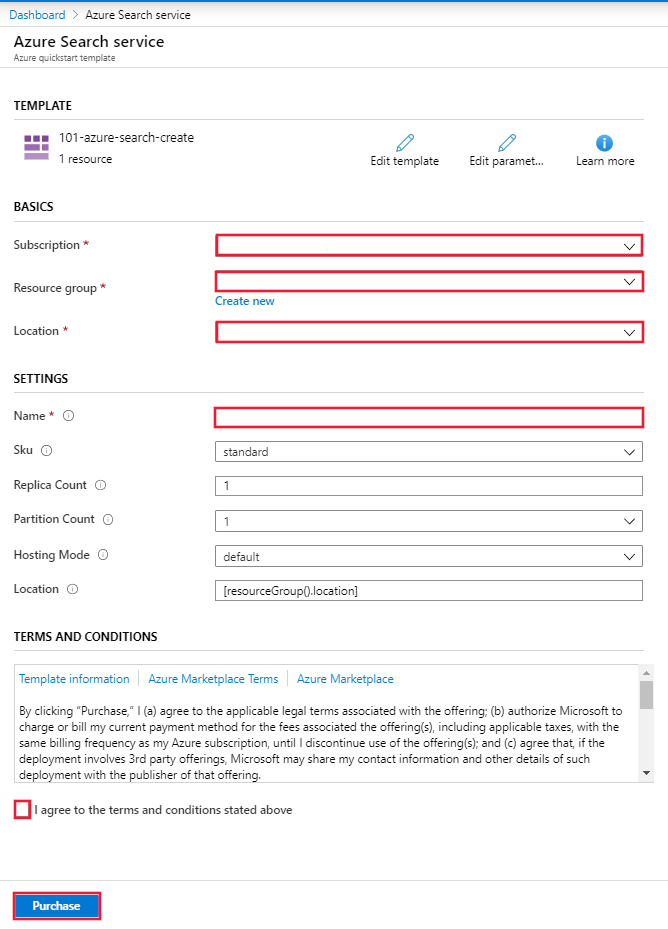

# Quickstart: Deploy Cognitive Search using an ARM template

This article walks you through the process for using an Azure Resource Manager template (ARM template) to deploy an Azure Cognitive Search resource in the Azure portal.

[!INCLUDE [About Azure Resource Manager](../../includes/resource-manager-quickstart-introduction.md)]

If your environment meets the prerequisites and you're familiar with using ARM templates, select the **Deploy to Azure** button. The template will open in the Azure portal.

## Prerequisites

If you don't have an Azure subscription, create a [free account](https://azure.microsoft.com/free/?WT.mc_id=A261C142F) before you begin.

## Review the template

The template used in this quickstart is from [Azure Quickstart Templates](https://azure.microsoft.com/resources/templates/101-azure-search-create/).

:::code language="json" source="~/quickstart-templates/quickstarts/microsoft.search/azure-search-create/azuredeploy.json":::

The Azure resource defined in this template:

- [Microsoft.Search/searchServices](/azure/templates/Microsoft.Search/searchServices): create an Azure Cognitive Search service

## Deploy the template

Select the following image to sign in to Azure and open a template. The template creates an Azure Cognitive Search resource.

The portal displays a form that allows you to easily provide parameter values. Some parameters are pre-filled with the default values from the template. You will need to provide your subscription, resource group, location, and service name. If you want to use Cognitive Services in an [AI enrichment](cognitive-search-concept-intro.md) pipeline, for example to analyze binary image files for text, choose a location that offers both Cognitive Search and Cognitive Services. Both services are required to be in the same region for AI enrichment workloads. Once you have completed the form, you will need to agree to the terms and conditions and then select the purchase button to complete your deployment.

> [!div class="mx-imgBorder"]
> 

## Review deployed resources

When your deployment is complete you can access your new resource group and new search service in the portal.

## Clean up resources

Other Cognitive Search quickstarts and tutorials build upon this quickstart. If you plan to continue on to work with subsequent quickstarts and tutorials, you may wish to leave this resource in place. When no longer needed, you can delete the resource group, which deletes the Cognitive Search service and related resources.

## Next steps

In this quickstart, you created a Cognitive Search service using an ARM template, and validated the deployment. To learn more about Cognitive Search and Azure Resource Manager, continue on to the articles below.

- Read an [overview of Azure Cognitive Search](search-what-is-azure-search.md).
- [Create an index](search-get-started-portal.md) for your search service.
- [Create a demo app](search-create-app-portal.md) using the portal wizard.
- [Create a skillset](cognitive-search-quickstart-blob.md) to extract information from your data.
