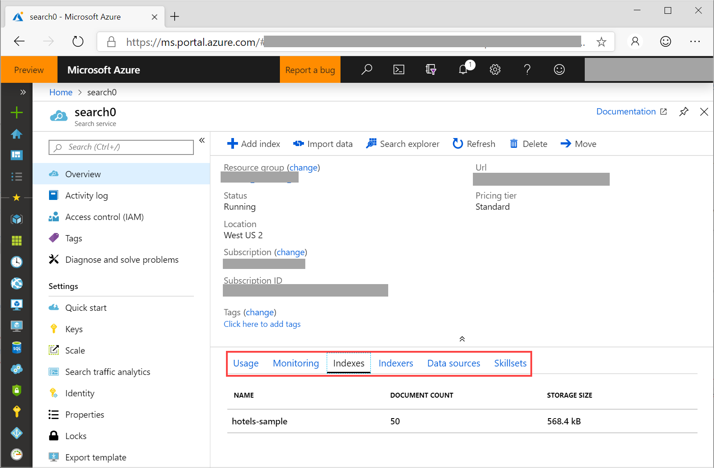
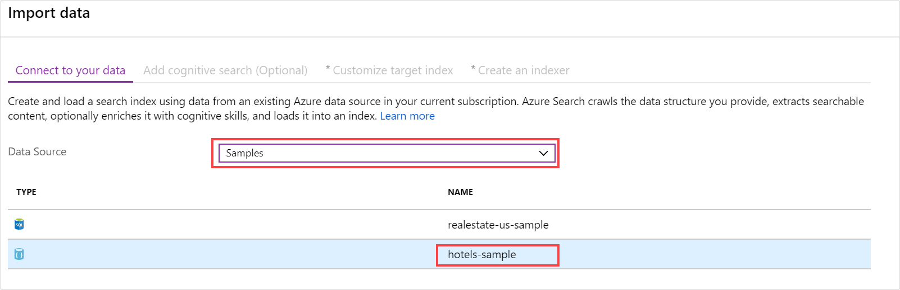
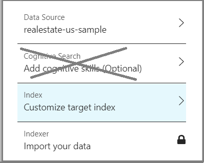
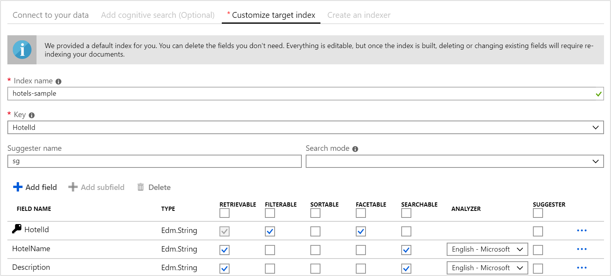
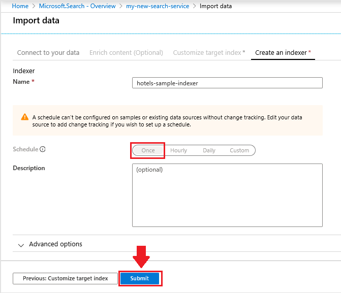
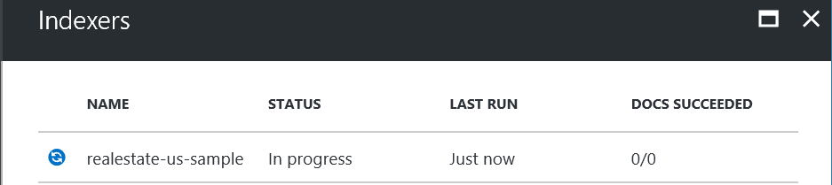
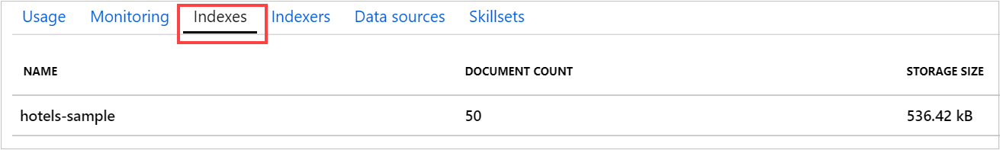
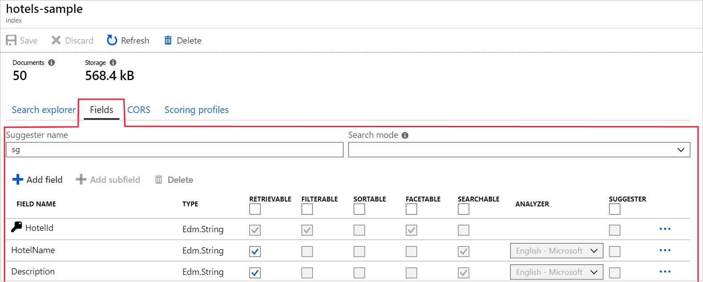
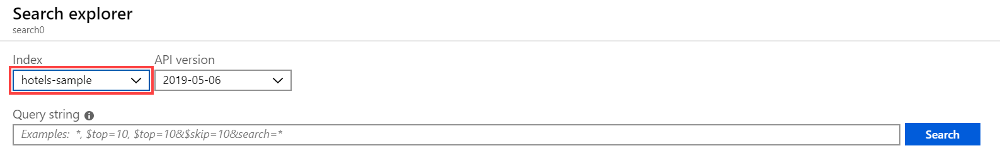
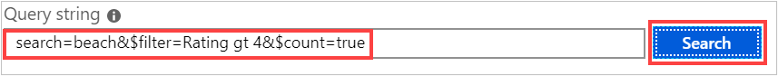

# Quickstart: Create an Azure Cognitive Search index in the Azure portal
> [!div class="op_single_selector"]
> * [Portal](search-get-started-portal.md)
> * [C#](search-get-started-dotnet.md)
> * [Java](search-get-started-java.md)
> * [Node.js](search-get-started-nodejs.md)
> * [PowerShell](search-get-started-powershell.md)
> * [Postman](search-get-started-postman.md)
> * [Python](search-get-started-python.md)

**Import data** wizard is an Azure portal tool that guides you through the creation of a search index so that you can write interesting queries within minutes. 

The wizard also has pages for AI enrichment so that you can extract text and structure from image files and unstructured text. Content processing with AI includes Optical Character Recognition (OCR), key phrase and entity extraction, and image analysis.

## Prerequisites

Before you begin, you must have the following:

+ An Azure account with an active subscription. [Create an account for free](https://azure.microsoft.com/free/).

+ An Azure Cognitive Search service. [Create a service](search-create-service-portal.md) or [find an existing service](https://ms.portal.azure.com/#blade/HubsExtension/BrowseResourceBlade/resourceType/Microsoft.Search%2FsearchServices) under your current subscription. You can use a free service for this quickstart. 

### Check for space

Many customers start with the free service. This version is limited to three indexes, three data sources, and three indexers. Make sure you have room for extra items before you begin. This tutorial creates one of each object.

Sections on the service dashboard show how many indexes, indexers, and data sources you already have. 

##  Create an index and load data

Search queries iterate over an [*index*](search-what-is-an-index.md) that contains searchable data, metadata, and additional constructs that optimize certain search behaviors.

For this tutorial, we use a built-in sample dataset that can be crawled using an [*indexer*](search-indexer-overview.md) via the [**Import data** wizard](search-import-data-portal.md). An indexer is a source-specific crawler that can read metadata and content from supported Azure data sources. Normally, indexers are used programmatically, but in the portal, you can access them through the **Import data** wizard. 

### Step 1 - Start the Import data wizard and create a data source

1. Sign in to the [Azure portal](https://portal.azure.com/) with your Azure account.

1. [Find your search service](https://ms.portal.azure.com/#blade/HubsExtension/BrowseResourceBlade/resourceType/Microsoft.Storage%2storageAccounts/) and on the Overview page, click **Import data** on the command bar to create and populate a search index.

   

1. In the wizard, click **Connect to your data** > **Samples** > **hotels-sample**. This data source is built-in. If you were creating your own data source, you would need to specify a name, type, and connection information. Once created, it becomes an "existing data source" that can be reused in other import operations.

   

1. Continue to the next page.

### Step 2 - Skip the "Enrich content" page

The wizard supports the creation of an [AI enrichment pipeline](cognitive-search-concept-intro.md) for incorporating the Cognitive Services AI algorithms into indexing. 

We'll skip this step for now, and move directly on to **Customize target index**.

   

> [!TIP]
> You can step through an AI-indexing example in a [quickstart](cognitive-search-quickstart-blob.md) or [tutorial](cognitive-search-tutorial-blob.md).

### Step 3 - Configure index

Typically, index creation is a code-based exercise, completed prior to loading data. However, as this tutorial indicates, the wizard can generate a basic index for any data source it can crawl. Minimally, an index requires a name and a fields collection; one of the fields should be marked as the document key to uniquely identify each document. Additionally, you can specify language analyzers or suggesters if you want autocomplete or suggested queries.

Fields have data types and attributes. The check boxes across the top are *index attributes* controlling how the field is used.

* **Retrievable** means that it shows up in search results list. You can mark individual fields as off limits for search results by clearing this checkbox, for example for fields used only in filter expressions.
* **Key** is the unique document identifier. It's always a string, and it is required.
* **Filterable**, **Sortable**, and **Facetable** determine whether fields are used in a filter, sort, or faceted navigation structure.
* **Searchable** means that a field is included in full text search. Strings are searchable. Numeric fields and Boolean fields are often marked as not searchable.

Storage requirements do not vary as a result of your selection. For example, if you set the **Retrievable** attribute on multiple fields, storage requirements do not go up.

By default, the wizard scans the data source for unique identifiers as the basis for the key field. *Strings* are attributed as **Retrievable** and **Searchable**. *Integers* are attributed as **Retrievable**, **Filterable**, **Sortable**, and **Facetable**.

1. Accept the defaults. 

   If you rerun the wizard a second time using an existing hotels data source, the index won't be configured with default attributes. You'll have to manually select attributes on future imports. 

   

2. Continue to the next page.

### Step 4 - Configure indexer

Still in the **Import data** wizard, click **Indexer** > **Name**, and type a name for the indexer.

This object defines an executable process. You could put it on recurring schedule, but for now use the default option to run the indexer once, immediately.

Click **Submit** to create and simultaneously run the indexer.

  

## Monitor progress

The wizard should take you to the Indexers list where you can monitor progress. For self-navigation, go to the Overview page and click 
**Indexers**.

It can take a few minutes for the portal to update the page, but you should see the newly created indexer in the list, with status indicating "in progress" or success, along with the number of documents indexed.

   

## View the index

The main service page provides links to the resources created in your Azure Cognitive Search service.  To view the index you just created, click **Indexes** from the list of links. 

Wait for the portal page to refresh. After a few minutes, you should see the index with a document count and storage size.

   

From this list, you can click on the *hotels-sample* index that you just created, view the index schema. and optionally add new fields. 

The **Fields** tab shows the index schema. Scroll to the bottom of the list to enter a new field. In most cases, you cannot change existing fields. Existing fields have a physical representation in Azure Cognitive Search and are thus non-modifiable, not even in code. To fundamentally change an existing field, create a new index, dropping the original.

   

Other constructs, such as scoring profiles and CORS options, can be added at any time.

To clearly understand what you can and cannot edit during index design, take a minute to view index definition options. Grayed-out options are an indicator that a value cannot be modified or deleted. 

##  Query using Search explorer

Moving forward, you should now have a search index that's ready to query using the built-in [**Search explorer**](search-explorer.md) query page. It provides a search box so that you can test arbitrary query strings.

**Search explorer** is only equipped to handle [REST API requests](https://docs.microsoft.com/rest/api/searchservice/search-documents), but it accepts syntax for both [simple query syntax](https://docs.microsoft.com/rest/api/searchservice/simple-query-syntax-in-azure-search) and [full Lucene query parser](https://docs.microsoft.com/rest/api/searchservice/lucene-query-syntax-in-azure-search), plus all the search parameters available in [Search Document REST API](https://docs.microsoft.com/rest/api/searchservice/search-documents#bkmk_examples) operations.

> [!TIP]
> The following steps are demonstrated at 6m08s into the [Azure Cognitive Search Overview video](https://channel9.msdn.com/Events/Connect/2016/138).
>

1. Click **Search explorer** on the command bar.

   

2. From the **Index** dropdown, choose  *hotels-sample-index*. Click the **API Version** dropdown, to see which REST APIs are available. For the queries below, use the generally available version (2019-05-06).

   

3. In the search bar, paste in the query strings below and click **Search**.

   

## Example queries

You can enter terms and phrases, similar to what you might do in a Bing or Google search, or fully-specified query expressions. Results are returned as verbose JSON documents.

### Simple query with top N results

#### Example (string query): `search=spa`

* The **search** parameter is used to input a keyword search for full text search, in this case, returning hotel data for those containing *spa* in any searchable field in the document.

* **Search explorer** returns results in JSON, which is verbose and hard to read if documents have a dense structure. This is intentional; visibility into the entire document is important for development purposes, especially during testing. For a better user experience, you will need to write code that [handles search results](search-pagination-page-layout.md) to bring out important elements.

* Documents are composed of all fields marked as "retrievable" in the index. To view index attributes in the portal, click *hotels-sample* in the **Indexes** list.

#### Example (parameterized query): `search=spa&$count=true&$top=10`

* The **&** symbol is used to append search parameters, which can be specified in any order.

* The **$count=true** parameter returns the total count of all documents returned. This value appears near the top of the search results. You can verify filter queries by monitoring changes reported by **$count=true**. Smaller counts indicate your filter is working.

* The **$top=10** returns the highest ranked 10 documents out of the total. By default, Azure Cognitive Search returns the first 50 best matches. You can increase or decrease the amount via **$top**.

###  Filter the query

Filters are included in search requests when you append the **$filter** parameter. 

#### Example (filtered): `search=beach&$filter=Rating gt 4`

* The **$filter** parameter returns results matching the criteria you provided. In this case, ratings greater than 4.

* Filter syntax is an OData construction. For more information, see [Filter OData syntax](https://docs.microsoft.com/rest/api/searchservice/odata-expression-syntax-for-azure-search).

###  Facet the query

Facet filters are included in search requests. You can use the facet parameter to return an aggregated count of documents that match a facet value you provide.

#### Example (faceted with scope reduction): `search=*&facet=Category&$top=2`

* **search=*** is an empty search. Empty searches search over everything. One reason for submitting an empty query is to  filter or facet over the complete set of documents. For example, you want a faceting navigation structure to consist of all hotels in the index.
* **facet** returns a navigation structure that you can pass to a UI control. It returns categories and a count. In this case, categories are based on a field conveniently called *Category*. There is no aggregation in Azure Cognitive Search, but you can approximate aggregation via `facet`, which gives a count of documents in each category.

* **$top=2** brings back two documents, illustrating that you can use `top` to both reduce or increase results.

#### Example (facet on numeric values): `search=spa&facet=Rating`

* This query is facet for rating, on a text search for *spa*. The term *Rating* can be specified as a facet because the field is marked as retrievable, filterable, and facetable in the index, and the values it contains (numeric, 1 through 5), are suitable for categorizing listings into groups.

* Only filterable fields can be faceted. Only retrievable fields can be returned in the results.

* The *Rating* field is double-precision floating point and the grouping will be by precise value. For more information on grouping by interval (for instance, "3 star ratings," "4 star ratings," etc.), see [How to implement faceted navigation in Azure Cognitive Search](https://docs.microsoft.com/azure/search/search-faceted-navigation#filter-based-on-a-range).

###  Highlight search results

Hit highlighting refers to formatting on text matching the keyword, given matches are found in a specific field. If your search term is deeply buried in a description, you can add hit highlighting to make it easier to spot.

#### Example (highlighter): `search=beach&highlight=Description`

* In this example, the formatted word *beach* is easier to spot in the description field.

#### Example (linguistic analysis): `search=beaches&highlight=Description`

* Full text search recognizes basic variations in word forms. In this case, search results contain highlighted text for "beach", for hotels that have that word in their searchable fields, in response to a keyword search on "beaches". Different forms of the same word can appear in results because of linguistic analysis. 

* Azure Cognitive Search supports 56 analyzers from both Lucene and Microsoft. The default used by Azure Cognitive Search is the standard Lucene analyzer.

###  Try fuzzy search

By default, misspelled query terms, like *seatle* for "Seattle", fail to return matches in typical search. The following example returns no results.

#### Example (misspelled term, unhandled): `search=seatle`

To handle misspellings, you can use fuzzy search. Fuzzy search is enabled when you use the full Lucene query syntax, which occurs when you do two things: set **queryType=full** on the query, and append the **~** to the search string.

#### Example (misspelled term, handled): `search=seatle~&queryType=full`

This example now returns documents that include matches on "Seattle".

When **queryType** is unspecified, the default simple query parser is used. The simple query parser is faster, but if you require fuzzy search, regular expressions, proximity search, or other advanced query types, you will need the full syntax.

Fuzzy search and wildcard search have implications on search output. Linguistic analysis is not performed on these query formats. Before using fuzzy and wildcard search, review [How full text search works in Azure Cognitive Search](search-lucene-query-architecture.md#stage-2-lexical-analysis) and look for the section about exceptions to lexical analysis.

For more information about query scenarios enabled by the full query parser, see [Lucene query syntax in Azure Cognitive Search](https://docs.microsoft.com/rest/api/searchservice/lucene-query-syntax-in-azure-search).

###  Try geospatial search

Geospatial search is supported through the [edm.GeographyPoint data type](https://docs.microsoft.com/rest/api/searchservice/supported-data-types) on a field containing coordinates. Geosearch is a type of filter, specified in [Filter OData syntax](https://docs.microsoft.com/rest/api/searchservice/odata-expression-syntax-for-azure-search).

#### Example (geo-coordinate filters): `search=*&$count=true&$filter=geo.distance(Location,geography'POINT(-122.12 47.67)') le 5`

The example query filters all results for positional data, where results are less than 5 kilometers from a given point (specified as latitude and longitude coordinates). By adding **$count**, you can see how many results are returned when you change either the distance or the coordinates.

Geospatial search is useful if your search application has a "find near me" feature or uses map navigation. It is not full text search, however. If you have user requirements for searching on a city or country/region by name, add fields containing city or country/region names, in addition to coordinates.

## Takeaways

This tutorial provided a quick introduction to Azure Cognitive Search using the Azure portal.

You learned how to create a search index using the **Import data** wizard. You learned about [indexers](search-indexer-overview.md), as well as the basic workflow for index design, including [supported modifications to a published index](https://docs.microsoft.com/rest/api/searchservice/update-index).

Using the **Search explorer** in the Azure portal, you learned some basic query syntax through hands-on examples that demonstrated key capabilities such as filters, hit highlighting, fuzzy search, and geo-search.

You also learned how to find indexes, indexers, and data sources in the portal. Given any new data source in the future, you can use the portal to quickly check its definitions or field collections with minimal effort.

## Clean up resources

When you're working in your own subscription, it's a good idea at the end of a project to identify whether you still need the resources you created. Resources left running can cost you money. You can delete resources individually or delete the resource group to delete the entire set of resources.

You can find and manage resources in the portal, using the **All resources** or **Resource groups** link in the left-navigation pane.

If you are using a free service, remember that you are limited to three indexes, indexers, and data sources. You can delete individual items in the portal to stay under the limit. 

## Next steps

Use a portal wizard to generate a ready-to-use web app that runs in a browser. You can try this wizard out on the small index you just created, or use one of the built-in sample data sets for a richer search experience.

> [!div class="nextstepaction"]
> [Create a search app in the portal](search-create-app-portal.md)