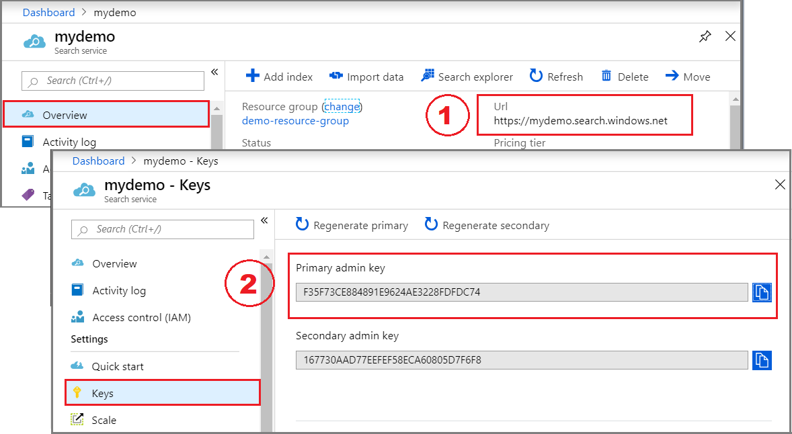
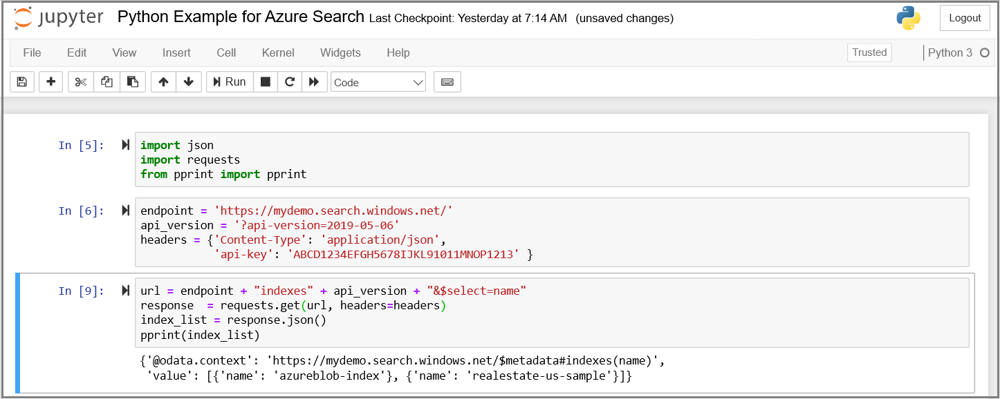
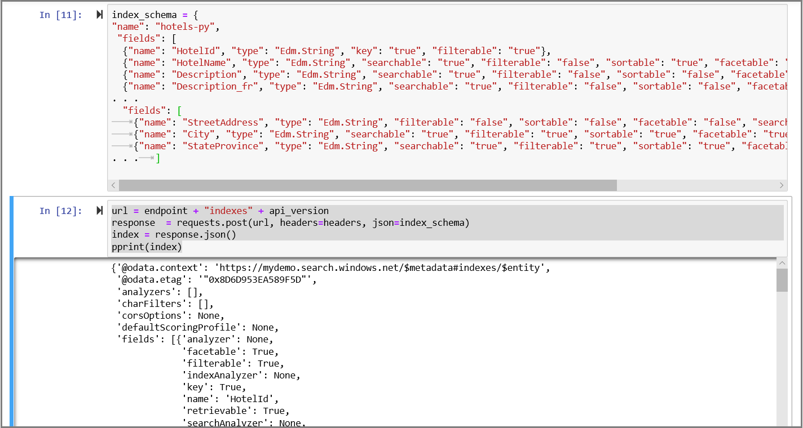

# Quickstart: Create an Azure Search index using Jupyter Python notebooks
> [!div class="op_single_selector"]
> * [Python (REST)](search-get-started-python.md)
> * [PowerShell (REST)](search-create-index-rest-api.md)
> * [C#](search-create-index-dotnet.md)
> * [Postman (REST)](search-fiddler.md)
> * [Portal](search-create-index-portal.md)
> 

Build a Jupyter notebook that creates, loads, and queries an Azure Search index using Python and the [Azure Search REST APIs](https://docs.microsoft.com/rest/api/searchservice/). This article explains how to build a notebook step by step, starting from scratch. Alternatively, you could run a finished notebook. To download a copy, go to [Azure-Search-python-samples repo](https://github.com/Azure-Samples/azure-search-python-samples).

If you don't have an Azure subscription, create a [free account](https://azure.microsoft.com/free/?WT.mc_id=A261C142F) before you begin.

## Prerequisites

The following services and tools are used in this quickstart. 

+ [Anaconda 3.x](https://www.anaconda.com/distribution/#download-section), providing Python 3.x and Jupyter Notebooks.

+ [Create an Azure Search service](search-create-service-portal.md) or [find an existing service](https://ms.portal.azure.com/#blade/HubsExtension/BrowseResourceBlade/resourceType/Microsoft.Search%2FsearchServices) under your current subscription. You can use a free service for this quickstart. 

## Get a key and URL

REST calls require the service URL and an access key on every request. A search service is created with both, so if you added Azure Search to your subscription, follow these steps to get the necessary information:

1. [Sign in to the Azure portal](https://portal.azure.com/), and in your search service **Overview** page, get the URL. An example endpoint might look like `https://mydemo.search.windows.net`.

1. In **Settings** > **Keys**, get an admin key for full rights on the service. There are two interchangeable admin keys, provided for business continuity in case you need to roll one over. You can use either the primary or secondary key on requests for adding, modifying, and deleting objects.



All requests require an api-key on every request sent to your service. Having a valid key establishes trust, on a per request basis, between the application sending the request and the service that handles it.

## Connect to Azure Search

Open a Jupyter notebook and verify the connection from your local workstation by requesting a list of indexes on your service. On Windows with Anaconda3, you can use Anaconda Navigator to launch a notebook.

1. Create a new Python3 notebook.

1. In the first cell, load the libraries used for working with JSON and formulating HTTP requests.

   ```python
   import json
   import requests
   from pprint import pprint
   ```

1. In the second cell, input the request elements that will be constants on every request. Replace the search service name (YOUR-SEARCH-SERVICE-NAME) and admin API key (YOUR-ADMIN-API-KEY) with valid values. 

   ```python
   endpoint = 'https://<YOUR-SEARCH-SERVICE-NAME>.search.windows.net/'
   api_version = '?api-version=2019-05-06'
   headers = {'Content-Type': 'application/json',
           'api-key': '<YOUR-ADMIN-API-KEY>' }
   ```

1. In the third cell, formulate the request. This GET request targets the indexes collection of your search service and selects the name property.

   ```python
   url = endpoint + "indexes" + api_version + "&$select=name"
   response  = requests.get(url, headers=headers)
   index_list = response.json()
   pprint(index_list)
   ```

1. Run each step. If indexes exist, the response contains a list of indexes. In the screenshot below, the service includes an azureblob-index and a realestate-us-sample index.

   

   An empty index collection returns this response: `{'@odata.context': 'https://mydemo.search.windows.net/$metadata#indexes(name)', 'value': []}`

> [!Tip]
> On a free service, you are limited to three indexes, indexers, and data sources. This quickstart creates one of each. Make sure you have room to create new objects before going any further.

## 1 - Create an index

Unless you are using the portal, an index must exist on the service before you can load data. This step uses the [Create Index REST API](https://docs.microsoft.com/rest/api/searchservice/create-index) to push an index schema to the service

The fields collection defines the structure of a *document*. Required elements of an index include a name and a fields collection. Each field has a name, type, and attributes that determine how it's used (for example, whether it is full-text searchable, filterable, or retrievable in search results). Within an index, one of the fields of type `Edm.String` must be designated as the *key* for document identity.

This index is named "hotels-py" and has the field definitions you see below. It's a subset of a larger [Hotels index](https://github.com/Azure-Samples/azure-search-sample-data/blob/master/hotels/Hotels_IndexDefinition.JSON) used in other walkthroughs. We trimmed it in this quickstart for brevity.

1. In the next cell, paste the following example into a cell to provide the schema. 

    ```python
    index_schema = {
       "name": "hotels-py",  
       "fields": [
         {"name": "HotelId", "type": "Edm.String", "key": "true", "filterable": "true"},
         {"name": "HotelName", "type": "Edm.String", "searchable": "true", "filterable": "false", "sortable": "true", "facetable": "false"},
         {"name": "Description", "type": "Edm.String", "searchable": "true", "filterable": "false", "sortable": "false", "facetable": "false", "analyzer": "en.lucene"},
         {"name": "Description_fr", "type": "Edm.String", "searchable": "true", "filterable": "false", "sortable": "false", "facetable": "false", "analyzer": "fr.lucene"},
         {"name": "Category", "type": "Edm.String", "searchable": "true", "filterable": "true", "sortable": "true", "facetable": "true"},
         {"name": "Tags", "type": "Collection(Edm.String)", "searchable": "true", "filterable": "true", "sortable": "false", "facetable": "true"},
         {"name": "ParkingIncluded", "type": "Edm.Boolean", "filterable": "true", "sortable": "true", "facetable": "true"},
         {"name": "LastRenovationDate", "type": "Edm.DateTimeOffset", "filterable": "true", "sortable": "true", "facetable": "true"},
         {"name": "Rating", "type": "Edm.Double", "filterable": "true", "sortable": "true", "facetable": "true"},
         {"name": "Address", "type": "Edm.ComplexType", 
         "fields": [
         {"name": "StreetAddress", "type": "Edm.String", "filterable": "false", "sortable": "false", "facetable": "false", "searchable": "true"},
         {"name": "City", "type": "Edm.String", "searchable": "true", "filterable": "true", "sortable": "true", "facetable": "true"},
         {"name": "StateProvince", "type": "Edm.String", "searchable": "true", "filterable": "true", "sortable": "true", "facetable": "true"},
         {"name": "PostalCode", "type": "Edm.String", "searchable": "true", "filterable": "true", "sortable": "true", "facetable": "true"},
         {"name": "Country", "type": "Edm.String", "searchable": "true", "filterable": "true", "sortable": "true", "facetable": "true"}
        ]
       }
      ]
    }
    ```

2. In another cell, formulate the request. This PUT request targets the indexes collection of your search service and creates an index based on the index schema you provided in the previous step.

   ```python
   url = endpoint + "indexes" + api_version
   response  = requests.post(url, headers=headers, json=index_schema)
   index = response.json()
   pprint(index)
   ```

3. Run each step.

   The response includes the JSON representation of the schema. The following screenshot trims parts of the index schema so that you can see more of the response.

    

> [!Tip]
> For verification, you could also check the Indexes list in the portal, or rerun the service connection request to see the *hotels-py* index listed in the Indexes collection.

<a name="load-documents"></a>

## 2 - Load documents

To push documents, use an HTTP POST request to your index's URL endpoint. The REST API is [Add, Update, or Delete Documents](https://docs.microsoft.com/rest/api/searchservice/addupdate-or-delete-documents). Documents originate from [HotelsData](https://github.com/Azure-Samples/azure-search-sample-data/blob/master/hotels/HotelsData_toAzureSearch.JSON) on GitHub.

1. In a new cell, provide four documents that conform to the index schema. Specify an upload action for each document.

    ```python
    documents = {
        "value": [
        {
        "@search.action": "upload",
        "HotelId": "1",
        "HotelName": "Secret Point Motel",
        "Description": "The hotel is ideally located on the main commercial artery of the city in the heart of New York. A few minutes away is Time's Square and the historic centre of the city, as well as other places of interest that make New York one of America's most attractive and cosmopolitan cities.",
        "Description_fr": "L'hôtel est idéalement situé sur la principale artère commerciale de la ville en plein cœur de New York. A quelques minutes se trouve la place du temps et le centre historique de la ville, ainsi que d'autres lieux d'intérêt qui font de New York l'une des villes les plus attractives et cosmopolites de l'Amérique.",
        "Category": "Boutique",
        "Tags": [ "pool", "air conditioning", "concierge" ],
        "ParkingIncluded": "false",
        "LastRenovationDate": "1970-01-18T00:00:00Z",
        "Rating": 3.60,
        "Address": {
            "StreetAddress": "677 5th Ave",
            "City": "New York",
            "StateProvince": "NY",
            "PostalCode": "10022",
            "Country": "USA"
            }
        },
        {
        "@search.action": "upload",
        "HotelId": "2",
        "HotelName": "Twin Dome Motel",
        "Description": "The hotel is situated in a  nineteenth century plaza, which has been expanded and renovated to the highest architectural standards to create a modern, functional and first-class hotel in which art and unique historical elements coexist with the most modern comforts.",
        "Description_fr": "L'hôtel est situé dans une place du XIXe siècle, qui a été agrandie et rénovée aux plus hautes normes architecturales pour créer un hôtel moderne, fonctionnel et de première classe dans lequel l'art et les éléments historiques uniques coexistent avec le confort le plus moderne.",
        "Category": "Boutique",
        "Tags": [ "pool", "free wifi", "concierge" ],
        "ParkingIncluded": "false",
        "LastRenovationDate": "1979-02-18T00:00:00Z",
        "Rating": 3.60,
        "Address": {
            "StreetAddress": "140 University Town Center Dr",
            "City": "Sarasota",
            "StateProvince": "FL",
            "PostalCode": "34243",
            "Country": "USA"
            }
        },
        {
        "@search.action": "upload",
        "HotelId": "3",
        "HotelName": "Triple Landscape Hotel",
        "Description": "The Hotel stands out for its gastronomic excellence under the management of William Dough, who advises on and oversees all of the Hotel’s restaurant services.",
        "Description_fr": "L'hôtel est situé dans une place du XIXe siècle, qui a été agrandie et rénovée aux plus hautes normes architecturales pour créer un hôtel moderne, fonctionnel et de première classe dans lequel l'art et les éléments historiques uniques coexistent avec le confort le plus moderne.",
        "Category": "Resort and Spa",
        "Tags": [ "air conditioning", "bar", "continental breakfast" ],
        "ParkingIncluded": "true",
        "LastRenovationDate": "2015-09-20T00:00:00Z",
        "Rating": 4.80,
        "Address": {
            "StreetAddress": "3393 Peachtree Rd",
            "City": "Atlanta",
            "StateProvince": "GA",
            "PostalCode": "30326",
            "Country": "USA"
        },
        {
        "@search.action": "upload",
        "HotelId": "4",
        "HotelName": "Sublime Cliff Hotel",
        "Description": "Sublime Cliff Hotel is located in the heart of the historic center of Sublime in an extremely vibrant and lively area within short walking distance to the sites and landmarks of the city and is surrounded by the extraordinary beauty of churches, buildings, shops and monuments. Sublime Cliff is part of a lovingly restored 1800 palace.",
        "Description_fr": "Le sublime Cliff Hotel est situé au coeur du centre historique de sublime dans un quartier extrêmement animé et vivant, à courte distance de marche des sites et monuments de la ville et est entouré par l'extraordinaire beauté des églises, des bâtiments, des commerces et Monuments. Sublime Cliff fait partie d'un Palace 1800 restauré avec amour.",
        "Category": "Boutique",
        "Tags": [ "concierge", "view", "24-hour front desk service" ],
        "ParkingIncluded": "true",
        "LastRenovationDate": "1960-02-06T00:00:00Z",
        "Rating": 4.60,
        "Address": {
            "StreetAddress": "7400 San Pedro Ave",
            "City": "San Antonio",
            "StateProvince": "TX",
            "PostalCode": "78216",
            "Country": "USA"
       }
      }
     ]
    }
    ```

2. In another cell, formulate the request. This POST request targets the docs collection of the hotels-py index and pushes the documents provided in the previous step.

   ```python
   url = endpoint + "indexes/hotels-py/docs/index" + api_version
   response  = requests.post(url, headers=headers, json=documents)
   index_content = response.json()
   pprint(index_content)
   ```

3. Run each step to push the documents to an index in your search service. Results should look similar to the following example. 

   ```
   {'@odata.context': "https://mydemo.search.windows.net/indexes('hotels-py')/$metadata#Collection(Microsoft.Azure.Search.V2019_05_06.IndexResult)",
    'value': [{'errorMessage': None,
            'key': '1',
            'status': True,
            'statusCode': 201},
           {'errorMessage': None,
            'key': '2',
            'status': True,
            'statusCode': 201},
           {'errorMessage': None,
            'key': '3',
            'status': True,
            'statusCode': 201}]},
           {'errorMessage': None,
            'key': '4',
            'status': True,
            'statusCode': 201}]}
     ```


## 3 - Search an index

This step shows you how to query an index using the [Search Documents REST API](https://docs.microsoft.com/rest/api/searchservice/search-documents).


1. In a new cell, provide a query expression. The following example searches on the terms "hotels" and "wifi". It also returns a *count* of documents that match, and *selects* which fields to include in the search results.

   ```python
   searchstring = '&search=hotels wifi&$count=true&$select=HotelId,HotelName'
   ```

2. Formulate a request. This GET request targets the docs collection of the hotels-py index, and attaches the query you specified in the previous step.

   ```python
   url = endpoint + "indexes/hotels-py/docs" + api_version + searchstring
   response  = requests.get(url, headers=headers, json=searchstring)
   query = response.json()
   pprint(query)
   ```

   Results should look similar to the following output. The results are unranked (search.score = 1.0) because we didn't provide any criteria to match on.

   ```
   {'@odata.context': "https://mydemo.search.windows.net/indexes('hotels-py')/$metadata#docs(*)",
    '@odata.count': 3,
    'value': [{'@search.score': 1.0,
               'HotelId': '1',
               'HotelName': 'Secret Point Motel'},
              {'@search.score': 1.0,
               'HotelId': '2',
               'HotelName': 'Twin Dome Motel'},
              {'@search.score': 1.0,
               'HotelId': '3',
               'HotelName': 'Triple Landscape Hotel'},
              {'@search.score': 1.0,
               'HotelId': '4',
               'HotelName': 'Sublime Cliff Hotel'}]}
   ```

3. Try a few other query examples to get a feel for the syntax. You can apply a filter, take the top two results, or order by a specific field.

   + `searchstring = '&search=*&$filter=Rating gt 4&$select=HotelId,HotelName,Description'`

   + `searchstring = '&search=boutique&$top=2&$select=HotelId,HotelName,Description'`

   + `searchstring = '&search=pool&$orderby=Address/City&$select=HotelId, HotelName, Address/City, Address/StateProvince'`

## Clean up 

You should delete the index if you no longer need it. A free service is limited to three indexes. You might want to delete any indexes you are not actively using to make room for other tutorials.

   ```python
  url = endpoint + "indexes/hotels-py" + api_version
  response  = requests.delete(url, headers=headers)
   ```

You can verify index deletion by returning a list of existing indexes. If hotels-py is gone, then you know your request succeeded.

```python
url = endpoint + "indexes" + api_version + "&$select=name"

response  = requests.get(url, headers=headers)
index_list = response.json()
pprint(index_list)
```

## Next steps

As a simplification, this quickstart uses an abbreviated version of the Hotels index. You can create the full version to try out more interesting queries. To get the full version and all 50 documents, run the **Import data** wizard, selecting *hotels-sample* from the built-in sample data sources.

> [!div class="nextstepaction"]
> [Quickstart: Create an index in the Azure portal](search-get-started-portal.md)
