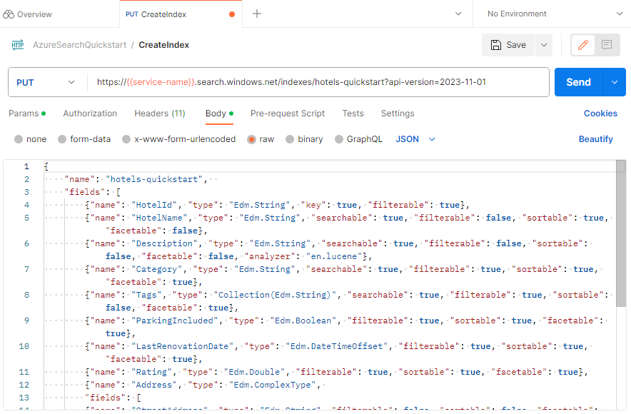
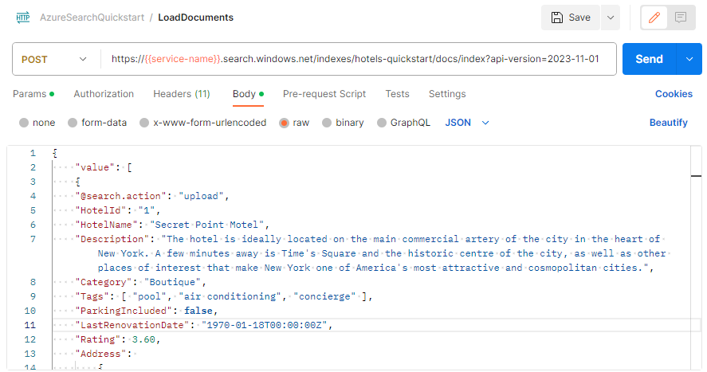
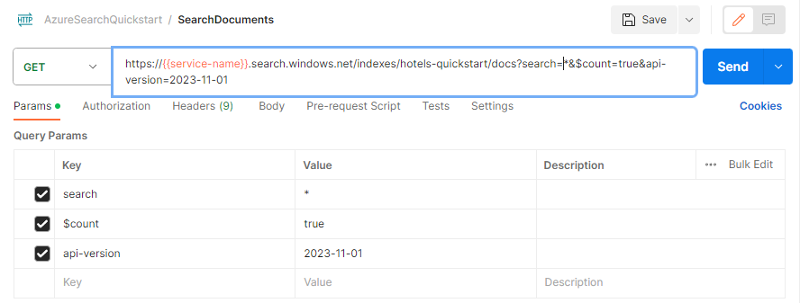
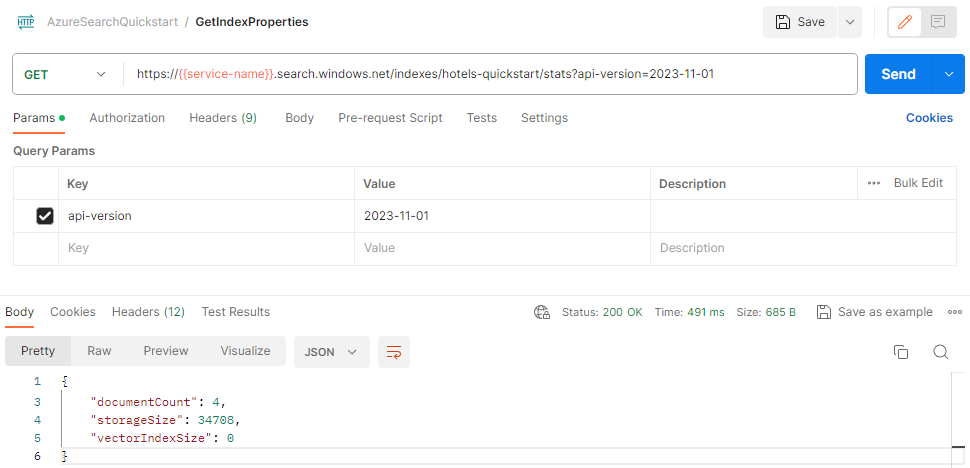

# Quickstart: Create an Azure Cognitive Search index using REST APIs

This article explains how to formulate requests interactively using the [Azure Cognitive Search REST APIs](/rest/api/searchservice) and a REST client for sending and receiving requests. 

The article uses the Postman app. You can [download and import a Postman collection](https://github.com/Azure-Samples/azure-search-postman-samples/tree/master/Quickstart) if you prefer to use predefined requests.

If you don't have an Azure subscription, create a [free account](https://azure.microsoft.com/free/?WT.mc_id=A261C142F) before you begin.

## Prerequisites

+ [Postman app](https://www.postman.com/downloads/), used for sending requests to Azure Cognitive Search.

+ [Create an Azure Cognitive Search service](search-create-service-portal.md) or [find an existing service](https://portal.azure.com/#blade/HubsExtension/BrowseResourceBlade/resourceType/Microsoft.Search%2FsearchServices) under your current subscription. You can use a free service for this quickstart. 

## Copy a key and URL

REST calls require the service URL and an access key on every request. A search service is created with both, so if you added Azure Cognitive Search to your subscription, follow these steps to get the necessary information:

1. Sign in to the [Azure portal](https://portal.azure.com), and in your search service **Overview** page, get the URL. An example endpoint might look like `https://mydemo.search.windows.net`.

1. In **Settings** > **Keys**, get an admin key for full rights on the service. There are two interchangeable admin keys, provided for business continuity in case you need to roll one over. You can use either the primary or secondary key on requests for adding, modifying, and deleting objects.

   

All requests require an api-key on every request sent to your service. Having a valid key establishes trust, on a per request basis, between the application sending the request and the service that handles it.

## Connect to Azure Cognitive Search

Connection information is specified in the URI endpoint. Collection variables are used to represent the search service name and API keys. A typical URI in this quickstart looks like this:

```http
https://{{service-name}}.search.windows.net/indexes/hotels-quickstart?api-version=2020-06-30
```

Notice the HTTPS prefix, the name of the service (variable, the name of an object (in this case, the name of an index in the indexes collection), and the [api-version](search-api-versions.md). The api-version is a required.

Request header composition includes two elements: `Content-Type` and the `api-key` used to authenticate to Azure Cognitive Search. The `api-key` is specified as variable, and it's also required.

For the requests to succeed, you'll need to provide the service name and api-key as collection variables.

1. Open the Postman app and import the collection.

1. Select the collection's access menu, select **Edit**, and provide the service name and key of your search service.

   :::image type="content" source="media/search-get-started-rest/postman-collection-variables.png" lightbox="media/search-get-started-rest/postman-collection-variables.png"alt-text="Screenshot of the Postman collection variable page." border="true":::

## 1 - Create an index

In Azure Cognitive Search, you usually create the index before loading it with data. The [Create Index REST API](/rest/api/searchservice/create-index) is used for this task. 

The URL is extended to include the `hotels-quickstart` index name.

1. Set the verb to **PUT**.

2. Copy in this URL `https://{{service-name}}.search.windows.net/indexes/hotels-quickstart?api-version=2020-06-30`.

3. Provide the index definition (copy-ready code is provided next) in the body of the request.

4. Select **Send**.



### Index definition

The fields collection defines document structure. Each document must have these fields, and each field must have a data type. String fields are used in full text search. If you need numeric data to be searchable, you'll need to cast numeric data as strings.

Attributes on the field determine allowed action. The REST APIs allow many actions by default. For example, all strings are searchable, retrievable, filterable, and facetable by default. Often, you only have to set attributes when you need to turn off a behavior.

```json
{
    "name": "hotels-quickstart",  
    "fields": [
        {"name": "HotelId", "type": "Edm.String", "key": true, "filterable": true},
        {"name": "HotelName", "type": "Edm.String", "searchable": true, "filterable": false, "sortable": true, "facetable": false},
        {"name": "Description", "type": "Edm.String", "searchable": true, "filterable": false, "sortable": false, "facetable": false, "analyzer": "en.lucene"},
        {"name": "Category", "type": "Edm.String", "searchable": true, "filterable": true, "sortable": true, "facetable": true},
        {"name": "Tags", "type": "Collection(Edm.String)", "searchable": true, "filterable": true, "sortable": false, "facetable": true},
        {"name": "ParkingIncluded", "type": "Edm.Boolean", "filterable": true, "sortable": true, "facetable": true},
        {"name": "LastRenovationDate", "type": "Edm.DateTimeOffset", "filterable": true, "sortable": true, "facetable": true},
        {"name": "Rating", "type": "Edm.Double", "filterable": true, "sortable": true, "facetable": true},
        {"name": "Address", "type": "Edm.ComplexType", 
        "fields": [
        {"name": "StreetAddress", "type": "Edm.String", "filterable": false, "sortable": false, "facetable": false, "searchable": true},
        {"name": "City", "type": "Edm.String", "searchable": true, "filterable": true, "sortable": true, "facetable": true},
        {"name": "StateProvince", "type": "Edm.String", "searchable": true, "filterable": true, "sortable": true, "facetable": true},
        {"name": "PostalCode", "type": "Edm.String", "searchable": true, "filterable": true, "sortable": true, "facetable": true},
        {"name": "Country", "type": "Edm.String", "searchable": true, "filterable": true, "sortable": true, "facetable": true}
        ]
     }
  ]
}
```

When you submit this request, you should get an HTTP 201 response, indicating the index was created successfully. You can verify this action in the portal, but note that the portal page has refresh intervals so it could take a minute or two to catch up.

> [!TIP]
> If you get HTTP 504, verify the URL specifies HTTPS. If you see HTTP 400 or 404, check the request body to verify there were no copy-paste errors. An HTTP 403 typically indicates a problem with the api-key (either an invalid key or a syntax problem with how the api-key is specified).

## 2 - Load documents

Creating the index and populating the index are separate steps. In Azure Cognitive Search, the index contains all searchable data. In this scenario, the data is provided as JSON documents. The [Add, Update, or Delete Documents REST API](/rest/api/searchservice/addupdate-or-delete-documents) is used for this task. 

The URL is extended to include the `docs` collections and `index` operation.

1. Set the verb to **POST**.

2. Copy in this URL `https://{{service-name}}.search.windows.net/indexes/hotels-quickstart/docs/index?api-version=2020-06-30`.

3. Provide the JSON documents (copy-ready code is next) in the body of the request.

4. Select **Send**.



### JSON documents to load into the index

The Request Body contains four documents to be added to the hotels index.

```json
{
    "value": [
    {
    "@search.action": "upload",
    "HotelId": "1",
    "HotelName": "Secret Point Motel",
    "Description": "The hotel is ideally located on the main commercial artery of the city in the heart of New York. A few minutes away is Time's Square and the historic centre of the city, as well as other places of interest that make New York one of America's most attractive and cosmopolitan cities.",
    "Category": "Boutique",
    "Tags": [ "pool", "air conditioning", "concierge" ],
    "ParkingIncluded": false,
    "LastRenovationDate": "1970-01-18T00:00:00Z",
    "Rating": 3.60,
    "Address": 
        {
        "StreetAddress": "677 5th Ave",
        "City": "New York",
        "StateProvince": "NY",
        "PostalCode": "10022",
        "Country": "USA"
        } 
    },
    {
    "@search.action": "upload",
    "HotelId": "2",
    "HotelName": "Twin Dome Motel",
    "Description": "The hotel is situated in a  nineteenth century plaza, which has been expanded and renovated to the highest architectural standards to create a modern, functional and first-class hotel in which art and unique historical elements coexist with the most modern comforts.",
    "Category": "Boutique",
    "Tags": [ "pool", "free wifi", "concierge" ],
    "ParkingIncluded": false,
    "LastRenovationDate": "1979-02-18T00:00:00Z",
    "Rating": 3.60,
    "Address": 
        {
        "StreetAddress": "140 University Town Center Dr",
        "City": "Sarasota",
        "StateProvince": "FL",
        "PostalCode": "34243",
        "Country": "USA"
        } 
    },
    {
    "@search.action": "upload",
    "HotelId": "3",
    "HotelName": "Triple Landscape Hotel",
    "Description": "The Hotel stands out for its gastronomic excellence under the management of William Dough, who advises on and oversees all of the Hotel’s restaurant services.",
    "Category": "Resort and Spa",
    "Tags": [ "air conditioning", "bar", "continental breakfast" ],
    "ParkingIncluded": true,
    "LastRenovationDate": "2015-09-20T00:00:00Z",
    "Rating": 4.80,
    "Address": 
        {
        "StreetAddress": "3393 Peachtree Rd",
        "City": "Atlanta",
        "StateProvince": "GA",
        "PostalCode": "30326",
        "Country": "USA"
        } 
    },
    {
    "@search.action": "upload",
    "HotelId": "4",
    "HotelName": "Sublime Cliff Hotel",
    "Description": "Sublime Cliff Hotel is located in the heart of the historic center of Sublime in an extremely vibrant and lively area within short walking distance to the sites and landmarks of the city and is surrounded by the extraordinary beauty of churches, buildings, shops and monuments. Sublime Cliff is part of a lovingly restored 1800 palace.",
    "Category": "Boutique",
    "Tags": [ "concierge", "view", "24-hour front desk service" ],
    "ParkingIncluded": true,
    "LastRenovationDate": "1960-02-06T00:00:00Z",
    "Rating": 4.60,
    "Address": 
        {
        "StreetAddress": "7400 San Pedro Ave",
        "City": "San Antonio",
        "StateProvince": "TX",
        "PostalCode": "78216",
        "Country": "USA"
        }
    }
  ]
}
```

In a few seconds, you should see an HTTP 201 response in the session list. This indicates the documents were created successfully. 

If you get a 207, at least one document failed to upload. If you get a 404, you have a syntax error in either the header or body of the request: verify you changed the endpoint to include `/docs/index`.

> [!TIP]
> For selected data sources, you can choose the alternative *indexer* approach which simplifies and reduces the amount of code required for indexing. For more information, see [Indexer operations](/rest/api/searchservice/indexer-operations).

## 3 - Search an index

Now that an index and document set are loaded, you can issue queries against them using [Search Documents REST API](/rest/api/searchservice/search-documents).

The URL is extended to include a query expression, specified using the search operator.

1. Set the verb to **GET**.

2. Copy in this URL `https://{{service-name}}.search.windows.net/indexes/hotels-quickstart/docs?search=*&$count=true&api-version=2020-06-30`.

3. Select **Send**.

This query is an empty and returns a count of the documents in the search results. The request and response should look similar to the following screenshot for Postman after you select **Send**. The status code should be 200.

 

Try a few other query examples to get a feel for the syntax. You can do a string search, verbatim $filter queries, limit the results set, scope the search to specific fields, and more.


```
# Query example 1 - Search on restaurant and wifi
# Return only the HotelName, Description, and Tags fields
https://{{service-name}}.search.windows.net/indexes/hotels-quickstart/docs?search=restaurant wifi&$count=true&$select=HotelName,Description,Tags&api-version=2020-06-30

# Query example 2 - Apply a filter to the index to find hotels rated 4 or highter
# Returns the HotelName and Rating. Two documents match
https://{service-name}}.search.windows.net/indexes/hotels-quickstart/docs?search=*&$filter=Rating gt 4&$select=HotelName,Rating&api-version=2020-06-30

# Query example 3 - Take the top two results, and show only HotelName and Category in the results
https://{service-name}}.search.windows.net/indexes/hotels-quickstart/docs?search=boutique&$top=2&$select=HotelName,Category&api-version=2020-06-30

# Query example 4 - Sort by a specific field (Address/City) in ascending order
https://{service-name}}.search.windows.net/indexes/hotels-quickstart/docs?search=pool&$orderby=Address/City asc&$select=HotelName, Address/City, Tags, Rating&api-version=2020-06-30
```

## Get index properties

You can also use [Get Statistics](/rest/api/searchservice/get-index-statistics) to query for document counts and index size: 

```http
https://{{service-name}}.search.windows.net/indexes/hotels-quickstart/stats?api-version=2020-06-30
```

Adding `/stats` to your URL returns index information. In Postman, your request should look similar to the following, and the response includes a document count and space used in bytes.

 

Notice that the api-version syntax differs. For this request, use `?` to append the api-version. The `?` separates the URL path from the query string, while & separates each 'name=value' pair in the query string. For this query, api-version is the first and only item in the query string.

## Clean up resources

When you're working in your own subscription, it's a good idea at the end of a project to identify whether you still need the resources you created. Resources left running can cost you money. You can delete resources individually or delete the resource group to delete the entire set of resources.

You can find and manage resources in the portal, using the **All resources** or **Resource groups** link in the left-navigation pane.

If you're using a free service, remember that you're limited to three indexes, indexers, and data sources. You can delete individual items in the portal to stay under the limit. 

## Next steps

Now that you know how to perform core tasks, you can move forward with more REST API calls for advanced features, such as indexers or [setting up an enrichment pipeline](cognitive-search-tutorial-blob.md) that adds content transformations to indexing. For your next step, we recommend the following link:

> [!div class="nextstepaction"]
> [Tutorial: Use REST and AI to generate searchable content from Azure blobs](cognitive-search-tutorial-blob.md)
