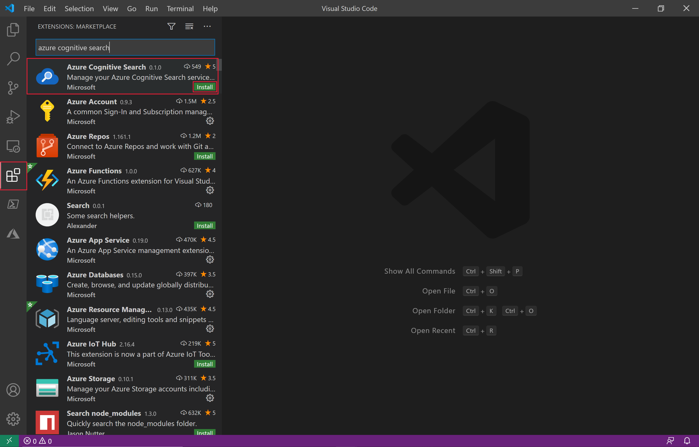
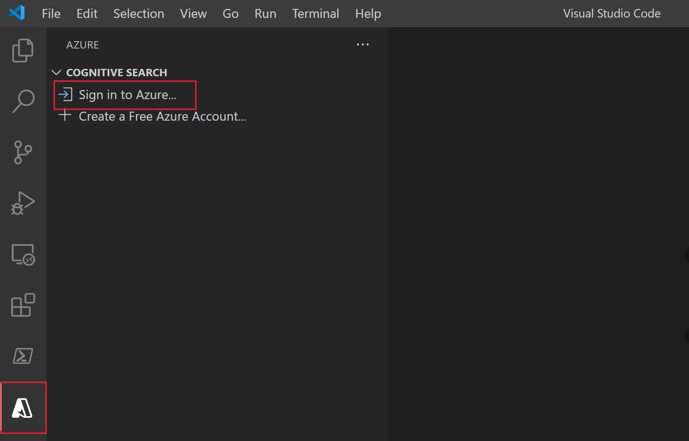
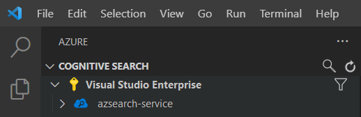
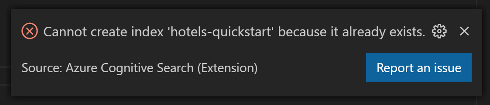
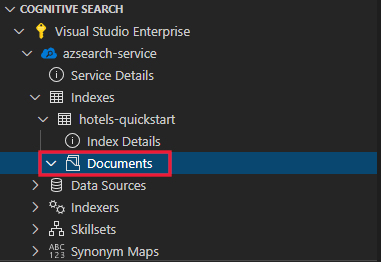
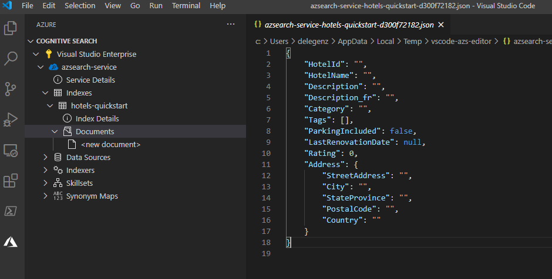
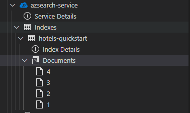
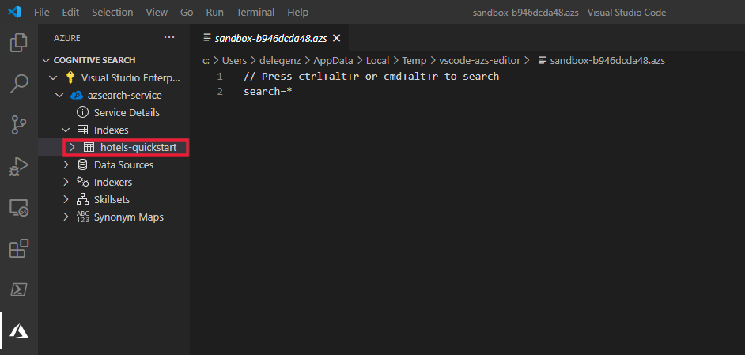
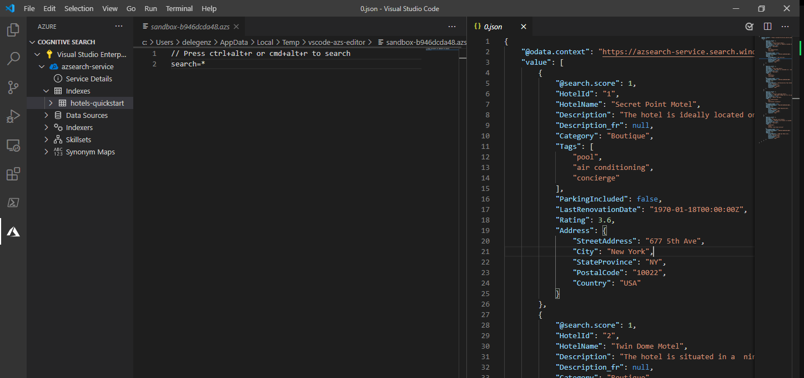
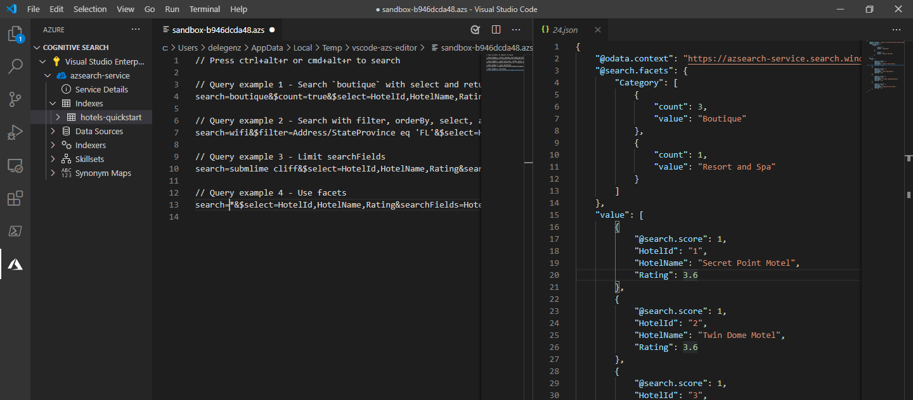

# Get started with Azure Cognitive Search using Visual Studio Code

This article explains how to formulate REST API requests interactively using the [Azure Cognitive Search REST APIs](/rest/api/searchservice) and [Visual Studio Code](https://marketplace.visualstudio.com/items?itemName=ms-azuretools.vscode-azurecognitivesearch). With the [Visual Studio code extension for Azure Cognitive Search (preview)](https://marketplace.visualstudio.com/items?itemName=ms-azuretools.vscode-azurecognitivesearch) and these instructions, you can send requests and view responses before writing any code.

If you don't have an Azure subscription, create a [free account](https://azure.microsoft.com/free/?WT.mc_id=A261C142F) before you begin.

> [!IMPORTANT] 
> This extension is in public preview under [supplemental terms of use](https://azure.microsoft.com/support/legal/preview-supplemental-terms/). 

## Prerequisites

The following services and tools are required for this quickstart. 

+ [Visual Studio Code](https://code.visualstudio.com/download)

+ [Azure Cognitive Search for Visual Studio Code (Preview)](https://marketplace.visualstudio.com/items?itemName=ms-azuretools.vscode-azurecognitivesearch)

+ [Create an Azure Cognitive Search service](search-create-service-portal.md) or [find an existing service](https://portal.azure.com/#blade/HubsExtension/BrowseResourceBlade/resourceType/Microsoft.Search%2FsearchServices) under your current subscription. You can use a free service for this quickstart. 

## Install the extension

Start [Visual Studio Code](https://code.visualstudio.com). Select the **Extensions** tab on the activity bar, then search for *Azure Cognitive Search*. Find the extension in the search results, and select **Install**.



Alternatively, you can install the [Azure Cognitive Search extension](https://aka.ms/vscode-search) from the Visual Studio Code marketplace in a web browser.

You should see a new Azure tab appear on the activity bar if you don't already have it.



## Connect to your subscription

Select **Sign in to Azure...** and log into your Azure Account.

You should see your subscriptions. In the following screenshot, the subscription name is "Visual Studio Enterprise" and it contains one search service named "azsearch-service". 



To limit the subscriptions displayed, open the command palette (Ctrl+Shift+P or Cmd+Shift+P) and search for *Azure* or *Select Subscriptions*. There are also commands available for signing in and out of your Azure account.

When you expand the search service, you'll see tree items for each Cognitive Search item: indexes, data sources, indexers, skillsets, synonym maps, and aliases.


These tree items can be expanded to show any resources you have in your search service.

## 1 - Create an index

To get started with Azure Cognitive Search, you first need to create a search index. This is done using the [Create Index REST API](/rest/api/searchservice/create-index). 

With the VS Code extension, you only need to worry about the body of the request. For this quickstart, we provide a sample index definition and corresponding documents.

### Index definition

The index definition below is a sample schema for fictitious hotels.

The `fields` collection defines the structure of documents in the search index. Each field has a data type and a number of additional attributes that determine how the field can be used.

```json
{
    "name": "hotels-quickstart",
    "fields": [
        {
            "name": "HotelId",
            "type": "Edm.String",
            "key": true,
            "filterable": true
        },
        {
            "name": "HotelName",
            "type": "Edm.String",
            "searchable": true,
            "filterable": false,
            "sortable": true,
            "facetable": false
        },
        {
            "name": "Description",
            "type": "Edm.String",
            "searchable": true,
            "filterable": false,
            "sortable": false,
            "facetable": false,
            "analyzer": "en.lucene"
        },
        {
            "name": "Description_fr",
            "type": "Edm.String",
            "searchable": true,
            "filterable": false,
            "sortable": false,
            "facetable": false,
            "analyzer": "fr.lucene"
        },
        {
            "name": "Category",
            "type": "Edm.String",
            "searchable": true,
            "filterable": true,
            "sortable": true,
            "facetable": true
        },
        {
            "name": "Tags",
            "type": "Collection(Edm.String)",
            "searchable": true,
            "filterable": true,
            "sortable": false,
            "facetable": true
        },
        {
            "name": "ParkingIncluded",
            "type": "Edm.Boolean",
            "filterable": true,
            "sortable": true,
            "facetable": true
        },
        {
            "name": "LastRenovationDate",
            "type": "Edm.DateTimeOffset",
            "filterable": true,
            "sortable": true,
            "facetable": true
        },
        {
            "name": "Rating",
            "type": "Edm.Double",
            "filterable": true,
            "sortable": true,
            "facetable": true
        },
        {
            "name": "Address",
            "type": "Edm.ComplexType",
            "fields": [
                {
                    "name": "StreetAddress",
                    "type": "Edm.String",
                    "filterable": false,
                    "sortable": false,
                    "facetable": false,
                    "searchable": true
                },
                {
                    "name": "City",
                    "type": "Edm.String",
                    "searchable": true,
                    "filterable": true,
                    "sortable": true,
                    "facetable": true
                },
                {
                    "name": "StateProvince",
                    "type": "Edm.String",
                    "searchable": true,
                    "filterable": true,
                    "sortable": true,
                    "facetable": true
                },
                {
                    "name": "PostalCode",
                    "type": "Edm.String",
                    "searchable": true,
                    "filterable": true,
                    "sortable": true,
                    "facetable": true
                },
                {
                    "name": "Country",
                    "type": "Edm.String",
                    "searchable": true,
                    "filterable": true,
                    "sortable": true,
                    "facetable": true
                }
            ]
        }
    ],
    "suggesters": [
        {
            "name": "sg",
            "searchMode": "analyzingInfixMatching",
            "sourceFields": [
                "HotelName"
            ]
        }
    ]
}
```

To create a new index, right-click on **Indexes** and then select **Create new index**. An editor with a name similar to `indexes-new-28c972f661.azsindex` will pop up. 

Paste the index definition from above into the window. Save the file and select **Upload** when prompted if you want to update the index. This step creates the index and adds it to the tree view on the left.


If there's a problem with your index definition, you should see an error message similar to the one below.



If an error occurs, fix the issue and resave the file.

## 2 - Load documents

In the REST API, creating the index and populating the index are separate steps. In Azure Cognitive Search, the index contains all searchable data. In this quickstart, the data is provided as JSON documents. The [Add, Update, or Delete Documents REST API](/rest/api/searchservice/addupdate-or-delete-documents) is used for this task. 

To add new documents to the index:

1. Expand the `hotels-quickstart` index you created. Right-click on **Documents** and select **Create new document**.

    

2. You should see a JSON editor that has inferred the schema of your index.

    

3. Paste in the JSON below and then save the file. A prompt asks you to confirm your changes. Select **Upload** to save the changes.

    ```json
    {
        "HotelId": "1",
        "HotelName": "Secret Point Motel",
        "Description": "The hotel is ideally located on the main commercial artery of the city in the heart of New York. A few minutes away is Time's Square and the historic centre of the city, as well as other places of interest that make New York one of America's most attractive and cosmopolitan cities.",
        "Category": "Boutique",
        "Tags": [ "pool", "air conditioning", "concierge" ],
        "ParkingIncluded": false,
        "LastRenovationDate": "1970-01-18T00:00:00Z",
        "Rating": 3.60,
        "Address": {
            "StreetAddress": "677 5th Ave",
            "City": "New York",
            "StateProvince": "NY",
            "PostalCode": "10022",
            "Country": "USA"
        } 
    }
    ```

4. Repeat this process for the three remaining documents:

    Document 2:
    ```json
    {
        "HotelId": "2",
        "HotelName": "Twin Dome Motel",
        "Description": "The hotel is situated in a  nineteenth century plaza, which has been expanded and renovated to the highest architectural standards to create a modern, functional and first-class hotel in which art and unique historical elements coexist with the most modern comforts.",
        "Category": "Boutique",
        "Tags": [ "pool", "free wifi", "concierge" ],
        "ParkingIncluded": false,
        "LastRenovationDate": "1979-02-18T00:00:00Z",
        "Rating": 3.60,
        "Address": {
            "StreetAddress": "140 University Town Center Dr",
            "City": "Sarasota",
            "StateProvince": "FL",
            "PostalCode": "34243",
            "Country": "USA"
        } 
    }
    ```

    Document 3:
    ```json
    {
        "HotelId": "3",
        "HotelName": "Triple Landscape Hotel",
        "Description": "The Hotel stands out for its gastronomic excellence under the management of William Dough, who advises on and oversees all of the Hotel’s restaurant services.",
        "Category": "Resort and Spa",
        "Tags": [ "air conditioning", "bar", "continental breakfast" ],
        "ParkingIncluded": true,
        "LastRenovationDate": "2015-09-20T00:00:00Z",
        "Rating": 4.80,
        "Address": {
            "StreetAddress": "3393 Peachtree Rd",
            "City": "Atlanta",
            "StateProvince": "GA",
            "PostalCode": "30326",
            "Country": "USA"
        } 
    }
    ```

    Document 4:
    ```json
    {
        "HotelId": "4",
        "HotelName": "Sublime Cliff Hotel",
        "Description": "Sublime Cliff Hotel is located in the heart of the historic center of Sublime in an extremely vibrant and lively area within short walking distance to the sites and landmarks of the city and is surrounded by the extraordinary beauty of churches, buildings, shops and monuments. Sublime Cliff is part of a lovingly restored 1800 palace.",
        "Category": "Boutique",
        "Tags": [ "concierge", "view", "24-hour front desk service" ],
        "ParkingIncluded": true,
        "LastRenovationDate": "1960-02-06T00:00:00Z",
        "Rating": 4.60,
        "Address": {
            "StreetAddress": "7400 San Pedro Ave",
            "City": "San Antonio",
            "StateProvince": "TX",
            "PostalCode": "78216",
            "Country": "USA"
        }
    }
    ```

At this point, you should see all four documents available in the documents section.



## 3 - Search an index

Now that the index contains content, you can issue queries using [Search Documents REST API](/rest/api/searchservice/search-documents):

1. Right-click the index you want to search and select **Search**. This step opens an editor with a name similar to `sandbox-b946dcda48.azs`.

    

2. A simple query is autopopulated. Press **Ctrl+Alt+R** or **Cmd+Alt+R** to submit the query. You'll see the results pop up in a window to the left.

    

### Example queries

Try a few other query examples to get a feel for the syntax. There's four additional queries below for you to try. You can add multiple queries to the same editor. When you press **Ctrl+Alt+R** or **Cmd+Alt+R**, the line your cursor determines which query will be submitted.



In the first query, we search `boutique` and `select` only certain fields. It's a best practice to only `select` the fields you need because pulling back unnecessary data can add latency to your queries. The query also sets `$count=true` to return the total number of results with the search results.

```
// Query example 1 - Search `boutique` with select and return count
search=boutique&$count=true&$select=HotelId,HotelName,Rating,Category
```

In the next query, we specify the search term `wifi` and also include a filter to only return results where the state is equal to `'FL'`. Results are also ordered by the Hotel's `Rating`.

```
// Query example 2 - Search with filter, orderBy, select, and count
search=wifi&$filter=Address/StateProvince eq 'FL'&$select=HotelId,HotelName,Rating,Address/StateProvince&$orderby=Rating desc
```

Next, the search is limited to a single searchable field using the `searchFields` parameter. This is a great option to make your query more efficient if you know you're only interested in matches in certain fields.

```
// Query example 3 - Limit searchFields
search=sublime cliff&$select=HotelId,HotelName,Rating&searchFields=HotelName
```

Another common option to include in a query is `facets`. Facets allow you to build out filters on your app to make it easy for users to know what values they can filter down to.

```
// Query example 4 - Take the top two results, and show only HotelName and Category in the results
search=*&$select=HotelId,HotelName,Rating&searchFields=HotelName&facet=Category
```

## Open index in the portal

If you'd like to view your search service in the portal, right-click the name of the search service and select **Open in Portal**.

## Clean up resources

When you're working in your own subscription, it's a good idea at the end of a project to identify whether you still need the resources you created. Resources left running can cost you money. You can delete resources individually or delete the resource group to delete the entire set of resources.

You can find and manage resources in the portal, using the **All resources** or **Resource groups** link in the left-navigation pane.

If you are using a free service, remember that you are limited to three indexes, indexers, and data sources. You can delete individual items in the portal to stay under the limit. 

## Next steps

Now that you know how to perform core tasks, you can move forward with additional REST API calls for more advanced features, such as indexers or [setting up an enrichment pipeline](cognitive-search-tutorial-blob.md) that adds content transformations to indexing. For your next step, we recommend the following link:

> [!div class="nextstepaction"]
> [Tutorial: Use REST and AI to generate searchable content from Azure blobs](cognitive-search-tutorial-blob.md)
