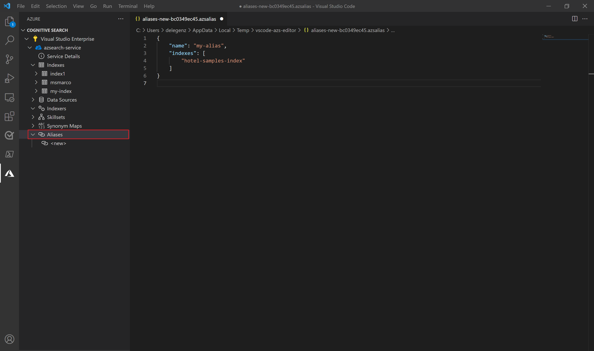

# Create an index alias in Azure Cognitive Search

> [!IMPORTANT]
> Index aliases are currently in public preview and available under [supplemental terms of use](https://azure.microsoft.com/support/legal/preview-supplemental-terms/).

In Azure Cognitive Search, an index alias is a secondary name that can be used to refer to an index for querying, indexing, and other operations. You can create an alias that maps to a search index and substitute the alias name in places where you would otherwise reference an index name. An alias adds flexibility if you need to change which index your application is pointing to. Instead of updating the references in your application, you can just update the mapping for your alias.

The main goal of index aliases is to make it easier to manage your production indexes. For example, if you need to make a change to your index definition, such as editing a field or adding a new analyzer, you'll have to create a new search index because all search indexes are immutable. This means you either need to [drop and rebuild your index](search-howto-reindex.md) or create a new index and then migrate your application over to that index.

Instead of dropping and rebuilding your index, you can use index aliases. A typical workflow would be to: 

1. Create your search index
1. Create an alias that maps to your search index
1. Have your application send querying/indexing requests to the alias rather than the index name
1. When you need to make a change to your index that requires a rebuild, create a new search index 
1. When your new index is ready to go, update the alias to map to the new index and requests will automatically be routed to the new index

## Create an index alias

You can create an alias using the preview REST API, the preview SDKs, or through [Visual Studio Code](search-get-started-vs-code.md). An alias consists of the `name` of the alias and the name of the search index that the alias is mapped to. Only one index name can be specified in the `indexes` array.

### [**REST API**](#tab/rest)

You can use the [Create or Update Alias (REST preview)](/rest/api/searchservice/preview-api/create-or-update-alias) to create an index alias.

```http
POST /aliases?api-version=2021-04-30-preview
{
    "name": "my-alias",
    "indexes": ["hotel-samples-index"]
}
```

### [**Visual Studio Code**](#tab/vscode)

To create an alias in Visual Studio Code:
1. Follow the steps in the [Visual Studio Code Quickstart](search-get-started-vs-code.md) to install the [Azure Cognitive Search extension](https://marketplace.visualstudio.com/items?itemName=ms-azuretools.vscode-azurecognitivesearch) and connect to your Azure Subscription.
1. Navigate to your search service.
1. Under your search service, right-click on **Aliases** and select **Create new alias**.
1. Provide the name of your alias and the name of the search index you'd like to map it to and then save the file to create the alias.

    

---

## Send requests to an index alias

Once you've created your alias, you're ready to start using it. Aliases can be used for [querying](/rest/api/searchservice/search-documents) and [indexing](/rest/api/searchservice/addupdate-or-delete-documents).

In the query below, instead of sending the request to `hotel-samples-index`, you can instead send the request to `my-alias` and it will be routed accordingly. 

```http
POST /indexes/my-alias/docs/search?api-version=2021-04-30-preview
{
    "search": "pool spa +airport",
    "searchMode": any,
    "queryType": "simple",
    "select": "HotelId, HotelName, Category, Description",
    "count": true
}
```

If you expect that you may need to make updates to your index definition for your production indexes, you should use an alias rather than the index name for requests in your client-side application. Scenarios that require you to create a new index are outlined under these [rebuild conditions](search-howto-reindex.md#rebuild-conditions).

> [!NOTE]
> You can only use an alias for [querying](/rest/api/searchservice/search-documents) and [indexing](/rest/api/searchservice/addupdate-or-delete-documents). Aliases can't be used to get or update an index definition, can't be used with the Analyze Text API, and can't be used as the `targetIndexName` on an indexer.

## Swap indexes

Now, whenever you need to update your application to point to a new index, all you need to do is update the mapping in your alias. PUT is required for updates as described in [Create or Update Alias (REST preview)](/rest/api/searchservice/preview-api/create-or-update-alias).

```http
PUT /aliases/my-alias?api-version=2021-04-30-preview
{
    "name": "my-alias",
    "indexes": ["hotel-samples-index2"]
}
```
After you make the update to the alias, requests will automatically start to be routed to the new index.

> [!NOTE]
> An update to an alias may take up to 10 seconds to propagate through the system so you should wait at least 10 seconds before deleting the index that the alias was previously mapped to.

## See also

+ [Drop and rebuild an index in Azure Cognitive Search](search-howto-reindex.md)