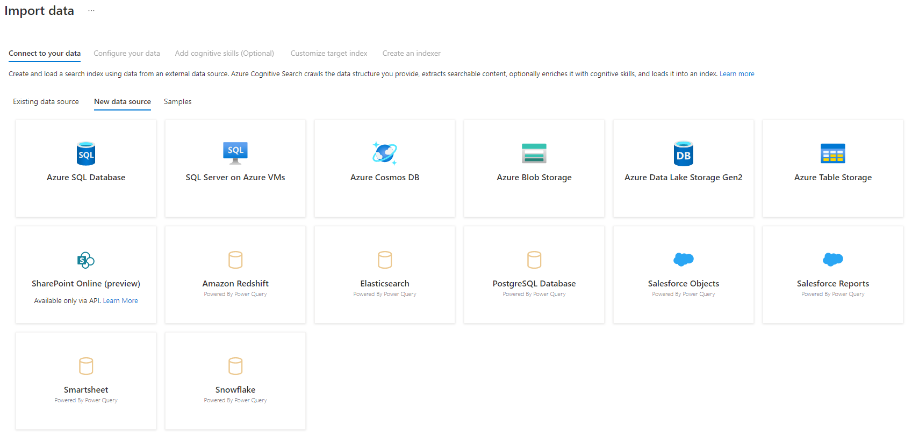
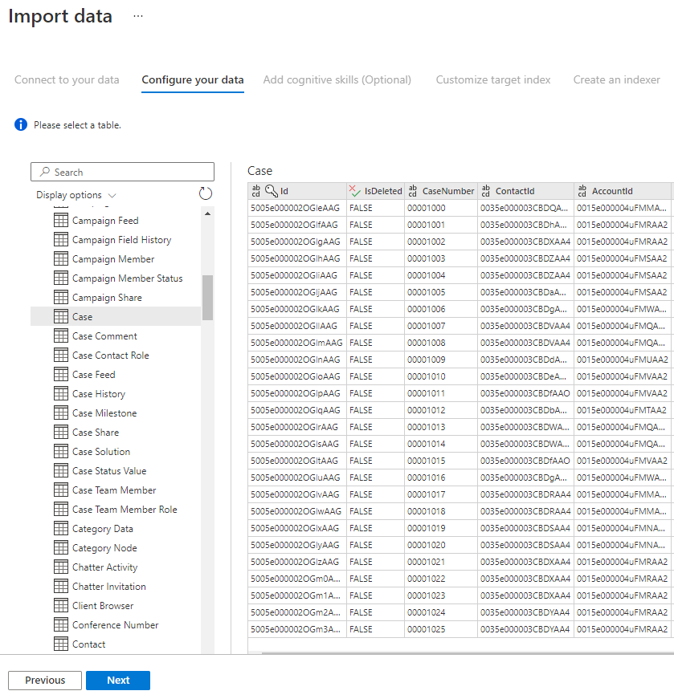
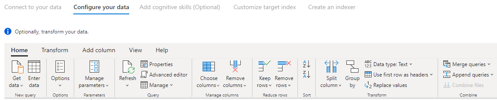
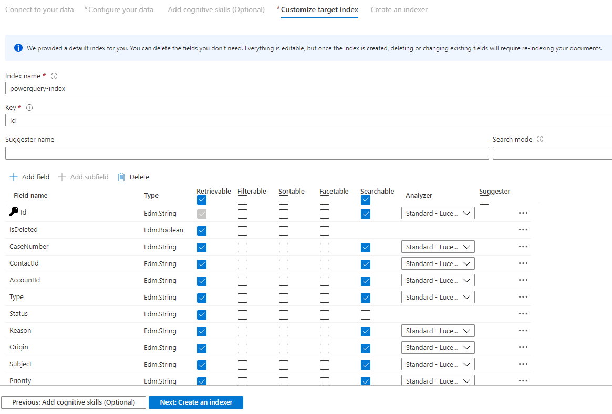
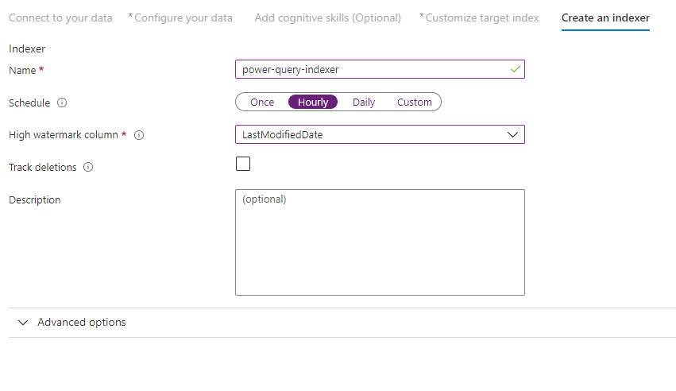

# Index data using Power Query connectors (preview)

> [!IMPORTANT] 
> Power Query connector support is currently in a **gated public preview**. [Sign up](https://aka.ms/azure-cognitive-search/indexer-preview) to request access.

If you are using an indexer to crawl external data sources for indexing, you can now use select [Power Query](/power-query/power-query-what-is-power-query) connectors for your data source connection in Azure Cognitive Search.

Power Query connectors can reach a broader range of data sources, including those on other cloud providers. New data sources supported in this preview include:

+ Amazon Redshift
+ Elasticsearch
+ PostgreSQL
+ Salesforce Objects
+ Salesforce Reports
+ Smartsheet
+ Snowflake

This article shows you an Azure portal-based approach for setting up an indexer using Power Query connectors. Currently, there is no SDK support.

> [!NOTE]
> Preview functionality is provided without a service level agreement, and is not recommended for production workloads. For more information, see [Supplemental Terms of Use for Microsoft Azure Previews](https://azure.microsoft.com/support/legal/preview-supplemental-terms/).

## Supported functionality
Power Query connectors are used in indexers. An indexer in Azure Cognitive Search is a crawler that extracts searchable data and metadata from an external data source and populates an index based on field-to-field mappings between the index and your data source. This approach is sometimes referred to as a 'pull model' because the service pulls data in without you having to write any code that adds data to an index. Indexers provide a convenient way for users to index content from their data source without having to write their own crawler or push model.

Indexers that reference Power Query data sources have the same level of support for skillsets, schedules, high water mark change detection logic, and most parameters that other indexers support.

## Prerequisites
Before you start pulling data from one of the supported data sources, you'll want to make sure you have all your resources set up.
+ Azure Cognitive Search service
    + Azure Cognitive Search service set up in a [supported region](search-how-to-index-power-query-data-sources.md#regional-availability).
    + Ensure that the Azure Cognitive Search team has enabled your search service for the preview. You can sign up for the preview by filling out [this form](https://aka.ms/azure-cognitive-search/indexer-preview). 
+ Azure Blob Storage account
    + A Blob Storage account is required for the preview to be used as an intermediary for your data. The data will flow from your data source, then to Blob Storage, then to the index. This requirement only exists with the initial gated preview.

## Getting started using the Azure portal
The Azure portal provides support for the Power Query connectors. By sampling data and reading metadata on the container, the Import data wizard in Azure Cognitive Search can create a default index, map source fields to target index fields, and load the index in a single operation. Depending on the size and complexity of source data, you could have an operational full text search index in minutes.

 The following video shows how to set up a Power Query connector in Azure Cognitive Search.
 
> [!VIDEO https://www.youtube.com/embed/uy-l4xFX1EE]

### Step 1 – Prepare source data
Make sure your data source contains data. The Import data wizard reads metadata and performs data sampling to infer an index schema, but it also loads data from your data source. If the data is missing, the wizard will stop and return and error. 

### Step 2 – Start Import data wizard
After you're approved for the preview, the Azure Cognitive Search team will provide you with an Azure portal link that uses a feature flag so that you can access the  Power Query connectors. Open this page and start the start the wizard from the command bar in the Azure Cognitive Search service page by selecting **Import data**.


### Step 3 – Select your data source
There are a few data sources that you can pull data from using this preview. All data sources that use Power Query will include a "Powered By Power Query" on their tile. 
Select your data source. 
 


Once you've selected your data source, select **Next: Configure your data** to move to the next section.

### Step 4 – Configure your data
Once you've selected your data source, you'll configure your connection. Each data source will require different information. For a few data sources, the Power Query documentation provides additional details on how to connect to your data. 

+ [PostgreSQL](/power-query/connectors/postgresql)
+ [Salesforce Objects](/power-query/connectors/salesforceobjects)
+ [Salesforce Reports](/power-query/connectors/salesforcereports)

Once you've provided your connection credentials, select **Next**.

### Step 5 – Select your data
The import wizard will preview various tables that are available in your data source. In this step you'll check one table that contains the data you want to import into your index.
 


Once you've selected your table, select **Next**.

### Step 6 – Transform your data (Optional)
Power Query connectors provide you with a rich UI experience that allows you to manipulate your data so you can send the right data to your index. You can remove columns, filter rows, and much more. 

It's not required that you transform your data before importing it into Azure Cognitive Search.

 

For more information about transforming data with Power Query, look at [Using Power Query in Power BI Desktop](/power-query/power-query-quickstart-using-power-bi). 

Once you're done transforming your data, select **Next**.

### Step 7 – Add Azure Blob storage
The Power Query connector preview currently requires you to provide a blob storage account. This step only exists with the initial gated preview. This blob storage account will serve as temporary storage for data that moves from your data source to an Azure Cognitive Search index.

We recommend providing a full access storage account connection string: 
```
{ "connectionString" : "DefaultEndpointsProtocol=https;AccountName=<your storage account>;AccountKey=<your account key>;" }
```

You can get the connection string from the Azure portal by navigating to the storage account blade > Settings > Keys (for Classic storage accounts) or Settings > Access keys (for Azure Resource Manager storage accounts).

After you've provided a data source name and connection string, select “Next: Add cognitive skills (Optional)”. 

### Step 8 – Add cognitive skills (Optional)
[AI enrichment](cognitive-search-concept-intro.md) is an extension of indexers that can be used to make your content more searchable.

This is an optional step for this preview. When complete, select **Next: Customize target index**.

### Step 9 – Customize target index
On the Index page, you should see a list of fields with a data type and a series of checkboxes for setting index attributes. The wizard can generate a fields list based on metadata and by sampling the source data.

You can bulk-select attributes by clicking the checkbox at the top of an attribute column. Choose Retrievable and Searchable for every field that should be returned to a client app and subject to full text search processing. You'll notice that integers are not full text or fuzzy searchable (numbers are evaluated verbatim and are often useful in filters).

Review the description of index attributes and language analyzers for more information.

Take a moment to review your selections. Once you run the wizard, physical data structures are created and you won't be able to edit most of the properties for these fields without dropping and recreating all objects.



When complete, select **Next: Create an Indexer**.

### Step 10 – Create an indexer
The last step creates the indexer. Naming the indexer allows it to exist as a standalone resource, which you can schedule and manage independently of the index and data source object, created in the same wizard sequence.

The output of the Import data wizard is an indexer that crawls your data source and imports the data you selected into an index on Azure Cognitive Search.

When creating the indexer, you can optionally choose to run the indexer on a schedule and add change detection. To add change detection, designate a 'high water mark' column.



Once you've finished filling out this page select **Submit**.

## High Water Mark Change Detection policy
This change detection policy relies on a "high water mark" column capturing the version or time when a row was last updated.

### Requirements
+ All inserts specify a value for the column.
+ All updates to an item also change the value of the column.
+ The value of this column increases with each insert or update.

## Unsupported column names
Field names in an Azure Cognitive Search index have to meet certain requirements. One of these requirements is that some characters such as "/" are not allowed. If a column name in your database does not meet these requirements, the index schema detection will not recognize your column as a valid field name and you won't see that column listed as a suggested field for your index. Normally, using [field mappings](search-indexer-field-mappings.md) would solve this problem but field mappings are not supported in the portal.

To index content from a column in your table that has an unsupported field name, rename the column during the "Transform your data" phase of the import data process. For example, you can rename a column named "Billing code/Zip code" to "zipcode". By renaming the column, the index schema detection will recognize it as a valid field name and add it as a suggestion to your index definition.

## Regional availability
The preview is only available to customers with search services in the following regions:
+ Central US
+ East US
+ East US 2
+ North Central US
+ North Europe
+ South Central US
+ West Central US
+ West Europe
+ West US
+ West US 2

## Preview limitations
There is a lot to be excited about with this preview, but there are a few limitations. This section describes the limitations that are specific to the current version of the preview.
+ Pulling binary data from your data source is not supported in this version of the preview. 
+ [Debug sessions](cognitive-search-debug-session.md) are not supported at this time.

## Next steps
You have learned how to pull data from new data sources using the Power Query connectors. To learn more about indexers, see [Indexers in Azure Cognitive Search](search-indexer-overview.md).