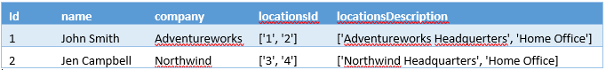
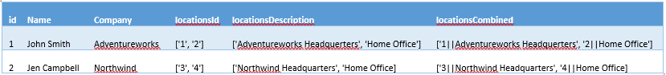

# How to model complex data types in Azure Search
External datasets used to populate an Azure Search index sometimes include hierarchical or nested substructures that do not break down neatly into a tabular rowset. Examples of such structures might include multiple locations and phone numbers for a single customer, multiple colors and sizes for a single SKU, multiple authors of a single book, and so on. In modeling terms, you might see these structures referred to as *complex data types*, *compound data types*, *composite data types*, or *aggregate data types*, to name a few.

Complex data types are not natively supported in Azure Search, but a proven workaround includes a two-step process of flattening the structure and then using a **Collection** data type to reconstitute the interior structure. Following the technique described in this article allows the content to be searched, faceted, filtered, and sorted.

## Example of a complex data structure
Typically, the data in question resides as a set of JSON or XML documents, or as items in a NoSQL store such as Azure Cosmos DB. Structurally, the challenge stems from having multiple child items that need to be searched and filtered.  As a starting point for illustrating the workaround, take the following JSON document that lists a set of contacts as an example:

~~~~~
[
  {
    "id": "1",
    "name": "John Smith",
    "company": "Adventureworks",
    "locations": [
      {
        "id": "1",
        "description": "Adventureworks Headquarters"
      },
      {
        "id": "2",
        "description": "Home Office"
      }
    ]
  }, 
  {
    "id": "2",
    "name": "Jen Campbell",
    "company": "Northwind",
    "locations": [
      {
        "id": "3",
        "description": "Northwind Headquarter"
      },
      {
        "id": "4",
        "description": "Home Office"
      }
    ]
}]
~~~~~

While the fields named ‘id’, ‘name’ and ‘company’ can easily be mapped one-to-one as fields within an Azure Search index, the ‘locations’ field contains an array of locations, having both a set of location IDs as well as location descriptions. Given that Azure Search does not have a data type that supports this, we need a different way to model this in Azure Search. 

> [!NOTE]
> This technique is also described by Kirk Evans in a blog post [Indexing DocumentDB with Azure Search](https://blogs.msdn.microsoft.com/kaevans/2015/03/09/indexing-documentdb-with-azure-seach/), which shows a technique called "flattening the data", whereby you would have a field called `locationsID` and `locationsDescription` that are both [collections](https://msdn.microsoft.com/library/azure/dn798938.aspx) (or an array of strings).   
> 
> 

## Part 1: Flatten the array into individual fields
To create an Azure Search index that accommodates this dataset, create individual fields for the nested substructure: `locationsID` and `locationsDescription` with a data type of [collections](https://msdn.microsoft.com/library/azure/dn798938.aspx) (or an array of strings). In these fields you would index the values ‘1’ and ‘2’ into the `locationsID` field for John Smith and the values ‘3’ & ‘4’ into the `locationsID` field for Jen Campbell.  

Your data within Azure Search would look like this: 

## Part 2: Add a collection field in the index definition
In the index schema, the field definitions might look similar to this example.

~~~~
var index = new Index()
{
    Name = indexName,
    Fields = new[]
    {
        new Field("id", DataType.String) { IsKey = true },
        new Field("name", DataType.String) { IsSearchable = true, IsFilterable = false, IsSortable = false, IsFacetable = false },
        new Field("company", DataType.String) { IsSearchable = true, IsFilterable = false, IsSortable = false, IsFacetable = false },
        new Field("locationsId", DataType.Collection(DataType.String)) { IsSearchable = true, IsFilterable = true, IsFacetable = true },
        new Field("locationsDescription", DataType.Collection(DataType.String)) { IsSearchable = true, IsFilterable = true, IsFacetable = true }
    }
};
~~~~

## Validate search behaviors and optionally extend the index
Assuming you created the index and loaded the data, you can now test the solution to verify search query execution against the dataset. Each **collection** field should be **searchable**, **filterable** and **facetable**. You should be able to run queries like:

* Find all people who work at the ‘Adventureworks Headquarters’.
* Get a count of the number of people who work in a ‘Home Office’.  
* Of the people who work at a ‘Home Office’, show what other offices they work along with a count of the people in each location.  

Where this technique falls apart is when you need to do a search that combines both the location id as well as the location description. For example:

* Find all people where they have a Home Office AND has a location ID of 4.  

If you recall the original content looked like this:

~~~~
   {
        id: '4',
        description: 'Home Office'
   }
~~~~

However, now that we have separated the data into separate fields, we have no way of knowing if the Home Office for Jen Campbell relates to `locationsID 3` or `locationsID 4`.  

To handle this case, define another field in the index that combines all of the data into a single collection.  For our example, we will call this field `locationsCombined` and we will separate the content with a `||` although you can choose any separator that you think would be a unique set of characters for your content. For example: 

Using this `locationsCombined` field, we can now accommodate even more queries, such as:

* Show a count of people who work at a ‘Home Office’ with location Id of ‘4’.  
* Search for people who work at a ‘Home Office’ with location Id ‘4’. 

## Limitations
This technique is useful for a number of scenarios, but it is not applicable in every case.  For example:

1. If you do not have a static set of fields in your complex data type and there was no way to map all the possible types to a single field. 
2. Updating the nested objects requires some extra work to determine exactly what needs to be updated in the Azure Search index

## Sample code
You can see an example on how to index a complex JSON data set into Azure Search and perform a number of queries over this dataset at this [GitHub repo](https://github.com/liamca/AzureSearchComplexTypes).

## Next step
[Vote for native support for complex data types](https://feedback.azure.com/forums/263029-azure-search) on the Azure Search UserVoice page and provide any additional input that you’d like us to consider regarding feature implementation. You can also reach out to me directly on Twitter at @liamca.

