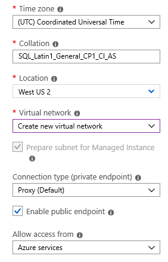
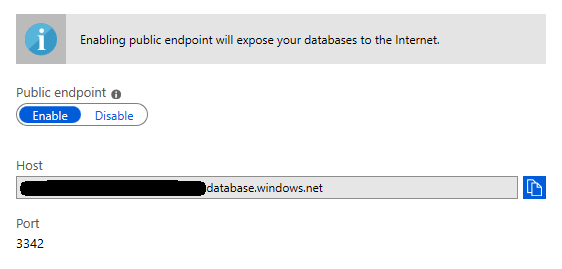
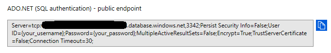

# Configure a connection from an Azure Cognitive Search indexer to SQL Managed Instance

As noted in [Connecting Azure SQL Database to Azure Cognitive Search using indexers](search-howto-connecting-azure-sql-database-to-azure-search-using-indexers.md#faq), creating indexers against **SQL Managed Instances** is supported by Azure Cognitive Search through the public endpoint.

## Create Azure SQL Managed Instance with public endpoint
Create a SQL Managed Instance with the **Enable public endpoint** option selected.

   

## Enable Azure SQL Managed Instance public endpoint
You can also enable public endpoint on an existing SQL Managed Instance under **Security** > **Virtual network** > **Public endpoint** > **Enable**.

   

## Verify NSG rules
Check the Network Security Group has the correct **Inbound security rules** that allow connections from Azure services.

   

> [!NOTE]
> Indexers still require that SQL Managed Instance be configured with a public endpoint in order to read data.
> However, you can choose to restrict the inbound access to that public endpoint by replacing the current rule (`public_endpoint_inbound`) with the following 2 rules:
>
> * Allowing inbound access from the `AzureCognitiveSearch` [service tag](https://docs.microsoft.com/azure/virtual-network/service-tags-overview#available-service-tags) ("SOURCE" = `AzureCognitiveSearch`, "NAME" = `cognitive_search_inbound`)
>
> * Allowing inbound access from the IP address of the search service, which can be obtained by pinging its fully qualified domain name (eg., `<your-search-service-name>.search.windows.net`). ("SOURCE" = `IP address`, "NAME" = `search_service_inbound`)
>
> For each of those 2 rules, set "PORT" = `3342`, "PROTOCOL" = `TCP`, "DESTINATION" = `Any`, "ACTION" = `Allow`

## Get public endpoint connection string
Make sure you use the connection string for the **public endpoint** (port 3342, not port 1433).

   

## Next steps
With configuration out of the way, you can now specify a SQL Managed Instance as the data source for an Azure Cognitive Search indexer using either the portal or REST API. See [Connecting Azure SQL Database to Azure Cognitive Search using indexers](search-howto-connecting-azure-sql-database-to-azure-search-using-indexers.md) for more information.
