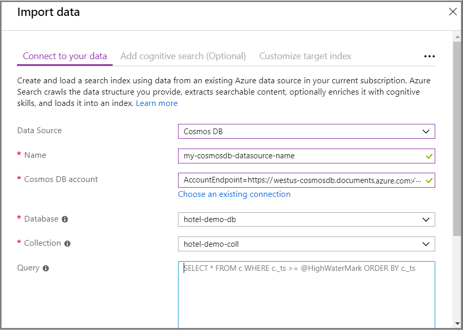
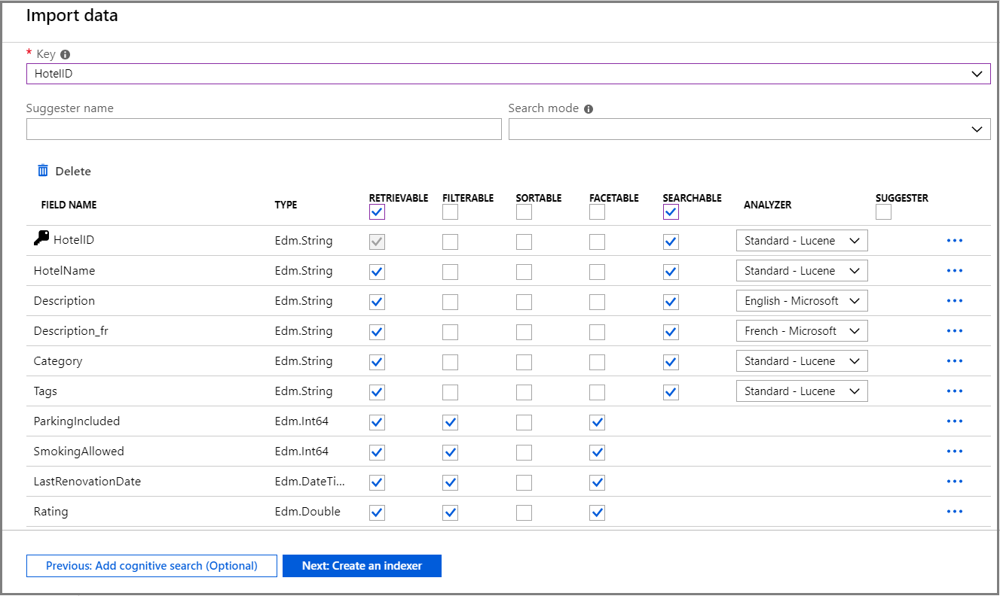
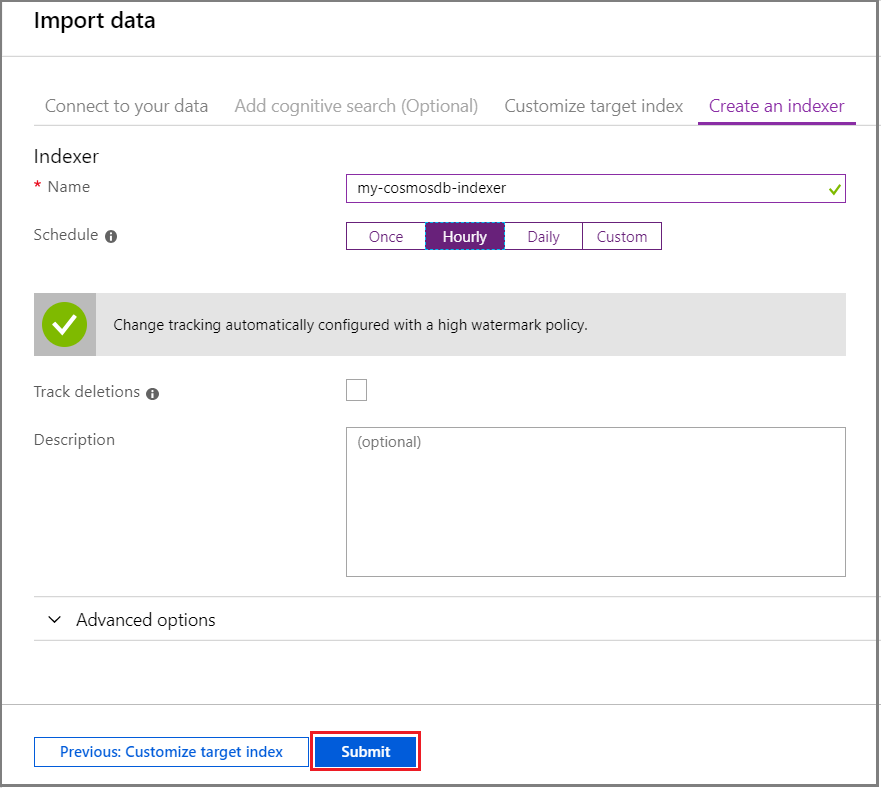

# How to index Cosmos DB using an Azure Search indexer

> [!Note]
> MongoDB API support is in preview and not intended for production use. The [REST API version 2019-05-06-Preview](search-api-preview.md) provides this feature. There is no portal or .NET SDK support at this time.
>
> SQL API is generally available.

This article shows you how to configure an Azure Cosmos DB [indexer](search-indexer-overview.md) to extract content and make it searchable in Azure Search. This workflow creates an Azure Search index and loads it with existing text extracted from Azure Cosmos DB. 

Because terminology can be confusing, it's worth noting that [Azure Cosmos DB indexing](https://docs.microsoft.com/azure/cosmos-db/index-overview) and [Azure Search indexing](search-what-is-an-index.md) are distinct operations, unique to each service. Before you start Azure Search indexing, your Azure Cosmos DB database must already exist and contain data.

You can use the [portal](#cosmos-indexer-portal), REST APIs, or .NET SDK to index Cosmos content. The Cosmos DB indexer in Azure Search can crawl [Azure Cosmos items](https://docs.microsoft.com/azure/cosmos-db/databases-containers-items#azure-cosmos-items) accessed through these protocols:

* [SQL API](https://docs.microsoft.com/azure/cosmos-db/sql-api-query-reference) 
* [MongoDB API (preview)](https://docs.microsoft.com/azure/cosmos-db/mongodb-introduction)

> [!Note]
> User Voice has existing items for additional API support. You can cast a vote for the Cosmos APIs you would like to see supported in Azure Search: [Table API](https://feedback.azure.com/forums/263029-azure-search/suggestions/32759746-azure-search-should-be-able-to-index-cosmos-db-tab), [Graph API](https://feedback.azure.com/forums/263029-azure-search/suggestions/13285011-add-graph-databases-to-your-data-sources-eg-neo4), 
[Apache Cassandra API](https://feedback.azure.com/forums/263029-azure-search/suggestions/32857525-indexer-crawler-for-apache-cassandra-api-in-azu).
>

## Use the portal

The easiest method for indexing Azure Cosmos items is to use a wizard in the [Azure portal](https://portal.azure.com/). By sampling data and reading metadata on the container, the [**Import data**](search-import-data-portal.md) wizard in Azure Search can create a default index, map source fields to target index fields, and load the index in a single operation. Depending on the size and complexity of source data, you could have an operational full text search index in minutes.

We recommend using the same Azure subscription for both Azure Search and Azure Cosmos DB, preferably in the same region.

### 1 - Prepare source data

You should have a Cosmos account, an Azure Cosmos database mapped to the SQL API or MongoDB API, and a container of JSON documents. 

Make sure your Cosmos DB database contains data. The [Import data wizard](search-import-data-portal.md) reads metadata and performs data sampling to infer an index schema, but it also loads data from Cosmos DB. If the data is missing, the wizard stops with this error "Error detecting index schema from data source: Could not build a prototype index because datasource 'emptycollection' returned no data".

### 2 - Start Import data wizard

You can [start the wizard](search-import-data-portal.md) from the command bar in the Azure Search service page, or by clicking **Add Azure Search** in the **Settings** section of your storage account's left navigation pane.

   

### 3 - Set the data source

> [!NOTE] 
> Currently, you cannot create or edit **MongoDB** data sources using Azure portal or the .NET SDK. However, you **can** monitor execution history of MongoDB indexers in the portal.

In the **data source** page, the source must be **Cosmos DB**, with the following specifications:

+ **Name** is the name of the data source object. Once created, you can choose it for other workloads.

+ **Cosmos DB account** should be the primary or secondary connection string from Cosmos DB, with an `AccountEndpoint` and an `AccountKey`. The account determines whether data is cast as SQL API or Mongo DB API

+ **Database** is an existing database from the account. 

+ **Collection** is a container of documents. Documents must exist in order for import to succeed. 

+ **Query** can be blank if you want all documents, otherwise you can input a query that selects a document subset. 

   

### 4 - Skip the "Add cognitive search" page in the wizard

Adding cognitive skills is not necessary for document import. Unless you have a specific need to [include Cognitive Services APIs and transformations](cognitive-search-concept-intro.md) to your indexing pipeline, you should skip this step.

To skip the step, first go to the next page.

   

From that page you can skip ahead to index customization.

   

### 5 - Set index attributes

In the **Index** page, you should see a list of fields with a data type and a series of checkboxes for setting index attributes. The wizard can generate a fields list based on metadata and by sampling the source data. 

You can bulk-select attributes by clicking the checkbox at the top of an attribute column. Choose **Retrievable** and **Searchable** for every field that should be returned to a client app and subject to full text search processing. You'll notice that integers are not full text or fuzzy searchable (numbers are evaluated verbatim and are often useful in filters).

Review the description of [index attributes](https://docs.microsoft.com/rest/api/searchservice/create-index#bkmk_indexAttrib) and [language analyzers](https://docs.microsoft.com/rest/api/searchservice/language-support) for more information. 

Take a moment to review your selections. Once you run the wizard, physical data structures are created and you won't be able to edit these fields without dropping and recreating all objects.

   

### 6 - Create indexer

Fully specified, the wizard creates three distinct objects in your search service. A data source object and index object are saved as named resources in your Azure Search service. The last step creates an indexer object. Naming the indexer allows it to exist as a standalone resource, which you can schedule and manage independently of the index and data source object, created in the same wizard sequence.

If you are not familiar with indexers, an *indexer* is a resource in Azure Search that crawls an external data source for searchable content. The output of the **Import data** wizard is an indexer that crawls your Cosmos DB data source, extracts searchable content, and imports it into an index on Azure Search.

The following screenshot shows the default indexer configuration. You can switch to **Once** if you want to run the indexer one time. Click **Submit** to run the wizard and create all objects. Indexing commences immediately.

   

You can monitor data import in the portal pages. Progress notifications indicate indexing status and how many documents are uploaded. 

When indexing is complete, you can use [Search explorer](search-explorer.md) to query your index.

> [!NOTE]
> If you don't see the data you expect, you might need to set more attributes on more fields. Delete the index and indexer you just created, and step through the wizard again, modifying your selections for index attributes in step 5. 

## Use REST APIs

You can use the REST API to index Azure Cosmos DB data, following a three-part workflow common to all indexers in Azure Search: create a data source, create an index, create an indexer. Data extraction from Cosmos storage occurs when you submit the Create Indexer request. After this request is finished, you will have a queryable index. 

If you are evaluating MongoDB, you must use the REST `api-version=2019-05-06-Preview` to create the data source.

In your Cosmos DB account you can choose whether you want the collection to automatically index all documents. By default, all documents are automatically indexed, but you can turn off automatic indexing. When indexing is turned off, documents can be accessed only through their self-links or by queries by using the document ID. Azure Search requires Cosmos DB automatic indexing to be turned on in the collection that will be indexed by Azure Search. 

> [!WARNING]
> Azure Cosmos DB is the next generation of DocumentDB. Previously with API version **2017-11-11** you could use the `documentdb` syntax. This meant that you could specify your data source type as `cosmosdb` or `documentdb`. Starting with API version **2019-05-06** both the Azure Search APIs and Portal only support the `cosmosdb` syntax as instructed in this article. This means that the data source type must `cosmosdb` if you would like to connect to a Cosmos DB endpoint.

### 1 - Assemble inputs for the request

For each request, you must provide the service name and admin key for Azure Search (in the POST header), and the storage account name and key for blob storage. You can use [Postman](search-get-started-postman.md) to send HTTP requests to Azure Search.

Copy the following four values into Notepad so that you can paste them into a request:

+ Azure Search service name
+ Azure Search admin key
+ Cosmos DB connection string

You can find these values in the portal:

1. In the portal pages for Azure Search, copy the search service URL from the Overview page.

2. In the left navigation pane, click **Keys** and then copy either the primary or secondary key (they are equivalent).

3. Switch to the portal pages for your Cosmos storage account. In the left navigation pane, under **Settings**, click **Keys**. This page provides a URI, two sets of connection strings, and two sets of keys. Copy one of the connection strings to Notepad.

### 2 - Create a data source

A **data source** specifies the data to index, credentials, and policies for identifying changes in the data (such as modified or deleted documents inside your collection). The data source is defined as an independent resource so that it can be used by multiple indexers.

To create a data source, formulate a POST request:

    POST https://[service name].search.windows.net/datasources?api-version=2019-05-06
    Content-Type: application/json
    api-key: [Search service admin key]

	{
        "name": "mycosmosdbdatasource",
        "type": "cosmosdb",
        "credentials": {
            "connectionString": "AccountEndpoint=https://myCosmosDbEndpoint.documents.azure.com;AccountKey=myCosmosDbAuthKey;Database=myCosmosDbDatabaseId"
        },
        "container": { "name": "myCollection", "query": null },
        "dataChangeDetectionPolicy": {
            "@odata.type": "#Microsoft.Azure.Search.HighWaterMarkChangeDetectionPolicy",
            "highWaterMarkColumnName": "_ts"
        }
    }

The body of the request contains the data source definition, which should include the following fields:

| Field   | Description |
|---------|-------------|
| **name** | Required. Choose any name to represent your data source object. |
|**type**| Required. Must be `cosmosdb`. |
|**credentials** | Required. Must be a Cosmos DB connection string. For SQL collections, connection strings are in this format: `AccountEndpoint=<Cosmos DB endpoint url>;AccountKey=<Cosmos DB auth key>;Database=<Cosmos DB database id>` For MongoDB collections, add **ApiKind=MongoDb** to the connection string: `AccountEndpoint=<Cosmos DB endpoint url>;AccountKey=<Cosmos DB auth key>;Database=<Cosmos DB database id>;ApiKind=MongoDb` Avoid port numbers in the endpoint url. If you include the port number, Azure Search will be unable to index your Azure Cosmos DB database.|
| **container** | Contains the following elements:  **name**: Required. Specify the ID of the database collection to be indexed. **query**: Optional. You can specify a query to flatten an arbitrary JSON document into a flat schema that Azure Search can index. For MongoDB collections, queries are not supported. |
| **dataChangeDetectionPolicy** | Recommended. See [Indexing Changed Documents](#DataChangeDetectionPolicy) section.|
|**dataDeletionDetectionPolicy** | Optional. See [Indexing Deleted Documents](#DataDeletionDetectionPolicy) section.|

### Using queries to shape indexed data
You can specify a SQL query to flatten nested properties or arrays, project JSON properties, and filter the data to be indexed. 

> [!WARNING]
> Custom queries are not supported for **MongoDB** collections: `container.query` parameter must be set to null or omitted. If you need to use a custom query, please let us know on [User Voice](https://feedback.azure.com/forums/263029-azure-search).

Example document:

    {
        "userId": 10001,
        "contact": {
            "firstName": "andy",
            "lastName": "hoh"
        },
        "company": "microsoft",
        "tags": ["azure", "cosmosdb", "search"]
    }

Filter query:

    SELECT * FROM c WHERE c.company = "microsoft" and c._ts >= @HighWaterMark ORDER BY c._ts

Flattening query:

    SELECT c.id, c.userId, c.contact.firstName, c.contact.lastName, c.company, c._ts FROM c WHERE c._ts >= @HighWaterMark ORDER BY c._ts
    
    
Projection query:

    SELECT VALUE { "id":c.id, "Name":c.contact.firstName, "Company":c.company, "_ts":c._ts } FROM c WHERE c._ts >= @HighWaterMark ORDER BY c._ts

Array flattening query:

    SELECT c.id, c.userId, tag, c._ts FROM c JOIN tag IN c.tags WHERE c._ts >= @HighWaterMark ORDER BY c._ts

### 3 - Create a target search index 

[Create a target Azure Search index](/rest/api/searchservice/create-index) if you don’t have one already. The following example creates an index with an ID and description field:

    POST https://[service name].search.windows.net/indexes?api-version=2019-05-06
    Content-Type: application/json
    api-key: [Search service admin key]

	{
       "name": "mysearchindex",
       "fields": [{
         "name": "id",
         "type": "Edm.String",
         "key": true,
         "searchable": false
       }, {
         "name": "description",
         "type": "Edm.String",
         "filterable": false,
         "sortable": false,
         "facetable": false,
         "suggestions": true
       }]
     }

Ensure that the schema of your target index is compatible with the schema of the source JSON documents or the output of your custom query projection.

> [!NOTE]
> For partitioned collections, the default document key is Azure Cosmos DB's `_rid` property, which Azure Search automatically renames to `rid` because field names cannot start with an undescore character. Also, Azure Cosmos DB `_rid` values contain characters that are invalid in Azure Search keys. For this reason, the `_rid` values are Base64 encoded.
> 
> For MongoDB collections, Azure Search automatically renames the `_id` property to `doc_id`.  

### Mapping between JSON Data Types and Azure Search Data Types
| JSON data type | Compatible target index field types |
| --- | --- |
| Bool |Edm.Boolean, Edm.String |
| Numbers that look like integers |Edm.Int32, Edm.Int64, Edm.String |
| Numbers that look like floating-points |Edm.Double, Edm.String |
| String |Edm.String |
| Arrays of primitive types, for example ["a", "b", "c"] |Collection(Edm.String) |
| Strings that look like dates |Edm.DateTimeOffset, Edm.String |
| GeoJSON objects, for example { "type": "Point", "coordinates": [long, lat] } |Edm.GeographyPoint |
| Other JSON objects |N/A |

### 4 - Configure and run the indexer

Once the index and data source have been created, you're ready to create the indexer:

    POST https://[service name].search.windows.net/indexers?api-version=2019-05-06
    Content-Type: application/json
    api-key: [admin key]

    {
      "name" : "mycosmosdbindexer",
      "dataSourceName" : "mycosmosdbdatasource",
      "targetIndexName" : "mysearchindex",
      "schedule" : { "interval" : "PT2H" }
    }

This indexer runs every two hours (schedule interval is set to "PT2H"). To run an indexer every 30 minutes, set the interval to "PT30M". The shortest supported interval is 5 minutes. The schedule is optional - if omitted, an indexer runs only once when it's created. However, you can run an indexer on-demand at any time.   

For more details on the Create Indexer API, check out [Create Indexer](https://docs.microsoft.com/rest/api/searchservice/create-indexer).

For more information about defining indexer schedules see [How to schedule indexers for Azure Search](search-howto-schedule-indexers.md).

## Use .NET

The generally available .NET SDK has full parity with the generally available REST API. We recommend that you review the previous REST API section to learn concepts, workflow, and requirements. You can then refer to following .NET API reference documentation to implement a JSON indexer in managed code.

+ [microsoft.azure.search.models.datasource](https://docs.microsoft.com/dotnet/api/microsoft.azure.search.models.datasource?view=azure-dotnet)
+ [microsoft.azure.search.models.datasourcetype](https://docs.microsoft.com/dotnet/api/microsoft.azure.search.models.datasourcetype?view=azure-dotnet) 
+ [microsoft.azure.search.models.index](https://docs.microsoft.com/dotnet/api/microsoft.azure.search.models.index?view=azure-dotnet) 
+ [microsoft.azure.search.models.indexer](https://docs.microsoft.com/dotnet/api/microsoft.azure.search.models.indexer?view=azure-dotnet)

## Indexing changed documents

The purpose of a data change detection policy is to efficiently identify changed data items. Currently, the only supported policy is the `High Water Mark` policy using the `_ts` (timestamp) property provided by Azure Cosmos DB, which is specified as follows:

    {
        "@odata.type" : "#Microsoft.Azure.Search.HighWaterMarkChangeDetectionPolicy",
        "highWaterMarkColumnName" : "_ts"
    }

Using this policy is highly recommended to ensure good indexer performance. 

If you are using a custom query, make sure that the `_ts` property is projected by the query.

### Incremental progress and custom queries

Incremental progress during indexing ensures that if indexer execution is interrupted by transient failures or execution time limit, the indexer can pick up where it left off next time it runs, instead of having to reindex the entire collection from scratch. This is especially important when indexing large collections. 

To enable incremental progress when using a custom query, ensure that your query orders the results by the `_ts` column. This enables periodic check-pointing that Azure Search uses to provide incremental progress in the presence of failures.   

In some cases, even if your query contains an `ORDER BY [collection alias]._ts` clause, Azure Search may not infer that the query is ordered by the `_ts`. You can tell Azure Search that results are ordered by using the `assumeOrderByHighWaterMarkColumn` configuration property. To specify this hint, create or update your indexer as follows: 

	{
     ... other indexer definition properties
     "parameters" : {
            "configuration" : { "assumeOrderByHighWaterMarkColumn" : true } }
    } 

## Indexing deleted documents

When rows are deleted from the collection, you normally want to delete those rows from the search index as well. The purpose of a data deletion detection policy is to efficiently identify deleted data items. Currently, the only supported policy is the `Soft Delete` policy (deletion is marked with a flag of some sort), which is specified as follows:

    {
        "@odata.type" : "#Microsoft.Azure.Search.SoftDeleteColumnDeletionDetectionPolicy",
        "softDeleteColumnName" : "the property that specifies whether a document was deleted",
        "softDeleteMarkerValue" : "the value that identifies a document as deleted"
    }

If you are using a custom query, make sure that the property referenced by `softDeleteColumnName` is projected by the query.

The following example creates a data source with a soft-deletion policy:

	POST https://[service name].search.windows.net/datasources?api-version=2019-05-06
    Content-Type: application/json
    api-key: [Search service admin key]

    {
        "name": "mycosmosdbdatasource",
        "type": "cosmosdb",
        "credentials": {
            "connectionString": "AccountEndpoint=https://myCosmosDbEndpoint.documents.azure.com;AccountKey=myCosmosDbAuthKey;Database=myCosmosDbDatabaseId"
        },
        "container": { "name": "myCosmosDbCollectionId" },
        "dataChangeDetectionPolicy": {
            "@odata.type": "#Microsoft.Azure.Search.HighWaterMarkChangeDetectionPolicy",
            "highWaterMarkColumnName": "_ts"
        },
        "dataDeletionDetectionPolicy": {
            "@odata.type": "#Microsoft.Azure.Search.SoftDeleteColumnDeletionDetectionPolicy",
            "softDeleteColumnName": "isDeleted",
            "softDeleteMarkerValue": "true"
        }
    }

## Next steps

Congratulations! You have learned how to integrate Azure Cosmos DB with Azure Search using an indexer.

* To learn more about Azure Cosmos DB, see the [Azure Cosmos DB service page](https://azure.microsoft.com/services/cosmos-db/).
* To learn more about Azure Search, see the [Search service page](https://azure.microsoft.com/services/search/).
