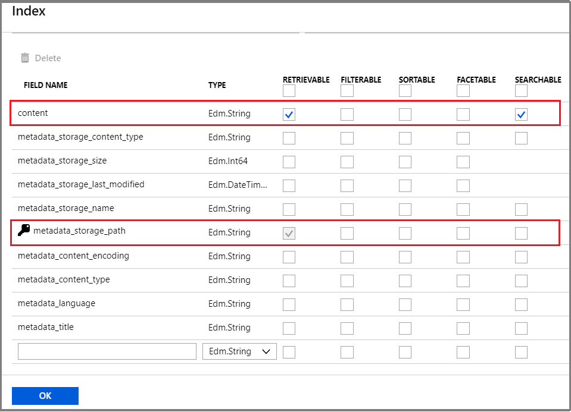
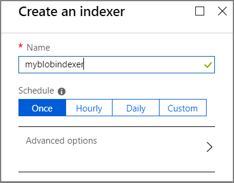

# How to index JSON blobs using a Blob indexer in Azure Cognitive Search

This article shows you how to configure an Azure Cognitive Search blob [indexer](search-indexer-overview.md) to extract structured content from JSON documents in Azure Blob storage and make it searchable in Azure Cognitive Search. This workflow creates an Azure Cognitive Search index and loads it with existing text extracted from JSON blobs. 

You can use the [portal](#json-indexer-portal), [REST APIs](#json-indexer-rest), or [.NET SDK](#json-indexer-dotnet) to index JSON content. Common to all approaches is that JSON documents are located in a blob container in an Azure Storage account. For guidance on pushing JSON documents from other non-Azure platforms, see [Data import in Azure Cognitive Search](search-what-is-data-import.md).

JSON blobs in Azure Blob storage are typically either a single JSON document (parsing mode is `json`) or a collection of JSON entities. For collections, the blob could have an **array** of well-formed JSON elements (parsing mode is `jsonArray`). Blobs could also be composed of multiple individual JSON entities separated by a newline (parsing mode is `jsonLines`). The **parsingMode** parameter on the request determines the output structures.

> [!NOTE]
> For more information about indexing multiple search documents from a single blob, see [One-to-many indexing](search-howto-index-one-to-many-blobs.md).

## Use the portal

The easiest method for indexing JSON documents is to use a wizard in the [Azure portal](https://portal.azure.com/). By parsing metadata in the Azure blob container, the [**Import data**](search-import-data-portal.md) wizard can create a default index, map source fields to target index fields, and load the index in a single operation. Depending on the size and complexity of source data, you could have an operational full text search index in minutes.

We recommend using the same region or location for both Azure Cognitive Search and Azure Storage for lower latency and to avoid bandwidth charges.

### 1 - Prepare source data

[Sign in to the Azure portal](https://portal.azure.com/) and [create a Blob container](https://docs.microsoft.com/azure/storage/blobs/storage-quickstart-blobs-portal) to contain your data. The Public Access Level can be set to any of its valid values.

You will need the storage account name, container name, and an access key to retrieve your data in the **Import data** wizard.

### 2 - Start Import data wizard

In the Overview page of your search service, you can [start the wizard](search-import-data-portal.md) from the command bar.

   

### 3 - Set the data source

In the **data source** page, the source must be **Azure Blob Storage**, with the following specifications:

+ **Data to extract** should be *Content and metadata*. Choosing this option allows the wizard to infer an index schema and map the fields for import.
   
+ **Parsing mode** should be set to *JSON*, *JSON array* or *JSON lines*. 

  *JSON* articulates each blob as a single search document, showing up as an independent item in search results. 

  *JSON array* is for blobs that contain well-formed JSON data - the well-formed JSON corresponds to an array of objects, or has a property which is an array of objects and you want each element to be articulated as a standalone, independent search document. If blobs are complex, and you don't choose *JSON array* the entire blob is ingested as a single document.

  *JSON lines* is for blobs composed of multiple JSON entities separated by a new-line, where you want each entity to be articulated as a standalone independent search document. If blobs are complex, and you don't choose *JSON lines* parsing mode, then the entire blob is ingested as a single document.
   
+ **Storage container** must specify your storage account and container, or a connection string that resolves to the container. You can get connection strings on the Blob service portal page.

   

### 4 - Skip the "Enrich content" page in the wizard

Adding cognitive skills (or enrichment) is not an import requirement. Unless you have a specific need to [add AI enrichment](cognitive-search-concept-intro.md) to your indexing pipeline, you should skip this step.

To skip the step, click the blue buttons at the bottom of the page for "Next" and "Skip".

### 5 - Set index attributes

In the **Index** page, you should see a list of fields with a data type and a series of checkboxes for setting index attributes. The wizard can generate a fields list based on metadata and by sampling the source data. 

You can bulk-select attributes by clicking the checkbox at the top of an attribute column. Choose **Retrievable** and **Searchable** for every field that should be returned to a client app and subject to full text search processing. You'll notice that integers are not full text or fuzzy searchable (numbers are evaluated verbatim and are often useful in filters).

Review the description of [index attributes](https://docs.microsoft.com/rest/api/searchservice/create-index#bkmk_indexAttrib) and [language analyzers](https://docs.microsoft.com/rest/api/searchservice/language-support) for more information. 

Take a moment to review your selections. Once you run the wizard, physical data structures are created and you won't be able to edit these fields without dropping and recreating all objects.

   

### 6 - Create indexer

Fully specified, the wizard creates three distinct objects in your search service. A data source object and index object are saved as named resources in your Azure Cognitive Search service. The last step creates an indexer object. Naming the indexer allows it to exist as a standalone resource, which you can schedule and manage independently of the index and data source object, created in the same wizard sequence.

If you are not familiar with indexers, an *indexer* is a resource in Azure Cognitive Search that crawls an external data source for searchable content. The output of the **Import data** wizard is an indexer that crawls your JSON data source, extracts searchable content, and imports it into an index on Azure Cognitive Search.

   

Click **OK** to run the wizard and create all objects. Indexing commences immediately.

You can monitor data import in the portal pages. Progress notifications indicate indexing status and how many documents are uploaded. 

When indexing is complete, you can use [Search explorer](search-explorer.md) to query your index.

> [!NOTE]
> If you don't see the data you expect, you might need to set more attributes on more fields. Delete the index and indexer you just created, and step through the wizard again, modifying your selections for index attributes in step 5. 

## Use REST APIs

You can use the REST API to index JSON blobs, following a three-part workflow common to all indexers in Azure Cognitive Search: create a data source, create an index, create an indexer. Data extraction from blob storage occurs when you submit the Create Indexer request. After this request is finished, you will have a queryable index. 

You can review [REST example code](#rest-example) at the end of this section that shows how to create all three objects. This section also contains details about [JSON parsing modes](#parsing-modes), [single blobs](#parsing-single-blobs), [JSON arrays](#parsing-arrays), and [nested arrays](#nested-json-arrays).

For code-based JSON indexing, use [Postman](search-get-started-postman.md) and the REST API to create these objects:

+ [index](https://docs.microsoft.com/rest/api/searchservice/create-index)
+ [data source](https://docs.microsoft.com/rest/api/searchservice/create-data-source)
+ [indexer](https://docs.microsoft.com/rest/api/searchservice/create-indexer)

Order of operations requires that you create and call objects in this order. In contrast with the portal workflow, a code approach requires an available index to accept the JSON documents sent through the **Create Indexer** request.

JSON blobs in Azure Blob storage are typically either a single JSON document or a JSON "array". The blob indexer in Azure Cognitive Search can parse either construction, depending on how you set the **parsingMode** parameter on the request.

| JSON document | parsingMode | Description | Availability |
|--------------|-------------|--------------|--------------|
| One per blob | `json` | Parses JSON blobs as a single chunk of text. Each JSON blob becomes a single Azure Cognitive Search document. | Generally available in both [REST](https://docs.microsoft.com/rest/api/searchservice/indexer-operations) API and [.NET](https://docs.microsoft.com/dotnet/api/microsoft.azure.search.models.indexer) SDK. |
| Multiple per blob | `jsonArray` | Parses a JSON array in the blob, where each element of the array becomes a separate Azure Cognitive Search document.  | Generally available in both [REST](https://docs.microsoft.com/rest/api/searchservice/indexer-operations) API and [.NET](https://docs.microsoft.com/dotnet/api/microsoft.azure.search.models.indexer) SDK. |
| Multiple per blob | `jsonLines` | Parses a blob which contains multiple JSON entities (an "array") separated by a newline, where each entity becomes a separate Azure Cognitive Search document. | Generally available in both [REST](https://docs.microsoft.com/rest/api/searchservice/indexer-operations) API and [.NET](https://docs.microsoft.com/dotnet/api/microsoft.azure.search.models.indexer) SDK. |

### 1 - Assemble inputs for the request

For each request, you must provide the service name and admin key for Azure Cognitive Search (in the POST header), and the storage account name and key for blob storage. You can use [Postman](search-get-started-postman.md) to send HTTP requests to Azure Cognitive Search.

Copy the following four values into Notepad so that you can paste them into a request:

+ Azure Cognitive Search service name
+ Azure Cognitive Search admin key
+ Azure storage account name
+ Azure storage account key

You can find these values in the portal:

1. In the portal pages for Azure Cognitive Search, copy the search service URL from the Overview page.

2. In the left navigation pane, click **Keys** and then copy either the primary or secondary key (they are equivalent).

3. Switch to the portal pages for your storage account. In the left navigation pane, under **Settings**, click **Access Keys**. This page provides both the account name and key. Copy the storage account name and one of the keys to Notepad.

### 2 - Create a data source

This step provides data source connection information used by the indexer. The data source is a named object in Azure Cognitive Search that persists the connection information. The data source type, `azureblob`, determines which data extraction behaviors are invoked by the indexer. 

Substitute valid values for service name, admin key, storage account, and account key placeholders.

    POST https://[service name].search.windows.net/datasources?api-version=2019-05-06
    Content-Type: application/json
    api-key: [admin key for Azure Cognitive Search]

    {
        "name" : "my-blob-datasource",
        "type" : "azureblob",
        "credentials" : { "connectionString" : "DefaultEndpointsProtocol=https;AccountName=<account name>;AccountKey=<account key>;" },
        "container" : { "name" : "my-container", "query" : "optional, my-folder" }
    }   

### 3 - Create a target search index 

Indexers are paired with an index schema. If you are using the API (rather than the portal), prepare an index in advance so that you can specify it on the indexer operation.

The index stores searchable content in Azure Cognitive Search. To create an index, provide a schema that specifies the fields in a document, attributes, and other constructs that shape the search experience. If you create an index that has the same field names and data types as the source, the indexer will match the source and destination fields, saving you the work of having to explicitly map the fields.

The following example shows a [Create Index](https://docs.microsoft.com/rest/api/searchservice/create-index) request. The index will have a searchable `content` field to store the text extracted from blobs:   

    POST https://[service name].search.windows.net/indexes?api-version=2019-05-06
    Content-Type: application/json
    api-key: [admin key for Azure Cognitive Search]

    {
          "name" : "my-target-index",
          "fields": [
            { "name": "id", "type": "Edm.String", "key": true, "searchable": false },
            { "name": "content", "type": "Edm.String", "searchable": true, "filterable": false, "sortable": false, "facetable": false }
          ]
    }

### 4 - Configure and run the indexer

As with an index and a data source, and indexer is also a named object that you create and reuse on an Azure Cognitive Search service. A fully specified request to create an indexer might look as follows:

    POST https://[service name].search.windows.net/indexers?api-version=2019-05-06
    Content-Type: application/json
    api-key: [admin key for Azure Cognitive Search]

    {
      "name" : "my-json-indexer",
      "dataSourceName" : "my-blob-datasource",
      "targetIndexName" : "my-target-index",
      "schedule" : { "interval" : "PT2H" },
      "parameters" : { "configuration" : { "parsingMode" : "json" } }
    }

Indexer configuration is in the body of the request. It requires a data source and an empty target index that already exists in Azure Cognitive Search. 

Schedule and parameters are optional. If you omit them, the indexer runs immediately, using `json` as the parsing mode.

This particular indexer does not include field mappings. Within the indexer definition, you can leave out **field mappings** if the properties of the source JSON document match the fields of your target search index. 

### REST Example

This section is a recap of all the requests used for creating objects. For a discussion of component parts, see the previous sections in this article.

### Data source request

All indexers require a data source object that provides connection information to existing data. 

    POST https://[service name].search.windows.net/datasources?api-version=2019-05-06
    Content-Type: application/json
    api-key: [admin key for Azure Cognitive Search]

    {
        "name" : "my-blob-datasource",
        "type" : "azureblob",
        "credentials" : { "connectionString" : "DefaultEndpointsProtocol=https;AccountName=<account name>;AccountKey=<account key>;" },
        "container" : { "name" : "my-container", "query" : "optional, my-folder" }
    }  

### Index request

All indexers require a target index that receives the data. The body of the request defines the index schema, consisting of fields, attributed to support the desired behaviors in a searchable index. This index should be empty when you run the indexer. 

    POST https://[service name].search.windows.net/indexes?api-version=2019-05-06
    Content-Type: application/json
    api-key: [admin key for Azure Cognitive Search]

    {
          "name" : "my-target-index",
          "fields": [
            { "name": "id", "type": "Edm.String", "key": true, "searchable": false },
            { "name": "content", "type": "Edm.String", "searchable": true, "filterable": false, "sortable": false, "facetable": false }
          ]
    }

### Indexer request

This request shows a fully-specified indexer. It includes field mappings, which were omitted in previous examples. Recall that "schedule", "parameters", and "fieldMappings" are optional as long as there is an available default. Omitting "schedule" causes the indexer to run immediately. Omitting "parsingMode" causes the index to use the "json" default.

Creating the indexer on Azure Cognitive Search triggers data import. It runs immediately, and thereafter on a schedule if you've provided one.

    POST https://[service name].search.windows.net/indexers?api-version=2019-05-06
    Content-Type: application/json
    api-key: [admin key for Azure Cognitive Search]

    {
      "name" : "my-json-indexer",
      "dataSourceName" : "my-blob-datasource",
      "targetIndexName" : "my-target-index",
      "schedule" : { "interval" : "PT2H" },
      "parameters" : { "configuration" : { "parsingMode" : "json" } },
      "fieldMappings" : [
        { "sourceFieldName" : "/article/text", "targetFieldName" : "text" },
        { "sourceFieldName" : "/article/datePublished", "targetFieldName" : "date" },
        { "sourceFieldName" : "/article/tags", "targetFieldName" : "tags" }
        ]
    }

## Use .NET SDK

The .NET SDK has full parity with the REST API. We recommend that you review the previous REST API section to learn concepts, workflow, and requirements. You can then refer to following .NET API reference documentation to implement a JSON indexer in managed code.

+ [microsoft.azure.search.models.datasource](https://docs.microsoft.com/dotnet/api/microsoft.azure.search.models.datasource?view=azure-dotnet)
+ [microsoft.azure.search.models.datasourcetype](https://docs.microsoft.com/dotnet/api/microsoft.azure.search.models.datasourcetype?view=azure-dotnet) 
+ [microsoft.azure.search.models.index](https://docs.microsoft.com/dotnet/api/microsoft.azure.search.models.index?view=azure-dotnet) 
+ [microsoft.azure.search.models.indexer](https://docs.microsoft.com/dotnet/api/microsoft.azure.search.models.indexer?view=azure-dotnet)

## Parsing modes

JSON blobs can assume multiple forms. The **parsingMode** parameter on the JSON indexer determines how JSON blob content is parsed and structured in an Azure Cognitive Search index:

| parsingMode | Description |
|-------------|-------------|
| `json`  | Index each blob as a single document. This is the default. |
| `jsonArray` | Choose this mode if your blobs consist of JSON arrays, and you need each element of the array to become a separate document in Azure Cognitive Search. |
|`jsonLines` | Choose this mode if your blobs consist of multiple JSON entities, that are separated by a new line, and you need each entity to become a separate document in Azure Cognitive Search. |

You can think of a document as a single item in search results. If you want each element in the array to show up in search results as an independent item, then use the `jsonArray` or `jsonLines` option as appropriate.

Within the indexer definition, you can optionally use [field mappings](search-indexer-field-mappings.md) to choose which properties of the source JSON document are used to populate your target search index. For `jsonArray` parsing mode, if the array exists as a lower-level property, you can set a document root indicating where the array is placed within the blob.

> [!IMPORTANT]
> When you use `json`, `jsonArray` or `jsonLines` parsing mode, Azure Cognitive Search assumes that all blobs in your data source contain JSON. If you need to support a mix of JSON and non-JSON blobs in the same data source, let us know on [our UserVoice site](https://feedback.azure.com/forums/263029-azure-search).

## Parse single JSON blobs

By default, [Azure Cognitive Search blob indexer](search-howto-indexing-azure-blob-storage.md) parses JSON blobs as a single chunk of text. Often, you want to preserve the structure of your JSON documents. For example, assume you have the following JSON document in Azure Blob storage:

    {
        "article" : {
            "text" : "A hopefully useful article explaining how to parse JSON blobs",
            "datePublished" : "2016-04-13",
            "tags" : [ "search", "storage", "howto" ]    
        }
    }

The blob indexer parses the JSON document into a single Azure Cognitive Search document. The indexer loads an index by matching "text", "datePublished", and "tags" from the source against identically named and typed target index fields.

As noted, field mappings are not required. Given an index with "text", "datePublished, and "tags" fields, the blob indexer can infer the correct mapping without a field mapping present in the request.

## Parse JSON arrays

Alternatively, you can use the JSON array option. This option is useful when blobs contain an *array of well-formed JSON objects*, and you want each element to become a separate Azure Cognitive Search document. For example, given the following JSON blob, you can populate your Azure Cognitive Search index with three separate documents, each with "id" and "text" fields.  

    [
        { "id" : "1", "text" : "example 1" },
        { "id" : "2", "text" : "example 2" },
        { "id" : "3", "text" : "example 3" }
    ]

For a JSON array, the indexer definition should look similar to the following example. Notice that the parsingMode parameter specifies the `jsonArray` parser. Specifying the right parser and having the right data input are the only two array-specific requirements for indexing JSON blobs.

    POST https://[service name].search.windows.net/indexers?api-version=2019-05-06
    Content-Type: application/json
    api-key: [admin key]

    {
      "name" : "my-json-indexer",
      "dataSourceName" : "my-blob-datasource",
      "targetIndexName" : "my-target-index",
      "schedule" : { "interval" : "PT2H" },
      "parameters" : { "configuration" : { "parsingMode" : "jsonArray" } }
    }

Again, notice that field mappings can be omitted. Assuming an index with identically named "id" and "text" fields, the blob indexer can infer the correct mapping without an explicit field mapping list.

## Parse nested arrays
For JSON arrays having nested elements, you can specify a `documentRoot` to indicate a multi-level structure. For example, if your blobs look like this:

    {
        "level1" : {
            "level2" : [
                { "id" : "1", "text" : "Use the documentRoot property" },
                { "id" : "2", "text" : "to pluck the array you want to index" },
                { "id" : "3", "text" : "even if it's nested inside the document" }  
            ]
        }
    }

Use this configuration to index the array contained in the `level2` property:

    {
        "name" : "my-json-array-indexer",
        ... other indexer properties
        "parameters" : { "configuration" : { "parsingMode" : "jsonArray", "documentRoot" : "/level1/level2" } }
    }

## Parse blobs separated by newlines

If your blob contains multiple JSON entities separated by a newline, and you want each element to become a separate Azure Cognitive Search document, you can opt for the JSON lines option. For example, given the following blob (where there are three different JSON entities), you can populate your Azure Cognitive Search index with three separate documents, each with "id" and "text" fields.

    { "id" : "1", "text" : "example 1" }
    { "id" : "2", "text" : "example 2" }
    { "id" : "3", "text" : "example 3" }

For JSON lines, the indexer definition should look similar to the following example. Notice that the parsingMode parameter specifies the `jsonLines` parser. 

    POST https://[service name].search.windows.net/indexers?api-version=2019-05-06
    Content-Type: application/json
    api-key: [admin key]

    {
      "name" : "my-json-indexer",
      "dataSourceName" : "my-blob-datasource",
      "targetIndexName" : "my-target-index",
      "schedule" : { "interval" : "PT2H" },
      "parameters" : { "configuration" : { "parsingMode" : "jsonLines" } }
    }

Again, notice that field mappings can be omitted, similar to the `jsonArray` parsing mode.

## Add field mappings

When source and target fields are not perfectly aligned, you can define a field mapping section in the request body for explicit field-to-field associations.

Currently, Azure Cognitive Search cannot index arbitrary JSON documents directly because it supports only primitive data types, string arrays, and GeoJSON points. However, you can use **field mappings** to pick parts of your JSON document and "lift" them into top-level fields of the search document. To learn about field mappings basics, see [Field mappings in Azure Cognitive Search indexers](search-indexer-field-mappings.md).

Revisiting our example JSON document:

    {
        "article" : {
            "text" : "A hopefully useful article explaining how to parse JSON blobs",
            "datePublished" : "2016-04-13"
            "tags" : [ "search", "storage", "howto" ]    
        }
    }

Assume a search index with the following fields: `text` of type `Edm.String`, `date` of type `Edm.DateTimeOffset`, and `tags` of type `Collection(Edm.String)`. Notice the discrepancy between "datePublished" in the source and `date` field in the index. To map your JSON into the desired shape, use the following field mappings:

    "fieldMappings" : [
        { "sourceFieldName" : "/article/text", "targetFieldName" : "text" },
        { "sourceFieldName" : "/article/datePublished", "targetFieldName" : "date" },
        { "sourceFieldName" : "/article/tags", "targetFieldName" : "tags" }
      ]

The source field names in the mappings are specified using the [JSON Pointer](https://tools.ietf.org/html/rfc6901) notation. You start with a forward slash to refer to the root of your JSON document, then pick the desired property (at arbitrary level of nesting) by using forward slash-separated path.

You can also refer to individual array elements by using a zero-based index. For example, to pick the first element of the "tags" array from the above example, use a field mapping like this:

    { "sourceFieldName" : "/article/tags/0", "targetFieldName" : "firstTag" }

> [!NOTE]
> If a source field name in a field mapping path refers to a property that doesn't exist in JSON, that mapping is skipped without an error. This is done so that we can support documents with a different schema (which is a common use case). Because there is no validation, you need to take care to avoid typos in your field mapping specification.
>
>

## See also

+ [Indexers in Azure Cognitive Search](search-indexer-overview.md)
+ [Indexing Azure Blob Storage with Azure Cognitive Search](search-howto-index-json-blobs.md)
+ [Indexing CSV blobs with Azure Cognitive Search blob indexer](search-howto-index-csv-blobs.md)
+ [Tutorial: Search semi-structured data from Azure Blob storage](search-semi-structured-data.md)
