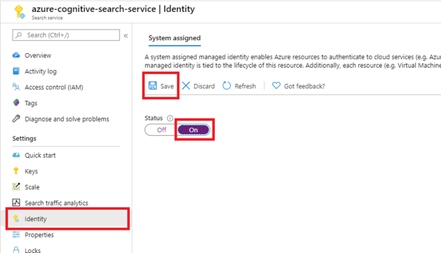
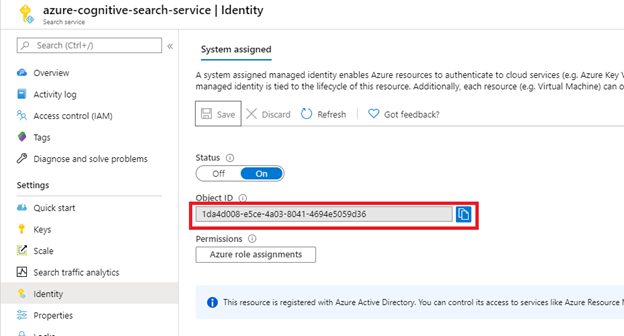
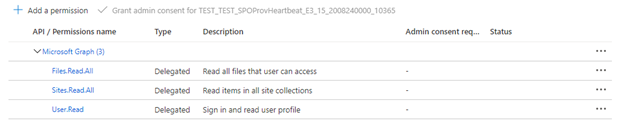
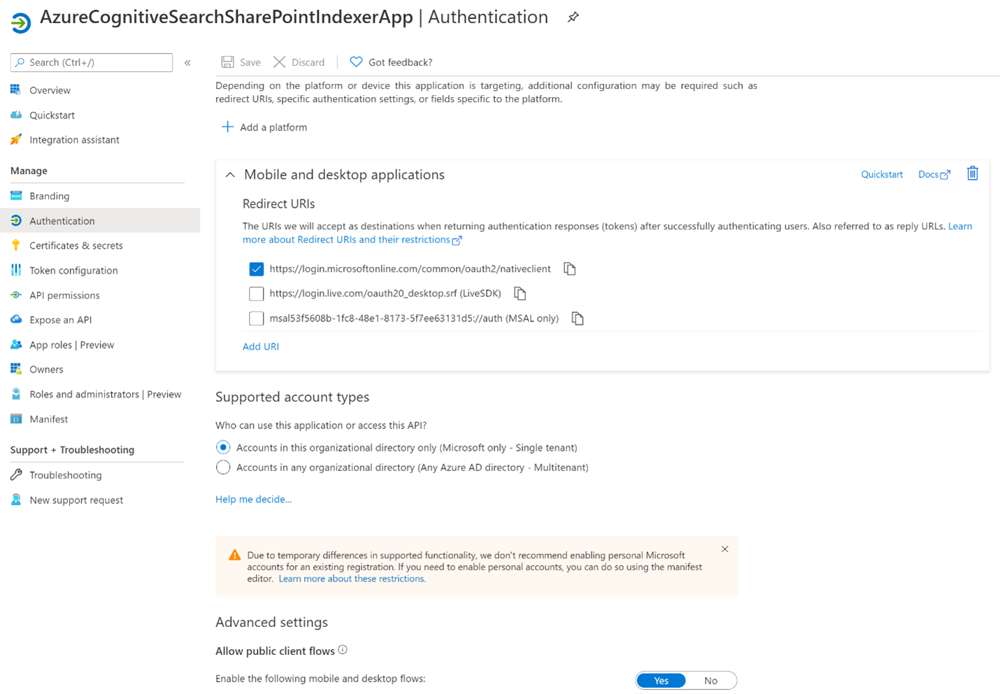
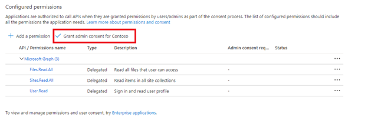
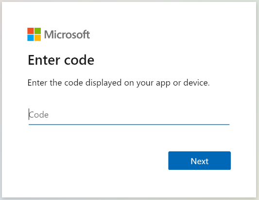
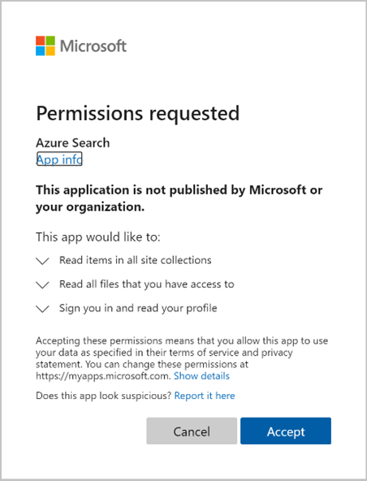

# Index data from SharePoint Online

> [!IMPORTANT] 
> SharePoint Online support is currently in public preview under [Supplemental Terms of Use](https://azure.microsoft.com/support/legal/preview-supplemental-terms/). [Request access](https://aka.ms/azure-cognitive-search/indexer-preview) to this feature, and after access is enabled, use a [preview REST API (2020-06-30-preview or later)](search-api-preview.md) to index your content. There is currently limited portal support and no .NET SDK support.

This article describes how to use Azure Cognitive Search to index documents (such as PDFs, Microsoft Office documents, and several other common formats) stored in SharePoint Online document libraries into an Azure Cognitive Search index. First, it explains the basics of setting up and configuring the indexer. Then, it offers a deeper exploration of behaviors and scenarios you are likely to encounter.

> [!NOTE]
> SharePoint Online supports a granular authorization model that determines per-user access at the document level. The SharePoint Online indexer does not pull these permissions into the search index, and Cognitive Search does not support document-level authorization. When a document is indexed from SharePoint Online into a search service, the content is available to anyone who has read access to the index. If you require document-level permissions, you should investigate security filters to trim results of unauthorized content. For more information, see [Security trimming using Active Directory identities](search-security-trimming-for-azure-search-with-aad.md).

## Functionality

An indexer in Azure Cognitive Search is a crawler that extracts searchable data and metadata from a data source. The SharePoint Online indexer will connect to your SharePoint Online site and index documents from one or more Document Libraries. The indexer provides the following functionality:
+ Index content from one or more SharePoint Online Document Libraries.
+ Index content from SharePoint Online Document Libraries that are in the same tenant as your Azure Cognitive Search service. The indexer will not work with SharePoint sites that are in a different tenant than your Azure Cognitive Search service. 
+ The indexer will support incremental indexing meaning that it will identify which content in the Document Library has changed and only index the updated content on future indexing runs. For example, if 5 PDFs are originally indexed by the indexer, then 1 is updated, then the indexer runs again, the indexer will only index the 1 PDF that was updated.
+ Text and normalized images will be extracted by default from the documents that are indexed. Optionally a skillset can be added to the pipeline for further content enrichment. More information on skillsets can be found in the article [Skillset concepts in Azure Cognitive Search](cognitive-search-working-with-skillsets.md).

## Supported document formats

The Azure Cognitive Search SharePoint Online indexer can extract text from the following document formats:

[!INCLUDE [search-document-data-sources](../../includes/search-blob-data-sources.md)]

## Incremental indexing and deletion detection
By default, the SharePoint Online indexer supports incremental indexing meaning that it will identify which content in the Document Library has changed and only index the updated content on future indexing runs. For example, if 5 Word documents are originally indexed by the indexer, then 1 is updated, then the indexer runs again, the indexer will only re-index the 1 Word document that was updated.

Deletion detection is also supported by default. This means that if a document is deleted from a SharePoint Online document library, the indexer will detect the delete during a future indexer run and remove the document from the index.

## Setting up SharePoint Online indexing
To set up the SharePoint Online Indexer, you will need to perform some actions in the Azure portal and some actions using the preview REST API. This preview isn’t supported by the SDK.

 The following video shows how to set up the SharePoint Online indexer.
 
> [!VIDEO https://www.youtube.com/embed/QmG65Vgl0JI]

### Step 1: Enable system assigned managed identity
When a system-assigned managed identity is enabled, Azure creates an identity for your search service that can be used by the indexer.



After selecting **Save** you will see an Object ID that has been assigned to your search service.



### Step 2: Create an AAD application
The SharePoint Online indexer will use this AAD application for authentication. 

1.	Navigate to the [Azure portal](https://portal.azure.com/).

1.	Open the menu on the left side of the main page and select **Azure Active Directory** then select **App registrations**. Select **+ New registration**.
    1.	Provide a name for your app.
    2.	Select **Single tenant**.
    3.	No redirect URI required.
    4.	Select **Register**

1.	Select **API permissions** from the menu on the left, then **Add a permission**, then **Microsoft Graph** then **Delegated permissions**. Add the following API permissions: 
    1.	**Delegated - Files.Read.All** 
    2.	**Delegated - Sites.Read.All** 
    3.	**Delegated - User.Read**

    

    Using delegated permissions means that the indexer will access the SharePoint site in the user context. So when you run the indexer it will only have access to the content that the logged in user has access to. User login happens when creating the indexer or updating the date source. The login step is described later in this article.

1.	Select the **Authentication** tab. Set **Allow public client flows** to **Yes** then select **Save**.

1.	Select **+ Add a platform**, then **Mobile and desktop applications**, then check `https://login.microsoftonline.com/common/oauth2/nativeclient`, then **Configure**.

    

1.	Give admin consent (Only required for certain tenants).

    Some tenants are locked down in such a way that admin consent is required for these delegated API permissions. If that is the case, you’ll need to have an admin grant admin consent for this AAD application before creating the indexer.

    Because not all tenant have this requirement, we recommend first skipping this step and continuing on with the instructions. You’ll know if you need admin consent if when creating the indexer, the authentication fails telling you that you need an admin to approve the authentication. In that case, have a tenant admin grant consent using the button below.

    

<a name="create-data-source"></a>

### Step 3: Create data source
> [!IMPORTANT] 
> Starting in this section you need to use the preview REST API for the remaining steps. If you’re not familiar with the Azure Cognitive Search REST API, we suggest taking a look at this [Quickstart](search-get-started-rest.md).

A data source specifies which data to index, credentials needed to access the data, and policies to efficiently identify changes in the data (new, modified, or deleted rows). A data source can be used by multiple indexers in the same search service.

For SharePoint indexing, the data source must have the following required properties:
+ **name** is the unique name of the data source within your search service.
+ **type** must be "sharepoint". This is case sensitive.
+ **credentials** provide the SharePoint Online endpoint and the AAD application (client) ID. An example SharePoint Online endpoint is `https://microsoft.sharepoint.com/teams/MySharePointSite`. You can get the SharePoint Online endpoint by navigating to the home page of your SharePoint site and copying the URL from the browser.
+ **container** specifies which document library to index. More information on creating the container can be found in the [Controlling which documents are indexed](#controlling-which-documents-are-indexed) section of this document.

To create a data source:

```http
POST https://[service name].search.windows.net/datasources?api-version=2020-06-30-Preview
Content-Type: application/json
api-key: [admin key]

{
    "name" : "sharepoint-datasource",
    "type" : "sharepoint",
    "credentials" : { "connectionString" : "SharePointOnlineEndpoint=[SharePoint Online site url];ApplicationId=[AAD App ID]" },
    "container" : { "name" : "defaultSiteLibrary", "query" : null }
}
```

### Step 4: Create an index
The index specifies the fields in a document, attributes, and other constructs that shape the search experience.

Here's how to create an index with a searchable content field to store the text extracted from documents in a Document Library:

```http
POST https://[service name].search.windows.net/indexes?api-version=2020-06-30
Content-Type: application/json
api-key: [admin key]

{
    "name" : "sharepoint-index",
    "fields": [
        { "name": "id", "type": "Edm.String", "key": true, "searchable": false },
        { "name": "metadata_spo_item_name", "type": "Edm.String", "key": false, "searchable": true, "filterable": false, "sortable": false, "facetable": false },
        { "name": "metadata_spo_item_path", "type": "Edm.String", "key": false, "searchable": false, "filterable": false, "sortable": false, "facetable": false },
        { "name": "metadata_spo_item_content_type", "type": "Edm.String", "key": false, "searchable": false, "filterable": true, "sortable": false, "facetable": true },
        { "name": "metadata_spo_item_last_modified", "type": "Edm.DateTimeOffset", "key": false, "searchable": false, "filterable": false, "sortable": true, "facetable": false },
        { "name": "metadata_spo_item_size", "type": "Edm.Int64", "key": false, "searchable": false, "filterable": false, "sortable": false, "facetable": false },
        { "name": "content", "type": "Edm.String", "searchable": true, "filterable": false, "sortable": false, "facetable": false }
    ]
}

```

For more information, see [Create Index (REST API)](/rest/api/searchservice/create-index).

### Step 5: Create an indexer
An indexer connects a data source with a target search index and provides a schedule to automate the data refresh. Once the index and data source have been created, you're ready to create the indexer!

During this section you’ll be asked to login with your organization credentials that have access to the SharePoint site. If possible, we recommend creating a new organizational user account and giving that new user the exact permissions that you want the indexer to have.

There are a few steps to creating the indexer:

1.	Send a request to attempt to create the indexer.

    ```http
    POST https://[service name].search.windows.net/indexers?api-version=2020-06-30-Preview
    Content-Type: application/json
    api-key: [admin key]
    
        {
          "name" : "sharepoint-indexer",
          "dataSourceName" : "sharepoint-datasource",
          "targetIndexName" : "sharepoint-index",
          "fieldMappings" : [
            { 
              "sourceFieldName" : "metadata_spo_site_library_item_id", 
              "targetFieldName" : "id", 
              "mappingFunction" : { 
                "name" : "base64Encode" 
              } 
            }
          ]
        }
    
    ```

1.	When creating the indexer for the first time it will fail and you’ll see the following error. Go to the link in the error message. If you don’t go to the link within 10 minutes the code will expire and you’ll need to recreate the [data source](#create-data-source).

    ```http
    {
        "error": {
            "code": "",
            "message": "Error with data source: To sign in, use a web browser to open the page https://microsoft.com/devicelogin and enter the code <CODE> to authenticate.  Please adjust your data source definition in order to proceed."
        }
    }
    ```

1.	Provide the code that was provided in the error message.

    

1.	The SharePoint indexer will access the SharePoint content as the signed-in user. The user that logs in during this step will be that signed-in user. So, if you log in with a user account that doesn’t have access to a document in the Document Library that you want to index, the indexer won’t have access to that document.

    If possible, we recommend creating a new user account and giving that new user the exact permissions that you want the indexer to have.

1.	Approve the permissions that are being requested.

    

1.	Resend the indexer create request. This time the request should succeed. 

    ```http
    POST https://[service name].search.windows.net/indexers?api-version=2020-06-30-Preview
    Content-Type: application/json
    api-key: [admin key]
    
    {
        "name" : "sharepoint-indexer",
        "dataSourceName" : "sharepoint-datasource",
        "targetIndexName" : "sharepoint-index"
    }
    ```

### Step 6: Check the indexer status
After the indexer has been created you can check the indexer status by making the following request.

```http
GET https://[service name].search.windows.net/indexers/sharepoint-indexer/status?api-version=2020-06-30-Preview
Content-Type: application/json
api-key: [admin key]
```

More information on the indexer status can be found here: [Get Indexer Status](/rest/api/searchservice/get-indexer-status).

## Updating the data source
If there are no updates to the data source object, the indexer can run on a schedule without any user interaction. However, every time the Azure Cognitive Search data source object is updated, you will need to login again in order for the indexer to run. For example, if you change the data source query, you will need to login again using the `https://microsoft.com/devicelogin` and a new code.

Once the data source has been updated, follow the below steps:

1.	Manually kick off a run of the indexer.

    ```http
    POST https://[service name].search.windows.net/indexers/sharepoint-indexer/run?api-version=2020-06-30-Preview  
    Content-Type: application/json
    api-key: [admin key]
    ```

    More information on the indexer run request can be found here: [Run Indexer](/rest/api/searchservice/run-indexer).

1.	Check the indexer status. If the last indexer run has an error telling you to go to `https://microsoft.com/devicelogin`, go to that page and provide the new code. 

    ```http
    GET https://[service name].search.windows.net/indexers/sharepoint-indexer/status?api-version=2020-06-30-Preview
    Content-Type: application/json
    api-key: [admin key]
    ```

    More information on the indexer status can be found here: [Get Indexer Status](/rest/api/searchservice/get-indexer-status).

1.	Login

1.	Manually kick off an indexer run again and check the indexer status. This time the indexer run should successfully start.

## Indexing document metadata
If you have set the indexer to index document metadata, the following metadata will be available to index.

> [!NOTE]
> Custom metadata is not included in the current version of the preview.

| Identifier | Type | Description | 
| ------------- | -------------- | ----------- |
| metadata_spo_site_library_item_id | Edm.String | The combination key of site ID, library ID and item ID which uniquely identifies an item in a document library for a site. |
| metadata_spo_site_id | Edm.String | The ID of the SharePoint Online site. |
| metadata_spo_library_id | Edm.String | The ID of document library. |
| metadata_spo_item_id | Edm.String | The ID of the (document) item in the library. |
| metadata_spo_item_last_modified | Edm.DateTimeOffset | The last modified date/time (UTC) of the item. |
| metadata_spo_item_name | Edm.String | The name of the item. |
| metadata_spo_item_size | Edm.Int64 | The size (in bytes) of the item. | 
| metadata_spo_item_content_type | Edm.String | The content type of the item. | 
| metadata_spo_item_extension | Edm.String | The extension of the item. |
| metadata_spo_item_weburi | Edm.String | The URI of the item. |
| metadata_spo_item_path | Edm.String | The combination of the parent path and item name. | 

The SharePoint Online indexer also supports metadata specific to each document type. More information can be found in [Content metadata properties used in Azure Cognitive Search](search-blob-metadata-properties.md).

<a name="controlling-which-documents-are-indexed"></a>

## Controlling which documents are indexed
A single SharePoint Online indexer can index content from one or more Document Libraries. Use the *container* parameter when creating your data source to indicate the document libraries that you want to index. 
The data source *container* has two properties: *name* and *query*. 

### Name
The *name* property is required and must be one of three values:
+ *defaultSiteLibrary*
    + Index all the content from the sites default document library.
+	*allSiteLibraries*
    + Index all the content from all the document libraries in a site. This will not index document libraries from a subsite. Those can be specified in the *query* though.
+	*useQuery*
    + Only index content defined in the *query*.

### Query
The *query* property is made up of keyword/value pairs. The below are the keywords that can be used. The values are either site urls or document library urls.

> [!NOTE]
> To get the value for a particular keyword, we recommend opening SharePoint Online in a browser, navigating to the Document Library that you’re trying to include/exclude and copying the URI from the browser. This is the easiest way to get the value to use with a keyword in the query.

| Keyword | Query Description | Example |
| ------------- | -------------- | ----------- |
| null | If null or empty, index either the default document library or all document libraries depending on the container name.	| Index all content from the default site library: <br><br>  ``` "container" : { "name" : "defaultSiteLibrary", "query" : null } ``` |
| includeLibrariesInSite | Index content from all libraries in defined site in the connection string. These are limited to subsites of your site <br><br> The *query* value for this keyword should be the URI of the site or subsite. | Index all content from all the document libraries in mysite. <br><br> ``` "container" : { "name" : "useQuery", "query" : "includeLibrariesInSite=https://mycompany.sharepoint.com/mysite" } ``` |
| includeLibrary | Index content from this library. <br><br> The *query* value for this keyword should be in one of the following formats: <br><br> Example 1: <br><br> *includeLibrary=[site or subsite]/[document library]* <br><br> Example 2: <br><br> URI copied from your browser. | Index all content from MyDocumentLibrary: <br><br> Example 1: <br><br> ``` "container" : { "name" : "useQuery", "query" : "includeLibrary=https://mycompany.sharepoint.com/mysite/MyDocumentLibrary" } ``` <br><br> Example 2: <br><br> ``` "container" : { "name" : "useQuery", "query" : "includeLibrary=https://mycompany.sharepoint.com/teams/mysite/MyDocumentLibrary/Forms/AllItems.aspx" } ``` |
| excludeLibrary |	Do not index content from this library. <br><br> The *query* value for this keyword should be in one of the following formats: <br><br> Example 1: <br><br> *excludeLibrary=[site or subsite URI]/[document library]* <br><br> Example 2: <br><br> URI copied from your browser. | Index all the content from all my libraries except for MyDocumentLibrary: <br><br> Example 1: <br><br> ``` "container" : { "name" : "useQuery", "query" : "includeLibrariesInSite=https://mysite.sharepoint.com/subsite1; excludeLibrary=https://mysite.sharepoint.com/subsite1/MyDocumentLibrary" } ``` <br><br> Example 2: <br><br> ``` "container" : { "name" : "useQuery", "query" : "includeLibrariesInSite=https://mycompany.sharepoint.com/teams/mysite; excludeLibrary=https://mycompany.sharepoint.com/teams/mysite/MyDocumentLibrary/Forms/AllItems.aspx" } ``` |

## Index by file type
You can control which documents are indexed and which are skipped.

### Include documents having specific file extensions
You can index only the documents with the file name extensions you specify by using the `indexedFileNameExtensions` indexer configuration parameter. The value is a string containing a comma-separated list of file extensions (with a leading dot). For example, to index only the .PDF and .DOCX documents, do this:

```http
PUT https://[service name].search.windows.net/indexers/[indexer name]?api-version=2020-06-30-Preview
Content-Type: application/json
api-key: [admin key]

{
    ... other parts of indexer definition
    "parameters" : { "configuration" : { "indexedFileNameExtensions" : ".pdf,.docx" } }
}
```

### Exclude documents having specific file extensions
You can exclude documents with specific file name extensions from indexing by using the `excludedFileNameExtensions` configuration parameter. The value is a string containing a comma-separated list of file extensions (with a leading dot). For example, to index all content except those with the .PNG and .JPEG extensions, do this:

```http
PUT https://[service name].search.windows.net/indexers/[indexer name]?api-version=2020-06-30-Preview
Content-Type: application/json
api-key: [admin key]

{
    ... other parts of indexer definition
    "parameters" : { "configuration" : { "excludedFileNameExtensions" : ".png,.jpeg" } }
}
```

If both `indexedFileNameExtensions` and `excludedFileNameExtensions` parameters are present, Azure Cognitive Search first looks at `indexedFileNameExtensions`, then at `excludedFileNameExtensions`. This means that if the same file extension is present in both lists, it will be excluded from indexing.

## Handling errors
By default, the SharePoint Online indexer stops as soon as it encounters a document with an unsupported content type (for example, an image). You can of course use the `excludedFileNameExtensions` parameter to skip certain content types. However, you may need to index documents without knowing all the possible content types in advance. To continue indexing when an unsupported content type is encountered, set the `failOnUnsupportedContentType` configuration parameter to false:

```http
PUT https://[service name].search.windows.net/indexers/[indexer name]?api-version=2020-06-30-Preview
Content-Type: application/json
api-key: [admin key]

{
    ... other parts of indexer definition
    "parameters" : { "configuration" : { "failOnUnsupportedContentType" : false } }
}
```

For some documents, Azure Cognitive Search is unable to determine the content type, or unable to process a document of otherwise supported content type. To ignore this failure mode, set the `failOnUnprocessableDocument` configuration parameter to false:

```http
"parameters" : { "configuration" : { "failOnUnprocessableDocument" : false } }
```

Azure Cognitive Search limits the size of documents that are indexed. These limits are documented in [Service Limits in Azure Cognitive Search](./search-limits-quotas-capacity.md). Oversized documents are treated as errors by default. However, you can still index storage metadata of oversized documents if you set `indexStorageMetadataOnlyForOversizedDocuments` configuration parameter to true:

```http
"parameters" : { "configuration" : { "indexStorageMetadataOnlyForOversizedDocuments" : true } }
```

You can also continue indexing if errors happen at any point of processing, either while parsing documents or while adding documents to an index. To ignore a specific number of errors, set the `maxFailedItems` and `maxFailedItemsPerBatch` configuration parameters to the desired values. For example:

```http
{
    ... other parts of indexer definition
    "parameters" : { "maxFailedItems" : 10, "maxFailedItemsPerBatch" : 10 }
}
```

## See also
+ [Indexers in Azure Cognitive Search](search-indexer-overview.md)
+ [Content metadata properties used in Azure Cognitive Search](search-blob-metadata-properties.md)