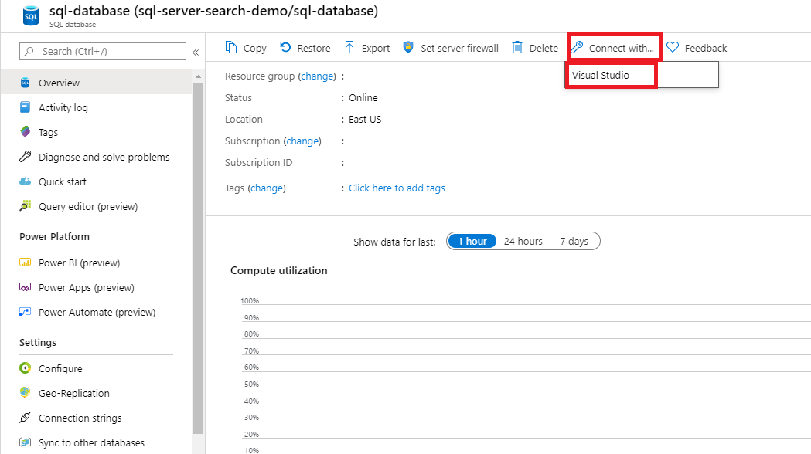
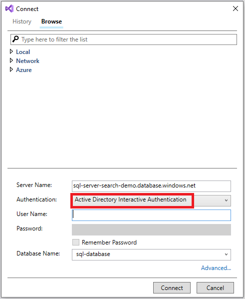
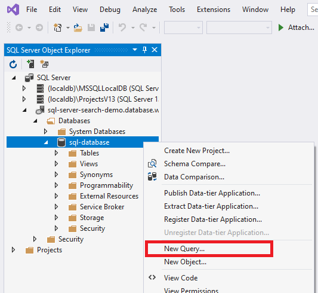
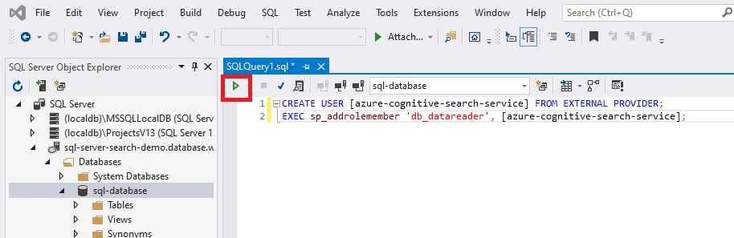

# Set up an indexer connection to Azure SQL using a managed identity

This article explains how to set up an indexer connection to Azure SQL Database using a managed identity instead of providing credentials in the connection string.

You can use a system-assigned managed identity or a user-assigned managed identity (preview). Managed identities are Azure Active Directory logins and require Azure role assignments to access data in Azure SQL.

## Prerequisites

* [Create a managed identity](search-howto-managed-identities-data-sources.md) for your search service.

* [Assign an Azure admin role on SQL](/azure/azure-sql/database/authentication-aad-configure). The identity used on the indexer connection needs read permissions. You must be an Azure AD admin with a server in SQL Database or SQL Managed Instance to grant read permissions on a database.

* You should be familiar with [indexer concepts](search-indexer-overview.md) and [configuration](search-howto-connecting-azure-sql-database-to-azure-search-using-indexers.md). 

## 1 - Assign permissions to read the database

Follow the below steps to assign the search service or user-assigned managed identity permission to read the database.

1. Connect to Visual Studio

    

2. Authenticate with your Azure AD account

    

3. Execute the following commands:

    Include the brackets around your search service name or user-assigned managed identity name.
    
    ```sql
    CREATE USER [insert your search service name here or user-assigned managed identity name] FROM EXTERNAL PROVIDER;
    EXEC sp_addrolemember 'db_datareader', [insert your search service name here or user-assigned managed identity name];
    ```

    

    

If you later change the search service identity or user-assigned identity after assigning permissions, you must remove the role membership and remove the user in the SQL database, then repeat the permission assignment. Removing the role membership and user can be accomplished by running the following commands:

 ```sql
sp_droprolemember 'db_datareader', [insert your search service name or user-assigned managed identity name];

DROP USER IF EXISTS [insert your search service name or user-assigned managed identity name];
```

## 2 - Add a role assignment

In this section you'll, give your Azure Cognitive Search service permission to read data from your SQL Server. For detailed steps, see [Assign Azure roles using the Azure portal](../role-based-access-control/role-assignments-portal.md).

1. In the Azure portal, navigate to your Azure SQL Server page.

1. Select **Access control (IAM)**.

1. Select **Add > Add role assignment**.

   :::image type="content" source="../../includes/role-based-access-control/media/add-role-assignment-menu-generic.png" alt-text="Screenshot that shows Access control (IAM) page with Add role assignment menu open.":::

1. On the **Role** tab, select the appropriate **Reader** role.

1. On the **Members** tab, select **Managed identity**, and then select **Select members**.

1. Select your Azure subscription.

1. If you're using a system-assigned managed identity, select **System-assigned managed identity**, search for your search service, and then select it.

1. Otherwise, if you're using a user-assigned managed identity, select **User-assigned managed identity**, search for the name of the user-assigned managed identity, and then select it.

1. On the **Review + assign** tab, select **Review + assign** to assign the role.

## 3 - Create the data source

Create the data source and provide either a system-assigned managed identity or a user-assigned managed identity (preview). 

### System-assigned managed identity

The [REST API](/rest/api/searchservice/create-data-source), Azure portal, and the [.NET SDK](/dotnet/api/azure.search.documents.indexes.models.searchindexerdatasourceconnection) support system-assigned managed identity. 

When you're connecting with a system-assigned managed identity, the only change to the data source definition is the format of the "credentials" property. You'll provide an Initial Catalog or Database name and a ResourceId that has no account key or password. The ResourceId must include the subscription ID of Azure SQL Database, the resource group of SQL Database, and the name of the SQL database.

Here's an example of how to create a data source to index data from a storage account using the [Create Data Source](/rest/api/searchservice/create-data-source) REST API and a managed identity connection string. The managed identity connection string format is the same for the REST API, .NET SDK, and the Azure portal.

```http
POST https://[service name].search.windows.net/datasources?api-version=2020-06-30
Content-Type: application/json
api-key: [admin key]

{
    "name" : "sql-datasource",
    "type" : "azuresql",
    "credentials" : { 
        "connectionString" : "Database=[SQL database name];ResourceId=/subscriptions/[subscription ID]/resourceGroups/[resource group name]/providers/Microsoft.Sql/servers/[SQL Server name];Connection Timeout=30;"
    },
    "container" : { 
        "name" : "my-table" 
    }
} 
```

### User-assigned managed identity (preview)

The 2021-04-30-preview REST API supports connections based on a user-assigned managed identity. When you're connecting with a user-assigned managed identity, there are two changes to the data source definition:

* First, the format of the "credentials" property is an Initial Catalog or Database name and a ResourceId that has no account key or password. The ResourceId must include the subscription ID of Azure SQL Database, the resource group of SQL Database, and the name of the SQL database. This is the same format as the system-assigned managed identity.

* Second, you'll add an "identity" property that contains the collection of user-assigned managed identities. Only one user-assigned managed identity should be provided when creating the data source. Set it to type "userAssignedIdentities".

Here's an example of how to create an indexer data source object using the [preview Create or Update Data Source](/rest/api/searchservice/preview-api/create-or-update-data-source) REST API:

```http
POST https://[service name].search.windows.net/datasources?api-version=2021-04-30-preview
Content-Type: application/json
api-key: [admin key]

{
    "name" : "sql-datasource",
    "type" : "azuresql",
    "credentials" : { 
        "connectionString" : "Database=[SQL database name];ResourceId=/subscriptions/[subscription ID]/resourceGroups/[resource group name]/providers/Microsoft.Sql/servers/[SQL Server name];Connection Timeout=30;"
    },
    "container" : { 
        "name" : "my-table" 
    },
    "identity" : { 
        "@odata.type": "#Microsoft.Azure.Search.DataUserAssignedIdentity",
        "userAssignedIdentity" : "/subscriptions/[subscription ID]/resourcegroups/[resource group name]/providers/Microsoft.ManagedIdentity/userAssignedIdentities/[managed identity name]"
    }
}   
```

## 4 - Create the index

The index specifies the fields in a document, attributes, and other constructs that shape the search experience.

Here's a [Create Index](/rest/api/searchservice/create-index) REST API call with a searchable `booktitle` field:   

```http
POST https://[service name].search.windows.net/indexes?api-version=2020-06-30
Content-Type: application/json
api-key: [admin key]

{
    "name" : "my-target-index",
    "fields": [
        { "name": "id", "type": "Edm.String", "key": true, "searchable": false },
        { "name": "booktitle", "type": "Edm.String", "searchable": true, "filterable": false, "sortable": false, "facetable": false }
    ]
}
```

## 5 - Create the indexer

An indexer connects a data source with a target search index, and provides a schedule to automate the data refresh. Once the index and data source have been created, you're ready to create the indexer. If the indexer is successful, the connection syntax and role assignments are valid.

Here's a [Create Indexer](/rest/api/searchservice/create-indexer) REST API call with an Azure SQL indexer definition. The indexer will run when you submit the request.

```http
POST https://[service name].search.windows.net/indexers?api-version=2020-06-30
Content-Type: application/json
api-key: [admin key]

{
    "name" : "sql-indexer",
    "dataSourceName" : "sql-datasource",
    "targetIndexName" : "my-target-index"
```

## Troubleshooting

If you get an error when the indexer tries to connect to the data source that says that the client isn't allowed to access the server, take a look at [common indexer errors](./search-indexer-troubleshooting.md).

You can also rule out any firewall issues by trying the connection with and without restrictions in place.

## See also

* [Azure SQL indexer](search-howto-connecting-azure-sql-database-to-azure-search-using-indexers.md)
