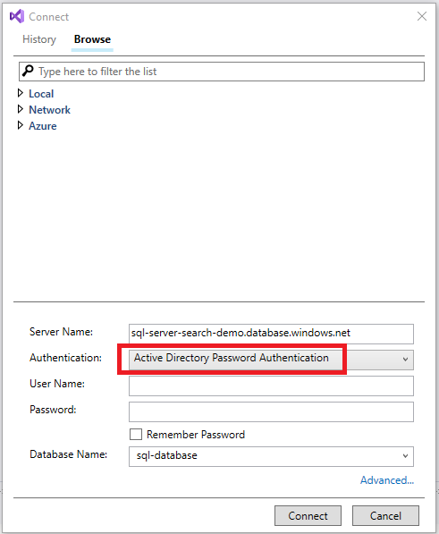
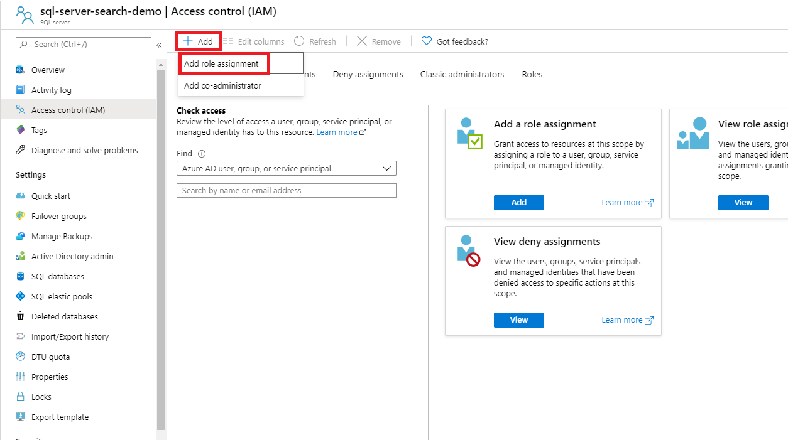
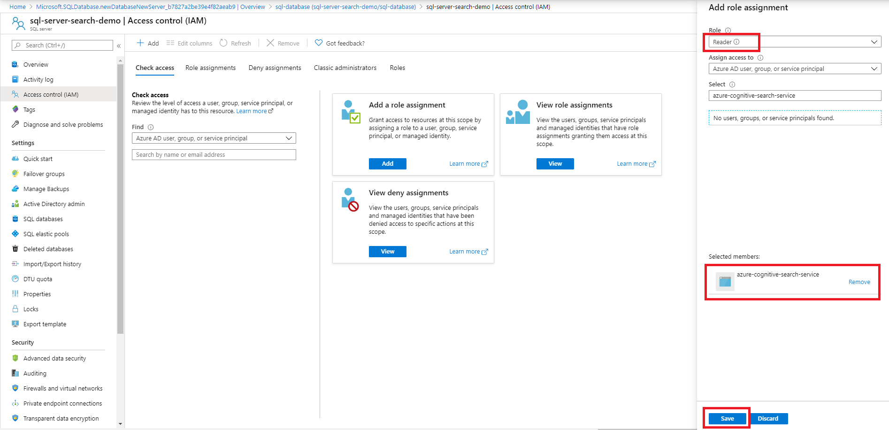
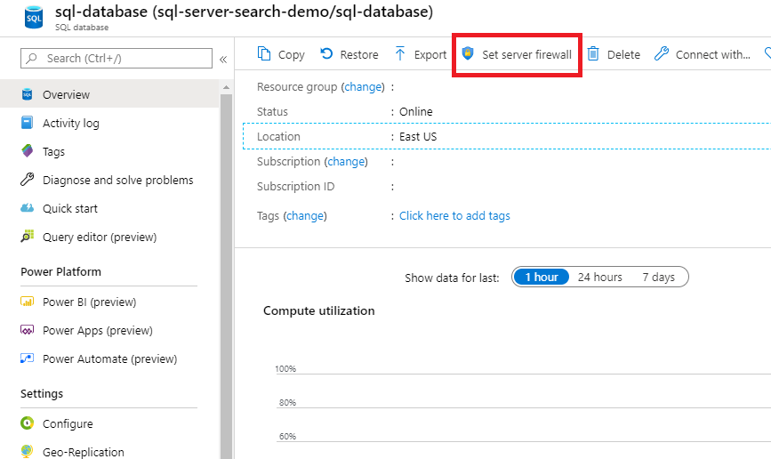

# Connect to an Azure SQL database using a managed identity (preview)

> [!IMPORTANT] 
> Support for using managed identities to connect to data sources is currently in a gated public preview. Preview functionality is provided without a service level agreement, and is not recommended for production workloads.
> You can request access to the preview by filling out [this form](https://aka.ms/azure-cognitive-search/mi-preview-request).

This document describes how to create an Azure Cognitive Search indexer that pulls content from an Azure SQL database and connects to the SQL database using a managed identity.

## Set up a connection using a managed identity

You can set up the managed identity connection using:

* Azure Cognitive Search REST API
* Azure Cognitive Search .NET SDK
* Azure portal
    * Additional information is required to use the managed identities in Azure portal that is not included on this page. This information will be provided to you when you sign up for the preview using [this form](https://aka.ms/azure-cognitive-search/mi-preview-request).

### 1 - Turn on system assigned managed identity

When a system assigned managed identity is enabled, Azure creates an identity for the instance in the Azure AD tenant that's trusted by the subscription of the instance. After the identity is created, the credentials are provisioned on the instance.


After selecting **Save** you will see an Object ID that has been assigned to your search service.


 
### 2 - Provision Azure Active Directory Admin for SQL Server

When connecting to the database in the next step, you will need to connect with an Azure Active Directory (Azure AD) account that has admin access to the database in order to give your search service permission to access the database.

Follow the instructions [here](https://docs.microsoft.com/azure/sql-database/sql-database-aad-authentication-configure?tabs=azure-powershell#provision-an-azure-active-directory-administrator-for-your-azure-sql-database-server) to give your Azure AD account admin access to the database.

### 3 - Assign the search service permissions

Follow the below steps to assign the search service permission to read the database.

1. Connect to Visual Studio

    

2. Authenticate with your Azure AD account

    

3. Execute the following commands:

    Include the brackets around your search service name.
    
    ```
    CREATE USER [your search service name here] FROM EXTERNAL PROVIDER;
    EXEC sp_addrolemember 'db_datareader', [your search service name here];
    ```

    

    

>[!NOTE]
> If the search service identity from step 1 is changed after completing this step, then you must remove the role membership and remove the user in the SQL database, then add the permissions again by completing step 3 again.
> Removing the role membership and user can be accomplished by running the following commands:
> ```
> sp_droprolemember 'db_datareader', [your search service name];
> DROP USER IF EXISTS [your search service name];
> ```

### 4 - Add a role assignment

In this step you will give your Azure Cognitive Search service permission to read data from your SQL server.

1. In the Azure Portal, navigate to the Azure SQL server that contains the database that contains the data that you would like to index.
2. Select **Access control (IAM)**
3. Select **Add** then **Add role assignment**

    

4. Select the appropriate **Reader** role.
5. Leave **Assign access to** as **Azure AD user, group or service principal**
6. Search for your search service, select it, then select **Save**

    

### 5 - Create the data source

When indexing from a SQL database, the data source must have the following required properties:

* **name** is the unique name of the data source within your search service.
* **type** is `azuresql`
* **credentials**
    * When using a managed identity to authenticate, the **credentials** format is different than when not using a manged identity. Here you will provide an Initial Catalog or Database name and a ResourceId that has no account key or password. The ResourceId must include the subscription ID of the Azure SQL database, the resource group of the SQL database, and the name of the SQL database. 
    * Managed identity connection string format:
        * *Initial Catalog|Database=[**database name**];ResourceId=/subscriptions/**your subscription ID**/resourceGroups/**your resource group name**/providers/Microsoft.Sql/servers/**your SQL server name**/;Connection Timeout=**connection timeout**;*
* **container** specifies the name of the table or view that you would like to index.

```
POST https://[service name].search.windows.net/datasources?api-version=2019-05-06
Content-Type: application/json
api-key: [admin key]

{
    "name" : "sql-datasource",
    "type" : "azuresql",
    "credentials" : { "connectionString" : "Database=sql-database;ResourceId=/subscriptions/00000000-0000-0000-0000-000000000000/resourceGroups/azure-sql-resource-group/providers/Microsoft.Sql/servers/sql-server-search-demo;Connection Timeout=30;" },
    "container" : { "name" : "my-table" }
} 
```

### 6 - Create the index

The index specifies the fields in a document, attributes, and other constructs that shape the search experience.

Here's how to create an index with a searchable `booktitle` field:   

```
POST https://[service name].search.windows.net/indexes?api-version=2019-05-06
Content-Type: application/json
api-key: [admin key]

{
    "name" : "my-target-index",
    "fields": [
    { "name": "id", "type": "Edm.String", "key": true, "searchable": false },
    { "name": "booktitle", "type": "Edm.String", "searchable": true, "filterable": false, "sortable": false, "facetable": false }
    ]
}
```

For more on creating indexes, see [Create Index](https://docs.microsoft.com/rest/api/searchservice/create-index)

### 7 - Create the indexer

An indexer connects a data source with a target search index, and provides a schedule to automate the data refresh.

Once the index and data source have been created, you're ready to create the indexer.

Example indexer definition for an Azure SQL indexer:

```
POST https://[service name].search.windows.net/indexers?api-version=2019-05-06
Content-Type: application/json
api-key: [admin key]

{
    "name" : "sql-indexer",
    "dataSourceName" : "sql-datasource",
    "targetIndexName" : "my-target-index",
    "schedule" : { "interval" : "PT2H" }
}
```    

This indexer will run every two hours (schedule interval is set to "PT2H"). To run an indexer every 30 minutes, set the interval to "PT30M". The shortest supported interval is 5 minutes. The schedule is optional - if omitted, an indexer runs only once when it's created. However, you can run an indexer on-demand at any time.   

For more details on the Create Indexer API, check out [Create Indexer](https://docs.microsoft.com/rest/api/searchservice/create-indexer).

For more information about defining indexer schedules see [How to schedule indexers for Azure Cognitive Search](search-howto-schedule-indexers.md).

## Troubleshooting

If you get an error when the indexer tries to connect to the data source that says that the client is not allowed to access the server, update the firewall to allow Azure services and resources to access the server.



Set *Allow Azure services and resources to access this server* to **Yes**.
