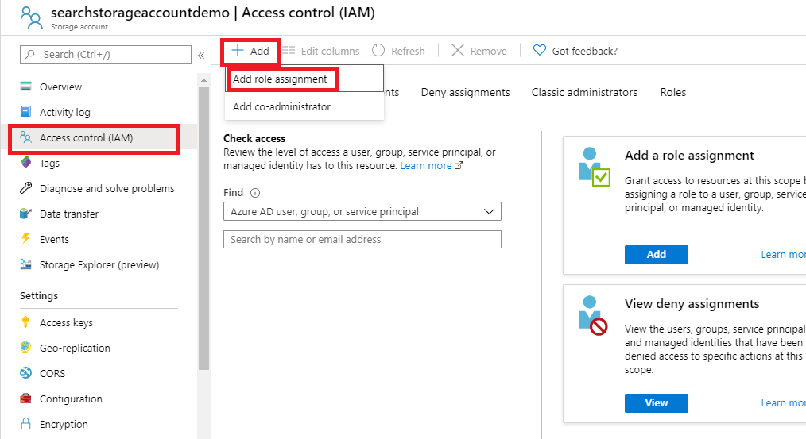
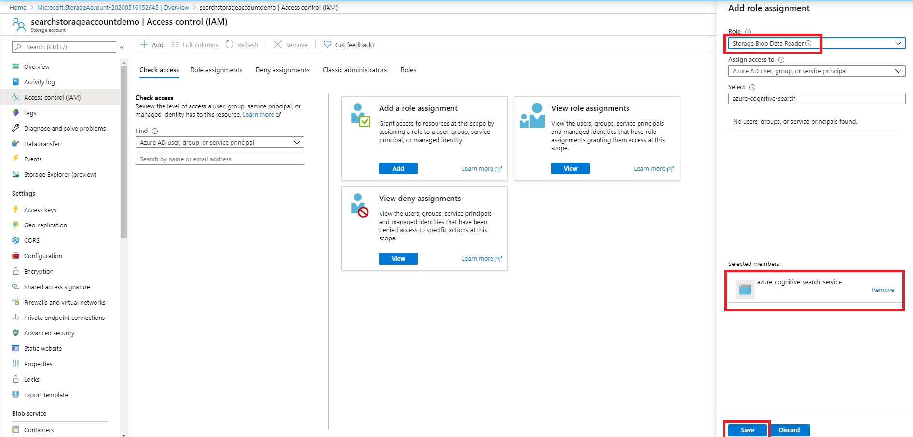
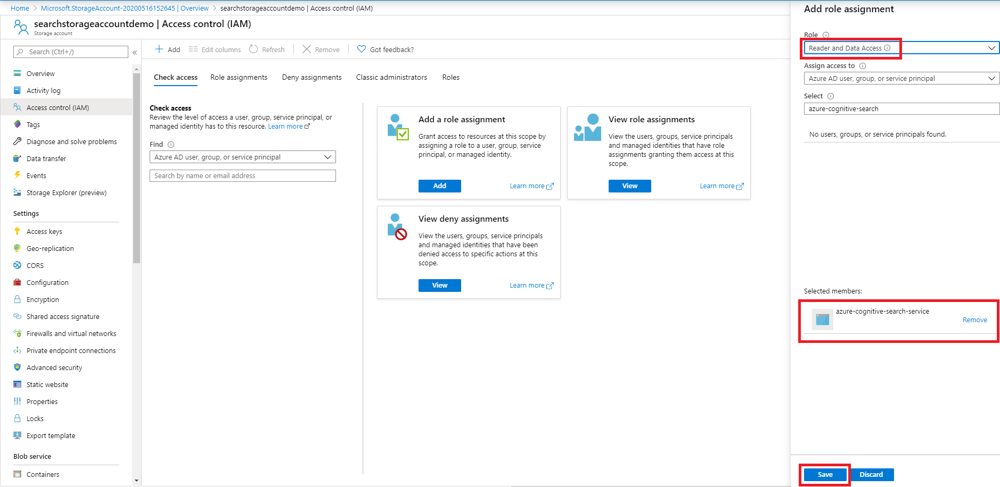

# Set up a connection to an Azure Storage account using a managed identity

This page describes how to set up an indexer connection to an Azure storage account using a managed identity instead of providing credentials in the data source object connection string.

Before learning more about this feature, it is recommended that you have an understanding of what an indexer is and how to set up an indexer for your data source. More information can be found at the following links:
* [Indexer overview](search-indexer-overview.md)
* [Azure Blob indexer](search-howto-indexing-azure-blob-storage.md)
* [Azure Data Lake Storage Gen2 indexer](search-howto-index-azure-data-lake-storage.md)
* [Azure Table indexer](search-howto-indexing-azure-tables.md)

## Set up the connection

### 1 - Turn on system-assigned managed identity

When a system-assigned managed identity is enabled, Azure creates an identity for your search service that can be used to authenticate to other Azure services within the same tenant and subscription. You can then use this identity in Azure role-based access control (Azure RBAC) assignments that allow access to data during indexing.


After selecting **Save** you will see an Object ID that has been assigned to your search service.


 
### 2 - Add a role assignment

In this step you will give your Azure Cognitive Search service permission to read data from your storage account.

1. In the Azure portal, navigate to the Storage account that contains the data that you would like to index.
2. Select **Access control (IAM)**
3. Select **Add** then **Add role assignment**

    

4. Select the appropriate role(s) based on the storage account type that you would like to index:
    1. Azure Blob storage requires that you add your search service to the **Storage Blob Data Reader** role.
    1. Azure Data Lake Storage Gen2 requires that you add your search service to the **Storage Blob Data Reader** role.
    1. Azure Table storage requires that you add your search service to the **Reader and Data Access** role.
5.	Leave **Assign access to** as **Azure AD user, group or service principal**
6.	Search for your search service, select it, then select **Save**

    Example for Azure Blob storage and Azure Data Lake Storage Gen2:

    

    Example for Azure Table storage:

    

### 3 - Create the data source

The [REST API](/rest/api/searchservice/create-data-source), Azure portal, and the [.NET SDK](/dotnet/api/azure.search.documents.indexes.models.searchindexerdatasourceconnection) support the managed identity connection string. Below is an example of how to create a data source to index data from a storage account using the [REST API](/rest/api/searchservice/create-data-source) and a managed identity connection string. The managed identity connection string format is the same for the REST API, .NET SDK, and the Azure portal.

When indexing from a storage account, the data source must have the following required properties:

* **name** is the unique name of the data source within your search service.
* **type**
    * Azure Blob storage: `azureblob`
    * Azure Table storage: `azuretable`
    * Azure Data Lake Storage Gen2: **type** will be provided once you sign up for the preview using [this form](https://aka.ms/azure-cognitive-search/mi-preview-request).
* **credentials**
    * When using a managed identity to authenticate, the **credentials** format is different than when not using a managed identity. Here you will provide a ResourceId that has no account key or password. The ResourceId must include the subscription ID of the storage account, the resource group of the storage account, and the storage account name.
    * Managed identity format: 
        * *ResourceId=/subscriptions/**your subscription ID**/resourceGroups/**your resource group name**/providers/Microsoft.Storage/storageAccounts/**your storage account name**/;*
* **container** specifies a container or table name in your storage account. By default, all blobs within the container are retrievable. If you only want to index blobs in a particular virtual directory, you can specify that directory using the optional **query** parameter.

Example of how to create a blob data source object using the [REST API](/rest/api/searchservice/create-data-source):

```
POST https://[service name].search.windows.net/datasources?api-version=2020-06-30
Content-Type: application/json
api-key: [admin key]

{
    "name" : "blob-datasource",
    "type" : "azureblob",
    "credentials" : { "connectionString" : "ResourceId=/subscriptions/00000000-0000-0000-0000-000000000000/resourceGroups/resource-group-name/providers/Microsoft.Storage/storageAccounts/storage-account-name/;" },
    "container" : { "name" : "my-container", "query" : "<optional-virtual-directory-name>" }
}   
```

### 4 - Create the index

The index specifies the fields in a document, attributes, and other constructs that shape the search experience.

Here's how to create an index with a searchable `content` field to store the text extracted from blobs:   

```http
    POST https://[service name].search.windows.net/indexes?api-version=2020-06-30
    Content-Type: application/json
    api-key: [admin key]

    {
          "name" : "my-target-index",
          "fields": [
            { "name": "id", "type": "Edm.String", "key": true, "searchable": false },
            { "name": "content", "type": "Edm.String", "searchable": true, "filterable": false, "sortable": false, "facetable": false }
          ]
    }
```

For more on creating indexes, see [Create Index](/rest/api/searchservice/create-index)

### 5 - Create the indexer

An indexer connects a data source with a target search index, and provides a schedule to automate the data refresh.

Once the index and data source have been created, you're ready to create the indexer.

Example indexer definition for a blob indexer:

```http
    POST https://[service name].search.windows.net/indexers?api-version=2020-06-30
    Content-Type: application/json
    api-key: [admin key]

    {
      "name" : "blob-indexer",
      "dataSourceName" : "blob-datasource",
      "targetIndexName" : "my-target-index",
      "schedule" : { "interval" : "PT2H" }
    }
```

This indexer will run every two hours (schedule interval is set to "PT2H"). To run an indexer every 30 minutes, set the interval to "PT30M". The shortest supported interval is 5 minutes. The schedule is optional - if omitted, an indexer runs only once when it's created. However, you can run an indexer on-demand at any time.   

For more details on the Create Indexer API, check out [Create Indexer](/rest/api/searchservice/create-indexer).

For more information about defining indexer schedules see [How to schedule indexers for Azure Cognitive Search](search-howto-schedule-indexers.md).

## Accessing secure data in storage accounts

Azure storage accounts can be further secured using firewalls and virtual networks. If you want to index content from a blob storage account or Data Lake Gen2 storage account that is secured using a firewall or virtual network, follow the instructions for [Accessing data in storage accounts securely via trusted service exception](search-indexer-howto-access-trusted-service-exception.md).

## See also

Learn more about Azure Storage indexers:

* [Azure Blob indexer](search-howto-indexing-azure-blob-storage.md)
* [Azure Data Lake Storage Gen2 indexer](search-howto-index-azure-data-lake-storage.md)
* [Azure Table indexer](search-howto-indexing-azure-tables.md)