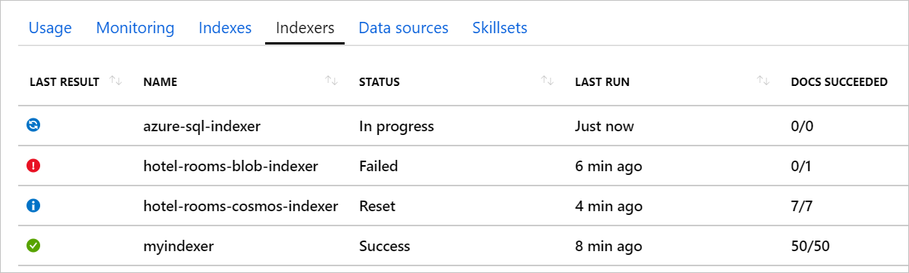
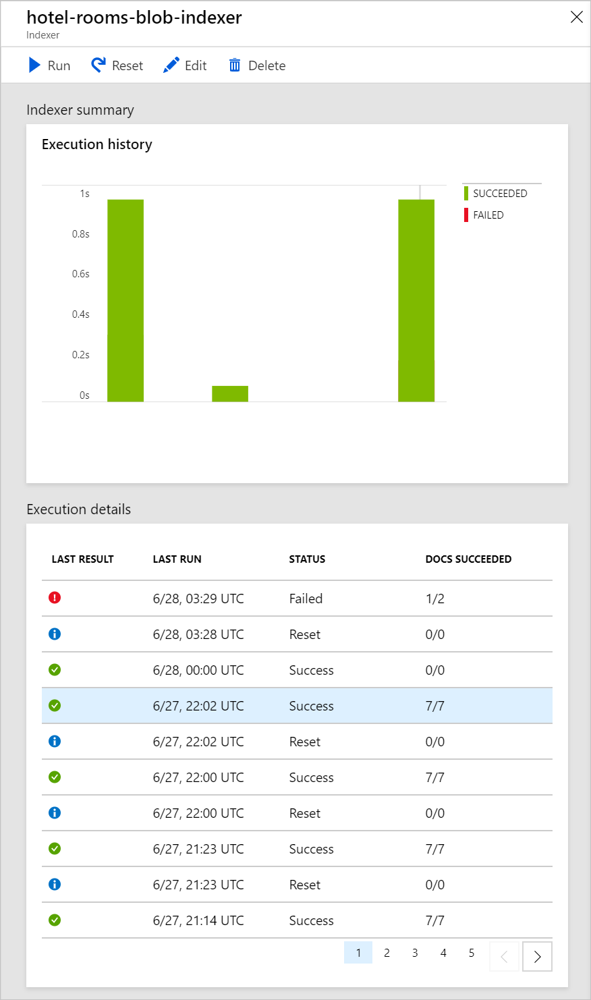
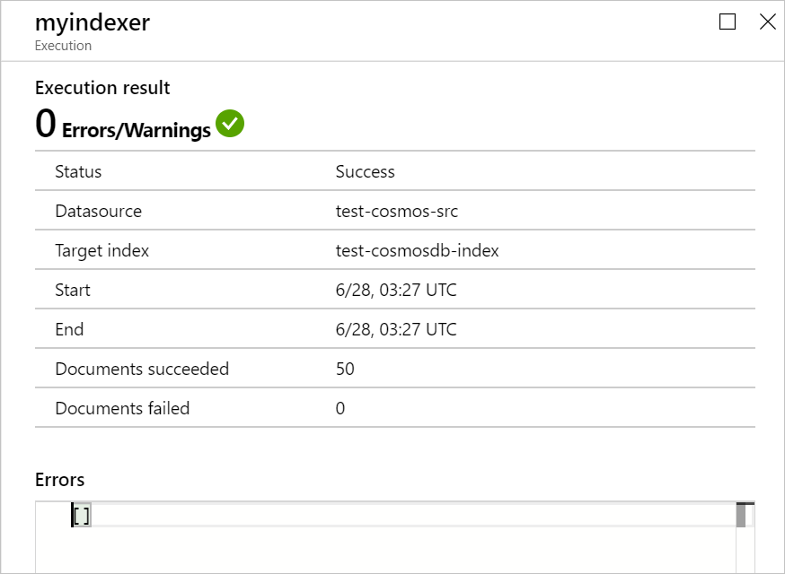
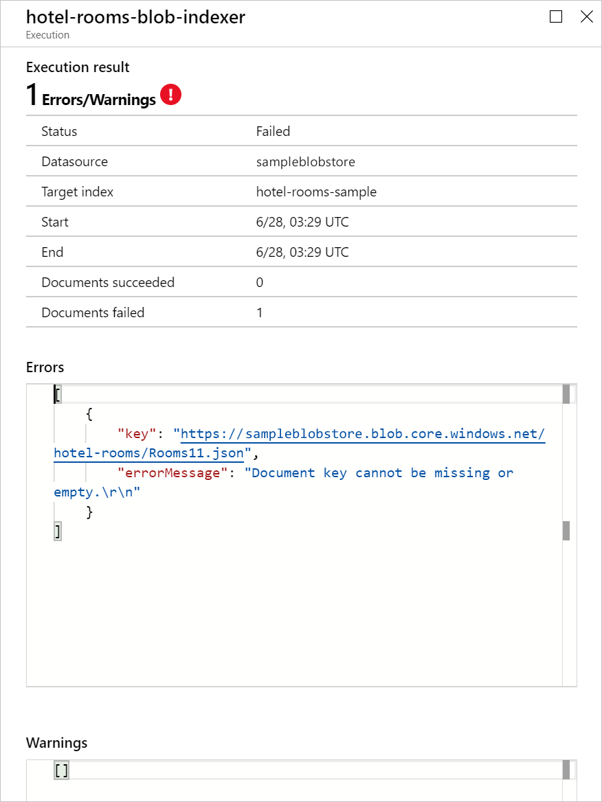
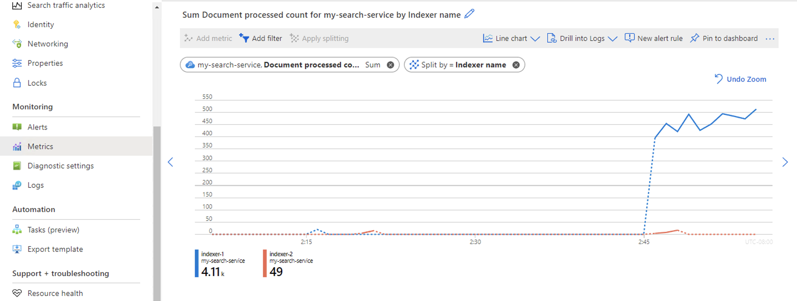
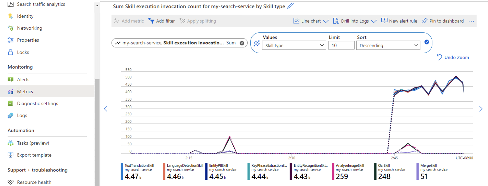

# Monitor indexer status and results in Azure Cognitive Search

You can monitor indexer processing in the Azure portal, or programmatically through REST calls or an Azure SDK. In addition to status about the indexer itself, you can review start and end times, and detailed errors and warnings from a particular run.

## Monitor using Azure portal

You can see the current status of all of your indexers in your search service Overview page. Portal pages refresh every few minutes, so you won't see evidence of a new indexer run right away. Select **Refresh** at the top of the page to immediately retrieve the most recent view.

   

| Status | Description |
|--------|-------------|
| **In Progress** | Indicates active execution. The portal will report on partial information. As indexing progresses, you can watch the **Docs Succeeded** value grow in response. Indexers that process large volumes of data can take a long time to run. For example, indexers that handle millions of source documents can run for 24 hours, and then restart almost immediately to pick up where it left off. As such, the status for high-volume indexers might always say **In Progress** in the portal. Even when an indexer is running, details are available about ongoing progress and previous runs. |
| **Success** | Indicates the run was successful. An indexer run can be successful even if individual documents have errors, if the number of errors is less than the indexer's **Max failed items** setting. |
| **Failed** | The number of errors exceeded **Max failed items** and indexing has stopped. |
| **Reset** | The indexer's internal change tracking state was reset. The indexer will run in full, refreshing all documents, and not just those with newer timestamps. |

You can select on an indexer in the list to see more details about the indexer's current and recent runs.

   

The **Indexer summary** chart displays a graph of the number of documents processed in its most recent runs.

The **Execution details** list shows up to 50 of the most recent execution results. Select on an execution result in the list to see specifics about that run. This includes its start and end times, and any errors and warnings that occurred.

   

If there were document-specific problems during the run, they'll be listed in the Errors and Warnings fields.

   

Warnings are common with some types of indexers, and don't always indicate a problem. For example indexers that use Azure AI services can report warnings when image or PDF files don't contain any text to process. 

For more information about investigating indexer errors and warnings, see [Indexer troubleshooting guidance](search-indexer-troubleshooting.md).

## Monitor with Azure Monitoring Metrics

Cognitive Search is a monitored resource in Azure Monitor, which means that you can use [Metrics Explorer](../azure-monitor/essentials/data-platform-metrics.md#metrics-explorer) to see basic metrics about the number of indexer-processed documents and skill invocations. These metrics can be used to monitor indexer progress and [set up alerts](../azure-monitor/alerts/alerts-metric-overview.md). 

Metric views can be filtered or split up by a set of predefined dimensions.

| Metric Name  |  Description | Dimensions  | Sample use cases |
|---|---|---|---|
| Document processed count  | Shows the number of indexer processed documents.  | Data source name, failed, index name, indexer name, skillset name  | <br> - Can be referenced as a rough measure of throughput (number of documents processed by indexer over time) <br> - Set up to alert on failed documents | 
|  Skill execution invocation count | Shows the number of skill invocations. | Data source name, failed, index name, indexer name, skill name, skill type, skillset name | <br> - Reference to ensure skills are invoked as expected by comparing relative invocation numbers between skills and number of skill invocations to the number of documents. <br> - Set up to alert on failed skill invocations |

The screenshot below shows the number of documents processed by indexers within a service over an hour, split up by indexer name.

   

You can also configure the graph to see the number of skill invocations over the same hour interval.

   


## Monitor using Get Indexer Status (REST API)

You can retrieve the status and execution history of an indexer using the [Get Indexer Status command](/rest/api/searchservice/get-indexer-status):

```http
GET https://[service name].search.windows.net/indexers/[indexer name]/status?api-version=2020-06-30
api-key: [Search service admin key]
```

The response contains overall indexer status, the last (or in-progress) indexer invocation, and the history of recent indexer invocations.

```output
{
    "status":"running",
    "lastResult": {
        "status":"success",
        "errorMessage":null,
        "startTime":"2018-11-26T03:37:18.853Z",
        "endTime":"2018-11-26T03:37:19.012Z",
        "errors":[],
        "itemsProcessed":11,
        "itemsFailed":0,
        "initialTrackingState":null,
        "finalTrackingState":null
     },
    "executionHistory":[ {
        "status":"success",
         "errorMessage":null,
        "startTime":"2018-11-26T03:37:18.853Z",
        "endTime":"2018-11-26T03:37:19.012Z",
        "errors":[],
        "itemsProcessed":11,
        "itemsFailed":0,
        "initialTrackingState":null,
        "finalTrackingState":null
    }]
}
```

Execution history contains up to the 50 most recent runs, which are sorted in reverse chronological order (most recent first).

Note there are two different status values. The top level status is for the indexer itself. An indexer status of **running** means the indexer is set up correctly and available to run, but not that it's currently running.

Each run of the indexer also has its own status that indicates whether that specific execution is ongoing (**running**), or already completed with a **success**, **transientFailure**, or **persistentFailure** status. 

When an indexer is reset to refresh its change tracking state, a separate execution history entry is added with a **Reset** status.

For more information about status codes and indexer monitoring data, see [Get Indexer Status](/rest/api/searchservice/get-indexer-status).

## Monitor using .NET

Using the Azure Cognitive Search .NET SDK, the following C# example writes information about an indexer's status and the results of its most recent (or ongoing) run to the console.

```csharp
static void CheckIndexerStatus(SearchIndexerClient indexerClient, SearchIndexer indexer)
{
    try
    {
        string indexerName = "hotels-sql-idxr";
        SearchIndexerStatus execInfo = indexerClient.GetIndexerStatus(indexerName);

        Console.WriteLine("Indexer has run {0} times.", execInfo.ExecutionHistory.Count);
        Console.WriteLine("Indexer Status: " + execInfo.Status.ToString());

        IndexerExecutionResult result = execInfo.LastResult;

        Console.WriteLine("Latest run");
        Console.WriteLine("Run Status: {0}", result.Status.ToString());
        Console.WriteLine("Total Documents: {0}, Failed: {1}", result.ItemCount, result.FailedItemCount);

        TimeSpan elapsed = result.EndTime.Value - result.StartTime.Value;
        Console.WriteLine("StartTime: {0:T}, EndTime: {1:T}, Elapsed: {2:t}", result.StartTime.Value, result.EndTime.Value, elapsed);

        string errorMsg = (result.ErrorMessage == null) ? "none" : result.ErrorMessage;
        Console.WriteLine("ErrorMessage: {0}", errorMsg);
        Console.WriteLine(" Document Errors: {0}, Warnings: {1}\n", result.Errors.Count, result.Warnings.Count);
    }
    catch (Exception e)
    {
        // Handle exception
    }
}
```

The output in the console will look something like this:

```output
Indexer has run 18 times.
Indexer Status: Running
Latest run
  Run Status: Success
  Total Documents: 7, Failed: 0
  StartTime: 11:29:31 PM, EndTime: 11:29:31 PM, Elapsed: 00:00:00.2560000
  ErrorMessage: none
  Document Errors: 0, Warnings: 0
```

Note there are two different status values. The top-level status is the status of the indexer itself. An indexer status of **Running** means that the indexer is set up correctly and available for execution, but not that it's currently executing.

Each run of the indexer also has its own status for whether that specific execution is ongoing (**Running**), or was already completed with a **Success** or **TransientError** status. 

When an indexer is reset to refresh its change tracking state, a separate history entry is added with a **Reset** status.

## Next steps

For more information about status codes and indexer monitoring information, see the following API reference:

* [GetIndexerStatus (REST API)](/rest/api/searchservice/get-indexer-status)
* [IndexerStatus](/dotnet/api/azure.search.documents.indexes.models.indexerstatus)
* [IndexerExecutionStatus](/dotnet/api/azure.search.documents.indexes.models.indexerexecutionstatus)
* [IndexerExecutionResult](/dotnet/api/azure.search.documents.indexes.models.indexerexecutionresult)
