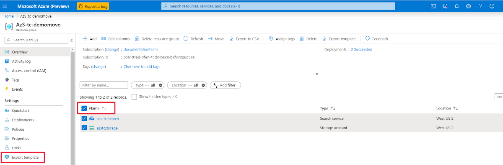

# Move your Azure AI Search service to another Azure region

Occasionally, customers ask about moving a search service to another region. Currently, there's no built-in mechanism or tooling to help with that task, but this article can help you understand the manual steps for recreating indexes and other objects on a new search service in a different region.

> [!NOTE]
> In the Azure portal, all services have an **Export template** command. In the case of Azure AI Search, this command produces a basic definition of a service (name, location, tier, replica, and partition count), but does not recognize the content of your service, nor does it carry over keys, roles, or logs. Although the command exists, we don't recommend using it for moving a search service.

## Prerequisites

+ Ensure that the services and features that your account uses are supported in the target region.

+ For preview features, ensure that your subscription is approved for the target region.

## Prepare and move

1. Identify dependencies and related services to understand the full impact of relocating a service, in case you need to move more than just Azure AI Search.

   Azure Storage is used for logging, creating a knowledge store, and is a commonly used external data source for AI enrichment and indexing. Azure AI services are used to power built-in skills during AI enrichment. Both Azure AI services and your search service are required to be in the same region if you're using AI enrichment.

1. Create an inventory of all objects on the service so that you know what to move: indexes, synonym maps, indexers, data sources, skillsets. If you enabled logging, create and archive any reports you might need for a historical record.

1. Check pricing and availability in the new region to ensure availability of Azure AI Search plus any related services in the new region. Most features are available in all regions, but some preview features have restricted availability.

1. Create a service in the new region and republish from source code any existing indexes, synonym maps, indexers, data sources, and skillsets. Remember that service names must be unique so you can't reuse the existing name. Check each skillset to see if connections to Azure AI services are still valid in terms of the same-region requirement. Also, if knowledge stores are created, check the connection strings for Azure Storage if you're using a different service.

1. Reload indexes and knowledge stores, if applicable. You'll either use application code to push JSON data into an index, or rerun indexers to pull documents in from external sources. 

1. Enable logging, and if you're using them, re-create security roles.

1. Update client applications and test suites to use the new service name and API keys, and test all applications.

## Discard or clean up

Delete the old service once the new service is fully tested and operational. Deleting the service automatically deletes all content associated with the service.

## Next steps

The following links can help you locate more information when completing the steps outlined above.

+ [Azure AI Search pricing and regions](https://azure.microsoft.com/pricing/details/search/)
+ [Choose a tier](search-sku-tier.md)
+ [Create a search service](search-create-service-portal.md)
+ [Load search documents](search-what-is-data-import.md)
+ [Enable logging](monitor-azure-cognitive-search.md)


<!-- To move your Azure AI services account from one region to another, you will create an export template to move your subscription(s). After moving your subscription, you will need to move your data and recreate your service.

In this article, you'll learn how to:

> [!div class="checklist"]
> * Export a template.
> * Modify the template: adding the target region, search and storage account names.
> * Deploy the template to create the new search and storage accounts.
> * Verify your service status in the new region
> * Clean up resources in the source region.

## Prerequisites

- Ensure that the services and features that your account uses are supported in the target region.

- For preview features, ensure that your subscription is allowlisted for the target region. For more information about preview features, see [knowledge stores](./knowledge-store-concept-intro.md), [incremental enrichment](./cognitive-search-incremental-indexing-conceptual.md), and [private endpoint](./service-create-private-endpoint.md).

## Assessment and planning

When you move your search service to the new region, you will need to [move your data to the new storage service](../storage/common/storage-account-move.md?tabs=azure-portal#configure-the-new-storage-account) and then rebuild your indexes, skillsets and knowledge stores. You should record current settings and copy json files to make the rebuilding of your service easier and faster.

## Moving your search service's resources

To start you will export and then modify a Resource Manager template.

### Export a template

1. Sign in to the [Azure portal](https://portal.azure.com).

2. Go to your Resource Group page.

> [!div class="mx-imgBorder"]
> 

3. Select **All resources**.

3. In the left hand navigation menu select **Export template**.

4. Choose **Download** in the **Export template** page.

5. Locate the .zip file that you downloaded from the portal, and unzip that file to a folder of your choice.

The zip file contains the .json files that comprise the template and scripts to deploy the template.

### Modify the template

You will modify the template by changing the search and storage account names and regions. The names must follow the rules for each service and region naming conventions. 

To obtain region location codes, see [Azure Locations](https://azure.microsoft.com/global-infrastructure/locations/).  The code for a region is the region name with no spaces, **Central US** = **centralus**.

1. In the Azure portal, select **Create a resource**.

2. In **Search the Marketplace**, type **template deployment**, and then press **ENTER**.

3. Select **Template deployment**.

4. Select **Create**.

5. Select **Build your own template in the editor**.

6. Select **Load file**, and then follow the instructions to load the **template.json** file that you downloaded and unzipped in the previous section.

7. In the **template.json** file, name the target search and storage accounts by setting the default value of the search and storage account names. 

8. Edit the **location** property in the **template.json** file to the target region for both your search and storage services. This example sets the target region to `centralus`.

```json
},
    "variables": {},
    "resources": [
        {
            "type": "Microsoft.Search/searchServices",
            "apiVersion": "2020-03-13",
            "name": "[parameters('searchServices_target_region_search_name')]",
            "location": "centralus",
            "sku": {
                "name": "standard"
            },
            "properties": {
                "replicaCount": 1,
                "partitionCount": 1,
                "hostingMode": "Default"
            }
        },
        {
            "type": "Microsoft.Storage/storageAccounts",
            "apiVersion": "2019-06-01",
            "name": "[parameters('storageAccounts_tagetstorageregion_name')]",
            "location": "centralus",
            "sku": {
                "name": "Standard_RAGRS",
                "tier": "Standard"
            },
```

### Deploy the template

1. Save the **template.json** file.

2. Enter or select the property values:

- **Subscription**: Select an Azure subscription.

- **Resource group**: Select **Create new** and give the resource group a name.

- **Location**: Select an Azure location.

3. Click the **I agree to the terms and conditions stated above** checkbox, and then click the **Select Purchase** button.

## Verifying your services' status in new region

To verify the move, open the new resource group and your services will be listed with the new region.

To move your data from your source region to the target region, please see this article's guidelines for [moving your data to the new storage account](../storage/common/storage-account-move.md?tabs=azure-portal#move-data-to-the-new-storage-account).

## Clean up resources in your original region

To commit the changes and complete the move of your service account, delete the source service account.

## Next steps

[Create an index](./search-get-started-portal.md)

[Create a skillset](./cognitive-search-quickstart-blob.md)

[Create a knowledge store](./knowledge-store-create-portal.md) -->
