# How to query a Cognitive Search index from Power Apps

This tutorial shows you how to integrate results from Azure Cognitive Search into a Power App. 

## Prerequisites:
1.    Power Apps account access with the ability to create custom connectors.
2.    We assume you have already created an Azure Search Index.

There are two main steps to having a PowerApp that shows Azure Cognitive Search results. First creating a connector that can query the search index, and then updating your power app application to visualize the results returned by the connector.

## Create a Custom Connector to Query Azure Search

1. Go to [make.powerapps.com](http://make.powerapps.com) and **Sign In**
2. Search for **Data** > **Custom Connectors**
 
    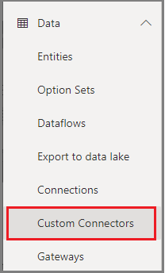

3. Click  **+ New custom connector**  and then select **Create from blank**

    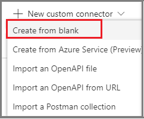

4. Give your custom connector a name. (that is, *AzureSearchQuery*), and then click **Continue**. This will bring up a wizard to create your new connector.

5. Enter information in the General Page.

    - Icon background color (for instance, #007ee5)
    - Description (for instance, "A connector to Azure Cognitive Search")
    - In the Host, you will need to enter your search service URL (for instance, `<yourservicename>.search.windows.net`)
    - For Base URL, simply enter "/"
    
    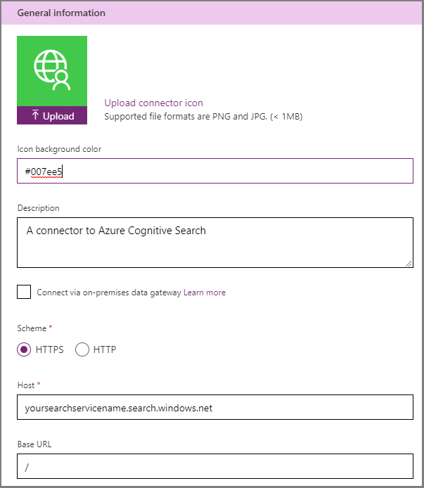

6. In the Security Page, set *API Key* as the **Authentication Type**, set the parameter label, and parameter name fields as *api-key*. For **Parameter location**, select *Header* as shown below.
 
    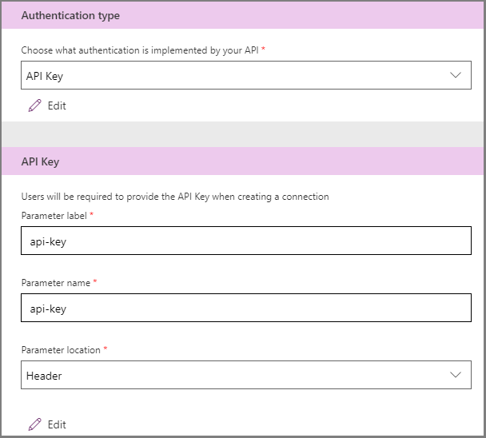

7. In the Definitions Page, select **+ New Action** to create an action that will query the index. Enter the value "Query" for the summary and the name of the operation ID. Enter a description like *"Queries the search index"*.
 
    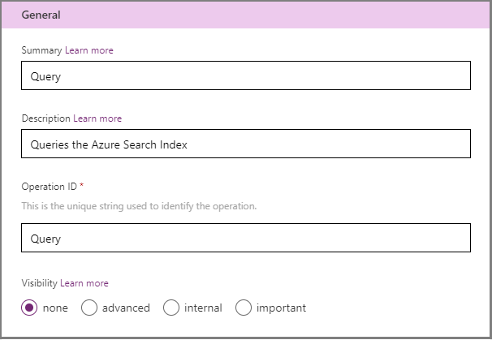

8. Press the **+ Import from sample** button to define the parameters and headers. Next, you will define the query request.  

    * Select the verb `GET`
    * For the URL enter a sample query for your search index, for instance:
       
    >https://yoursearchservicename.search.windows.net/indexes/yourindexname/docs?search=*&api-version=2019-05-06-Preview
    

    **Power Apps** will use the syntax to extract parameters from the query. Notice we explicitly defined the search field. 

    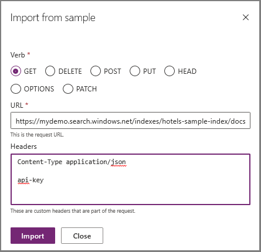
    
9.  Click **Import** to automatically pre-fill the Request dialog.

    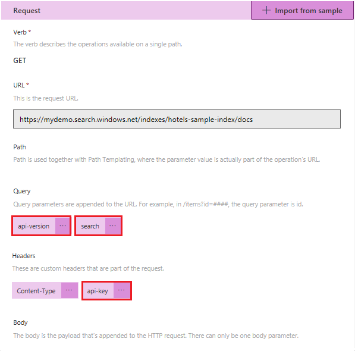


10. Complete setting the parameter metadata by clicking the **…** symbol next to each of the parameters.

    - For *search*: Set `*` as the **default value**, set **required** as *false* and set the **visibility** to *none*. 

    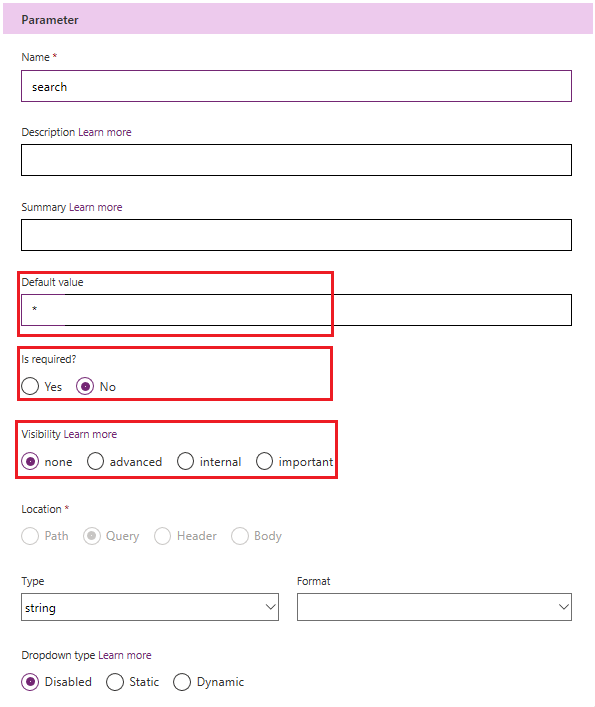


    - For *api-version*: Set `2019-05-06-Preview` as the **default value**, set the **visibility** as internal and set **required** to *True*.  

    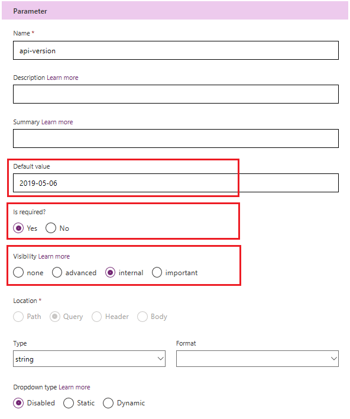

    - Similarly, for *api-key*, set it as **required**, with *internal* **visibility**. Enter your search service API key as the **default value**.
    
    After you make these changes, toggle to the **Swagger Editor** view. In the parameters section you should see the following configuration:    

    ```
          parameters:
          - {name: search, in: query, required: false, type: string, default: '*'}
          - {name: api-version, in: query, required: true, type: string, default: 2019-05-06-Preview,
            x-ms-visibility: internal}
          - {name: api-key, in: header, required: true, type: string, default: YOURKEYGOESHERE,
            x-ms-visibility: internal}
    ```

11. On the Response section, click **"Add default response"**. This is critical because it will help **Power Apps** understand the schema of the response. Paste a sample response.

    > [!TIP] 
    > There is a character limit to the JSON response you can enter, so you may want to simplify the JSON so that it before pasting it. The important aspect schema/format of the response. The actual values in the sample response are less important and can be simplified to reduce the character count.
    

12.    Click the **Create connector** button on the top right of the screen before you can Test it.

13.    In the Test Page, click the **+ New Connection**, and enter your search service query key as the value for *api-key*.

This step may take you to the out of the wizard and into the Connections page. You may want to go back to the Custom Connections editor to actually test the connection. Go to **Custom Connector** > Select the newly created Connector > … > **View Properties** > **Edit** > **4. Test** to get back to the test page.

14.    Now click **Test operation** to make sure that you are getting results from your index. If you were successful you should see a 200 status, and in the body of the response you should see JSON that describes your search results.


## Visualize Results from the Customer Connector we just created
The goal of this tutorial is not to show you how to create fancy user experiences with power apps, so the UI layout will be minimalistic. Let's create a PowerApp with a search box, a search button and display the results in a gallery control.  The PowerApp will connect to our recently created custom connector to get the data from Azure Search.

1. Create new Power App
Go to the **Apps** section, click on **+ New app**, and select **Canvas**

     

2. Select the type of application you would like. For this tutorial create a **Blank App** with the **Phone Layout**. The **Power Apps Studio** will appear.

3. Once in the studio, select the **Data Sources**  tab, and click on the new Connector you have just created. In our case, it is called *AzureSearchQuery*. Click **Add a connection**.

  
    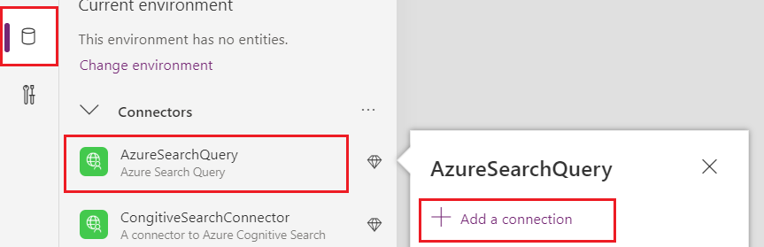

Now *AzureSearchQuery* is a data source that is available to be used from your application.

4. Navigate to the **Insert tab**, so that we can add a few controls to our form.

    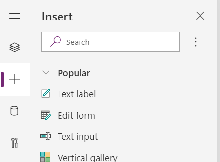

5.  Insert the following elements:
-   A Text Label with the value "Query:"
-   A Text Input element (call it txtQuery, default value: "*")
-   A button with the text "Search" 
-   A Vertical Gallery called (call it galleryResults)

    Your form should look something like this:

    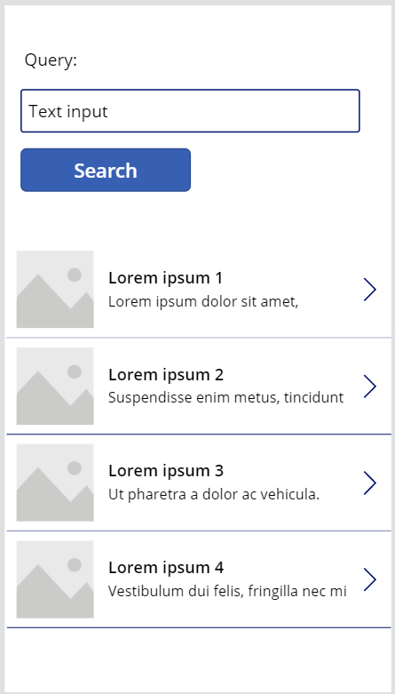

6. To make the **Search button** issue a query, select the button, and Paste the following action to take on **OnSelect**:

    ```
    If(!IsBlank(txtQuery.Text),
        ClearCollect(azResult, AzureSearchQuery.Get({search: txtQuery.Text}).value))
    ```
 
    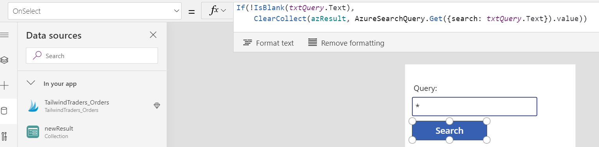
 
    This action will cause the button to update a new collection called *azResult* with the result of the search query, using the text in the *txtQuery* text box as the query term.
    
7.  As a next step, we will link the vertical gallery we created to the *azResult* collection. Select the gallery control, and perform the following actions in the properties pane.

    -  Set **DataSource** to *azResult*.
    
    -  Select a **Layout** that works for you based on the type of data in your index.
    
    -  **Edit Fields**, and select the fields you would like to visualize.

    Since we provided a sample result when we defined the connector, PowerApps is aware of the fields available in your index.
    
    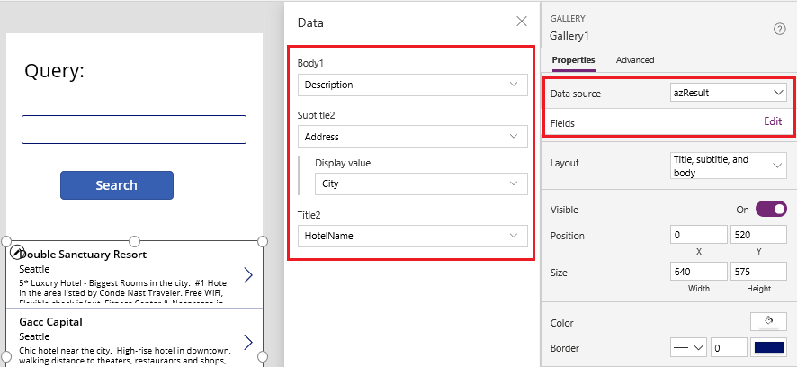
 
8.  Press **F5** to preview the PowerApp.  

      Remember that the fields can be set to calculated values. For the example below, I calculated the full path of my images as the concatenation of the root path for the data and the name of the file as an example.
 
     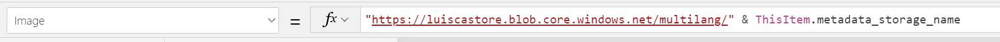


     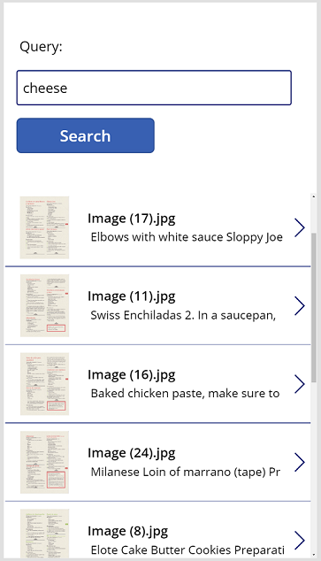

## Next Steps

To learn more about creating your own PowerApps, check the [PowerApps Learning Catalog](https://docs.microsoft.com/en-us/powerapps/learning-catalog/get-started)

