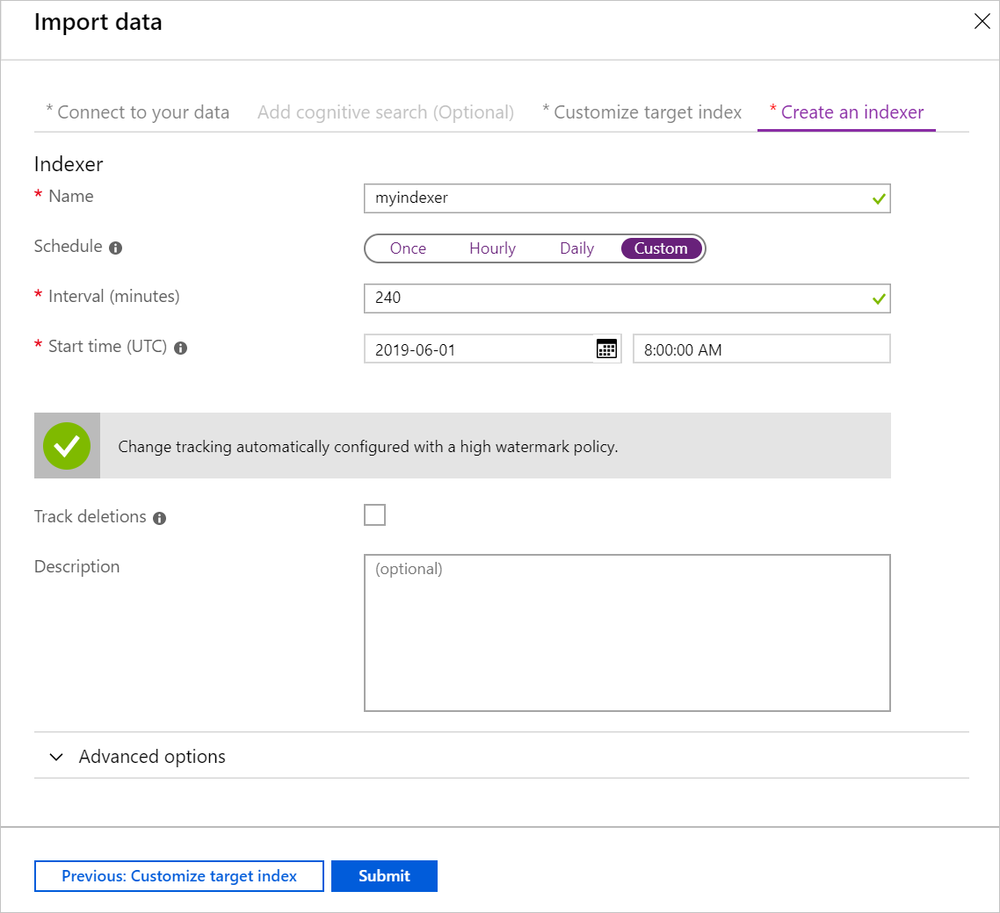
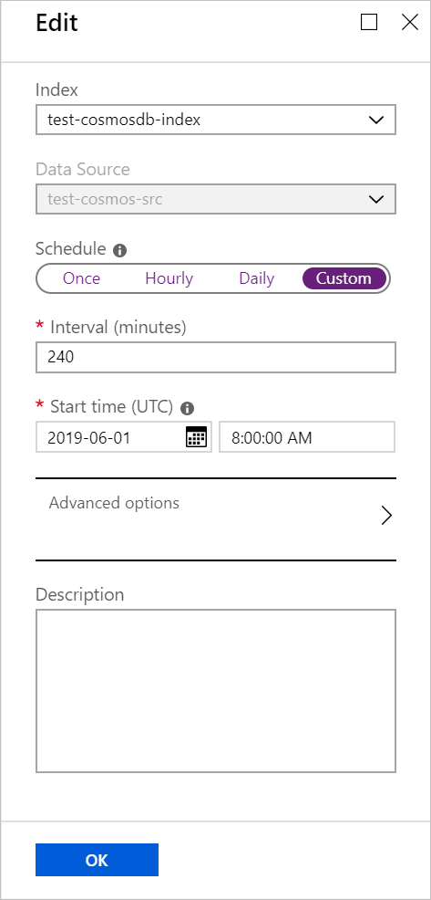

# How to schedule indexers in Azure Cognitive Search

An indexer normally runs once, immediately after it is created. You can run it again on demand using the portal, the REST API, or the .NET SDK. You can also configure an indexer to run periodically on a schedule.

Some situations where indexer scheduling is useful:

* Source data will change over time, and you want the Azure Cognitive Search indexers to automatically process the changed data.
* The index will be populated from multiple data sources and you want to make sure the indexers run at different times to reduce conflicts.
* The source data is very large and you want to spread the indexer processing over time. For more information about indexing large volumes of data, see [How to index large data sets in Azure Cognitive Search](search-howto-large-index.md).

The scheduler is a built-in feature of Azure Cognitive Search. You can't use an external scheduler to control search indexers.

## Define schedule properties

An indexer schedule has two properties:
* **Interval**, which defines the amount of time in between scheduled indexer executions. The smallest interval allowed is 5 minutes, and the largest is 24 hours.
* **Start Time (UTC)**, which indicates the first time at which the indexer should be run.

You can specify a schedule when first creating the indexer, or by updating the indexer's properties later. Indexer schedules can be set using the [portal](#portal), the [REST API](#restApi), or the [.NET SDK](#dotNetSdk).

Only one execution of an indexer can run at a time. If an indexer is already running when its next execution is scheduled, that execution is postponed until the next scheduled time.

Let’s consider an example to make this more concrete. Suppose we configure an indexer schedule with an **Interval** of hourly and a **Start Time** of June 1, 2019 at 8:00:00 AM UTC. Here’s what could happen when an indexer run takes longer than an hour:

* The first indexer execution starts at or around June 1, 2019 at 8:00 AM UTC. Assume this execution takes 20 minutes (or any time less than 1 hour).
* The second execution starts at or around June 1, 2019 9:00 AM UTC. Suppose that this execution takes 70 minutes - more than an hour – and it will not complete until 10:10 AM UTC.
* The third execution is scheduled to start at 10:00 AM UTC, but at that time the previous execution is still running. This scheduled execution is then skipped. The next execution of the indexer will not start until 11:00 AM UTC.

> [!NOTE]
> If an indexer is set to a certain schedule but repeatedly fails on the same document over and over again each time it runs, the indexer will begin running on a less frequent interval (up to the maximum of at least once every 24 hours) until it successfully makes progress again.  If you believe you have fixed whatever the issue that was causing the indexer to be stuck at a certain point, you can perform an on demand run of the indexer, and if that successfully makes progress, the indexer will return to its set schedule interval again.

<a name="portal"></a>

## Schedule in the portal

The Import Data wizard in the portal lets you define the schedule for an indexer at creation time. The default Schedule setting is **Hourly**, which means the indexer runs once after it is created, and runs again every hour afterwards.

You can change the Schedule setting to **Once** if you don't want the indexer to run again automatically, or to **Daily** to run once per day. Set it to **Custom** if you want to specify a different interval or a specific future Start Time.

When you set the schedule to **Custom**, fields appear to let you specify the **Interval** and the **Start Time (UTC)**. The shortest time interval allowed is 5 minutes, and the longest is 1440 minutes (24 hours).

   

After an indexer has been created, you can change the schedule settings using the indexer's Edit panel. The Schedule fields are the same as in the Import Data wizard.

   

<a name="restApi"></a>

## Schedule using REST APIs

You can define the schedule for an indexer using the REST API. To do this, include the **schedule** property when creating or updating the indexer. The example below shows a PUT request to update an existing indexer:

    PUT https://myservice.search.windows.net/indexers/myindexer?api-version=2019-05-06
    Content-Type: application/json
    api-key: admin-key

    {
        "dataSourceName" : "myazuresqldatasource",
        "targetIndexName" : "target index name",
        "schedule" : { "interval" : "PT10M", "startTime" : "2015-01-01T00:00:00Z" }
    }

The **interval** parameter is required. The interval refers to the time between the start of two consecutive indexer executions. The smallest allowed interval is 5 minutes; the longest is one day. It must be formatted as an XSD "dayTimeDuration" value (a restricted subset of an [ISO 8601 duration](https://www.w3.org/TR/xmlschema11-2/#dayTimeDuration) value). The pattern for this is: `P(nD)(T(nH)(nM))`. Examples: `PT15M` for every 15 minutes, `PT2H` for every 2 hours.

The optional **startTime** indicates when scheduled executions should begin. If it is omitted, the current UTC time is used. This time can be in the past, in which case the first execution is scheduled as if the indexer has been running continuously since the original **startTime**.

You can also run an indexer on demand at any time using the Run Indexer call. For more information about running indexers and setting indexer schedules, see [Run Indexer](https://docs.microsoft.com/rest/api/searchservice/run-indexer), [Get Indexer](https://docs.microsoft.com/rest/api/searchservice/get-indexer), and [Update Indexer](https://docs.microsoft.com/rest/api/searchservice/update-indexer) in the REST API Reference.

<a name="dotNetSdk"></a>

## Schedule using the .NET SDK

You can define the schedule for an indexer using the Azure Cognitive Search .NET SDK. To do this, include the **schedule** property when creating or updating an Indexer.

The following C# example creates an indexer, using a predefined data source and index, and sets its schedule to run once every day starting 30 minutes from now:

```
    Indexer indexer = new Indexer(
        name: "azure-sql-indexer",
        dataSourceName: dataSource.Name,
        targetIndexName: index.Name,
        schedule: new IndexingSchedule(
                        TimeSpan.FromDays(1), 
                        new DateTimeOffset(DateTime.UtcNow.AddMinutes(30))
                    )
        );
    await searchService.Indexers.CreateOrUpdateAsync(indexer);
```
If the **schedule** parameter is omitted, the indexer will only run once immediately after it is created.

The **startTime** parameter can be set to a time in the past. In that case, the first execution is scheduled as if the indexer has been running continuously since the given **startTime**.

The schedule is defined using the [IndexingSchedule](https://docs.microsoft.com/dotnet/api/microsoft.azure.search.models.indexingschedule?view=azure-dotnet) class. The **IndexingSchedule** constructor requires an **interval** parameter specified using a **TimeSpan** object. The smallest interval value allowed is 5 minutes, and the largest is 24 hours. The second **startTime** parameter, specified as a **DateTimeOffset** object, is optional.

The .NET SDK lets you control indexer operations using the [SearchServiceClient](https://docs.microsoft.com/dotnet/api/microsoft.azure.search.searchserviceclient) class and its [Indexers](https://docs.microsoft.com/dotnet/api/microsoft.azure.search.searchserviceclient.indexers) property, which implements methods from the **IIndexersOperations** interface. 

You can run an indexer on demand at any time using one of the [Run](https://docs.microsoft.com/dotnet/api/microsoft.azure.search.indexersoperationsextensions.run), [RunAsync](https://docs.microsoft.com/dotnet/api/microsoft.azure.search.indexersoperationsextensions.runasync), or [RunWithHttpMessagesAsync](https://docs.microsoft.com/dotnet/api/microsoft.azure.search.iindexersoperations.runwithhttpmessagesasync) methods.

For more information about creating, updating, and running indexers, see [IIindexersOperations](https://docs.microsoft.com/dotnet/api/microsoft.azure.search.iindexersoperations?view=azure-dotnet).
