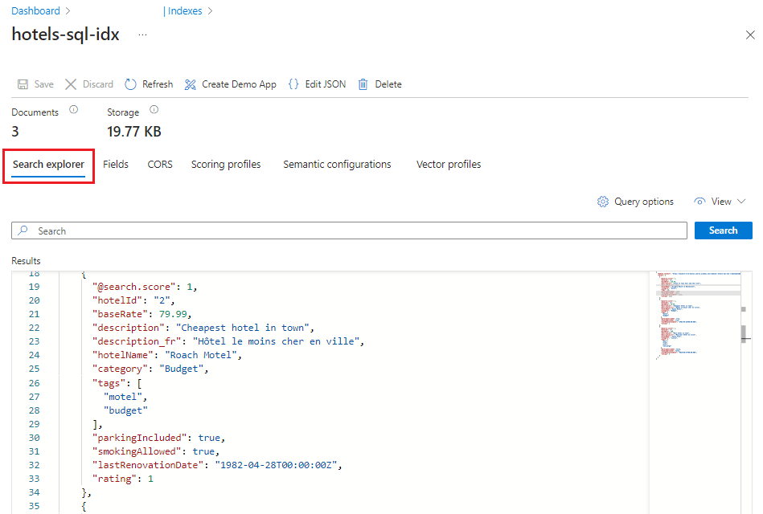

# Tutorial: Index data from Azure SQL databases in C#

Configure an [indexer](search-indexer-overview.md) programmatically to extract searchable data from Azure SQL database and sends it to a search index in Azure Cognitive Search. 

This tutorial uses C# and the [.NET SDK](https://aka.ms/search-sdk) to perform the following tasks:

> [!div class="checklist"]
> * Create a data source that connects to Azure SQL Database
> * Configure an indexer
> * Run an indexer to load data into an index
> * Query an index as a verification step

If you don't have an Azure subscription, create a [free account](https://azure.microsoft.com/free/?WT.mc_id=A261C142F) before you begin.

## Prerequisites

+ [Azure SQL Database](https://azure.microsoft.com/services/sql-database/)
+ [Visual Studio](https://visualstudio.microsoft.com/downloads/)
+ [Create](search-create-service-portal.md) or [find an existing search service](https://ms.portal.azure.com/#blade/HubsExtension/BrowseResourceBlade/resourceType/Microsoft.Search%2FsearchServices) 

> [!Note]
> You can use the free service for this tutorial. A free search service limits you to three indexes, three indexers, and three data sources. This tutorial creates one of each. Before starting, make sure you have room on your service to accept the new resources.

## Download files

Source code for this tutorial is in the [DotNetHowToIndexer](https://github.com/Azure-Samples/search-dotnet-getting-started/tree/master/DotNetHowToIndexers) folder in the [Azure-Samples/search-dotnet-getting-started](https://github.com/Azure-Samples/search-dotnet-getting-started) GitHub repository.

## Get a key and URL

API calls require the service URL and an access key. A search service is created with both, so if you added Azure Cognitive Search to your subscription, follow these steps to get the necessary information:

1. [Sign in to the Azure portal](https://portal.azure.com/), and in your search service **Overview** page, get the URL. An example endpoint might look like `https://mydemo.search.windows.net`.

1. In **Settings** > **Keys**, get an admin key for full rights on the service. There are two interchangeable admin keys, provided for business continuity in case you need to roll one over. You can use either the primary or secondary key on requests for adding, modifying, and deleting objects.

   

## Set up connections

1. Start Visual Studio and open **DotNetHowToIndexers.sln**.

1. In Solution Explorer, open **appsettings.json** and replace placeholder values with connection information to your search service. If the full URL is "https://my-demo-service.search.windows.net", the service name to provide is "my-demo-service".

    ```json
    {
      "SearchServiceName": "Put your search service name here",
      "SearchServiceAdminApiKey": "Put your primary or secondary API key here",
      "AzureSqlConnectionString": "Put your Azure SQL database connection string here",
    }
    ```

The last entry requires an existing database. You'll create it in the next step.

## Prepare sample data

In this step, create an external data source on Azure SQL Database that an indexer can crawl. You can use the Azure portal and the *hotels.sql* file from the sample to create the dataset in Azure SQL Database. Azure Cognitive Search consumes flattened rowsets, such as one generated from a view or query. The SQL file in the sample solution creates and populates a single table.

If you have an existing Azure SQL Database resource, you can add the hotels table to it, starting at step 4.

1. [Sign in to the Azure portal](https://portal.azure.com/).

1. Find or create a **SQL Database**. You can use defaults and the lowest level pricing tier. One advantage to creating a server is that you can specify an administrator user name and password, necessary for creating and loading tables in a later step.

   

1. Click **Review + create** to deploy the new server and database. Wait for the server and database to deploy.

1. On the navigation pane, click **Query editor (preview)** and enter the user name and password of server admin. 

   If access is denied, copy the client IP address from the error message, and then click the **Set server firewall** link to add a rule that allows access from your client computer, using your client IP for the range. It can take several minutes for the rule to take effect.

1. In Query editor, click **Open query** and navigate to the location of *hotels.sql* file on your local computer. 

1. Select the file and click **Open**. The script should look similar to the following screenshot:

   

1. Click **Run** to execute the query. In the Results pane, you should see a query succeeded message, for 3 rows.

1. To return a rowset from this table, you can execute the following query as a verification step:

    ```sql
    SELECT * FROM Hotels
    ```

1. Copy the ADO.NET connection string for the database. Under **Settings** > **Connection Strings**, copy the ADO.NET connection string, similar to the example below.

    ```sql
    Server=tcp:{your_dbname}.database.windows.net,1433;Initial Catalog=hotels-db;Persist Security Info=False;User ID={your_username};Password={your_password};MultipleActiveResultSets=False;Encrypt=True;TrustServerCertificate=False;Connection Timeout=30;
    ```

1. Paste the connection string into "AzureSqlConnectionString" as the third entry in **appsettings.json** file in Visual Studio.

    ```json
    {
      "SearchServiceName": "<placeholder-Azure-Search-service-name>",
      "SearchServiceAdminApiKey": "<placeholder-admin-key-for-Azure-Search>",
      "AzureSqlConnectionString": "Server=tcp:{your_dbname}.database.windows.net,1433;Initial Catalog=hotels-db;Persist Security Info=False;User ID={your_username};Password={your_password};MultipleActiveResultSets=False;Encrypt=True;TrustServerCertificate=False;Connection Timeout=30;",
    }
    ```

1. Enter your password into the connection string in the **appsettings.json** file. Database and user names will copy over in your connection string, but the password must be entered manually.

## Build the solution

Press F5 to build the solution. The program executes in debug mode. A console window reports the status of each operation.

   

Your code runs locally in Visual Studio, connecting to your search service on Azure, which in turn connects to Azure SQL Database and retrieves the dataset. With this many operations, there are several potential points of failure. If you get an error, check the following conditions first:

+ Search service connection information that you provide is limited to the service name in this tutorial. If you entered the full URL, operations stop at index creation, with a failure to connect error.

+ Database connection information in **appsettings.json**. It should be the ADO.NET connection string obtained from the portal, modified to include a username and password that are valid for your database. The user account must have permission to retrieve data. Your local client IP address must be allowed access.

+ Resource limits. Recall that the Free tier has limits of 3 indexes, indexers, and data sources. A service at the maximum limit cannot create new objects.

## Check results

Use Azure portal to verify object creation, and then use **Search explorer** to query the index.

1. [Sign in to the Azure portal](https://portal.azure.com/), and in your search service **Overview** page, open each list in turn to verify the object is created. **Indexes**, **Indexers**, and **Data Sources** will have "hotels", "azure-sql-indexer", and "azure-sql", respectively.

   

1. Select the hotels index. On the hotels page, **Search explorer** is the first tab. 

1. Click **Search** to issue an empty query. 

   The three entries in your index are returned as JSON documents. Search explorer returns documents in JSON so that you can view the entire structure.

   
   
1. Next, enter a search string: `search=river&$count=true`. 

   This query invokes full text search on the term `river`, and the result includes a count of the matching documents. Returning the count of matching documents is helpful in testing scenarios when you have a large index with thousands or millions of documents. In this case, only one document matches the query.

1. Lastly, enter a search string that limits the JSON output to fields of interest: `search=river&$count=true&$select=hotelId, baseRate, description`. 

   The query response is reduced to selected fields, resulting in more concise output.

## Explore the code

Now that you understand what the sample code create, let's return to the solution to review the code. Relevant code is in two files:

  + **hotel.cs**, containing a schema that defines the index
  + **Program.cs**, containing functions for creating and managing structures in your service

### In hotel.cs

The index schema defines the fields collection, including attributes specifying allowed operations, such as whether a field is full-text searchable, filterable, or sortable as shown in the following field definition for HotelName. 

```csharp
. . . 
[IsSearchable, IsFilterable, IsSortable]
public string HotelName { get; set; }
. . .
```

A schema can also include other elements, including scoring profiles for boosting a search score, custom analyzers, and other constructs. However, for our purposes, the schema is sparsely defined, consisting only of fields found in the sample datasets.

### In Program.cs

The main program includes logic for creating a client, an index, a data source, and an indexer. The code checks for and deletes existing resources of the same name, under the assumption that you might run this program multiple times.

The data source object is configured with settings that are specific to Azure SQL database resources, including [partial or incremental indexing](search-howto-connecting-azure-sql-database-to-azure-search-using-indexers.md#capture-new-changed-and-deleted-rows) for leveraging the built-in [change detection features](https://docs.microsoft.com/sql/relational-databases/track-changes/about-change-tracking-sql-server) of Azure SQL. The demo hotels database in Azure SQL has a "soft delete" column named **IsDeleted**. When this column is set to true in the database, the indexer removes the corresponding document from the Azure Cognitive Search index.

  ```csharp
  Console.WriteLine("Creating data source...");

  DataSource dataSource = DataSource.AzureSql(
      name: "azure-sql",
      sqlConnectionString: configuration["AzureSQLConnectionString"],
      tableOrViewName: "hotels",
      deletionDetectionPolicy: new SoftDeleteColumnDeletionDetectionPolicy(
          softDeleteColumnName: "IsDeleted",
          softDeleteMarkerValue: "true"));
  dataSource.DataChangeDetectionPolicy = new SqlIntegratedChangeTrackingPolicy();

  searchService.DataSources.CreateOrUpdateAsync(dataSource).Wait();
  ```

An indexer object is platform-agnostic, where  configuration, scheduling, and invocation are the same regardless of the source. This example indexer includes a schedule, a reset option that clears indexer history, and calls a method to create and run the indexer immediately.

  ```csharp
  Console.WriteLine("Creating Azure SQL indexer...");
  Indexer indexer = new Indexer(
      name: "azure-sql-indexer",
      dataSourceName: dataSource.Name,
      targetIndexName: index.Name,
      schedule: new IndexingSchedule(TimeSpan.FromDays(1)));
  // Indexers contain metadata about how much they have already indexed
  // If we already ran the sample, the indexer will remember that it already
  // indexed the sample data and not run again
  // To avoid this, reset the indexer if it exists
  exists = await searchService.Indexers.ExistsAsync(indexer.Name);
  if (exists)
  {
      await searchService.Indexers.ResetAsync(indexer.Name);
  }

  await searchService.Indexers.CreateOrUpdateAsync(indexer);

  // We created the indexer with a schedule, but we also
  // want to run it immediately
  Console.WriteLine("Running Azure SQL indexer...");

  try
  {
      await searchService.Indexers.RunAsync(indexer.Name);
  }
  catch (CloudException e) when (e.Response.StatusCode == (HttpStatusCode)429)
  {
      Console.WriteLine("Failed to run indexer: {0}", e.Response.Content);
  }
  ```

## Reset and rerun

In the early experimental stages of development, the most practical approach for design iteration is to delete the objects from Azure Cognitive Search and allow your code to rebuild them. Resource names are unique. Deleting an object lets you recreate it using the same name.

The sample code for this tutorial checks for existing objects and deletes them so that you can rerun your code.

You can also use the portal to delete indexes, indexers, and data sources.

## Clean up resources

When you're working in your own subscription, at the end of a project, it's a good idea to remove the resources that you no longer need. Resources left running can cost you money. You can delete resources individually or delete the resource group to delete the entire set of resources.

You can find and manage resources in the portal, using the All resources or Resource groups link in the left-navigation pane.

## Next steps

Now that you're familiar with the basics of SQL Database indexing, let's take a closer look at indexer configuration.

> [!div class="nextstepaction"]
> [Configure an Azure SQL database indexer](search-howto-connecting-azure-sql-database-to-azure-search-using-indexers.md)