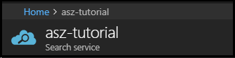

# How to crawl an Azure SQL database using Azure Search indexers

[*Indexers*](search-indexer-overview.md) are a component of Azure Search that crawl external data sources, populating a [search index](search-what-is-an-index.md) with searchable content. Of all indexers, the indexer for Azure SQL database is the most widely used. 

This tutorial shows you how to configure an indexer for extracting data from a sample Azure SQL database. Proficiency in indexer configuration is helpful because it simplifies the amount of code you have to write and maintain. Rather than preparing and pushing a schema-compliant JSON dataset, you can attach an indexer to a data source, have the indexer extract data, push data into an index, and optionally run the indexer on a recurring schedule to pick up changes in the underlying source.

In this tutorial, using the [Azure Search .NET client libraries](https://aka.ms/search-sdk) and a .NET Core console application, you perform the following tasks:

> [!div class="checklist"]
> * Download and configure the solution
> * Add search service information to application settings
> * Prepare an external dataset in Azure SQL database 
> * Review the index and indexer definitions in sample code
> * Run the indexer code to import data
> * Search the index
> * View indexer configuration in the portal

## Prerequisites

* An active Azure account. If you don't have one, you can sign up for a [free trial](https://azure.microsoft.com/free/). 

* An Azure Search service. For help setting one up, see [Create a search service](search-create-service-portal.md).

* An Azure SQL database providing the external data source used by an indexer. The sample solution provides a SQL data file to create the table.

* Visual Studio 2017. You can use the free [Visual Studio 2017 Community Edition](https://www.visualstudio.com/downloads/). 

> [!Note]
> If you are using the free Azure Search service, you are limited to three indexes, three indexers, and three data sources. This tutorial creates one of each. Make sure you have room on your service to accept the new resources.

## Download the solution

The indexer solution used in this tutorial is from a collection of Azure Search samples delivered in one master download. The solution used for this tutorial is *DotNetHowToIndexers*.

1. Go to [**Azure-Samples/search-dotnet-getting-started**](https://github.com/Azure-Samples/search-dotnet-getting-started) in the Azure samples GitHub repository.

2. Click **Clone or Download** > **Download ZIP**. By default, the file goes to the Downloads folder.

3. In **File Explorer** > **Downloads**, right-click the file and choose **Extract all**.

4. Turn off read-only permissions. Right-click the folder name > **Properties** > **General**, and then clear the **Read-only** attribute for the current folder, subfolders, and files.

5. In **Visual Studio 2017**, open the solution *DotNetHowToIndexers.sln*.

6. In **Solution Explorer**, right-click the top node parent Solution > **Restore Nuget Packages**.

## Set up connections
Connection information to required services is specified in the **appsettings.json** file in the solution. 

In Solution Explorer, open **appsettings.json** so that you can populate each setting, using the instructions in this tutorial.  

```json
{
  "SearchServiceName": "Put your search service name here",
  "SearchServiceAdminApiKey": "Put your primary or secondary API key here",
  "AzureSqlConnectionString": "Put your Azure SQL database connection string here",
}
```

### Get the search service URL and admin api-key

You can find the search service endpoint and key in the portal. A key provides access to service operations. Admin keys allow write-access, necessary for creating and deleting objects such as indexes and indexers, in your service.

1. Sign in to the [Azure portal](https://portal.azure.com/) and find the [search services for your subscription](https://portal.azure.com/#blade/HubsExtension/BrowseResourceBlade/resourceType/Microsoft.Search%2FsearchServices).

2. Open the service page.

3. On the top, find the service name in the main page. In the following screenshot, it's *azs-tutorial*.

   

4. Copy and paste it as your first entry into **appsettings.json** in Visual Studio.

  > [!Note]
  > A service name is part of the endpoint that includes search.windows.net. If you are curious, you can see the full URL in **Essentials** on the Overview page. The URL should look like this example: https://your-service-name.search.windows.net

5. On the left, in **Settings** > **Keys**, copy one of the admin keys and paste it as the second entry into i**appsettings.json**. Keys are alphanumeric strings generated for your service during provisioning and used to authorize access to service operations. 

  After adding both settings, your file should look similar to this example:

  ```json
  {
    "SearchServiceName": "azs-tutorial",
    "SearchServiceAdminApiKey": "A1B2C3D4E5F6G7H8I9J10K11L12M13N14",
    . . .
  }
  ```

## Prepare an external data source

In this step, create an external data source that an indexer can crawl. The data file for this tutorial is *hotels.sql*, provided in the \DotNetHowToIndexers solution folder. 

### Azure SQL Database

You can use the Azure portal and the *hotels.sql* file from the sample to create the dataset in Azure SQL Database. Azure Search consumes flattened rowsets, such as one provided by a view, query, or stored procedure.

The following exercise assumes no existing server or database, and includes instructions for creating both in step 2. If you have an existing resource, you can add the hotels table, starting at step 4.

1. Sign in to the [Azure portal](https://portal.azure.com/). 

2. Click **New** > **SQL Database** to create a database, server, and resource group. You can use defaults and the lowest level pricing tier. One advantage to creating a server is that you can specify an administrator user name and password, necessary for creating and loading tables in a later step.

   

3. Click **Create** to deploy the new server and database. Wait for the server and database to deploy.

4. Open the SQL Database page for your new database, if it's not already open. The resource name should say *SQL database* and not *SQL Server*.

  

4. On the command bar, click **Tools** > **Query editor**.

5. Click **Login** and enter the user name and password of server admin.

6. Click **Open query** and navigate to the location of *hotels.sql*. 

7. Select the file and click **Open**. The script should look similar to the following screenshot:

  

8. Click **Run** to execute the query. In the Results pane, you should see a query succeeded message, for 3 rows.

9. To return a rowset from this table, you can execute the following query as a verification step:

   ```sql
   SELECT HotelId, HotelName, Tags FROM Hotels
   ```
   The prototypical query, `SELECT * FROM Hotels`, doesn't work in the Query Editor. The sample data includes geographic coordinates in the Location field, which is not handled in the editor at this time. For a list of other columns to query, you can execute this statement: `SELECT * FROM sys.columns WHERE object_id = OBJECT_ID('dbo.Hotels')`

10. Now that you have an external dataset, copy the ADO.NET connection string for the database. On the SQL Database page of your database, go to **Settings** > **Connection Strings**, and copy the ADO.NET connection string.
 
  An ADO.NET connection string looks like the following example, modified to use a valid database name, user name, and password.

  ```sql
  Server=tcp:hotels-db.database.windows.net,1433;Initial Catalog=hotels-db;Persist Security Info=False;User ID={your_username};Password={your_password};MultipleActiveResultSets=False;Encrypt=True;TrustServerCertificate=False;Connection Timeout=30;
  ```
11. Paste the connection string into "AzureSqlConnectionString" as the third entry in **appsettings.json** file in Visual Studio.

    ```json
    {
      "SearchServiceName": "azs-tutorial",
      "SearchServiceAdminApiKey": "A1B2C3D4E5F6G7H8I9J10K11L12M13N14",
      "AzureSqlConnectionString": "Server=tcp:hotels-db.database.windows.net,1433;Initial Catalog=hotels-db;Persist Security  Info=False;User ID={your_username};Password={your_password};MultipleActiveResultSets=False;Encrypt=True;TrustServerCertificate=False;Connection Timeout=30;",
    }
    ```

## Understand index and indexer code

Your code is now ready to build and run. Before doing that, take a minute to study the index and indexer definitions for this sample. The relevant code is in two files:

  + **hotel.cs**, containing the schema that defines the index
  + **Program.cs**, containing the functions for creating and managing structures in your service

### In hotel.cs

The index schema defines the fields collection, including attributes specifying allowed operations, such as whether a field is full-text searchable, filterable, or sortable as shown in the following field definition for HotelName. 

```csharp
. . . 
[IsSearchable, IsFilterable, IsSortable]
public string HotelName { get; set; }
. . .
```

A schema can also include other elements, including scoring profiles for boosting a search score, custom analyzers, and other constructs. However, for our purposes, the schema is sparsely defined, consisting only of fields found in the sample datasets.

In this tutorial, the indexer pulls data from one data source. In practice, you can attach multiple indexers to the same index, creating a consolidated searchable index from multiple data sources and indexers. You can use the same index-indexer pair, varying just the data sources, or one index with various indexer and data source combinations, depending on where you need the flexibility.

### In Program.cs

The main program includes functions for all three representative data sources. Focusing on just Azure SQL Database, the following objects stand out:

  ```csharp
  private const string IndexName = "hotels";
  private const string AzureSqlHighWaterMarkColumnName = "RowVersion";
  private const string AzureSqlDataSourceName = "azure-sql";
  private const string AzureSqlIndexerName = "azure-sql-indexer";
  ```

In Azure Search, objects that you can view, configure, or delete independently include indexes, indexers, and data sources (*hotels*, *azure-sql-indexer*, *azure-sql*, respectively). 

The *AzureSqlHighWaterMarkColumnName* column deserves special mention because it provides change detection information, used by the indexer to determine whether a row has changed since the last indexing workload. [Change detection policies](search-howto-connecting-azure-sql-database-to-azure-search-using-indexers.md) are supported only in indexers and vary by data source. For Azure SQL Database, you can choose from two policies, depending on database requirements.

The following code shows the methods in Program.cs used for creating a data source and indexer. The code checks for and deletes existing resources of the same name, under the assumption that you might run this program multiple times.

  ```csharp
  private static string SetupAzureSqlIndexer(SearchServiceClient serviceClient, IConfigurationRoot configuration)
  {
    Console.WriteLine("Deleting Azure SQL data source if it exists...");
    DeleteDataSourceIfExists(serviceClient, AzureSqlDataSourceName);

    Console.WriteLine("Creating Azure SQL data source...");
    DataSource azureSqlDataSource = CreateAzureSqlDataSource(serviceClient, configuration);

    Console.WriteLine("Deleting Azure SQL indexer if it exists...");
    DeleteIndexerIfExists(serviceClient, AzureSqlIndexerName);

    Console.WriteLine("Creating Azure SQL indexer...");
    Indexer azureSqlIndexer = CreateIndexer(serviceClient, AzureSqlDataSourceName, AzureSqlIndexerName);

    return azureSqlIndexer.Name;
  }
  ```

Notice that the indexer API calls are platform-agnostic except for [DataSourceType](https://docs.microsoft.com/dotnet/api/microsoft.azure.search.models.datasourcetype?view=azure-dotnet), which specifies the type of crawler to invoke.

## Run the indexer

In this step, compile and run the program. 

1. In Solution Explorer, right-click **DotNetHowToIndexers** and select **Build**.
2. Again, right-click **DotNetHowToIndexers**, followed by **Debug** > **Start new instance**.

The program executes in debug mode. A console window reports the status of each operation.

  

Your code runs locally in Visual Studio, connecting to your search service on Azure, which in turn uses the connection string to connect to Azure SQL Database and retrieve the dataset. With this many operations, there are several potential points of failure, but if you get an error, check the following conditions first:

+ Database connection information in **appsettings.json**. It should be the ADO.NET connection string obtained from the portal, modified to include a username and password that are valid for your database. The user account must have permission to retrieve data.

+ Resource limits. Recall that the shared (free) service has limits of 3 indexes, indexers, and data sources. A service at the maximum limit cannot create new objects.

## Search the index 

In the Azure portal, in the search service Overview page, click **Search explorer** at the top to submit a few queries on the new index.

1. Click **Change index** at the top to select the *hotels* index.
2. Click **Search** to issue an empty search. The three entries in your index are returned as JSON documents.
3. Next, enter a search string: `search=river&$count=true`. 

This query invokes full text search on the term `river`, and the result includes a count of the matching documents. In this case, only one document matches the query.

## View indexer configuration

All indexers, including the one you just created programmatically, are listed in the portal. You can open an indexer definition and view its data source, or configure a refresh schedule to pick up new and changed rows.

1. Open the service Overview page of your Azure Search service.
2. Scroll down to find the tiles for **Indexers** and **Data Sources**.
3. Click a tile to open a list of each resource. You can select individual indexers or data sources to view or modify configuration settings.

  

## Clean up resources

If you're not going to continue to using these services, follow these steps to delete all resources created by this tutorial in the Azure portal. 

1. From the left-hand menu in the Azure portal, click **Resource groups** and then click the name of the resource you created. 
2. On your resource group page, click **Delete resource group**, type the name of the resource to delete in the text box, and then click **Delete**.

## Next steps

For more information and tasks specific to other supported data sources, see the following articles:

* [Azure SQL Database or SQL Server on an Azure virtual machine](search-howto-connecting-azure-sql-database-to-azure-search-using-indexers.md)
* [Azure Cosmos DB](search-howto-index-documentdb.md)
* [Azure Table Storage](search-howto-indexing-azure-tables.md)
* [Azure Blob Storage](search-howto-indexing-azure-blob-storage.md)
* [Indexing CSV blobs using the Azure Search Blob indexer](search-howto-index-csv-blobs.md)
* [Indexing JSON blobs with Azure Search Blob indexer](search-howto-index-json-blobs.md)

