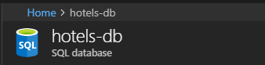
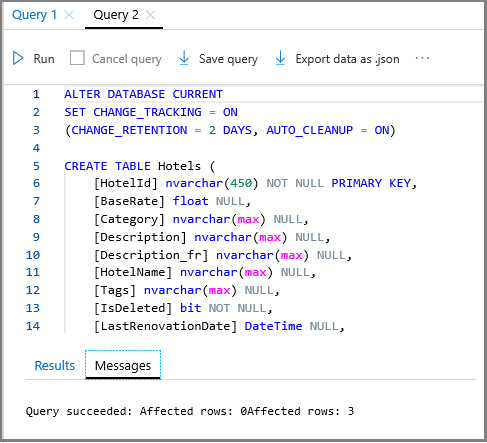
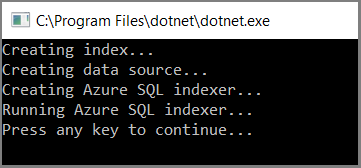
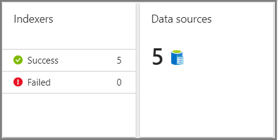

# C# Tutorial: Crawl an Azure SQL database using Azure Search indexers

Learn how to configure an indexer for extracting searchable data from a sample Azure SQL database. [Indexers](search-indexer-overview.md) are a component of Azure Search that crawl external data sources, populating a [search index](search-what-is-an-index.md) with content. Of all indexers, the indexer for Azure SQL Database is the most widely used. 

Proficiency in indexer configuration is helpful because it simplifies the amount of code you have to write and maintain. Rather than preparing and pushing a schema-compliant JSON dataset, you can attach an indexer to a data source, have the indexer extract data and insert it into an index, and optionally run the indexer on a recurring schedule to pick up changes in the underlying source.

In this tutorial, use the [Azure Search .NET client libraries](https://aka.ms/search-sdk) and a .NET Core console application to perform the following tasks:

> [!div class="checklist"]
> * Add search service information to application settings
> * Prepare an external dataset in Azure SQL database 
> * Review the index and indexer definitions in sample code
> * Run the indexer code to import data
> * Search the index
> * View indexer configuration in the portal

If you don't have an Azure subscription, create a [free account](https://azure.microsoft.com/free/?WT.mc_id=A261C142F) before you begin.

## Prerequisites

The following services, tools, and data are used in this quickstart. 

[Create an Azure Search service](search-create-service-portal.md) or [find an existing service](https://ms.portal.azure.com/#blade/HubsExtension/BrowseResourceBlade/resourceType/Microsoft.Search%2FsearchServices) under your current subscription. You can use a free service for this tutorial.

[Azure SQL Database](https://azure.microsoft.com/services/sql-database/) stores the external data source used by an indexer. The sample solution provides a SQL data file to create the table. Steps for creating the service and database are provided in this tutorial.

[Visual Studio 2017](https://visualstudio.microsoft.com/downloads/), any edition, can be used to run the sample solution. Sample code and instructions were tested on the free Community edition.

[Azure-Samples/search-dotnet-getting-started](https://github.com/Azure-Samples/search-dotnet-getting-started) provides the sample solution, located in the Azure samples GitHub repository. Download and extract the solution. By default, solutions are read-only. Right-click the solution and clear the read-only attribute so that you can modify files.

> [!Note]
> If you are using the free Azure Search service, you are limited to three indexes, three indexers, and three data sources. This tutorial creates one of each. Make sure you have room on your service to accept the new resources.

## Get a key and URL

REST calls require the service URL and an access key on every request. A search service is created with both, so if you added Azure Search to your subscription, follow these steps to get the necessary information:

1. [Sign in to the Azure portal](https://portal.azure.com/), and in your search service **Overview** page, get the URL. An example endpoint might look like `https://mydemo.search.windows.net`.

1. In **Settings** > **Keys**, get an admin key for full rights on the service. There are two interchangeable admin keys, provided for business continuity in case you need to roll one over. You can use either the primary or secondary key on requests for adding, modifying, and deleting objects.


All requests require an api-key on every request sent to your service. Having a valid key establishes trust, on a per request basis, between the application sending the request and the service that handles it.

## Set up connections
Connection information to required services is specified in the **appsettings.json** file in the solution. 

1. In Visual Studio, open the **DotNetHowToIndexers.sln** file.

1. In Solution Explorer, open **appsettings.json** so that you can populate each setting.  

The first two entries you can fill in right now, using the URL and admin keys for your Azure Search service. Given an endpoint of `https://mydemo.search.windows.net`, the service name to provide is `mydemo`.

```json
{
  "SearchServiceName": "Put your search service name here",
  "SearchServiceAdminApiKey": "Put your primary or secondary API key here",
  "AzureSqlConnectionString": "Put your Azure SQL database connection string here",
}
```

The last entry requires an existing database. You'll create it in the next step.

## Prepare sample data

In this step, create an external data source that an indexer can crawl. You can use the Azure portal and the *hotels.sql* file from the sample to create the dataset in Azure SQL Database. Azure Search consumes flattened rowsets, such as one generated from a view or query. The SQL file in the sample solution creates and populates a single table.

The following exercise assumes no existing server or database, and instructs you to create both in step 2. Optionally, if you have an existing resource, you can add the hotels table to it, starting at step 4.

1. [Sign in to the Azure portal](https://portal.azure.com/). 

2. Find or create an **Azure SQL Database** to create a database, server, and resource group. You can use defaults and the lowest level pricing tier. One advantage to creating a server is that you can specify an administrator user name and password, necessary for creating and loading tables in a later step.

   

3. Click **Create** to deploy the new server and database. Wait for the server and database to deploy.

4. Open the SQL Database page for your new database, if it's not already open. The resource name should say *SQL database* and not *SQL Server*.

   

4. On the navigation pane, click **Query editor (preview)**.

5. Click **Login** and enter the user name and password of server admin.

6. Click **Open query** and navigate to the location of *hotels.sql*. 

7. Select the file and click **Open**. The script should look similar to the following screenshot:

   

8. Click **Run** to execute the query. In the Results pane, you should see a query succeeded message, for 3 rows.

9. To return a rowset from this table, you can execute the following query as a verification step:

    ```sql
    SELECT HotelId, HotelName, Tags FROM Hotels
    ```
    The prototypical query, `SELECT * FROM Hotels`, doesn't work in the Query Editor. The sample data includes geographic coordinates in the Location field, which is not handled in the editor at this time. For a list of other columns to query, you can execute this statement: `SELECT * FROM sys.columns WHERE object_id = OBJECT_ID('dbo.Hotels')`

10. Now that you have an external dataset, copy the ADO.NET connection string for the database. On the SQL Database page of your database, go to **Settings** > **Connection Strings**, and copy the ADO.NET connection string.
 
    An ADO.NET connection string looks like the following example, modified to use a valid database name, user name, and password.

    ```sql
    Server=tcp:hotels-db.database.windows.net,1433;Initial Catalog=hotels-db;Persist Security Info=False;User ID={your_username};Password={your_password};MultipleActiveResultSets=False;Encrypt=True;TrustServerCertificate=False;Connection Timeout=30;
    ```
11. Paste the connection string into "AzureSqlConnectionString" as the third entry in **appsettings.json** file in Visual Studio.

    ```json
    {
      "SearchServiceName": "<placeholder-Azure-Search-service-name>",
      "SearchServiceAdminApiKey": "<placeholder-admin-key-for-Azure-Search>",
      "AzureSqlConnectionString": "Server=tcp:hotels-db.database.windows.net,1433;Initial Catalog=hotels-db;Persist Security  Info=False;User ID={your_username};Password={your_password};MultipleActiveResultSets=False;Encrypt=True;TrustServerCertificate=False;Connection Timeout=30;",
    }
    ```

## Understand the code

Once the data and configuration settings are in place, the sample program in **DotNetHowToIndexers.sln** is ready to build and run. Before doing that, take a minute to study the index and indexer definitions for this sample. The relevant code is in two files:

  + **hotel.cs**, containing the schema that defines the index
  + **Program.cs**, containing the functions for creating and managing structures in your service

### In hotel.cs

The index schema defines the fields collection, including attributes specifying allowed operations, such as whether a field is full-text searchable, filterable, or sortable as shown in the following field definition for HotelName. 

```csharp
. . . 
[IsSearchable, IsFilterable, IsSortable]
public string HotelName { get; set; }
. . .
```

A schema can also include other elements, including scoring profiles for boosting a search score, custom analyzers, and other constructs. However, for our purposes, the schema is sparsely defined, consisting only of fields found in the sample datasets.

In this tutorial, the indexer pulls data from one data source. In practice, you can attach multiple indexers to the same index, creating a consolidated searchable index from multiple data sources. You can use the same index-indexer pair, varying just the data sources, or one index with various indexer and data source combinations, depending on where you need the flexibility.

### In Program.cs

The main program includes logic for creating a client, an index, a data source, and an indexer. The code checks for and deletes existing resources of the same name, under the assumption that you might run this program multiple times.

The data source object is configured with settings that are specific to Azure SQL database resources, including [incremental indexing](search-howto-connecting-azure-sql-database-to-azure-search-using-indexers.md#capture-new-changed-and-deleted-rows) for leveraging the built-in [change detection features](https://docs.microsoft.com/sql/relational-databases/track-changes/about-change-tracking-sql-server) of Azure SQL. The demo hotels database in Azure SQL has a "soft delete" column named **IsDeleted**. When this column is set to true in the database, the indexer removes the corresponding document from the Azure Search index.

  ```csharp
  Console.WriteLine("Creating data source...");

  DataSource dataSource = DataSource.AzureSql(
      name: "azure-sql",
      sqlConnectionString: configuration["AzureSQLConnectionString"],
      tableOrViewName: "hotels",
      deletionDetectionPolicy: new SoftDeleteColumnDeletionDetectionPolicy(
          softDeleteColumnName: "IsDeleted",
          softDeleteMarkerValue: "true"));
  dataSource.DataChangeDetectionPolicy = new SqlIntegratedChangeTrackingPolicy();

  searchService.DataSources.CreateOrUpdateAsync(dataSource).Wait();
  ```

An indexer object is platform-agnostic, where  configuration, scheduling, and invocation are the same regardless of the source. This example indexer includes a schedule, a reset option that clears indexer history, and calls a method to create and run the indexer immediately.

  ```csharp
  Console.WriteLine("Creating Azure SQL indexer...");
  Indexer indexer = new Indexer(
      name: "azure-sql-indexer",
      dataSourceName: dataSource.Name,
      targetIndexName: index.Name,
      schedule: new IndexingSchedule(TimeSpan.FromDays(1)));
  // Indexers contain metadata about how much they have already indexed
  // If we already ran the sample, the indexer will remember that it already
  // indexed the sample data and not run again
  // To avoid this, reset the indexer if it exists
  exists = await searchService.Indexers.ExistsAsync(indexer.Name);
  if (exists)
  {
      await searchService.Indexers.ResetAsync(indexer.Name);
  }

  await searchService.Indexers.CreateOrUpdateAsync(indexer);

  // We created the indexer with a schedule, but we also
  // want to run it immediately
  Console.WriteLine("Running Azure SQL indexer...");

  try
  {
      await searchService.Indexers.RunAsync(indexer.Name);
  }
  catch (CloudException e) when (e.Response.StatusCode == (HttpStatusCode)429)
  {
      Console.WriteLine("Failed to run indexer: {0}", e.Response.Content);
  }
  ```


## Run the indexer

In this step, compile and run the program. 

1. In Solution Explorer, right-click **DotNetHowToIndexers** and select **Build**.
2. Again, right-click **DotNetHowToIndexers**, followed by **Debug** > **Start new instance**.

The program executes in debug mode. A console window reports the status of each operation.

  

Your code runs locally in Visual Studio, connecting to your search service on Azure, which in turn uses the connection string to connect to Azure SQL Database and retrieve the dataset. With this many operations, there are several potential points of failure, but if you get an error, check the following conditions first:

+ Search service connection information that you provide is limited to the service name in this tutorial. If you entered the full URL, operations stop at index creation, with a failure to connect error.

+ Database connection information in **appsettings.json**. It should be the ADO.NET connection string obtained from the portal, modified to include a username and password that are valid for your database. The user account must have permission to retrieve data.

+ Resource limits. Recall that the shared (free) service has limits of 3 indexes, indexers, and data sources. A service at the maximum limit cannot create new objects.

## Search the index 

In the Azure portal, in the search service Overview page, click **Search explorer** at the top to submit a few queries on the new index.

1. Click **Change index** at the top to select the *hotels* index.

2. Click the **Search** button to issue an empty search. 

   The three entries in your index are returned as JSON documents. Search explorer returns documents in JSON so that you can view the entire structure.

3. Next, enter a search string: `search=river&$count=true`. 

   This query invokes full text search on the term `river`, and the result includes a count of the matching documents. Returning the count of matching documents is helpful in testing scenarios when you have a large index with thousands or millions of documents. In this case, only one document matches the query.

4. Lastly, enter a search string that limits the JSON output to fields of interest: `search=river&$count=true&$select=hotelId, baseRate, description`. 

   The query response is reduced to selected fields, resulting in more concise output.

## View indexer configuration

All indexers, including the one you just created programmatically, are listed in the portal. You can open an indexer definition and view its data source, or configure a refresh schedule to pick up new and changed rows.

1. [Sign in to the Azure portal](https://portal.azure.com/), and in your search service **Overview** page, click the links for **Indexes**, **Indexers**, and **Data Sources**.
3. Select individual objects to view or modify configuration settings.

   

## Clean up resources

The fastest way to clean up after a tutorial is by deleting the resource group containing the Azure Search service. You can delete the resource group now to permanently delete everything in it. In the portal, the resource group name is on the Overview page of Azure Search service.

## Next steps

You can attach AI enrichment algorithms to an indexer pipeline. As a next step, continue on with the following tutorial.

> [!div class="nextstepaction"]
> [Indexing Documents in Azure Blob Storage](search-howto-indexing-azure-blob-storage.md)