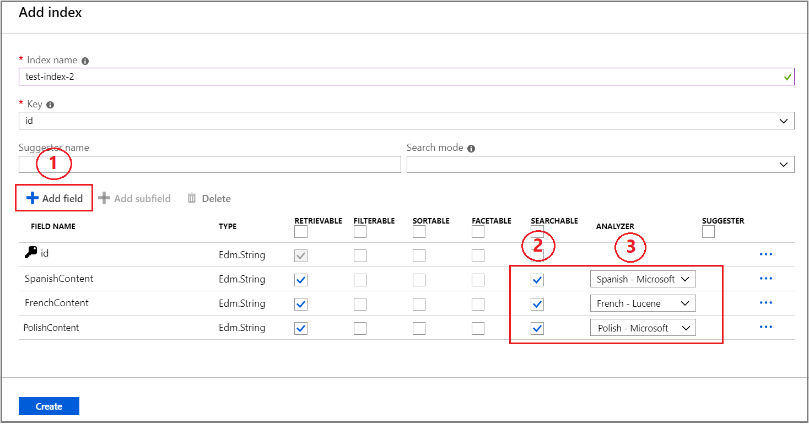

# How to create an index for multiple languages in Azure Cognitive Search

Indexes can include fields containing content from multiple languages, for example, creating individual fields for language-specific strings. For best results during indexing and querying, assign a language analyzer that provides the appropriate linguistic rules. 

Azure Cognitive Search offers a large selection of language analyzers from both Lucene and Microsoft that can be assigned to individual fields using the Analyzer property. You can also specify a language analyzer in the portal, as described in this article.

## Add analyzers to fields

A language analyzer is specified when a field is created. Adding an analyzer to an existing field definition requires overwriting (and reloading) the index, or creating a new field identical to the original, but with an analyzer assignment. You could then delete the unused field at your convenience.

1. Sign in to the [Azure portal](https://portal.azure.com) and find your search service.
1. Click **Add index** in the command bar at the top of the service dashboard to start a new index, or open an existing index to set an analyzer on new fields you're adding to an existing index.
1. Start a field definition by providing a name.
1. Choose the Edm.String data type. Only string fields are full-text searchable.
1. Set the **Searchable** attribute to enable the Analyzer property. A field must be text-based in order to make use of a language analyzer.
1. Choose one of the available analyzers. 

By default, all searchable fields use the [Standard Lucene analyzer](https://lucene.apache.org/core/6_6_1/core/org/apache/lucene/analysis/standard/StandardAnalyzer.html) which is language-agnostic. To view the full list of supported analyzers, see [Add language analyzers to an Azure Cognitive Search index](index-add-language-analyzers.md).

In the portal, analyzers are intended to be used as-is. If you require customization or a specific configuration of filters and tokenizers, you should [create a custom analyzer](index-add-custom-analyzers.md) in code. The portal does not support selecting or configuring custom analyzers.

## Query language-specific fields

Once the language analyzer is selected for a field, it will be used with each indexing and search request for that field. When a query is issued against multiple fields using different analyzers, the query will be processed independently by the assigned analyzers for each field.

If the language of the agent issuing a query is known, a search request can be scoped to a specific field using the **searchFields** query parameter. The following query will be issued only against the description in Polish:

`https://[service name].search.windows.net/indexes/[index name]/docs?search=darmowy&searchFields=PolishContent&api-version=2020-06-30`

You can query your index from the portal, using [**Search explorer**](search-explorer.md) to paste in a query similar to the one shown above.

## Boost language-specific fields

Sometimes the language of the agent issuing a query is not known, in which case the query can be issued against all fields simultaneously. If needed, preference for results in a certain language can be defined using [scoring profiles](index-add-scoring-profiles.md). In the example below, matches found in the description in English will be scored higher relative to matches in Polish and French:

    "scoringProfiles": [
      {
        "name": "englishFirst",
        "text": {
          "weights": { "description_en": 2 }
        }
      }
    ]

`https://[service name].search.windows.net/indexes/[index name]/docs?search=Microsoft&scoringProfile=englishFirst&api-version=2020-06-30`

## Next steps

If you're a .NET developer, note that you can configure language analyzers using the [Azure Cognitive Search .NET SDK](https://www.nuget.org/packages/Microsoft.Azure.Search) and the [Analyzer](https://docs.microsoft.com/dotnet/api/microsoft.azure.search.models.analyzer?view=azure-dotnet) property. 