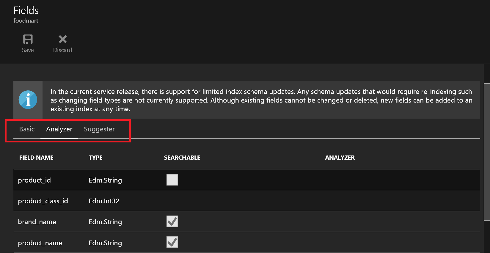

# Create an index for multiple languages in Azure Search

Language analyzers are used as-is, with no modifications, and are assigned to individual fields using the Analyzer property. You can also specify a language analyzer in the portal. 

You can only set a language analyzer when a field is created. Adding an analyzer to an existing field requires overwriting (and reloading) the index, or creating a new field identical to the original, but with an analyzer assignment. You could then delete the unused field at your convenience.

## Add analyzers to fields
1. Sign in to the [Azure portal](https://portal.azure.com) and find your search service.
1. Click **Add index** in the command bar at the top of the service dashboard to start a new index, or open an existing index to set an analyzer on new fields you're adding to an existing index.
1. Start a field definition by providing a name, choosing the data type, and setting attributes. Only **Searchable** fields can take a language analyzer.
1. Choose an available analyzer.

By default, all searchable fields use the [Standard Lucene analyzer](https://lucene.apache.org/core/4_10_0/analyzers-common/org/apache/lucene/analysis/standard/StandardAnalyzer.html) which is language-agnostic. To view the full list of supported analyzers, see [Add language analyzers to an Azure Search index](index-add-language-analyzers.md).

Once the language analyzer is selected for a field, it will be used with each indexing and search request for that field. When a query is issued against multiple fields using different analyzers, the query will be processed independently by the assigned analyzers for each field.

Many web and mobile applications serve users around the globe using different languages. It’s possible to define an index for a scenario like this by creating a field for each language supported.

If the language of the agent issuing a query is known, a search request can be scoped to a specific field using the **searchFields** query parameter. The following query will be issued only against the description in Polish:

`https://[service name].search.windows.net/indexes/[index name]/docs?search=darmowy&searchFields=PolishContent&api-version=2019-05-06`

You can query your index from the portal, using [**Search explorer**](search-explorer.md) to paste in a query similar to the one shown above.

Sometimes the language of the agent issuing a query is not known, in which case the query can be issued against all fields simultaneously. If needed, preference for results in a certain language can be defined using [scoring profiles](index-add-scoring-profiles.md). In the example below, matches found in the description in English will be scored higher relative to matches in Polish and French:

    "scoringProfiles": [
      {
        "name": "englishFirst",
        "text": {
          "weights": { "description_en": 2 }
        }
      }
    ]

`https://[service name].search.windows.net/indexes/[index name]/docs?search=Microsoft&scoringProfile=englishFirst&api-version=2019-05-06`

## Next steps

If you're a .NET developer, note that you can configure language analyzers using the [Azure Search .NET SDK](https://www.nuget.org/packages/Microsoft.Azure.Search). 