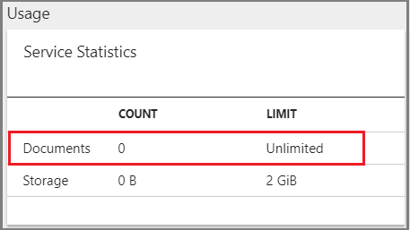

# Service limits in Azure Search
Maximum limits on storage, workloads, and quantities of indexes, documents, and other objects depend on whether you [provision Azure Search](search-create-service-portal.md) at **Free**, **Basic**, **Standard**, or **Storage Optimized** pricing tiers.

+ **Free** is a multi-tenant shared service that comes with your Azure subscription.

+ **Basic** provides dedicated computing resources for production workloads at a smaller scale.

+ **Standard** runs on dedicated machines with more storage and processing capacity at every level. Standard comes in four levels: S1, S2, S3, and S3 HD.

+ **Storage Optimized** runs on dedicated machines with more total storage, storage bandwidth, and memory than **Standard**. Storage Optimized comes in two levels: L1 and L2

> [!NOTE]
> As of July 1, all tiers are generally available, including the Storage Optimized tier. All pricing can be found on the [Pricing Details](https://azure.microsoft.com/pricing/details/search/) page.

  S3 High Density (S3 HD) is engineered for specific workloads: [multi-tenancy](search-modeling-multitenant-saas-applications.md) and large quantities of small indexes (one million documents per index, three thousand indexes per service). This tier does not provide the [indexer feature](search-indexer-overview.md). On S3 HD, data ingestion must leverage the push approach, using API calls to push data from source to index. 

> [!NOTE]
> A service is provisioned at a specific tier. Jumping tiers to gain capacity involves provisioning a new service (there is no in-place upgrade). For more information, see [Choose a SKU or tier](search-sku-tier.md). To learn more about adjusting capacity within a service you've already provisioned, see [Scale resource levels for query and indexing workloads](search-capacity-planning.md).
>

## Subscription limits
[!INCLUDE [azure-search-limits-per-subscription](../../includes/azure-search-limits-per-subscription.md)]

## Storage limits
[!INCLUDE [azure-search-limits-per-service](../../includes/azure-search-limits-per-service.md)]

## Index limits

| Resource | Free | Basic&nbsp;1  | S1 | S2 | S3 | S3&nbsp;HD | L1 | L2 |
| -------- | ---- | ------------------- | --- | --- | --- | --- | --- | --- |
| Maximum indexes |3 |5 or 15 |50 |200 |200 |1000 per partition or 3000 per service |10 |10 |
| Maximum simple fields per index |1000 |100 |1000 |1000 |1000 |1000 |1000 |1000 |
| Maximum complex collection fields per index |40 |40 |40 |40 |40 |40 |40 |40 |
| Maximum elements across all complex collections per document |3000 |3000 |3000 |3000 |3000 |3000 |3000 |3000 |
| Maximum depth of complex fields |10 |10 |10 |10 |10 |10 |10 |10 |
| Maximum [suggesters](https://docs.microsoft.com/rest/api/searchservice/suggesters) per index |1 |1 |1 |1 |1 |1 |1 |1 |
| Maximum [scoring profiles](https://docs.microsoft.com/rest/api/searchservice/add-scoring-profiles-to-a-search-index) per index |100 |100 |100 |100 |100 |100 |100 |100 |
| Maximum functions per profile |8 |8 |8 |8 |8 |8 |8 |8 |

1 Basic services created before December 2017 have lower limits (5 instead of 15) on indexes. Basic tier is the only SKU with a lower limit of 100 fields per index.

## Document limits 

As of October 2018, there are no longer any document limits for any new service created at any billable tier (Basic, S1, S2, S3, S3 HD) in any region. While most regions have had unlimited document counts since November/December 2017, there were five regions that continued to impose document limits. Depending on when and where you created a search service, you might be running a service that is still subject to document limits.

To determine whether your service has document limits, check the Usage tile in the overview page of your service. Document counts are either unlimited, or subject to a limit based on tier.

  

### Regions previously having document limits

If the portal indicates a document limit, your service was either created before late 2017, or it was created on a data center using lower-capacity clusters for hosting Azure Search services:

+ Australia East
+ East Asia
+ Central India
+ Japan West
+ West Central US

For services subject to document limits, the following maximum limits apply:

|  Free | Basic | S1 | S2 | S3 | S3&nbsp;HD |
|-------|-------|----|----|----|-------|
|  10,000 |1&nbsp;million |15 million per partition or 180 million per service |60 million per partition or 720 million per service |120 million per partition or 1.4 billion per service |1 million per index or 200 million per partition |

If your service has limits that are blocking you, create a new service and then republish all content to that service. There is no mechanism for seamlessly reprovisioning your service onto new hardware behind the scenes.

> [!Note] 
> For S3 High Density services created after late 2017, the 200 million document per partition has been removed but the 1 million document per index limit remains.

### Document size limits per API call

The maximum document size when calling an Index API is approximately 16 megabytes.

Document size is actually a limit on the size of the Index API request body. Since you can pass a batch of multiple documents to the Index API at once, the size limit realistically depends on how many documents are in the batch. For a batch with a single document, the maximum document size is 16 MB of JSON.

To keep document size down, remember to exclude non-queryable data from the request. Images and other binary data are not directly queryable and shouldn't be stored in the index. To integrate non-queryable data into search results, define a non-searchable field that stores a URL reference to the resource.

## Indexer limits

Maximum running times exist to provide balance and stability to the service as a whole, but larger data sets might need more indexing time than the maximum allows. If an indexing job cannot complete within the maximum time allowed, try running it on a schedule. The scheduler keeps track of indexing status. If a scheduled indexing job is interrupted for any reason, the indexer can pick up where it last left off at the next scheduled run.

| Resource | Free&nbsp;1 | Basic&nbsp;2| S1 | S2 | S3 | S3&nbsp;HD&nbsp;3|L1 |L2 |
| -------- | ----------------- | ----------------- | --- | --- | --- | --- | --- | --- |
| Maximum indexers |3 |5 or 15|50 |200 |200 |N/A |10 |10 |
| Maximum datasources |3 |5 or 15 |50 |200 |200 |N/A |10 |10 |
| Maximum skillsets 4 |3 |5 or 15 |50 |200 |200 |N/A |10 |10 |
| Maximum indexing load per invocation |10,000 documents |Limited only by maximum documents |Limited only by maximum documents |Limited only by maximum documents |Limited only by maximum documents |N/A |No limit |No limit |
| Minimum schedule | 5 minutes |5 minutes |5 minutes |5 minutes |5 minutes |5 minutes |5 minutes | 5 minutes |
| Maximum running time 5 | 1-3 minutes |24 hours |24 hours |24 hours |24 hours |N/A  |24 hours |24 hours |
| Maximum running time for cognitive search skillsets or blob indexing with image analysis 5 | 3-10 minutes |2 hours |2 hours |2 hours |2 hours |N/A  |2 hours |2 hours |
| Blob indexer: maximum blob size, MB |16 |16 |128 |256 |256 |N/A  |256 |256 |
| Blob indexer: maximum characters of content extracted from a blob |32,000 |64,000 |4&nbsp;million |4&nbsp;million |4&nbsp;million |N/A |4&nbsp;million |4&nbsp;million |

1 Free services have indexer maximum execution time of 3 minutes for blob sources and 1 minute for all other data sources. For AI indexing that calls into Cognitive Services, free services are limited to 20 free transactions per day, where a transaction is defined as a document that successfully passes through the enrichment pipeline.

2 Basic services created before December 2017 have lower limits (5 instead of 15) on indexers, data sources, and skillsets.

3 S3 HD services do not include indexer support.

4 Maximum of 30 skills per skillset.

5 Cognitive search workloads and image analysis in Azure blob indexing have shorter running times than regular text indexing. Image analysis and natural language processing are computationally intensive and consume disproportionate amounts of available processing power. Running time was reduced to give other jobs in the queue an opportunity to run.  

## Queries per second (QPS)

QPS estimates must be developed independently by every customer. Index size and complexity, query size and complexity, and the amount of traffic are primary determinants of QPS. There is no way to offer meaningful estimates when such factors are unknown.

Estimates are more predictable when calculated on services running on dedicated resources (Basic and Standard tiers). You can estimate QPS more closely because you have control over more of the parameters. For guidance on how to approach estimation, see [Azure Search performance and optimization](search-performance-optimization.md).

For the Storage Optimized tiers,  you should expect a lower query throughput and higher latency than the Standard tiers.  The methodology for estimating the query performance you'll experience is the same as the Standard tiers.

## Data limits (cognitive search)

A [cognitive search pipeline](cognitive-search-concept-intro.md) that makes calls to a Text Analytics resource for [entity recognition](cognitive-search-skill-entity-recognition.md), [key phrase extraction](cognitive-search-skill-keyphrases.md), [sentiment analysis](cognitive-search-skill-sentiment.md), and [language detection](cognitive-search-skill-language-detection.md) is subject to data limits. The maximum size of a record should be 50,000 characters as measured by `String.Length`. If you need to break up your data before sending it to the sentiment analyzer, use the [Text Split skill](cognitive-search-skill-textsplit.md).

## API request limits
* Maximum of 16 MB per request 1
* Maximum 8 KB URL length
* Maximum 1000 documents per batch of index uploads, merges, or deletes
* Maximum 32 fields in $orderby clause
* Maximum search term size is 32,766 bytes (32 KB minus 2 bytes) of UTF-8 encoded text

1 In Azure Search, the body of a request is subject to an upper limit of 16 MB, imposing a practical limit on the contents of individual fields or collections that are not otherwise constrained by theoretical limits (see [Supported data types](https://docs.microsoft.com/rest/api/searchservice/supported-data-types) for more information about field composition and restrictions).

## API response limits
* Maximum 1000 documents returned per page of search results
* Maximum 100 suggestions returned per Suggest API request

## API key limits
API keys are used for service authentication. There are two types. Admin keys are specified in the request header and grant full read-write access to the service. Query keys are read-only, specified on the URL, and typically distributed to client applications.

* Maximum of 2 admin keys per service
* Maximum of 50 query keys per service
