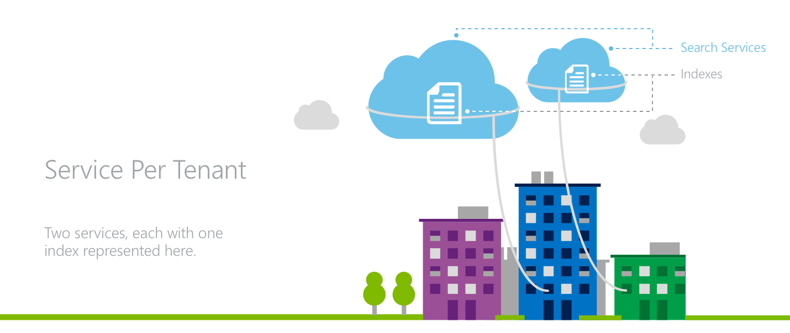

# Design patterns for multitenant SaaS applications and Azure Cognitive Search
A multitenant application is one that provides the same services and capabilities to any number of tenants who cannot see or share the data of any other tenant. This document discusses tenant isolation strategies for multitenant applications built with Azure Cognitive Search.

## Azure Cognitive Search concepts
As a search-as-a-service solution, Azure Cognitive Search allows developers to add rich search experiences to applications without managing any infrastructure or becoming an expert in information retrieval. Data is uploaded to the service and then stored in the cloud. Using simple requests to the Azure Cognitive Search API, the data can then be modified and searched. An overview of the service can be found in [this article](https://aka.ms/whatisazsearch). Before discussing design patterns, it is important to understand some concepts in Azure Cognitive Search.

### Search services, indexes, fields, and documents
When using Azure Cognitive Search, one subscribes to a *search service*. As data is uploaded to Azure Cognitive Search, it is stored in an *index* within the search service. There can be a number of indexes within a single service. To use the familiar concepts of databases, the search service can be likened to a database while the indexes within a service can be likened to tables within a database.

Each index within a search service has its own schema, which is defined by a number of customizable *fields*. Data is added to an Azure Cognitive Search index in the form of individual *documents*. Each document must be uploaded to a particular index and must fit that index's schema. When searching data using Azure Cognitive Search, the full-text search queries are issued against a particular index.  To compare these concepts to those of a database, fields can be likened to columns in a table and documents can be likened to rows.

### Scalability
Any Azure Cognitive Search service in the Standard [pricing tier](https://azure.microsoft.com/pricing/details/search/) can scale in two dimensions: storage and availability.

* *Partitions* can be added to increase the storage of a search service.
* *Replicas* can be added to a service to increase the throughput of requests that a search service can handle.

Adding and removing partitions and replicas at will allow the capacity of the search service to grow with the amount of data and traffic the application demands. In order for a search service to achieve a read [SLA](https://azure.microsoft.com/support/legal/sla/search/v1_0/), it requires two replicas. In order for a service to achieve a read-write [SLA](https://azure.microsoft.com/support/legal/sla/search/v1_0/), it requires three replicas.

### Service and index limits in Azure Cognitive Search
There are a few different [pricing tiers](https://azure.microsoft.com/pricing/details/search/) in Azure Cognitive Search, each of the tiers has different [limits and quotas](search-limits-quotas-capacity.md). Some of these limits are at the service-level, some are at the index-level, and some are at the partition-level.

|  | Basic | Standard1 | Standard2 | Standard3 | Standard3 HD |
| --- | --- | --- | --- | --- | --- |
| Maximum Replicas per Service |3 |12 |12 |12 |12 |
| Maximum Partitions per Service |1 |12 |12 |12 |3 |
| Maximum Search Units (Replicas*Partitions) per Service |3 |36 |36 |36 |36 (max 3 partitions) |
| Maximum Storage per Service |2 GB |300 GB |1.2 TB |2.4 TB |600 GB |
| Maximum Storage per Partition |2 GB |25 GB |100 GB |200 GB |200 GB |
| Maximum Indexes per Service |5 |50 |200 |200 |3000 (max 1000 indexes/partition) |

#### S3 High Density'
In Azure Cognitive Search’s S3 pricing tier, there is an option for the High Density (HD) mode designed specifically for multitenant scenarios. In many cases, it is necessary to support a large number of smaller tenants under a single service to achieve the benefits of simplicity and cost efficiency.

S3 HD allows for the many small indexes to be packed under the management of a single search service by trading the ability to scale out indexes using partitions for the ability to host more indexes in a single service.

An S3 service is designed to host a fixed number of indexes (maximum 200) and allow each index to scale in size horizontally as new partitions are added to the service. Adding partitions to S3 HD services increases the maximum number of indexes that the service can host. The ideal maximum size for an individual S3HD index is around 50 - 80 GB, although there is no hard size limit on each index imposed by the system.

## Considerations for multitenant applications
Multitenant applications must effectively distribute resources among the tenants while preserving some level of privacy between the various tenants. There are a few considerations when designing the architecture for such an application:

* *Tenant isolation:* Application developers need to take appropriate measures to ensure that no tenants have unauthorized or unwanted access to the data of other tenants. Beyond the perspective of data privacy, tenant isolation strategies require effective management of shared resources and protection from noisy neighbors.
* *Cloud resource cost:* As with any other application, software solutions must remain cost competitive as a component of a multitenant application.
* *Ease of Operations:* When developing a multitenant architecture, the impact on the application's operations and complexity is an important consideration. Azure Cognitive Search has a [99.9% SLA](https://azure.microsoft.com/support/legal/sla/search/v1_0/).
* *Global footprint:* Multitenant applications may need to effectively serve tenants which are distributed across the globe.
* *Scalability:* Application developers need to consider how they reconcile between maintaining a sufficiently low level of application complexity and designing the application to scale with number of tenants and the size of tenants' data and workload.

Azure Cognitive Search offers a few boundaries that can be used to isolate tenants’ data and workload.

## Modeling multitenancy with Azure Cognitive Search
In the case of a multitenant scenario, the application developer consumes one or more search services and divide their tenants among services, indexes, or both. Azure Cognitive Search has a few common patterns when modeling a multitenant scenario:

1. *Index per tenant:* Each tenant has its own index within a search service that is shared with other tenants.
2. *Service per tenant:* Each tenant has its own dedicated Azure Cognitive Search service, offering highest level of data and workload separation.
3. *Mix of both:* Larger, more-active tenants are assigned dedicated services while smaller tenants are assigned individual indexes within shared services.

## 1. Index per tenant

In an index-per-tenant model, multiple tenants occupy a single Azure Cognitive Search service where each tenant has their own index.

Tenants achieve data isolation because all search requests and document operations are issued at an index level in Azure Cognitive Search. In the application layer, there is the need awareness to direct the various tenants’ traffic to the proper indexes while also managing resources at the service level across all tenants.

A key attribute of the index-per-tenant model is the ability for the application developer to oversubscribe the capacity of a search service among the application’s tenants. If the tenants have an uneven distribution of workload, the optimal combination of tenants can be distributed across a search service’s indexes to accommodate a number of highly active, resource-intensive tenants while simultaneously serving a long tail of less active tenants. The trade-off is the inability of the model to handle situations where each tenant is concurrently highly active.

The index-per-tenant model provides the basis for a variable cost model, where an entire Azure Cognitive Search service is bought up-front and then subsequently filled with tenants. This allows for unused capacity to be designated for trials and free accounts.

For applications with a global footprint, the index-per-tenant model may not be the most efficient. If an application's tenants are distributed across the globe, a separate service may be necessary for each region which may duplicate costs across each of them.

Azure Cognitive Search allows for the scale of both the individual indexes and the total number of indexes to grow. If an appropriate pricing tier is chosen, partitions and replicas can be added to the entire search service when an individual index within the service grows too large in terms of storage or traffic.

If the total number of indexes grows too large for a single service, another service has to be provisioned to accommodate the new tenants. If indexes have to be moved between search services as new services are added, the data from the index has to be manually copied from one index to the other as Azure Cognitive Search does not allow for an index to be moved.

## 2. Service per tenant

In a service-per-tenant architecture, each tenant has its own search service.

In this model, the application achieves the maximum level of isolation for its tenants. Each service has dedicated storage and throughput for handling search request as well as separate API keys.

For applications where each tenant has a large footprint or the workload has little variability from tenant to tenant, the service-per-tenant model is an effective choice as resources are not shared across various tenants’ workloads.

A service per tenant model also offers the benefit of a predictable, fixed cost model. There is no up-front investment in an entire search service until there is a tenant to fill it, however the cost-per-tenant is higher than an index-per-tenant model.

The service-per-tenant model is an efficient choice for applications with a global footprint. With geographically-distributed tenants, it is easy to have each tenant's service in the appropriate region.

The challenges in scaling this pattern arise when individual tenants outgrow their service. Azure Cognitive Search does not currently support upgrading the pricing tier of a search service, so all data would have to be manually copied to a new service.

## 3. Mixing both models
Another pattern for modeling multitenancy is mixing both index-per-tenant and service-per-tenant strategies.

By mixing the two patterns, an application's largest tenants can occupy dedicated services while the long tail of less active, smaller tenants can occupy indexes in a shared service. This model ensures that the largest tenants have consistently high performance from the service while helping to protect the smaller tenants from any noisy neighbors.

However, implementing this strategy relies foresight in predicting which tenants will require a dedicated service versus an index in a shared service. Application complexity increases with the need to manage both of these multitenancy models.

## Achieving even finer granularity
The above design patterns to model multitenant scenarios in Azure Cognitive Search assume a uniform scope where each tenant is a whole instance of an application. However, applications can sometimes handle many smaller scopes.

If service-per-tenant and index-per-tenant models are not sufficiently small scopes, it is possible to model an index to achieve an even finer degree of granularity.

To have a single index behave differently for different client endpoints, a field can be added to an index which designates a certain value for each possible client. Each time a client calls Azure Cognitive Search to query or modify an index, the code from the client application specifies the appropriate value for that field using Azure Cognitive Search's [filter](https://msdn.microsoft.com/library/azure/dn798921.aspx) capability at query time.

This method can be used to achieve functionality of separate user accounts, separate permission levels, and even completely separate applications.

> [!NOTE]
> Using the approach described above to configure a single index to serve multiple tenants affects the relevance of search results. Search relevance scores are computed at an index-level scope, not a tenant-level scope, so all tenants' data is incorporated in the relevance scores' underlying statistics such as term frequency.
> 
> 

## Next steps
Azure Cognitive Search is a compelling choice for many applications. When evaluating the various design patterns for multitenant applications, consider the [various pricing tiers](https://azure.microsoft.com/pricing/details/search/) and the respective [service limits](search-limits-quotas-capacity.md) to best tailor Azure Cognitive Search to fit application workloads and architectures of all sizes.

Any questions about Azure Cognitive Search and multitenant scenarios can be directed to azuresearch_contact@microsoft.com.

