# Visualize Azure Cognitive Search Logs and Metrics with Power BI
[Azure Cognitive Search](./search-what-is-azure-search.md) allows you to store operation logs and service metrics about your search service in an Azure Storage account. This page provides instructions for how you can visualize that information through a Power BI Template App. The app provides detailed insights about your search service, including information about Search, Indexing, Operations, and Service metrics.

You can find the Power BI Template App **Azure Cognitive Search: Analyze Logs and Metrics** in the [Power BI Apps marketplace](https://appsource.microsoft.com/marketplace/apps).

## How to get started with the app

1. Enable metric and resource logging for your search service:

    1. Create or identify an existing [Azure Storage account](../storage/common/storage-account-create.md) where you can archive the logs
    1. Navigate to your Azure Cognitive Search service in the Azure portal
    1. Under the Monitoring section on the left column, select **Diagnostic settings**

        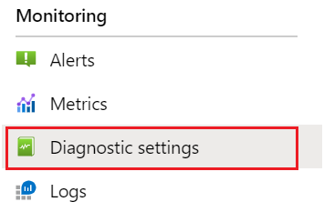

    1. Select **+ Add diagnostic setting**
    1. Check **Archive to a storage account**, provide your Storage account information, and check **OperationLogs** and **AllMetrics**

        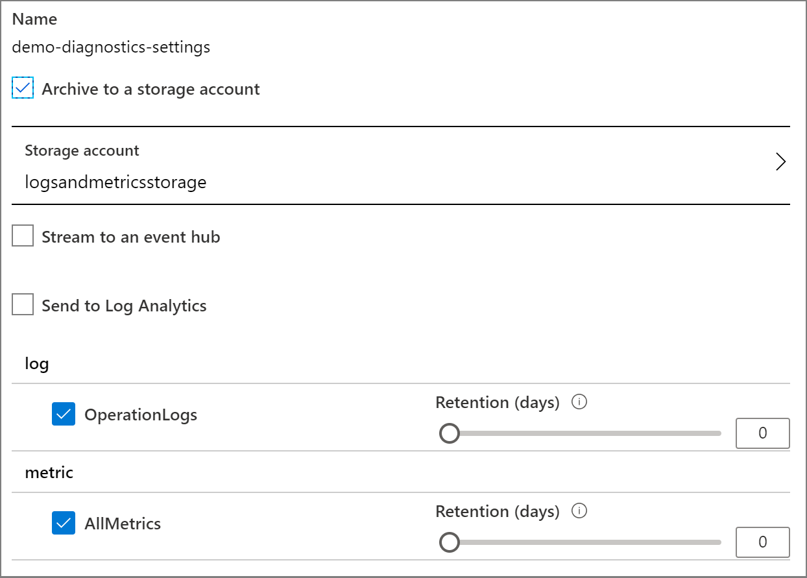
    1. Select **Save**

1. After logging has been enabled, use your search service to start generating logs and metrics. It takes up to an hour before the containers will appear in Blob storage with these logs. You will see a **insights-logs-operationlogs** container for search traffic logs and a **insights-metrics-pt1m** container for metrics.

1. Find the Azure Cognitive Search Power BI App in the [Power BI Apps marketplace](https://appsource.microsoft.com/marketplace/apps) and install it into a new workspace or an existing workspace. The app is called **Azure Cognitive Search: Analyze Logs and Metrics**.

1. After installing the app, select the app from your list of apps in Power BI.

    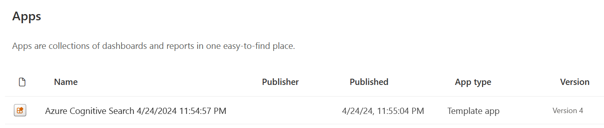

1. Select **Connect** to connect your data

    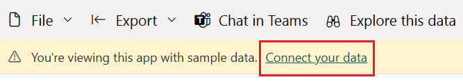

1. Input the name of the storage account that contains your logs and metrics. By default the app will look at the last 10 days of data but this value can be changed with the **Days** parameter.

    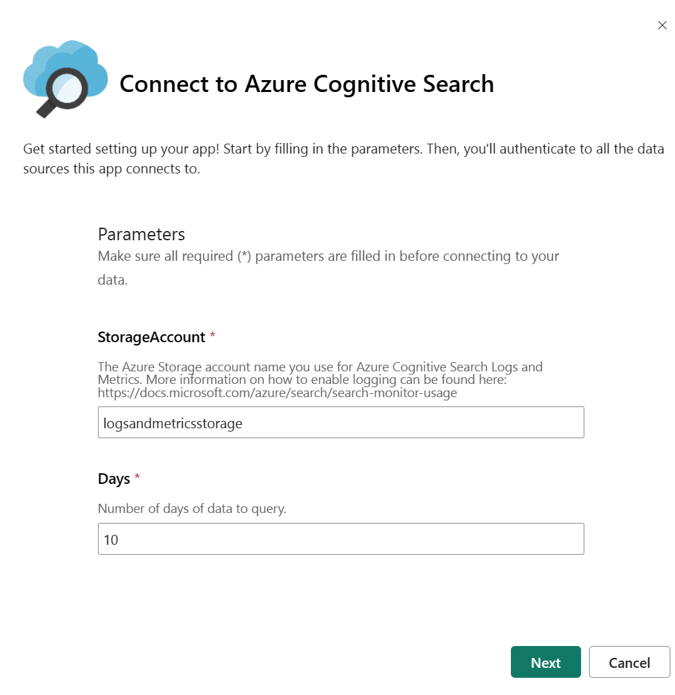

1. Select **Key** as the authentication method and provide your storage account key. Select **Private** as the privacy level. Click Sign In and to begin the loading process.

    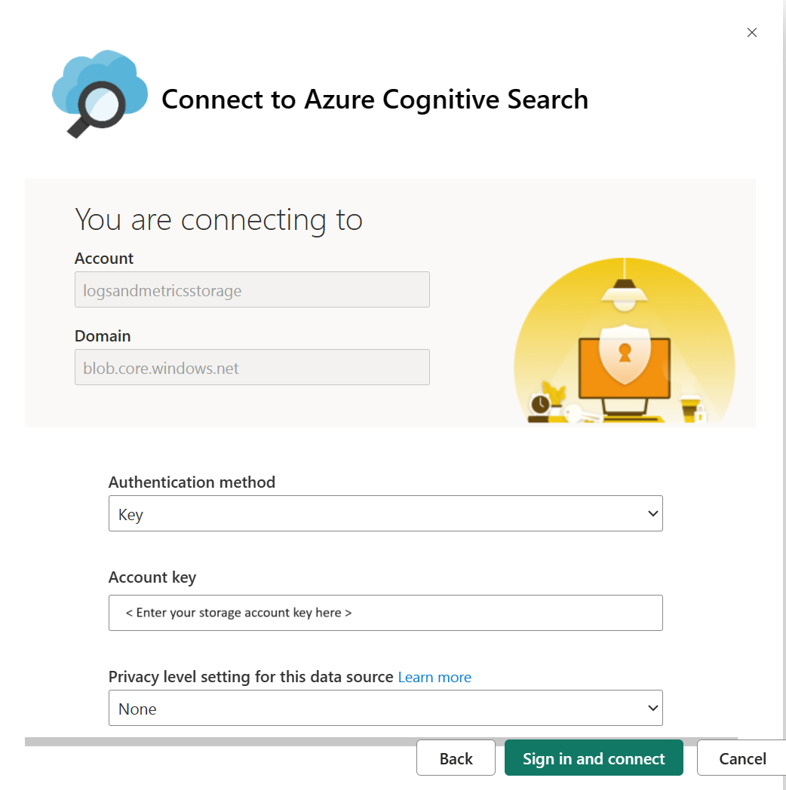

1. Wait for the data to refresh. This may take some time depending on how much data you have. You can see if the data is still being refreshed based on the below indicator.

    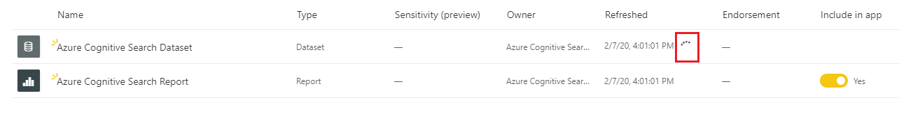

1. Once the data refresh has completed, select **Azure Cognitive Search Report** to view the report.

    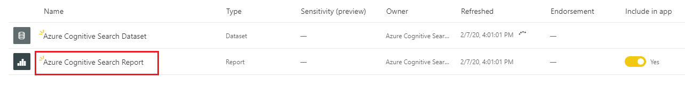

1. Make sure to refresh the page after opening the report so that it opens with your data.

    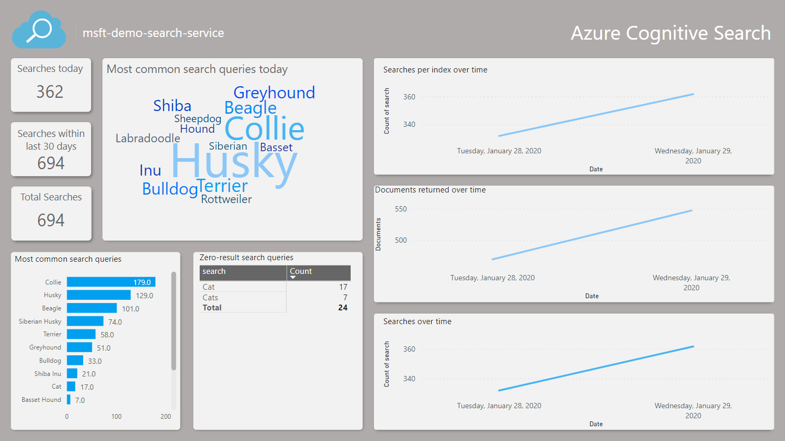

## How to change the app parameters
If you would like to visualize data from a different storage account or change the number of days of data to query, follow the below steps to change the **Days** and **StorageAccount** parameters.

1. Navigate to your Power BI apps, find your Azure Cognitive Search app and select the **Edit app** button to view the workspace.

    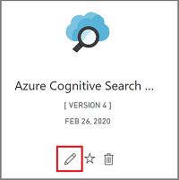

1. Select **Settings** from the Dataset options.

    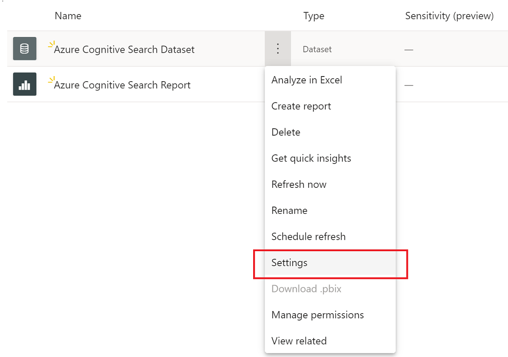

1. While in the Datasets tab, change the parameter values and select **Apply**. If there is an issue with the connection, update the data source credentials on the same page.

1. Navigate back to the workspace and select **Refresh now** from the Dataset options.

    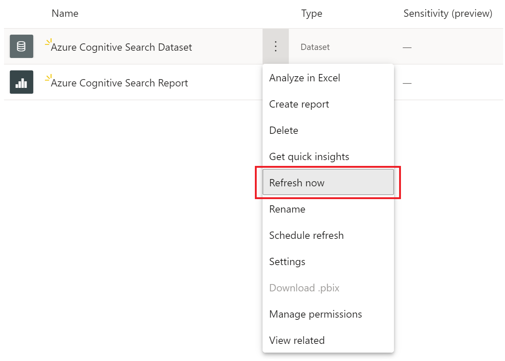

1. Open the report to view the updated data. You might also need to refresh the report to view the latest data.

## Troubleshooting
If you find that you cannot see your data follow these troubleshooting steps:

1. Open the report and refresh the page to make sure you're viewing the latest data. There's an option in the report to refresh the data. Select this to get the latest data.

1. Ensure the storage account name and access key you provided are correct. The storage account name should correspond to the account configured with your search service logs.

1. Confirm that your storage account contains the  containers **insights-logs-operationlogs** and **insights-metrics-pt1m** and each container has data. The logs and metrics will be within a couple layers of folders.

1. Check to see if the dataset is still refreshing. The refresh status indicator is shown in step 8 above. If it is still refreshing, wait until the refresh is complete to open and refresh the report.

## Next steps
[Learn more about Azure Cognitive Search](./index.yml)

[What is Power BI?](/power-bi/fundamentals/power-bi-overview)

[Basic concepts for designers in the Power BI service](/power-bi/service-basic-concepts)