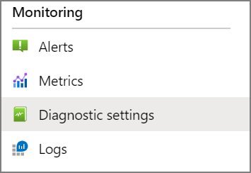
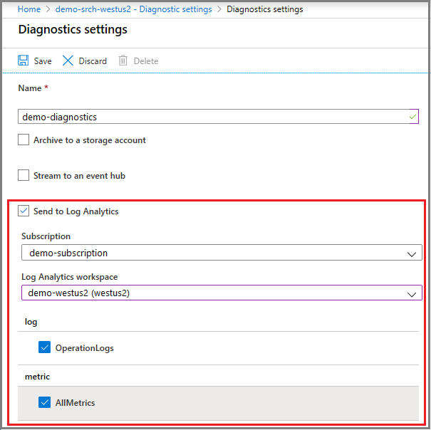
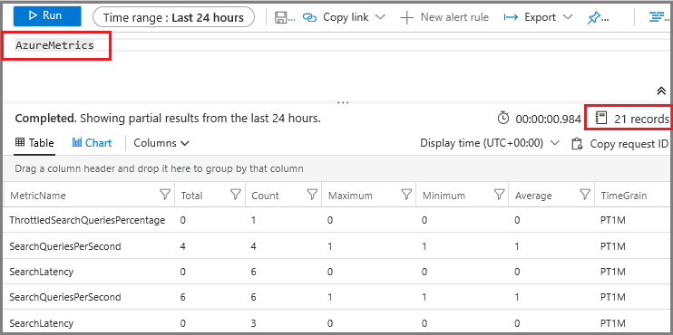
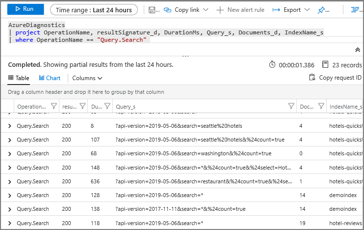

# Collect and analyze log data for Azure Cognitive Search

Diagnostic or operational logs provide insight into the detailed operations of Azure Cognitive Search and are useful for monitoring service and workload processes. Internally, some system information exists on the backend for a short period of time, sufficient for investigation and analysis if you file a support ticket. However, if you want self-direction over operational data, you should configure a diagnostic setting to specify where logging information is collected.

Diagnostic logging is enabled through integration with [Azure Monitor](https://docs.microsoft.com/azure/azure-monitor/). 

When you set up diagnostic logging, you will be asked to specify a storage mechanism. The following table enumerates options for collecting and persisting data.

| Resource | Used for |
|----------|----------|
| [Send to Log Analytics workspace](https://docs.microsoft.com/azure/azure-monitor/learn/tutorial-resource-logs) | Events and metrics are sent to a Log Analytics workspace, which can be queried in the portal to return detailed information. For an introduction, see [Get started with Azure Monitor logs](https://docs.microsoft.com/azure/azure-monitor/learn/tutorial-viewdata) |
| [Archive with Blob storage](https://docs.microsoft.com/azure/storage/blobs/storage-blobs-overview) | Events and metrics are archived to a Blob container and stored in JSON files. Logs can be quite granular (by the hour/minute), useful for researching a specific incident but not for open-ended investigation. Use a JSON editor to view a raw log file or Power BI to aggregate and visualize log data.|
| [Stream to Event Hub](https://docs.microsoft.com/azure/event-hubs/) | Events and metrics are streamed to an Azure Event Hubs service. Choose this as an alternative data collection service for very large logs. |

## Prerequisites

Create resources in advance so that you can select one or more when configuring diagnostic logging.

+ [Create a log analytics workspace](../azure-monitor/learn/quick-create-workspace.md)

+ [Create a storage account](../storage/common/storage-quickstart-create-account.md)

+ [Create an Event Hub](../event-hubs/event-hubs-create.md)

## Enable data collection

Diagnostic settings specify how logged events and metrics are collected.

1. Under **Monitoring**, select **Diagnostic settings**.

   

1. Select **+ Add diagnostic setting**

1. Check **Log Analytics**, select your workspace, and select **OperationLogs** and **AllMetrics**.

   

1. Save the setting.

1. After logging has been enabled, use your search service to start generating logs and metrics. It will take time before logged events and metrics become available.

For Log Analytics, it will be several minutes before data is available, after which you can run Kusto queries to return data. For more information, see [Monitor query requests](search-monitor-logs.md).

For Blob storage, it takes one hour before the containers will appear in Blob storage. There is one blob, per hour, per container. Containers are only created when there is an activity to log or measure. When the data is copied to a storage account, the data is formatted as JSON and placed in two containers:

+ insights-logs-operationlogs: for search traffic logs
+ insights-metrics-pt1m: for metrics

## Query log information

Two tables contain logs and metrics for Azure Cognitive Search: **AzureDiagnostics** and **AzureMetrics**.

1. Under **Monitoring**, select **Logs**.

1. Enter **AzureMetrics** in the query window. Run this simple query to get acquainted with the data collected in this table. Scroll across the table to view metrics and values. Notice the record count at the top, and if your service has been collecting metrics for a while, you might want to adjust the time interval to get a manageable data set.

   

1. Enter the following query to return a tabular result set.

   ```
   AzureMetrics
    | project MetricName, Total, Count, Maximum, Minimum, Average
   ```

1. Repeat the previous steps, starting with **AzureDiagnostics** to return all columns for informational purposes, followed by a more selective query that extracts more interesting information.

   ```
   AzureDiagnostics
   | project OperationName, resultSignature_d, DurationMs, Query_s, Documents_d, IndexName_s
   | where OperationName == "Query.Search" 
   ```

   

## Kusto query examples

If you enabled diagnostic logging, you can query **AzureDiagnostics** for a list of operations that ran on your service and when. You can also correlate activity to investigate changes in performance.

#### Example: List operations 

Return a list of operations and a count of each one.

```
AzureDiagnostics
| summarize count() by OperationName
```

#### Example: Correlate operations

Correlate query request with indexing operations, and render the data points across a time chart to see operations coincide.

```
AzureDiagnostics
| summarize OperationName, Count=count()
| where OperationName in ('Query.Search', 'Indexing.Index')
| summarize Count=count(), AvgLatency=avg(DurationMs) by bin(TimeGenerated, 1h), OperationName
| render timechart
```

## Logged operations

Logged events captured by Azure Monitor include those related to indexing and queries. The **AzureDiagnostics** table in Log Analytics collects operational data related to queries and indexing.

| OperationName | Description |
|---------------|-------------|
| ServiceStats | This operation is a routine call to [Get Service Statistics](https://docs.microsoft.com/rest/api/searchservice/get-service-statistics), either called directly or implicitly to populate a portal overview page when it is loaded or refreshed. |
| Query.Search |  Query requests against an index See [Monitor queries](search-monitor-queries.md) for information about logged queries.|
| Indexing.Index  | This operation is a call to [Add, Update or Delete Documents](https://docs.microsoft.com/rest/api/searchservice/addupdate-or-delete-documents). |
| indexes.Prototype | This is an index created by the Import Data wizard. |
| Indexers.Create | Create an indexer explicitly or implicitly through the Import Data wizard. |
| Indexers.Get | Returns the name of an indexer whenever the indexer is run. |
| Indexers.Status | Returns the status of an indexer whenever the indexer is run. |
| DataSources.Get | Returns the name of the data source whenever an indexer is run.|
| Indexes.Get | Returns the name of an index whenever an indexer is run. |

## Log schema

If you are building custom reports, the data structures that contain Azure Cognitive Search log data conform to the schema below. For Blob storage, each blob has one root object called **records** containing an array of log objects. Each blob contains records for all the operations that took place during the same hour.

The following table is a partial list of fields common to resource logging.

| Name | Type | Example | Notes |
| --- | --- | --- | --- |
| timeGenerated |datetime |"2018-12-07T00:00:43.6872559Z" |Timestamp of the operation |
| resourceId |string |"/SUBSCRIPTIONS/11111111-1111-1111-1111-111111111111/<br/>RESOURCEGROUPS/DEFAULT/PROVIDERS/<br/> MICROSOFT.SEARCH/SEARCHSERVICES/SEARCHSERVICE" |Your ResourceId |
| operationName |string |"Query.Search" |The name of the operation |
| operationVersion |string |"2020-06-30" |The api-version used |
| category |string |"OperationLogs" |constant |
| resultType |string |"Success" |Possible values: Success or Failure |
| resultSignature |int |200 |HTTP result code |
| durationMS |int |50 |Duration of the operation in milliseconds |
| properties |object |see the following table |Object containing operation-specific data |

### Properties schema

The properties below are specific to Azure Cognitive Search.

| Name | Type | Example | Notes |
| --- | --- | --- | --- |
| Description_s |string |"GET /indexes('content')/docs" |The operation's endpoint |
| Documents_d |int |42 |Number of documents processed |
| IndexName_s |string |"test-index" |Name of the index associated with the operation |
| Query_s |string |"?search=AzureSearch&$count=true&api-version=2020-06-30" |The query parameters |

## Metrics schema

Metrics are captured for query requests and measured in one minute intervals. Every metric exposes minimum, maximum and average values per minute. For more information, see [Monitor query requests](search-monitor-queries.md).

| Name | Type | Example | Notes |
| --- | --- | --- | --- |
| resourceId |string |"/SUBSCRIPTIONS/11111111-1111-1111-1111-111111111111/<br/>RESOURCEGROUPS/DEFAULT/PROVIDERS/<br/>MICROSOFT.SEARCH/SEARCHSERVICES/SEARCHSERVICE" |your resource ID |
| metricName |string |"Latency" |the name of the metric |
| time |datetime |"2018-12-07T00:00:43.6872559Z" |the operation's timestamp |
| average |int |64 |The average value of the raw samples in the metric time interval, units in seconds or percentage, depending on the metric. |
| minimum |int |37 |The minimum value of the raw samples in the metric time interval, units in seconds. |
| maximum |int |78 |The maximum value of the raw samples in the metric time interval, units in seconds.  |
| total |int |258 |The total value of the raw samples in the metric time interval, units in seconds.  |
| count |int |4 |The number of metrics emitted from a node to the log within the one minute interval.  |
| timegrain |string |"PT1M" |The time grain of the metric in ISO 8601. |

It's common for queries to execute in milliseconds, so only queries that measure as seconds will appear in metric like QPS.

For the **Search Queries Per Second** metric, minimum is the lowest value for search queries per second that was registered during that minute. The same applies to the maximum value. Average, is the aggregate across the entire minute. For example, within one minute, you might have a pattern like this: one second of high load that is the maximum for SearchQueriesPerSecond, followed by 58 seconds of average load, and finally one second with only one query, which is the minimum.

For **Throttled Search Queries Percentage**, minimum, maximum, average and total, all have the same value: the percentage of search queries that were throttled, from the total number of search queries during one minute.

## View raw log files

Blob storage is used for archiving log files. You can use any JSON editor to view the log file. If you don't have one, we recommend [Visual Studio Code](https://code.visualstudio.com/download).

1. In Azure portal, open your Storage account. 

2. In the left-navigation pane, click **Blobs**. You should see **insights-logs-operationlogs** and **insights-metrics-pt1m**. These containers are created by Azure Cognitive Search when the log data is exported to Blob storage.

3. Click down the folder hierarchy until you reach the .json file.  Use the context-menu to download the file.

Once the file is downloaded, open it in a JSON editor to view the contents.

## Next steps

If you haven't done so already, review the fundamentals of search service monitoring to learn about the full range of oversight capabilities.

> [!div class="nextstepaction"]
> [Monitor operations and activity in Azure Cognitive Search](search-monitor-usage.md)