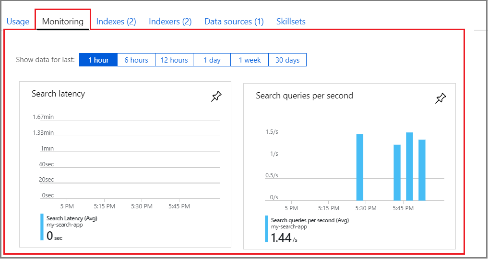
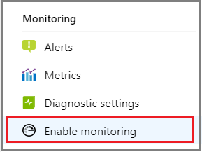
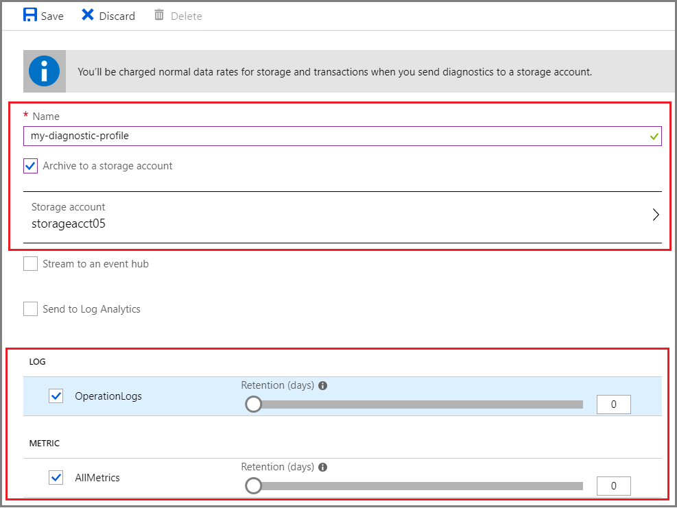

# Monitor resource consumption and query activity in Azure Search

In the Overview page of your Azure Search service, you can view system data about resource usage, query metrics, and how much quota is available to create more indexes, indexers, and data sources. You can also use the portal to configure log analytics or another resource used for persistent data collection. 

Setting up logs is useful for self-diagnostics and preserving operational history. Internally, logs exist on the backend for a short period of time, sufficient for investigation and analysis if you file a support ticket. If you want control over and access to log information, you should set up one of the solutions described in this article.

In this article, learn about your monitoring options, how to enable logging and log storage, and how to view log contents.

## Metrics at a glance

**Usage** and **Monitoring** sections built into the Overview page report out on resource consumption and query execution metrics. This information becomes available as soon as you start using the service, with no configuration required. This page is refreshed every few minutes. If you are finalizing decisions about [which tier to use for production workloads](search-sku-tier.md), or whether to [adjust the number of active replicas and partitions](search-capacity-planning.md), these metrics can help you with those decisions by showing you how quickly resources are consumed and how well the current configuration handles the existing load.

The **Usage** tab shows you resource availability relative to current [limits](search-limits-quotas-capacity.md). The following illustration is for the free service, which is capped at 3 objects of each type and 50 MB of storage. A Basic or Standard service has higher limits, and if you increase the partition counts, maximum storage goes up proportionally.


## Queries per second (QPS) and other metrics

The **Monitoring** tab shows moving averages for metrics like search *Queries Per Second* (QPS), aggregated per minute. 
*Search latency* is the amount of time the search service needed to process search queries, aggregated per minute. *Throttled search queries percentage* (not shown) is the percentage of search queries that were throttled, also aggregated per minute.

These numbers are approximate and are intended to give you a general idea of how well your system is servicing requests. Actual QPS may be higher or lower than the number reported in the portal.



## Activity logs

The **Activity log** collects information from Azure Resource Manager. Examples of information found in the Activity log include creating or deleting a service, updating a resource group, checking for name availability, or getting a service access key to handle a request. 

You can access the **Activity log** from the left-navigation pane, or from Notifications in the top window command bar, or from the **Diagnose and solve problems** page.

For in-service tasks like creating an index or deleting a data source, you'll see generic notifications like "Get Admin Key" for each request, but not the specific action itself. For this level of information, you must enable an add-on monitoring solution.

## Add-on monitoring solutions

Azure Search does not store any data beyond the objects it manages, which means log data has to be stored externally. You can configure any of the resources below if you want to persist log data. 

The following table compares options for storing logs and adding in-depth monitoring of service operations and query workloads through Application Insights.

| Resource | Used for |
|----------|----------|
| [Application Insights](https://docs.microsoft.com/azure/azure-monitor/app/app-insights-overview) | Logged events and query metrics, based on the schemas below, correlated with user events in your app. This is the only solution that takes user actions or signals into account, mapping events from user-initiated search, as opposed to filter requests submitted by application code. To use this approach, copy-paste instrumentation code into your source files to route request information to Application Insights. For more information, see [Search traffic analytics](search-traffic-analytics.md). |
| [Azure Monitor logs](https://docs.microsoft.com/azure/azure-monitor/log-query/log-query-overview) | Logged events and query metrics, based on the schemas below. Events are logged to a Log Analytics workspace. You can run queries against a workspace to return detailed information from the log. For more information, see [Get started with Azure Monitor logs](https://docs.microsoft.com/azure/azure-monitor/learn/tutorial-viewdata) |
| [Blob storage](https://docs.microsoft.com/azure/storage/blobs/storage-blobs-overview) | Logged events and query metrics, based on the schemas below. Events are logged to a Blob container and stored in JSON files. Use a JSON editor to view file contents.|
| [Event Hub](https://docs.microsoft.com/azure/event-hubs/) | Logged events and query metrics, based on the schemas documented in this article. Choose this as an alternative data collection service for very large logs. |

Both Azure Monitor logs and Blob storage are available as a Free shared service so that you can try it out at no charge for the lifetime of your Azure subscription. Application Insights is free to sign up and use as long as application data size is under certain limits (see the [pricing page](https://azure.microsoft.com/pricing/details/monitor/) for details).

The next section walks you through the steps of enabling and using Azure Blob storage to collect and access log data created by Azure Search operations.

## Enable logging

Logging for indexing and query workloads is off by default and depends on add-on solutions for both logging infrastructure and long-term external storage. By itself, the only persisted data in Azure Search are the objects it creates and manages, so logs must be stored elsewhere.

In this section, you'll learn how to use Blob storage to store logged events and metrics data.

1. [Create a storage account](https://docs.microsoft.com/azure/storage/common/storage-quickstart-create-account) if you don't already have one. You can place it in the same resource group as Azure Search to simplify clean up later if you want to delete all resources used in this exercise.

   Your storage account must exist in the same region as Azure Search.

2. Open your search service Overview page. In the left-navigation pane, scroll down to **Monitoring** and click **Enable Monitoring**.

   

3. Choose the data you want to export: Logs, Metrics or both. You can copy it to a storage account, send it to an event hub or export it to Azure Monitor logs.

   For archival to Blob storage, only the storage account must exist. Containers and blobs will be created as-needed when log data is exported.

   

4. Save the profile.

5. Test logging by creating or deleting objects (creates log events) and by submitting queries (generates metrics). 

Logging is enabled once you save the profile. Containers are only created when there is an activity to log or measure. When the data is copied to a storage account, the data is formatted as JSON and placed in two containers:

* insights-logs-operationlogs: for search traffic logs
* insights-metrics-pt1m: for metrics

**It takes one hour before the containers will appear in Blob storage. There is one blob, per hour, per container.**

You can use [Visual Studio Code](#download-and-open-in-visual-studio-code) or another JSON editor to view the files. 

### Example path

```
resourceId=/subscriptions/<subscriptionID>/resourcegroups/<resourceGroupName>/providers/microsoft.search/searchservices/<searchServiceName>/y=2018/m=12/d=25/h=01/m=00/name=PT1H.json
```

## Log schema
Blobs containing your search service traffic logs are structured as described in this section. Each blob has one root object called **records** containing an array of log objects. Each blob contains records for all the operations that took place during the same hour.

| Name | Type | Example | Notes |
| --- | --- | --- | --- |
| time |datetime |"2018-12-07T00:00:43.6872559Z" |Timestamp of the operation |
| resourceId |string |"/SUBSCRIPTIONS/11111111-1111-1111-1111-111111111111/<br/>RESOURCEGROUPS/DEFAULT/PROVIDERS/<br/> MICROSOFT.SEARCH/SEARCHSERVICES/SEARCHSERVICE" |Your ResourceId |
| operationName |string |"Query.Search" |The name of the operation |
| operationVersion |string |"2019-05-06" |The api-version used |
| category |string |"OperationLogs" |constant |
| resultType |string |"Success" |Possible values: Success or Failure |
| resultSignature |int |200 |HTTP result code |
| durationMS |int |50 |Duration of the operation in milliseconds |
| properties |object |see the following table |Object containing operation-specific data |

**Properties schema**

| Name | Type | Example | Notes |
| --- | --- | --- | --- |
| Description |string |"GET /indexes('content')/docs" |The operation's endpoint |
| Query |string |"?search=AzureSearch&$count=true&api-version=2019-05-06" |The query parameters |
| Documents |int |42 |Number of documents processed |
| IndexName |string |"testindex" |Name of the index associated with the operation |

## Metrics schema

Metrics are captured for query requests.

| Name | Type | Example | Notes |
| --- | --- | --- | --- |
| resourceId |string |"/SUBSCRIPTIONS/11111111-1111-1111-1111-111111111111/<br/>RESOURCEGROUPS/DEFAULT/PROVIDERS/<br/>MICROSOFT.SEARCH/SEARCHSERVICES/SEARCHSERVICE" |your resource id |
| metricName |string |"Latency" |the name of the metric |
| time |datetime |"2018-12-07T00:00:43.6872559Z" |the operation's timestamp |
| average |int |64 |The average value of the raw samples in the metric time interval |
| minimum |int |37 |The minimum value of the raw samples in the metric time interval |
| maximum |int |78 |The maximum value of the raw samples in the metric time interval |
| total |int |258 |The total value of the raw samples in the metric time interval |
| count |int |4 |The number of raw samples used to generate the metric |
| timegrain |string |"PT1M" |The time grain of the metric in ISO 8601 |

All metrics are reported in one-minute intervals. Every metric exposes minimum, maximum and average values per minute.

For the SearchQueriesPerSecond metric, minimum is the lowest value for search queries per second that was registered during that minute. The same applies to the maximum value. Average, is the aggregate across the entire minute.
Think about this scenario during one minute: one second of high load that is the maximum for SearchQueriesPerSecond, followed by 58 seconds of average load, and finally one second with only one query, which is the minimum.

For ThrottledSearchQueriesPercentage, minimum, maximum, average and total, all have the same value: the percentage of search queries that were throttled, from the total number of search queries during one minute.

## Download and open in Visual Studio Code

You can use any JSON editor to view the log file. If you don't have one, we recommend [Visual Studio Code](https://code.visualstudio.com/download).

1. In Azure portal, open your Storage account. 

2. In the left-navigation pane, click **Blobs**. You should see **insights-logs-operationlogs** and **insights-metrics-pt1m**. These containers are created by Azure Search when the log data is exported to Blob storage.

3. Click down the folder hierarchy until you reach the .json file.  Use the context-menu to download the file.

Once the file is downloaded, open it in a JSON editor to view the contents.

## Use system APIs
Both the Azure Search REST API and the .NET SDK provide programmatic access to service metrics, index and indexer information, and document counts.

* [Get Services Statistics](/rest/api/searchservice/get-service-statistics)
* [Get Index Statistics](/rest/api/searchservice/get-index-statistics)
* [Count Documents](/rest/api/searchservice/count-documents)
* [Get Indexer Status](/rest/api/searchservice/get-indexer-status)

To enable using PowerShell or the Azure CLI, see the documentation [here](https://docs.microsoft.com/azure/azure-monitor/platform/diagnostic-logs-overview).

## Next steps

[Manage your Search service on Microsoft Azure](search-manage.md) for more information on service administration and [Performance and optimization](search-performance-optimization.md) for tuning guidance.