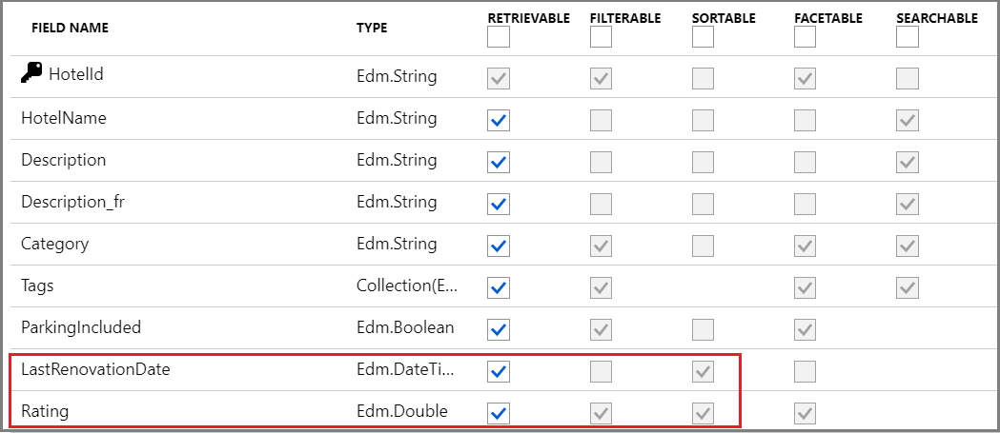

# Create a full-text query in Azure AI Search

If you're building a query for [full text search](search-lucene-query-architecture.md), this article provides steps for setting up the request. It also introduces a query structure, and explains how field attributes and linguistic analyzers can impact query outcomes.

## Prerequisites

+ A [search index](search-how-to-create-search-index.md) with string fields attributed as `searchable`.

+ Read permissions on the search index. For read access, include a [query API key](search-security-api-keys.md) on the request, or give the caller [Search Index Data Reader](search-security-rbac.md) permissions.

## Example of a full text query request

In Azure AI Search, a query is a read-only request against the docs collection of a single search index, with parameters that both inform query execution and shape the response coming back. 

A full text query is specified in a `search` parameter and consists of terms, quote-enclosed phrases, and operators. Other parameters add more definition to the request.

The following [Search POST REST API](/rest/api/searchservice/documents/search-post) call illustrates a query request using the aforementioned parameters.

```http
POST https://[service name].search.windows.net/indexes/hotels-sample-index/docs/search?api-version=2023-11-01
{
    "search": "NY +view",
    "queryType": "simple",
    "searchMode": "all",
    "searchFields": "HotelName, Description, Address/City, Address/StateProvince, Tags",
    "select": "HotelName, Description, Address/City, Address/StateProvince, Tags",
    "top": "10",
    "count": "true"
}
```

**Key points:**

+ **`search`** provides the match criteria, usually whole terms or phrases, with or without operators. Any field that is attributed as "searchable" in the index schema is a candidate for this parameter.

+ **`queryType`** sets the parser: `simple`, `full`. The [default simple query parser](search-query-simple-examples.md) is optimal for full text search. The [full Lucene query parser](search-query-lucene-examples.md) is for advanced query constructs like regular expressions, proximity search, fuzzy and wildcard search. This parameter can also be set to `semantic` for [semantic ranking](semantic-search-overview.md) for advanced semantic modeling on the query response.

+ **`searchMode`** specifies whether matches are based on "all" criteria (favors precision) or "any" criteria (favors recall) in the expression. The default is "any". If you anticipate heavy use of Boolean operators, which is more likely in indexes that contain large text blocks (a content field or long descriptions), be sure to test queries with the **`searchMode=Any|All`** parameter to evaluate the impact of that setting on boolean search.

+ **`searchFields`** constrains query execution to specific searchable fields. During development, it's helpful to use the same field list for select and search. Otherwise a match might be based on field values that you can't see in the results, creating uncertainty as to why the document was returned.

Parameters used to shape the response:

+ **`select`** specifies which fields to return in the response. Only fields marked as "retrievable" in the index can be used in a select statement.

+ **`top`** returns the specified number of best-matching documents. In this example, only 10 hits are returned. You can use top and skip (not shown) to page the results.

+ **`count`** tells you how many documents in the entire index match overall, which can be more than what are returned. 

+ **`orderby`** is used if you want to sort results by a value, such as a rating or location. Otherwise, the default is to use the relevance score to rank results. A  field must be attributed as "sortable" to be a candidate for this parameter.

## Choose a client

For early development and proof-of-concept testing, start with Azure portal or the Postman app for making REST API calls. These approaches are interactive, useful for targeted testing, and help you assess the effects of different properties without having to write any code.

To call search from within an app, use the **Azure.Document.Search** client libraries in the Azure SDKs for .NET, Java, JavaScript, and Python.

### [**Azure portal**](#tab/portal-text-query)

In the portal, when you open an index, you can work with Search Explorer alongside the index JSON definition in side-by-side tabs for easy access to field attributes. Check the **Fields** table to see which ones are searchable, sortable, filterable, and facetable while testing queries.

1. Sign in to the [Azure portal](https://portal.azure.com) and find your search service.

1. Open **Indexes** and select an index.

1. An index opens to the [**Search explorer**](search-explorer.md) tab so that you can query right away. Switch to **JSON view** to specify query syntax. 

   Here's a full text search query expression that works for the Hotels sample index:

   ```json
      {
          "search": "pool spa +airport",
          "queryType": "simple",
          "searchMode": "any",
          "searchFields": "Description, Tags",
          "select": "HotelName, Description, Tags",
          "top": 10,
          "count": true
      }
    ```

   The following screenshot illustrates the query and response:

   :::image type="content" source="media/search-explorer/search-explorer-full-text-query-hotels.png" alt-text="Screenshot of Search Explorer with a full text query.":::

### [**REST API**](#tab/rest-text-query)

[Postman app](https://www.postman.com/downloads/) is useful for working with the REST APIs, such as [Search Documents (REST)](/rest/api/searchservice/documents/search-post). 

[Quickstart: Create a search index using REST and Postman](search-get-started-rest.md) has step-by-step instructions for setting up requests.

The following example calls the REST API for full text search:

```http
POST https://[service name].search.windows.net/indexes/hotels-sample-index/docs/search?api-version=2023-11-01
{
    "search": "NY +view",
    "queryType": "simple",
    "searchMode": "all",
    "searchFields": "HotelName, Description, Address/City, Address/StateProvince, Tags",
    "select": "HotelName, Description, Address/City, Address/StateProvince, Tags",
    "count": true
}
```

### [**Azure SDKs**](#tab/sdk-text-query)

The following Azure SDKs provide a **SearchClient** that has methods for formulating query requests.

| Azure SDK | Client | Examples |
|-----------|--------|----------|
| .NET | [SearchClient](/dotnet/api/azure.search.documents.searchclient) | [DotNetHowTo](https://github.com/Azure-Samples/search-dotnet-getting-started/tree/master/DotNetHowTo) |
| Java | [SearchClient](/java/api/com.azure.search.documents.searchclient) | [SearchForDynamicDocumentsExample.java](https://github.com/Azure/azure-sdk-for-java/blob/azure-search-documents_11.1.3/sdk/search/azure-search-documents/src/samples/java/com/azure/search/documents/SearchForDynamicDocumentsExample.java) |
| JavaScript | [SearchClient](/javascript/api/@azure/search-documents/searchclient) | [SDK examples](/javascript/api/overview/azure/search-documents-readme?view=azure-node-latest#examples&preserve-view=true) |
| Python | [SearchClient](/python/api/azure-search-documents/azure.search.documents.searchclient) | [sample_simple_query.py ](https://github.com/Azure/azure-sdk-for-python/blob/7cd31ac01fed9c790cec71de438af9c45cb45821/sdk/search/azure-search-documents/samples/sample_simple_query.py) |

---

## Choose a query type: simple | full

If your query is full text search, a query parser is used to process any text that's passed as search terms and phrases. Azure AI Search offers two query parsers. 

+ The simple parser understands the [simple query syntax](query-simple-syntax.md). This parser was selected as the default for its speed and effectiveness in free form text queries. The syntax supports common search operators (AND, OR, NOT) for term and phrase searches, and prefix (`*`) search (as in "sea*" for Seattle and Seaside). A general recommendation is to try the simple parser first, and then move on to full parser if application requirements call for more powerful queries.

+ The [full Lucene query syntax](query-Lucene-syntax.md#bkmk_syntax), enabled when you add `queryType=full` to the request, is based on the [Apache Lucene Parser](https://lucene.apache.org/core/6_6_1/queryparser/org/apache/lucene/queryparser/classic/package-summary.html).

Full syntax and simple syntax overlap to the extent that both support the same prefix and boolean operations, but the full syntax provides more operators. In full, there are more operators for boolean expressions, and more operators for advanced queries such as fuzzy search, wildcard search, proximity search, and regular expressions.

## Choose query methods

Search is fundamentally a user-driven exercise, where terms or phrases are collected from a search box, or from click events on a page. The following table summarizes the mechanisms by which you can collect user input, along with the expected search experience.

| Input | Experience |
|-------|---------|
| [Search method](/rest/api/searchservice/search-documents) | A user types the terms or phrases into a search box, with or without operators, and clicks Search to send the request. Search can be used with filters on the same request, but not with autocomplete or suggestions. |
| [Autocomplete method](/rest/api/searchservice/autocomplete) | A user types a few characters, and queries are initiated after each new character is typed. The response is a completed string from the index. If the string provided is valid, the user clicks Search to send that query to the service. |
| [Suggestions method](/rest/api/searchservice/suggestions) | As with autocomplete, a user types a few characters and incremental queries are generated. The response is a dropdown list of matching documents, typically represented by a few unique or descriptive fields. If any of the selections are valid, the user clicks one and the matching document is returned. |
| [Faceted navigation](/rest/api/searchservice/search-documents#query-parameters) | A page shows clickable navigation links or breadcrumbs that narrow the scope of the search. A faceted navigation structure is composed dynamically based on an initial query. For example, `search=*` to populate a faceted navigation tree composed of every possible category. A faceted navigation structure is created from a query response, but it's also a mechanism for expressing the next query. n REST API reference, `facets` is documented as a query parameter of a Search Documents operation, but it can be used without the `search` parameter.|
| [Filter method](/rest/api/searchservice/search-documents#query-parameters) | Filters are used with facets to narrow results. You can also implement a filter behind the page, for example to initialize the page with language-specific fields. In REST API reference, `$filter` is documented as a query parameter of a Search Documents operation, but it can be used without the `search` parameter.|

## Effect of field attributes on queries

If you're familiar with [query types and composition](search-query-overview.md), you might remember that the parameters on a query request depend on field attributes in an index. For example, only fields marked as `searchable` and `retrievable` can be used in queries and search results. When setting the `search`, `filter`, and `orderby` parameters in your request, you should check attributes to avoid unexpected results.

In the portal screenshot below of the [hotels sample index](search-get-started-portal.md), only the last two fields "LastRenovationDate" and "Rating" are `sortable`, a requirement for use in an `"$orderby"` only clause.



For field attribute definitions, see [Create Index (REST API)](/rest/api/searchservice/create-index).

## Effect of tokens on queries

During indexing, the search engine uses a text analyzer on strings to maximize the potential for finding a match at query time. At a minimum, strings are lower-cased, but depending on the analyzer, might also undergo lemmatization and stop word removal. Larger strings or compound words are typically broken up by whitespace, hyphens, or dashes, and indexed as separate tokens. 

The point to take away here's that what you think your index contains, and what's actually in it, can be different. If queries don't return expected results, you can inspect the tokens created by the analyzer through the [Analyze Text (REST API)](/rest/api/searchservice/test-analyzer). For more information about tokenization and the impact on queries, see [Partial term search and patterns with special characters](search-query-partial-matching.md).

## Next steps

Now that you have a better understanding of how query requests work, try the following quickstarts for hands-on experience.

+ [Search explorer](search-explorer.md)
+ [Quickstart: Full text search using the Azure SDKs](search-get-started-text.md)
