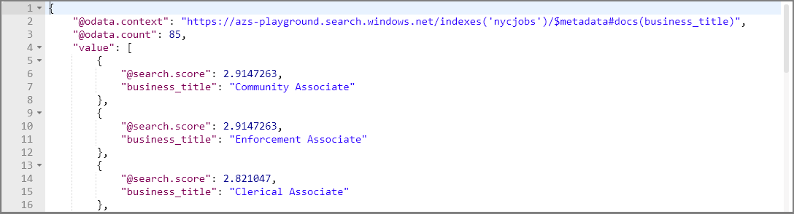
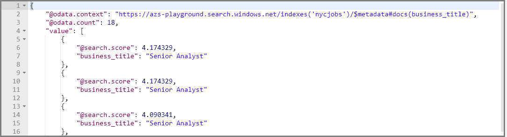
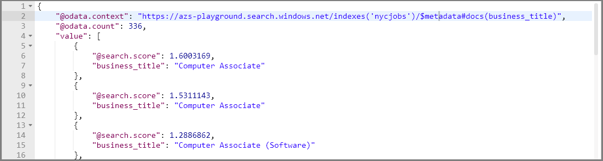
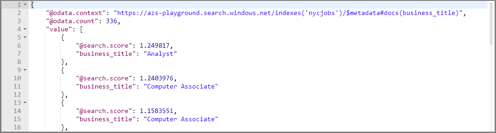
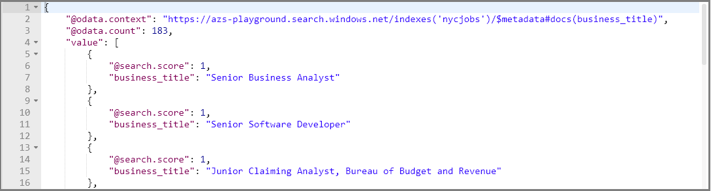
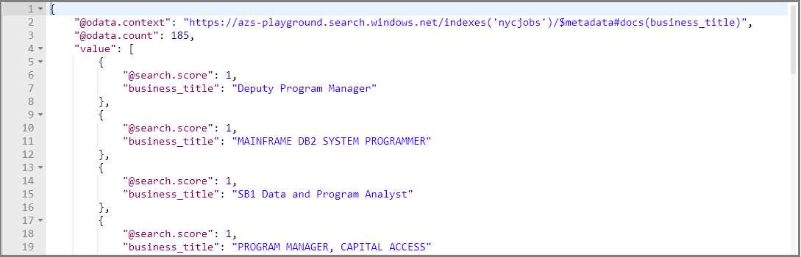

# Use the "full" Lucene search syntax (advanced queries in Azure Cognitive Search)

When constructing queries for Azure Cognitive Search, you can replace the default [simple query parser](query-simple-syntax.md) with the more expansive [Lucene Query Parser in Azure Cognitive Search](query-lucene-syntax.md) to formulate specialized and advanced query definitions. 

The Lucene parser supports complex query constructs, such as field-scoped queries, fuzzy search, infix and suffix wildcard search, proximity search, term boosting, and regular expression search. The additional power comes with additional processing requirements so you should expect a slightly longer execution time. In this article, you can step through examples demonstrating query operations available when using the full syntax.

> [!Note]
> Many of the specialized query constructions enabled through the full Lucene query syntax are not [text-analyzed](search-lucene-query-architecture.md#stage-2-lexical-analysis), which can be surprising if you expect stemming or lemmatization. Lexical analysis is only performed on complete terms (a term query or phrase query). Query types with incomplete terms (prefix query, wildcard query, regex query, fuzzy query) are added directly to the query tree, bypassing the analysis stage. The only transformation performed on partial query terms is lowercasing. 
>

## Formulate requests in Postman

The following examples leverage a NYC Jobs search index consisting of jobs available based on a dataset provided by the [City of New York OpenData](https://opendata.cityofnewyork.us/) initiative. This data should not be considered current or complete. The index is on a sandbox service provided by Microsoft, which means you do not need an Azure subscription or Azure Cognitive Search to try these queries.

What you do need is Postman or an equivalent tool for issuing HTTP request on GET. For more information, see [Explore with REST clients](search-get-started-postman.md).

### Set the request header

1. In the request header, set **Content-Type** to `application/json`.

2. Add an **api-key**, and set it to this string: `252044BE3886FE4A8E3BAA4F595114BB`. This is a query key for the sandbox search service hosting the NYC Jobs index.

After you specify the request header, you can reuse it for all of the queries in this article, swapping out only the **search=** string. 

  

### Set the request URL

Request is a GET command paired with a URL containing the Azure Cognitive Search endpoint and search string.

  

URL composition has the following elements:

+ **`https://azs-playground.search.windows.net/`** is a sandbox search service maintained by the Azure Cognitive Search development team. 
+ **`indexes/nycjobs/`** is the NYC Jobs index in the indexes collection of that service. Both the service name and index are required on the request.
+ **`docs`** is the documents collection containing all searchable content. The query api-key provided in the request header only works on read operations targeting the documents collection.
+ **`api-version=2019-05-06`** sets the api-version, which is a required parameter on every request.
+ **`search=*`** is the query string, which in the initial query is null, returning the first 50 results (by default).

## Send your first query

As a verification step, paste the following request into GET and click **Send**. Results are returned as verbose JSON documents. Entire documents are returned, which allows you to see all fields and all values.

Paste this URL into a REST client as a validation step and to view document structure.

  ```http
  https://azs-playground.search.windows.net/indexes/nycjobs/docs?api-version=2019-05-06&$count=true&search=*
  ```

The query string, **`search=*`**, is an unspecified search equivalent to null or empty search. It's the simplest search you can do.

Optionally, you can add **`$count=true`** to the URL to return a count of the documents matching the search criteria. On an empty search string, this is all the documents in the index (about 2800 in the case of NYC Jobs).

## How to invoke full Lucene parsing

Add **queryType=full** to invoke the full query syntax, overriding the default simple query syntax. 

```GET
https://azs-playground.search.windows.net/indexes/nycjobs/docs?api-version=2019-05-06&queryType=full&search=*
```

All of the examples in this article specify the **queryType=full** search parameter, indicating that the full syntax is handled by the Lucene Query Parser. 

## Example 1: Query scoped to a list of fields

This first example is not Lucene-specific, but we lead with it to introduce the first fundamental query concept: field scope. This example scopes the entire query and the response to just a few specific fields. Knowing how to structure a readable JSON response is important when your tool is Postman or Search explorer. 

For brevity, the query targets only the *business_title* field and specifies only business titles are returned. The **searchFields** parameter restricts query execution to just the business_title field, and **select** specifies which fields are included in the response.

### Search expression

```http
&search=*&searchFields=business_title&$select=business_title
```

Here is the same query with multiple fields in a comma-delimited list.

```http
search=*&searchFields=business_title, posting_type&$select=business_title, posting_type
```

The spaces after the commas are optional.

> [!Tip]
> When using the REST API from your application code, don't forget to URL-encode parameters like `$select` and `searchFields`.

### Full URL

```http
https://azs-playground.search.windows.net/indexes/nycjobs/docs?api-version=2019-05-06&queryType=full&$count=true&search=*&searchFields=business_title&$select=business_title
```

Response for this query should look similar to the following screenshot.

  

You might have noticed the search score in the response. Uniform scores of 1 occur when there is no rank, either because the search was not full text search, or because no criteria was applied. For null search with no criteria, rows come back in arbitrary order. When you include actual search criteria, you will see search scores evolve into meaningful values.

## Example 2: Fielded search

Full Lucene syntax supports scoping individual search expressions to a specific field. This example searches for business titles with the term senior in them, but not junior.

### Search expression

```http
$select=business_title&search=business_title:(senior NOT junior)
```

Here is the same query with multiple fields.

```http
$select=business_title, posting_type&search=business_title:(senior NOT junior) AND posting_type:external
```

### Full URL

```GET
https://azs-playground.search.windows.net/indexes/nycjobs/docs?api-version=2019-05-06&queryType=full&$count=true&$select=business_title&search=business_title:(senior NOT junior)
```

  

You can define a fielded search operation with the **fieldName:searchExpression** syntax, where the search expression can be a single word or a phrase, or a more complex expression in parentheses, optionally with Boolean operators. Some examples include the following:

- `business_title:(senior NOT junior)`
- `state:("New York" OR "New Jersey")`
- `business_title:(senior NOT junior) AND posting_type:external`

Be sure to put multiple strings within quotation marks if you want both strings to be evaluated as a single entity, as in this case searching for two distinct locations in the `state` field. Also, ensure the operator is capitalized as you see with NOT and AND.

The field specified in **fieldName:searchExpression** must be a searchable field. See [Create Index (Azure Cognitive Search REST API)](https://docs.microsoft.com/rest/api/searchservice/create-index) for details on how index attributes are used in field definitions.

> [!NOTE]
> In the example above, we did not need to use the `searchFields` parameter because each part of the query has a field name explicitly specified. However, you can still use the `searchFields` parameter if you want to run a query where some parts are scoped to a specific field, and the rest could apply to several fields. For example, the query `search=business_title:(senior NOT junior) AND external&searchFields=posting_type` would match `senior NOT junior` only to the `business_title` field, while it would match "external" with the `posting_type` field. The field name provided in **fieldName:searchExpression** always takes precedence over the `searchFields` parameter, which is why in this example, we do not need to include `business_title` in the `searchFields` parameter.

## Example 3: Fuzzy search

Full Lucene syntax also supports fuzzy search, matching on terms that have a similar construction. 
To do a fuzzy search, append the tilde `~` symbol at the end of a single word with an optional parameter, a value between 0 and 2, that specifies the edit distance. For example, `blue~` or `blue~1` would return blue, blues, and glue.

### Search expression

```http
searchFields=business_title&$select=business_title&search=business_title:asosiate~
```

Phrases aren't supported directly but you can specify a fuzzy match on component parts of a phrase.

```http
searchFields=business_title&$select=business_title&search=business_title:asosiate~ AND comm~ 
```


### Full URL

This query searches for jobs with the term "associate" (deliberately misspelled):

```GET
https://azs-playground.search.windows.net/indexes/nycjobs/docs?api-version=2019-05-06&queryType=full&$count=true&searchFields=business_title&$select=business_title&search=business_title:asosiate~
```
  


> [!Note]
> Fuzzy queries are not [analyzed](search-lucene-query-architecture.md#stage-2-lexical-analysis). Query types with incomplete terms (prefix query, wildcard query, regex query, fuzzy query) are added directly to the query tree, bypassing the analysis stage. The only transformation performed on incomplete query terms is lowercasing.
>

## Example 4: Proximity search
Proximity searches are used to find terms that are near each other in a document. Insert a tilde "~" symbol at the end of a phrase followed by the number of words that create the proximity boundary. For example, "hotel airport"~5 will find the terms hotel and airport within 5 words of each other in a document.

### Search expression

```http
searchFields=business_title&$select=business_title&search=business_title:%22senior%20analyst%22~1
```

### Full URL

In this query, for jobs with the term "senior analyst" where it is separated by no more than one word:

```GET
https://azs-playground.search.windows.net/indexes/nycjobs/docs?api-version=2019-05-06&queryType=full&$count=true&searchFields=business_title&$select=business_title&search=business_title:%22senior%20analyst%22~1
```
  

Try it again removing the words between the term "senior analyst". Notice that 8 documents are returned for this query as opposed to 10 for the previous query.

```GET
https://azs-playground.search.windows.net/indexes/nycjobs/docs?api-version=2019-05-06&queryType=full&$count=true&searchFields=business_title&$select=business_title&search=business_title:%22senior%20analyst%22~0
```

## Example 5: Term boosting
Term boosting refers to ranking a document higher if it contains the boosted term, relative to documents that do not contain the term. To boost a term, use the caret, "^", symbol with a boost factor (a number) at the end of the term you are searching. 

### Full URLs

In this "before" query, search for jobs with the term *computer analyst* and notice there are no results with both words *computer* and *analyst*, yet *computer* jobs are at the top of the results.

```GET
https://azs-playground.search.windows.net/indexes/nycjobs/docs?api-version=2019-05-06&queryType=full&$count=true&searchFields=business_title&$select=business_title&search=business_title:computer%20analyst
```
  

In the "after" query, repeat the search, this time boosting results with the term *analyst* over the term *computer* if both words do not exist. 

```GET
https://azs-playground.search.windows.net/indexes/nycjobs/docs?api-version=2019-05-06&queryType=full&$count=true&searchFields=business_title&$select=business_title&search=business_title:computer%20analyst%5e2
```
A more human readable version of the above query is `search=business_title:computer analyst^2`. For a workable query, `^2` is encoded as `%5E2`, which is harder to see.

  

Term boosting differs from scoring profiles in that scoring profiles boost certain fields, rather than specific terms. The following example helps illustrate the differences.

Consider a scoring profile that boosts matches in a certain field, such as **genre** in the musicstoreindex example. Term boosting could be used to further boost certain search terms higher than others. For example, "rock^2 electronic" will boost documents that contain the search terms in the **genre** field higher than other searchable fields in the index. Furthermore, documents that contain the search term "rock" will be ranked higher than the other search term "electronic" as a result of the term boost value (2).

When setting the factor level, the higher the boost factor, the more relevant the term will be relative to other search terms. By default, the boost factor is 1. Although the boost factor must be positive, it can be less than 1 (for example, 0.2).


## Example 6: Regex

A regular expression search finds a match based on the contents between forward slashes "/", as documented in the [RegExp class](https://lucene.apache.org/core/6_6_1/core/org/apache/lucene/util/automaton/RegExp.html).

### Search expression

```http
searchFields=business_title&$select=business_title&search=business_title:/(Sen|Jun)ior/
```

### Full URL

In this query, search for jobs with either the term Senior or Junior: `search=business_title:/(Sen|Jun)ior/`.

```GET
https://azs-playground.search.windows.net/indexes/nycjobs/docs?api-version=2019-05-06&queryType=full&$count=true&searchFields=business_title&$select=business_title&search=business_title:/(Sen|Jun)ior/
```

  

> [!Note]
> Regex queries are not [analyzed](https://docs.microsoft.com/azure/search/search-lucene-query-architecture#stage-2-lexical-analysis). The only transformation performed on incomplete query terms is lowercasing.
>

## Example 7: Wildcard search
You can use generally recognized syntax for multiple (\*) or single (?) character wildcard searches. Note the Lucene query parser supports the use of these symbols with a single term, and not a phrase.

### Search expression

```http
searchFields=business_title&$select=business_title&search=business_title:prog*
```

### Full URL

In this query, search for jobs that contain the prefix 'prog' which would include business titles with the terms programming and programmer in it. You cannot use a * or ? symbol as the first character of a search.

```GET
https://azs-playground.search.windows.net/indexes/nycjobs/docs?api-version=2019-05-06&queryType=full&$count=true&searchFields=business_title&$select=business_title&search=business_title:prog*
```
  

> [!Note]
> Wildcard queries are not [analyzed](https://docs.microsoft.com/azure/search/search-lucene-query-architecture#stage-2-lexical-analysis). The only transformation performed on incomplete query terms is lowercasing.
>

## Next steps
Try specifying the Lucene Query Parser in your code. The following links explain how to set up search queries for both .NET and the REST API. The links use the default simple syntax so you will need to apply what you learned from this article to specify the **queryType**.

* [Query your index using the .NET SDK](search-query-dotnet.md)
* [Query your index using the REST API](search-create-index-rest-api.md)

Additional syntax reference, query architecture, and examples can be found in the following links:

+ [Simple syntax query examples](search-query-simple-examples.md)
+ [How full text search works in Azure Cognitive Search](search-lucene-query-architecture.md)
+ [Simple query syntax](https://docs.microsoft.com/rest/api/searchservice/simple-query-syntax-in-azure-search)
+ [Full Lucene query syntax](https://docs.microsoft.com/rest/api/searchservice/lucene-query-syntax-in-azure-search)