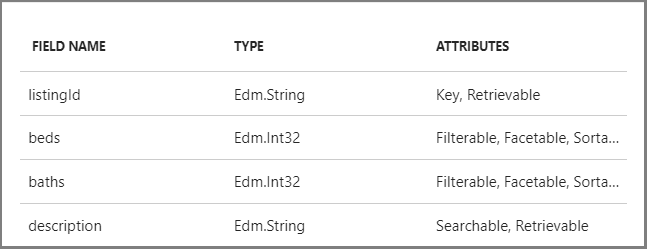

# Query types and composition in Azure Search

In Azure Search, a query is a full specification of a round-trip operation. Parameters provide match criteria for finding documents in an index, execution instructions for the engine, and directives for shaping the response. More precisely, you can specify which fields are in-scope, how to search, which fields to return, whether to sort or filter, and so forth. Unspecified, a query runs against all searchable fields as a full text search operation, returning an unscored result set in arbitrary order.

## A first look at query requests

Examples are useful for introducing new concepts. As a representative query constructed in the [REST API](https://docs.microsoft.com/rest/api/searchservice/search-documents), this example targets the [real estate demo index](search-get-started-portal.md) and includes common parameters.

```
{  
    "queryType": "simple" 
    "search": "seattle townhouse* +\"lake\"", 
    "searchFields": "description, city",  
    "count": "true", 
    "select": "listingId, street, status, daysOnMarket, description",
    "top": "10",
    "orderby": "daysOnMarket"
 } 
```

+ **`queryType`** sets the parser, which in Azure Search can be the [default simple query parser](search-query-simple-examples.md) (optimal for full text search), or the [full Lucene query parser](search-query-lucene-examples.md) used for advanced query constructs like regular expressions, proximity search, fuzzy and wildcard search, to name a few.

+ **`search`** provides the match criteria, usually text but often accompanied by boolean operators. Single standalone terms are *term* queries. Quote-enclosed multi-part queries are *key phrase* queries. Search can be undefined, as in **`search=*`**, but more likely consists of terms, phrases, and operators similar to what appears in the example.

+ **`searchFields`** is optional, used to constrain query execution to specific fields.

Responses are also shaped by the parameters you include in the query. In the example, the result set consists of fields listed in the **`select`** statement. Only the top 10 hits are returned in this query, but **`count`** tells you how many documents match overall. In this query, rows are sorted by daysOnMarket.

In Azure Search, query execution is always against one index, authenticated using an api-key provided in the request. In REST, both are provided in request headers.

### How to run this query

To execute this query, use [Search explorer and the real estate demo index](search-get-started-portal.md). 

You can paste this query string into the explorer's search bar: `search=seattle townhouse +lake&searchFields=description, city&$count=true&$select=listingId, street, status, daysOnMarket, description&$top=10&$orderby=daysOnMarket`

### How query operations are enabled by the index

Index design and query design are tightly coupled in Azure Search. An essential fact to know up front is that the *index schema*, with attributes on each field, determines the kind of query you can build. 

Index attributes on a field set the allowed operations - whether a field is *searchable* in the index, *retrievable* in results, *sortable*, *filterable*, and so forth. In the example query string, `"$orderby": "daysOnMarket"` only works because the daysOnMarket field is marked as *sortable* in the index schema. 



The above screenshot is a partial list of index attributes for the real estate sample. You can view the entire index schema in the portal. For more information about index attributes, see [Create Index REST API](https://docs.microsoft.com/rest/api/searchservice/create-index).

> [!Note]
> Some query functionality is enabled index-wide rather than on a per-field basis. These capabilities include: [synonym maps](https://docs.microsoft.com/rest/api/searchservice/synonym-map-operations), [custom analyzers](https://docs.microsoft.com/rest/api/searchservice/custom-analyzers-in-azure-search), [suggester constructs (for autocomplete and autosuggest)](https://docs.microsoft.com/rest/api/searchservice/suggesters), [scoring logic for ranking results](https://docs.microsoft.com/rest/api/searchservice/add-scoring-profiles-to-a-search-index).

## Elements of a query request

Queries are always directed at a single index. You cannot join indexes or create custom or temporary data structures as a query target. 

Required elements on a query request include the following components:

+ Service endpoint and index documents collection, expressed as a URL containing fixed and user-defined components: **`https://<your-service-name>.search.windows.net/indexes/<your-index-name>/docs`**
+ **`api-version`** (REST only) is necessary because more than one version of the API is available at all times. 
+ **`api-key`**, either a query or admin api-key, authenticates the request to your service.
+ **`queryType`**, either simple or full, which can be omitted if you are using the built-in default simple syntax.
+ **`search`** or **`filter`** provides the match criteria, which can be unspecified if you want to perform an empty search. Both query types are discussed in terms of the simple parser, but even advanced queries require the search parameter for passing complex query expressions.

All other search parameters are optional. For the full list of attributes, see [Create Index (REST)](https://docs.microsoft.com/rest/api/searchservice/create-index). For a closer look at how parameters are used during processing, see [How full-text search works in Azure Search](search-lucene-query-architecture.md).

## Choose a parser: simple | full

Azure Search sits on top of Apache Lucene and gives you a choice between two query parsers for handling typical and specialized queries. Requests using the simple parser are formulated using the [simple query syntax](https://docs.microsoft.com/rest/api/searchservice/Simple-query-syntax-in-Azure-Search), selected as the default for its speed and effectiveness in free form text queries. This syntax supports a number of common search operators including the AND, OR, NOT, phrase, suffix, and precedence operators.

The [full Lucene query syntax](https://docs.microsoft.com/rest/api/searchservice/Lucene-query-syntax-in-Azure-Search#bkmk_syntax), enabled when you add `queryType=full` to the request, exposes the widely adopted and expressive query language developed as part of [Apache Lucene](https://lucene.apache.org/core/4_10_2/queryparser/org/apache/lucene/queryparser/classic/package-summary.html). Full syntax extends the simple syntax. Any query you write for the simple syntax runs under the full Lucene parser. 

The following examples illustrate the point: same query, but with different queryType settings, yield different results. In the first query, the `^3` is treated as part of the search term.

```
queryType=simple&search=mountain beach garden ranch^3&searchFields=description&$count=true&$select=listingId, street, status, daysOnMarket, description&$top=10&$orderby=daysOnMarket
```

The same query using the full Lucene parser interprets the in-field boost on "ranch", which boosts the search rank of results containing that specific term.

```
queryType=simple&search=mountain beach garden ranch^3&searchFields=description&$count=true&$select=listingId, street, status, daysOnMarket, description&$top=10&$orderby=daysOnMarket
```

<a name="types-of-queries"></a>

## Types of queries

Azure Search supports a broad range of query types. 

| Query type | Usage | Examples and more information |
|------------|--------|-------------------------------|
| Free form text search | Search parameter and either parser| Full text search scans for one or more terms in all *searchable* fields in your index, and works the way you would expect a search engine like Google or Bing to work. The example in the introduction is full text search.<br/><br/>Full text search undergoes text analysis using the standard Lucene analyzer (by default) to lower-case all terms, remove stop words like "the". You can override the default with [non-English analyzers](https://docs.microsoft.com/rest/api/searchservice/language-support#analyzer-list) or [specialized analyzers](https://docs.microsoft.com/rest/api/searchservice/custom-analyzers-in-azure-search#AnalyzerTable) that modify text analysis. An example is [keyword](https://lucene.apache.org/core/4_10_3/analyzers-common/org/apache/lucene/analysis/core/KeywordAnalyzer.html) that treats the entire contents of a field as a single token. This is useful for data like zip codes, ids, and some product names. | 
| Filtered search | [OData filter expression](https://docs.microsoft.com/rest/api/searchservice/OData-Expression-Syntax-for-Azure-Search) and either parser | Filter queries evaluate a boolean expression over all *filterable* fields in an index. Unlike search, a filter query matches the exact contents of a field, including case-sensitivity on string fields. Another difference is that filter queries are expressed in OData syntax. <br/>[Filter expression example](search-query-simple-examples.md#example-3-filter-queries) |
| Geo-search | [Edm.GeographyPoint type](https://docs.microsoft.com/rest/api/searchservice/supported-data-types) on the field, filter expression, and either parser | Coordinates stored in a field having an Edm.GeographyPoint are used for "find near me" or map-based search controls. <br/>[Geo-search example](search-query-simple-examples.md#example-5-geo-search)|
| Range search | filter expression and simple parser | In Azure Search, range queries are built using the filter parameter. <br/>[Range filter example](search-query-simple-examples.md#example-4-range-filters) | 
| [Intra-field filtering](https://docs.microsoft.com/rest/api/searchservice/Lucene-query-syntax-in-Azure-Search#bkmk_fields) | Search parameter and Full parser | Build a composite query expression targeting a single field. <br/>[Intra-field filtering example](search-query-lucene-examples.md#example-2-intra-field-filtering) |
| [fuzzy search](https://docs.microsoft.com/rest/api/searchservice/Lucene-query-syntax-in-Azure-Search#bkmk_fuzzy) | Search parameter and Full parser | Matches on terms having a similar construction or spelling. <br/>[Fuzzy search example](search-query-lucene-examples.md#example-3-fuzzy-search) |
| [proximity search](https://docs.microsoft.com/rest/api/searchservice/Lucene-query-syntax-in-Azure-Search#bkmk_proximity) | Search parameter and Full parser | Finds terms that are near each other in a document. <br/>[Proximity search example](search-query-lucene-examples.md#example-4-proximity-search) |
| [term boosting](https://docs.microsoft.com/rest/api/searchservice/Lucene-query-syntax-in-Azure-Search#bkmk_termboost) | Search parameter and Full parser | Ranks a document higher if it contains the boosted term, relative to others that don't. <br/>[Term boosting example](search-query-lucene-examples.md#example-5-term-boosting) |
| [regular expression search](https://docs.microsoft.com/rest/api/searchservice/Lucene-query-syntax-in-Azure-Search#bkmk_regex) | Search parameter and Full parser | Matches based on the contents of a regular expression. <br/>[Regular expression example](search-query-lucene-examples.md#example-6-regex) |
|  [wildcard or prefix search](https://docs.microsoft.com/rest/api/searchservice/Lucene-query-syntax-in-Azure-Search#bkmk_wildcard) | Search parameter and Full parser | Matches based on a prefix and tilde (`~`) or single character (`?`). <br/>[Wildcard search example](search-query-lucene-examples.md#example-7-wildcard-search) |

## Manage search results 

Query results are streamed as JSON documents in the REST API, although if you use .NET APIs, serialization is built in. You can shape results by setting parameters on the query, selecting specific fields for the response.

Parameters on the query can be used to structure the result set in the following ways:

+ Limiting or batching the number of documents in the results (50 by default)
+ Selecting fields to include in the results
+ Setting a sort order
+ Adding hit highlights to draw attention to matching terms in the body of the search results

### Tips for unexpected results

Occasionally, the substance and not the structure of results are unexpected. When query outcomes are not what you expect to see, you can try these query modifications to see if results improve:

+ Change **`searchMode=any`** (default) to **`searchMode=all`** to require matches on all criteria instead of any of the criteria. This is especially true when boolean operators are included the query.

+ Change the query technique if text or lexical analysis is necessary, but the query type precludes linguistic processing. In full text search, text or lexical analysis auto-corrects for spelling errors, singular-plural word forms, and even irregular verbs or nouns. For some queries such as fuzzy or wildcard search, text analysis is not part of the query parsing pipeline. For some scenarios, regular expressions have been used as a workaround. 

### Paging results
Azure Search makes it easy to implement paging of search results. By using the **`top`** and **`skip`** parameters, you can smoothly issue search requests that allow you to receive the total set of search results in manageable, ordered subsets that easily enable good search UI practices. When receiving these smaller subsets of results, you can also receive the count of documents in the total set of search results.

You can learn more about paging search results in the article [How to page search results in Azure Search](search-pagination-page-layout.md).

### Ordering results
When receiving results for a search query, you can request that Azure Search serves the results ordered by values in a specific field. By default, Azure Search orders the search results based on the rank of each document's search score, which is derived from [TF-IDF](https://en.wikipedia.org/wiki/Tf%E2%80%93idf).

If you want Azure Search to return your results ordered by a value other than the search score, you can use the **`orderby`** search parameter. You can specify the value of the **`orderby`** parameter to include field names and calls to the [**`geo.distance()` function**](https://docs.microsoft.com/rest/api/searchservice/OData-Expression-Syntax-for-Azure-Search) for geospatial values. Each expression can be followed by `asc` to indicate that results are requested in ascending order, and **`desc`** to indicate that results are requested in descending order. The default ranking ascending order.


### Hit highlighting
In Azure Search, emphasizing the exact portion of search results that match the search query is made easy by using the **`highlight`**, **`highlightPreTag`**, and **`highlightPostTag`** parameters. You can specify which *searchable* fields should have their matched text emphasized as well as specifying the exact string tags to append to the start and end of the matched text that Azure Search returns.

## APIs and tools for testing

The following table lists the APIs and tool-based approaches for submitting queries.

| Methodology | Description |
|-------------|-------------|
| [SearchIndexClient (.NET)](https://docs.microsoft.com/dotnet/api/microsoft.azure.search.searchindexclient?view=azure-dotnet) | Client that can be used to query an Azure Search index.  <br/>[Learn more.](search-howto-dotnet-sdk.md#core-scenarios)  |
| [Search Documents (REST API)](https://docs.microsoft.com/rest/api/searchservice/search-documents) | GET or POST methods on an index, using query parameters for additional input.  |
| [Fiddler, Postman, or other HTTP testing tool](search-fiddler.md) | Explains how to set up a request header and body for sending queries to Azure Search.  |
| [Search explorer in Azure portal](search-explorer.md) | Provides a search bar and options for index and api-version selections. Results are returned as JSON documents. <br/>[Learn more.](search-get-started-portal.md#query-index) | 

## See also

+ [How full text search works in Azure Search (query parsing architecture)](search-lucene-query-architecture.md)
+ [Search explorer](search-explorer.md)
+ [How to query in .NET](search-query-dotnet.md)
+ [How to query in REST](search-query-rest-api.md)
