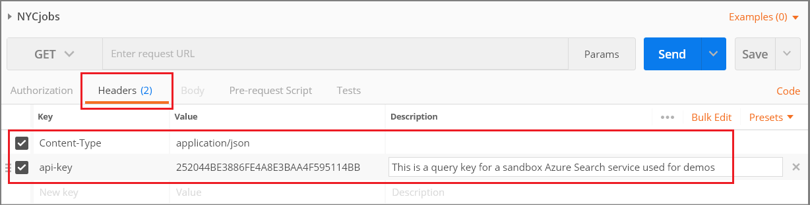
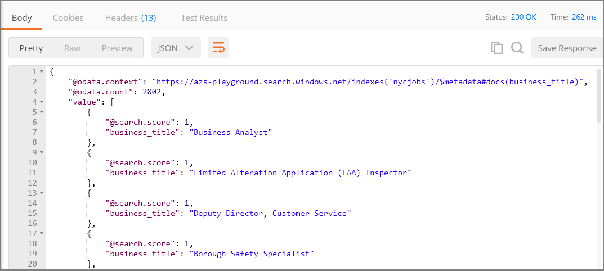
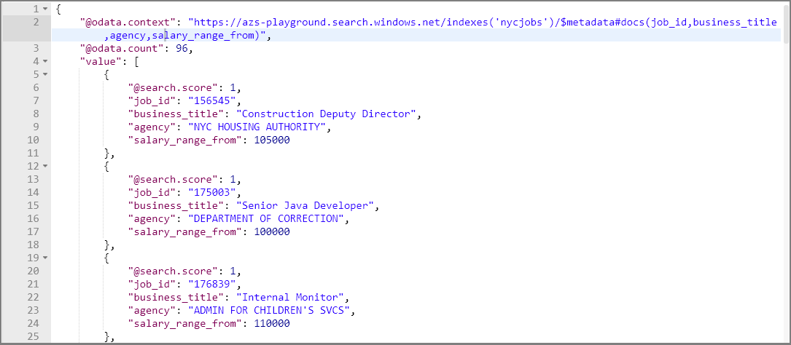
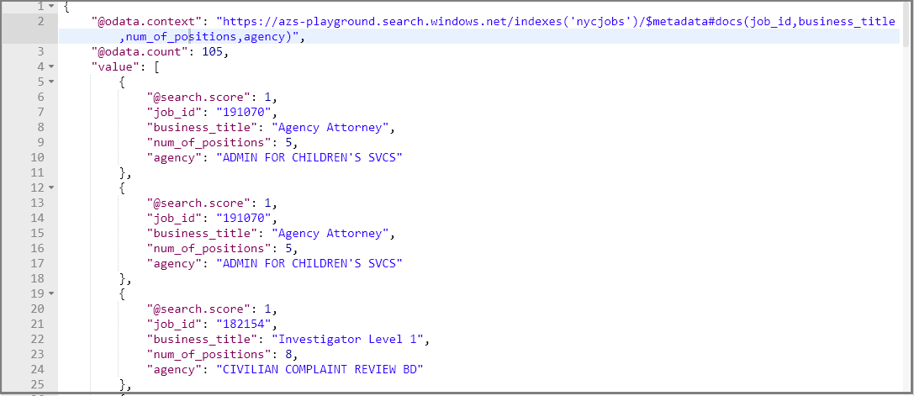
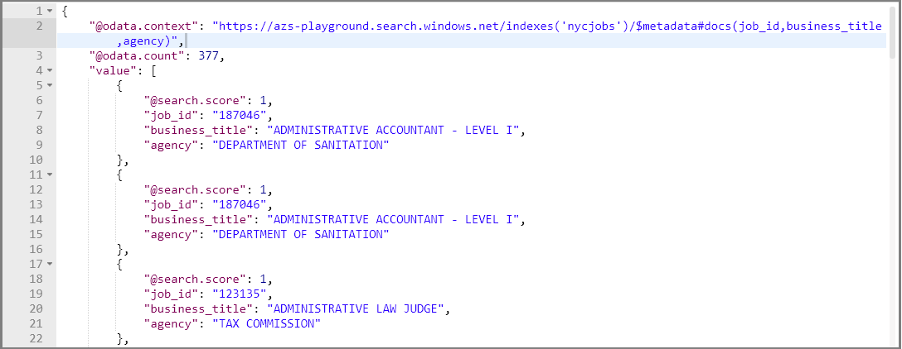
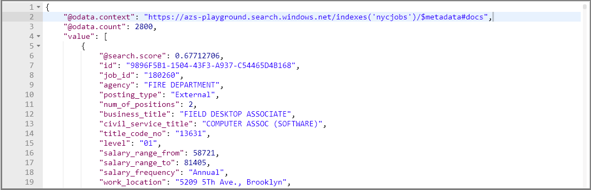
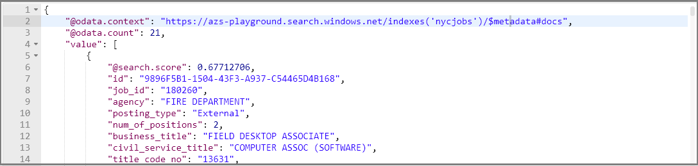

# Create a simple query in Azure Cognitive Search

In Azure Cognitive Search, the [simple query syntax](query-simple-syntax.md) invokes the default query parser for executing full text search queries against an index. This parser is fast and handles common scenarios, including full text search, filtered and faceted search, and geo-search. 

In this article, we use examples to illustrate the simple syntax, populating the `search=` parameter of a [Search Documents](https://docs.microsoft.com/rest/api/searchservice/search-documents) operation.

An alternative query syntax is [Full Lucene](query-lucene-syntax.md), supporting more complex query structures, such as fuzzy and wildcard search, which can take additional time to process. For more information and examples demonstrating full syntax, see [Use the full Lucene syntax](search-query-lucene-examples.md).

## Formulate requests in Postman

The following examples leverage a NYC Jobs search index consisting of jobs available based on a dataset provided by the [City of New York OpenData](https://nycopendata.socrata.com/) initiative. This data should not be considered current or complete. The index is on a sandbox service provided by Microsoft, which means you do not need an Azure subscription or Azure Cognitive Search to try these queries.

What you do need is Postman or an equivalent tool for issuing HTTP request on GET. For more information, see [Quickstart: Explore Azure Cognitive Search REST API using Postman](search-get-started-postman.md).

### Set the request header

1. In the request header, set **Content-Type** to `application/json`.

2. Add an **api-key**, and set it to this string: `252044BE3886FE4A8E3BAA4F595114BB`. This is a query key for the sandbox search service hosting the NYC Jobs index.

After you specify the request header, you can reuse it for all of the queries in this article, swapping out only the **search=** string. 

  

### Set the request URL

Request is a GET command paired with a URL containing the Azure Cognitive Search endpoint and search string.

  

URL composition has the following elements:

+ **`https://azs-playground.search.windows.net/`** is a sandbox search service maintained by the Azure Cognitive Search development team. 
+ **`indexes/nycjobs/`** is the NYC Jobs index in the indexes collection of that service. Both the service name and index are required on the request.
+ **`docs`** is the documents collection containing all searchable content. The query api-key provided in the request header only works on read operations targeting the documents collection.
+ **`api-version=2020-06-30`** sets the api-version, which is a required parameter on every request.
+ **`search=*`** is the query string, which in the initial query is null, returning the first 50 results (by default).

## Send your first query

As a verification step, paste the following request into GET and click **Send**. Results are returned as verbose JSON documents. Entire documents are returned, which allows you to see all fields and all values.

Paste this URL into a REST client as a validation step and to view document structure.

  ```http
  https://azs-playground.search.windows.net/indexes/nycjobs/docs?api-version=2020-06-30&$count=true&search=*
  ```

The query string, **`search=*`**, is an unspecified search equivalent to null or empty search. It's not especially useful, but it is the simplest search you can do.

Optionally, you can add **`$count=true`** to the URL to return a count of the documents matching the search criteria. On an empty search string, this is all the documents in the index (about 2800 in the case of NYC Jobs).

## How to invoke simple query parsing

For interactive queries, you don't have to specify anything: simple is the default. In code, if you previously invoked **queryType=full** for full query syntax, you could reset the default with **queryType=simple**.

## Example 1: Field-scoped query

This first example is not parser-specific, but we lead with it to introduce the first fundamental query concept: containment. This example scopes query execution and the response to just a few specific fields. Knowing how to structure a readable JSON response is important when your tool is Postman or Search explorer. 

For brevity, the query targets only the *business_title* field and specifies only business titles are returned. The syntax is **searchFields** to restrict query execution to just the business_title field, and **select** to specify which fields are included in the response.

### Partial query string

```http
searchFields=business_title&$select=business_title&search=*
```

Here is the same query with multiple fields in a comma-delimited list.

```http
search=*&searchFields=business_title, posting_type&$select=business_title, posting_type
```

### Full URL

```http
https://azs-playground.search.windows.net/indexes/nycjobs/docs?api-version=2020-06-30&$count=true&searchFields=business_title&$select=business_title&search=*
```

Response for this query should look similar to the following screenshot.

  

You might have noticed the search score in the response. Uniform scores of 1 occur when there is no rank, either because the search was not full text search, or because no criteria was applied. For null search with no criteria, rows come back in arbitrary order. When you include actual criteria, you will see search scores evolve into meaningful values.

## Example 2: Look up by ID

This example is a bit atypical, but when evaluating search behaviors, you might want to inspect the entire contents of a specific document to understand why it was included or excluded from results. To return a single document in its entirety, use a [Lookup operation](https://docs.microsoft.com/rest/api/searchservice/lookup-document) to pass in the document ID.

All documents have a unique identifier. To try out the syntax for a lookup query, first return a list of document IDs so that you can find one to use. For NYC Jobs, the identifiers are stored in the `id` field.

```http
https://azs-playground.search.windows.net/indexes/nycjobs/docs?api-version=2020-06-30&$count=true&searchFields=id&$select=id&search=*
```

The next example is a lookup query returning a specific document based on `id` "9E1E3AF9-0660-4E00-AF51-9B654925A2D5", which appeared first in the previous response. The following query returns the entire document, not just selected fields. 

```http
https://azs-playground.search.windows.net/indexes/nycjobs/docs/9E1E3AF9-0660-4E00-AF51-9B654925A2D5?api-version=2020-06-30&$count=true&search=*
```

## Example 3: Filter queries

[Filter syntax](https://docs.microsoft.com/azure/search/search-query-odata-filter) is an OData expression that you can use with **search** or by itself. A standalone filter, without a search parameter, is useful when the filter expression is able to fully qualify documents of interest. Without a query string, there is no lexical or linguistic analysis, no scoring (all scores are 1), and no ranking. Notice the search string is empty.

```http
POST /indexes/nycjobs/docs/search?api-version=2020-06-30
    {
      "search": "",
      "filter": "salary_frequency eq 'Annual' and salary_range_from gt 90000",
      "select": "job_id, business_title, agency, salary_range_from",
      "count": "true"
    }
```

Used together, the filter is applied first to the entire index, and then the search is performed on the results of the filter. Filters can therefore be a useful technique to improve query performance since they reduce the set of documents that the search query needs to process.

  

If you want to try this out in Postman using GET, you can paste in this string:

```http
https://azs-playground.search.windows.net/indexes/nycjobs/docs?api-version=2020-06-30&$count=true&$select=job_id,business_title,agency,salary_range_from&search=&$filter=salary_frequency eq 'Annual' and salary_range_from gt 90000
```

Another powerful way to combine filter and search is through **`search.ismatch*()`** in a filter expression, where you can use a search query within the filter. This filter expression uses a wildcard on *plan* to select business_title including the term plan, planner, planning, and so forth.

```http
https://azs-playground.search.windows.net/indexes/nycjobs/docs?api-version=2020-06-30&$count=true&$select=job_id,business_title,agency&search=&$filter=search.ismatch('plan*', 'business_title', 'full', 'any')
```

For more information about the function, see [search.ismatch in "Filter examples"](https://docs.microsoft.com/azure/search/search-query-odata-full-text-search-functions#examples).

## Example 4: Range filters

Range filtering is supported through **`$filter`** expressions for any data type. The following examples search over numeric and string fields. 

Data types are important in range filters and work best when numeric data is in numeric fields, and string data in string fields. Numeric data in string fields is not suitable for ranges because numeric strings are not comparable in Azure Cognitive Search. 

The following examples are in POST format for readability (numeric range, followed by text range):

```http
POST /indexes/nycjobs/docs/search?api-version=2020-06-30
    {
      "search": "",
      "filter": "num_of_positions ge 5 and num_of_positions lt 10",
      "select": "job_id, business_title, num_of_positions, agency",
      "orderby": "agency",
      "count": "true"
    }
```
  


```http
POST /indexes/nycjobs/docs/search?api-version=2020-06-30
    {
      "search": "",
      "filter": "business_title ge 'A*' and business_title lt 'C*'",
      "select": "job_id, business_title, agency",
      "orderby": "business_title",
      "count": "true"
    }
```

  

You can also try these out in Postman using GET:

```http
https://azs-playground.search.windows.net/indexes/nycjobs/docs?api-version=2020-06-30&search=&$filter=num_of_positions ge 5 and num_of_positions lt 10&$select=job_id, business_title, num_of_positions, agency&$orderby=agency&$count=true
```

```http
https://azs-playground.search.windows.net/indexes/nycjobs/docs?api-version=2020-06-30&search=&$filter=business_title ge 'A*' and business_title lt 'C*'&$select=job_id, business_title, agency&$orderby=business_title&$count=true
```

> [!NOTE]
> Faceting over ranges of values is a common search application requirement. For more information and examples on building filters for facet navigation structures, see ["Filter based on a range" in *How to implement faceted navigation*](search-faceted-navigation.md#filter-based-on-a-range).

## Example 5: Geo-search

The sample index includes a geo_location field with latitude and longitude coordinates. This example uses the [geo.distance function](https://docs.microsoft.com/azure/search/search-query-odata-geo-spatial-functions#examples) that filters on documents within the circumference of a starting point, out to an arbitrary distance (in kilometers) that you provide. You can adjust the last value in the query (4) to reduce or enlarge the surface area of the query.

The following example is in POST format for readability:

```http
POST /indexes/nycjobs/docs/search?api-version=2020-06-30
    {
      "search": "",
      "filter": "geo.distance(geo_location, geography'POINT(-74.11734 40.634384)') le 4",
      "select": "job_id, business_title, work_location",
      "count": "true"
    }
```
For more readable results, search results are trimmed to include a job ID, job title, and the work location. The starting coordinates were obtained from a random document in the index (in this case, for a work location on Staten island.

You can also try this out in Postman using GET:

```http
https://azs-playground.search.windows.net/indexes/nycjobs/docs?api-version=2020-06-30&$count=true&search=&$select=job_id, business_title, work_location&$filter=geo.distance(geo_location, geography'POINT(-74.11734 40.634384)') le 4
```

## Example 6: Search precision

Term queries are single terms, perhaps many of them, that are evaluated independently. Phrase queries are enclosed in quotation marks and evaluated as a verbatim string. Precision of the match is controlled by operators and searchMode.

Example 1: **`&search=fire`**  returns 150 results, where all matches contain the word fire somewhere in the document.

```http
https://azs-playground.search.windows.net/indexes/nycjobs/docs?api-version=2020-06-30&$count=true&search=fire
```

Example 2: **`&search=fire department`** returns 2002 results. Matches are returned for documents containing either fire or department.

```http
https://azs-playground.search.windows.net/indexes/nycjobs/docs?api-version=2020-06-30&$count=true&search=fire department
```

Example 3: **`&search="fire department"`** returns 82 results. Enclosing the string in quotation marks is a verbatim search on both terms, and matches are found on tokenized terms in the index consisting of the combined terms. This explains why a search like **`search=+fire +department`** is not equivalent. Both terms are required, but are scanned for independently. 

```http
https://azs-playground.search.windows.net/indexes/nycjobs/docs?api-version=2020-06-30&$count=true&search="fire department"
```

## Example 7: Booleans with searchMode

Simple syntax supports boolean operators in the form of characters (`+, -, |`). The searchMode parameter informs tradeoffs between precision and recall, with `searchMode=any` favoring recall (matching on any criteria qualifies a document for the result set), and `searchMode=all` favoring precision (all criteria must be matched). The default is `searchMode=any`, which can be confusing if you are stacking a query with multiple operators and getting broader instead of narrower results. This is particularly true with NOT, where results include all documents "not containing" a specific term.

Using the default searchMode (any), 2800 documents are returned: those containing the multi-part term "fire department", plus all documents that do not have the term "Metrotech Center".

```http
https://azs-playground.search.windows.net/indexes/nycjobs/docs?api-version=2020-06-30&$count=true&searchMode=any&search="fire department"  -"Metrotech Center"
```

  

Changing searchMode to `all` enforces a cumulative effect on criteria and returns a smaller result set - 21 documents - consisting of documents containing the entire phrase "fire department", minus those jobs at the Metrotech Center address.

```http
https://azs-playground.search.windows.net/indexes/nycjobs/docs?api-version=2020-06-30&$count=true&searchMode=all&search="fire department"  -"Metrotech Center"
```
  

## Example 8: Structuring results

Several parameters control which fields are in the search results, the number of documents returned in each batch, and sort order. This example resurfaces a few of the previous examples, limiting results to specific fields using the **$select** statement and verbatim search criteria, returning 82 matches 

```http
https://azs-playground.search.windows.net/indexes/nycjobs/docs?api-version=2020-06-30&$count=true&$select=job_id,agency,business_title,civil_service_title,work_location,job_description&search="fire department"
```
Appended onto the previous example, you can sort by title. This sort works because civil_service_title is *sortable* in the index.

```http
https://azs-playground.search.windows.net/indexes/nycjobs/docs?api-version=2020-06-30&$count=true&$select=job_id,agency,business_title,civil_service_title,work_location,job_description&search="fire department"&$orderby=civil_service_title
```

Paging results is implemented using the **$top** parameter, in this case returning the top 5 documents:

```http
https://azs-playground.search.windows.net/indexes/nycjobs/docs?api-version=2020-06-30&$count=true&$select=job_id,agency,business_title,civil_service_title,work_location,job_description&search="fire department"&$orderby=civil_service_title&$top=5&$skip=0
```

To get the next 5, skip the first batch:

```http
https://azs-playground.search.windows.net/indexes/nycjobs/docs?api-version=2020-06-30&$count=true&$select=job_id,agency,business_title,civil_service_title,work_location,job_description&search="fire department"&$orderby=civil_service_title&$top=5&$skip=5
```

## Next steps
Try specifying queries in your code. The following links explain how to set up search queries for both .NET and the REST API using the default simple syntax.

* [Query your index using the .NET SDK](search-query-dotnet.md)
* [Query your index using the REST API](search-create-index-rest-api.md)

Additional syntax reference, query architecture, and examples can be found in the following links:

+ [Lucene syntax query examples for building advanced queries](search-query-lucene-examples.md)
+ [How full text search works in Azure Cognitive Search](search-lucene-query-architecture.md)
+ [Simple query syntax](https://docs.microsoft.com/rest/api/searchservice/simple-query-syntax-in-azure-search)
+ [Full Lucene query](https://docs.microsoft.com/rest/api/searchservice/lucene-query-syntax-in-azure-search)
+ [Filter and Orderby syntax](https://docs.microsoft.com/rest/api/searchservice/odata-expression-syntax-for-azure-search)
