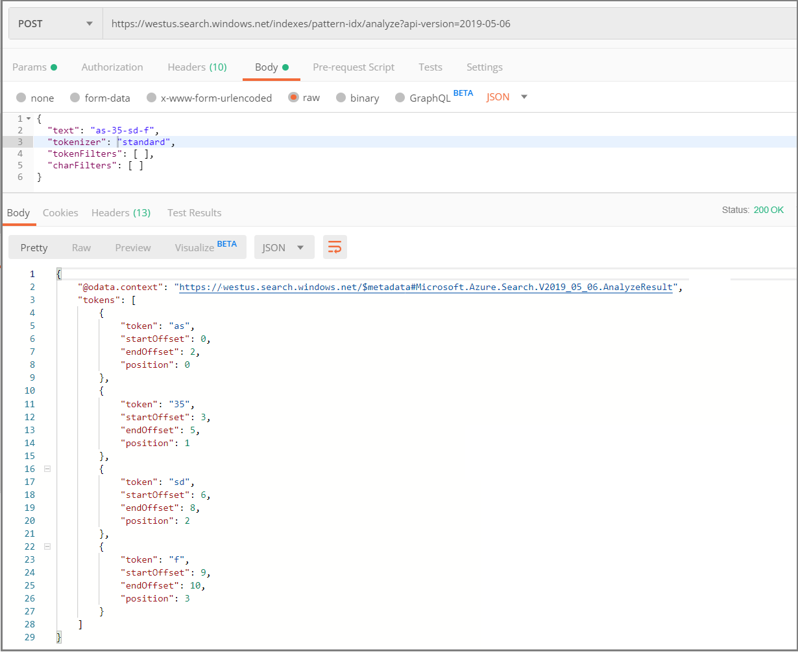

# Match on strings containing special characters 

Addresses, dates, phone numbers, model or account numbers, and URLs or file paths are all common examples of searchable text that includes dashes or other characters that contribute meaning or context to the value itself. However, search strings that include special characters (`-, /, \, &, ?, *, =`) can be problematic in full text search scenarios due to linguistic processing that typically removes special characters during indexing and query parsing. An exact match on a term like "abc-123" requires that the hyphenated term is intact in the index. If tokenization has split them up, the search engine might fail to return results, or rank a particular document lower than expected.

The strategy for matching on strings that include special characters includes the following components:

+ Reduce or eliminate tokenization on fields containing special characters
+ Optionally, use regular expressions and escaping to specify a hard-to-match pattern


you need to circumvent the default text analysis phase the default text analyzer is often insufficient for finding matches in your index because those characters are often stripped out during the analysis phase of 

Assuming the following fictitious feature codes, you might want queries like `"SQL*Linux"` to get the first two documents, or `"SQL.2019"` for the last two.

+ `"MSFT/SQL.2017/Linux"`
+ `"MSFT/SQL.2019/Linux&Java-Ext"`
+ `"MSFT/SQL.2019/Win&Java-Ext"`

What makes the above terms problematic in search scenarios is the linguistic analysis that occurs during indexing and queries, where composite terms are broken into smaller parts, and characters like dashes, periods, and slashes are discarded. 

For example, using the default analyzer, the middle term is tokenized as: `MSFT`, `SQL`, `2019`, `Linux`, `Java`, `Ext`, segmented and stripped of all characters. Given these transformations, you can imagine how searching on a pattern like `"SQL.2019"` becomes problematic when the index contains only segments of the term, and not the extended pattern that you expect.

## How to approach pattern matching

For pattern matching on partial terms or on strings that contain special characters, adopt an indexing strategy that preserves or creates necessary information:

+ Use a keyword analyzer to preserve the whole term, including special characters that are part of the query string.

+ Use prefix and suffix token filters to generate new combinations of partial strings.

Both approaches require a custom analyzer as replacement for the default text analyzer. However, the first approach introduces requirements for queries that match on patterns, and those take longer to process. The second approach is typically faster to query, but expands index size with additional character combinations.

You can implement either approach, both, or [design alternative solutions](#design-a-custom-solution) once you understand the role of analyzers in indexing and query parsing.

> [!NOTE]
> Exceptions to the conditions and approaches described in this article include $filters and specific query types. $filter expressions are not evaluated against the inverted indexes, and thus tokenization behaviors are not applicable. Similarly, RegEx queries, wildcard (*) queries, and fuzzy matching queries are lower-cased by the query parser, but are not otherwise stemmed or lemmatized during query parsing. As such, tokenization is less of a concern.

## Set up analyzers

Gaining control over tokenization starts with switching out the default Standard Lucene analyzer for a [custom analyzer](index-add-custom-analyzers.md) that delivers minimal processing (typical when using advanced wildcard queries), or additional processing that generates more tokens.

### Use the Keyword tokenizer to preserve whole terms

If the objective is to match on patterns that contain special characters, make sure whole terms are preserved intact. The keyword tokenizer creates a single token for the entire contents of a field. You should combine it with a lowercase token filter. Query parsers typicaly lowercase any uppercase text inputs. Lowercasing homogenizes the inputs with the tokenized terms.

The following example illustrates a custom analyzer that provides the keyword tokenizer and a lowercase token filter. Customer analyzers are defined within the index and then referenced on the field definition.

```json
{
"fields": [
  {
  "name": "featureCode",
  "analyzer":"myCustomAnalyzer",
  "type": "Edm.String",
  "searchable": true,
  "filterable": true,
  "retrievable": true,
  "sortable": false,
  "facetable": false
  }
]

"analyzers": [
  {
  "@odata.type":"#Microsoft.Azure.Search.CustomAnalyzer",
  "name":"myCustomAnalyzer",
  "charFilters":[],
  "tokenizer":"keyword_v2",
  "tokenFilters":["lowercase"]
  }
],
"tokenizers":[],
"charFilters": [],
"tokenFilters": []
```
The keyword_v2 tokenizer and lowercase token filter are known to the system and using their default configuration, which is why you can reference them without having to define them first.

### Use prefix and suffix token filters to generate partial strings

A token filter adds additional processing over existing tokens in your index. The following example adds an EdgeNGramTokenFilter to make prefix matches faster. Additional tokens are generated for in 2-25 character combinations: (not only MS, MSF, MSFT, MSFT/, but also embedded/internal partial strings like SQL, SQL., SQL.2)

```json
{
"fields": [
  {
  "name": "featureCode",
  "analyzer":"myCustomAnalyzer",
  "type": "Edm.String",
  "searchable": true,
  "filterable": true,
  "retrievable": true,
  "sortable": false,
  "facetable": false
  }
]

"analyzers": [
  {
  "@odata.type":"#Microsoft.Azure.Search.CustomAnalyzer",
  "name":"myCustomAnalyzer",
  "charFilters":[],
  "tokenizer":"keyword_v2",
  "tokenFilters":["lowercase", "my_edgeNGram"]
  }
],
"tokenizers":[],
"charFilters": [],
"tokenFilters": [
  {
  "@odata.type":"#Microsoft.Azure.Search.EdgeNGramTokenFilterV2",
  "name":"my_edgeNGram",
  "minGram": 2,
  "maxGram": 25,
  "side": "front"
  }
]
```

<!-- In full text search, query patterns that include spaces or characters (like dashes, slashes, quotes, commas, and periods) are problematic because [analyzers](search-lucene-query-architecture.md#stage-1-query-parsing) both strip out those characters at query time, and use them during indexing to break up and tokenize terms into smaller searchable parts. For example, using the default analyzer, this Microsoft phone number, 800-642-7676, would be tokenized into 3 separate components, which makes finding an exact match on the whole term less likely.

A more realistic scenario is a complex term, such as the following fictitious example that combines upper and lower case text with special characters: `"MSFT/SQL.2019/Linux&Java-Ext"`. If you used the default analyzer on such a term, the index would have tokens for individual parts, but not the term as a whole. As such, queries like `MSFT/SQL*` or `"Linux&Java"` would return zero results.

In Azure Cognitive Search, you can make complex patterns more matchable using a combination of query and indexing capabilities. 

+ Query techniques include using regular expressions (RegEx) and wildcards to match on specific character sequences placed anywhere within a term, including terms that have spaces and symbols. 

+ Indexing techniques include analyzers that tokenize on whole terms to preserve the integrity of the string, as well as anlayzers that generate tokens based on prefix or suffix sequences.  -->

<!-- ## Query techniques for matching on patterns

Suppose you have three documents with the following fictitious feature codes, and your goal is to design various queries that match on partial strings:

+ `featureCode: MSFT/SQL.2017/Linux`
+ `featureCode: MSFT/SQL.2019/Linux&Java-Ext`
+ `featureCode: MSFT/SQL.2019/Win&Java-Ext`

Some example queries might be `"MSFT/SQL*"` (a wildcard prefix query), `"*Java"` (a wildcard suffix query), `"2019/Linux"` (partial string query), `"SQL.201?` (single character wildcard), or any regular expression query that provides advanced pattern matching.

+ Wildcard queries
+ Regular expression queries

Within your index, the following tokens are necessary to support these queries:

Whole-term tokens to support regular expression queries
Prefix terms (optional but recommended for performance)
Suffix terms (optional but recommended for performance)


You can also include prefix and suffix analyzers for similar use cases that call for pattern matching. -->

<!-- Transition phrase from query to indexing section?

To support matching on specific patterns, whether in whole or partial terms, you want to control how terms are tokenized during indexing, as well as build a query that defines the pattern of interest.  -->


<!-- ## Techniques for pattern matching

The following techniques are useful for searching on patterns, including those that contain special characters.

| Type   | Explanation |
|--------|-------------| 
| Wildcard | A type of query available when you use the Full Lucene syntax option.  |
| RegEx    | A type of query available when you use the Full Lucene syntax option.  |
| Prefix analyzer  | Used during indexing and queries to ... |
| Suffix analyzer  | Used during indexing and queries to ... |

Both Wildcard and RegEx queries require the full syntax (queryType=Full) and do not return search rankings.

Prefix and Suffix queries use the default simple syntax. -->

<!-- ## Requirements

Implementing support for regular expressions and partial term matching is more complicated than straight full text search, but its useful when the following conditions exist:

+ Field type is **Edm.String**. Fields with numeric data types are never analyzed during indexing and are thus tokenized as whole terms.
+ Values include spaces, characters, or meaningful combinations of upper and lower case text
+ Queries are composed of whole or partial terms that include any of the above elements (spaces, special characters, case-sensitive values)

The following table includes examples that indicate a need for a RegEx search:

| String | Explanation |
|--------|-------------|
| `800-642-7676` | Phone numbers follow specific patterns and include delimiters that are part of the value. |
| `support@microsoft.com`  | Email addresses with `@` are candidates for RegEx search.  |
| `Bravern-2` | Alphanumeric content, with some form of delimiter, is often found in addresses, SKUs, product or model identifiers, account numbers, student IDs, and so forth. Search strings that include delimiters are typically constructed using a RegEx query that includes the special character. |
| `"ABCD.23PT1111/Dur/5min"` | Composite terms like this one often need to be matched using partial term queries built from combinations of each part (for example, `1111/Dur/5min`). This type of query is virtually impossible to do unless you are using un-analyzed text and a RegEx query. | -->

## Test analyzer output

The service provides an API that returns tokenized terms for a specific string. The following screenshot shows the request and response to [Test Analyzer REST API](https://docs.microsoft.com/rest/api/searchservice/test-analyzer). The equivalent API in .NET is the [AnalyzerResult class](https://docs.microsoft.com/dotnet/api/microsoft.azure.search.models.analyzeresult?view=azure-dotnet).

   

## Query for patterns

Once you have an index that articulates the terms that you expect, you can proceed with a query construct designed for pattern matching.

[Wildcard](search-query-lucene-examples.md#example-7-wildcard-search) and [Regular expression (RegEx)](search-query-lucene-examples.md#example-6-regex) queries are often used to find patterns on content that is expressed as full tokens in an index. 

1. On the query request, add `querytype=full` to specify the full Lucene query syntax used for wildcard and RegEx queries.

2. In the query string:

   + For wildcard search, embed `*` or `?` wildcard characters
   + For RegEx queries, enclose your pattern or term with `/`, such as `fieldCode:/SQL*Java-Ext/`

> [!NOTE]
> You might be inclined to also use `searchFields` as a field constraint, or set `searchMode=all` as an operator contraint, but in most cases you won't need either one. A regular expression query is typically sufficient for finding an exact match.

## Design a custom solution

The two approaches described in this article are common design patterns, but if they don't produce expected results, you can experiment with alternatives. The following guidance might help focus your investigation.

Recall that when search terms include special characters or combinations of partial strings, address the following challenges:

+ Control the tokenization process to ensure your index actually contains complete information. Instead of segmented terms, you want *intact* terms so that partial and pattern matching can succeed. You can override default analyzer with a specific analyzer as a control mechanism. You can also add token filters for additional modifications.

+ Create queries that do the best job of setting up the matching criteria when the criteria in question contains characters or specific patterns. Wildcard queries are a common approach. Remember that if you are using wildcards and the full Lucene syntax (queryType=full) you need to formulate the string within a regular expression.

### Consider dedicated analyzers for indexing and query execution

Analyzers are called during indexing and during query execution. It's common to use the same analyzer for both but you can configure custom analyzers for each workload. Analyzer overrides are specified in the [index definition](https://docs.microsoft.com/rest/api/searchservice/create-index) in an `analyzers` section, and then referenced on specific fields. 

When custom analysis is only required during indexing, you can apply the custom analyzer to just indexing and continue to use the standard Lucene analyzer (or another analyzer) for queries.

To specify role-specific analysis, you can set properties on the field for each one, setting `indexAnalyzer` and `searchAnalyzer` instead of the default `analyzer` property.

```json
"name": "featureCode",
"indexAnalyzer":"my_customanalyzer",
"searchAnalyzer":"standard",
```

### Consider duplicating fields for query optimization

Another option leverages the per-field analyzer assignment to optimize for different scenarios. Specifically, you might define "featureCode" and "featureCodeRegex" to support regular full text search on the first, and advanced pattern matching on the second.

```json
{
  "name": "featureCode",
  "type": "Edm.String",
  "retrievable": true,
  "searchable": true,
  "analyzer": ""
},
{
  "name": "featureCodeRegex",
  "type": "Edm.String",
  "retrievable": true,
  "searchable": true,
  "analyzer": "my_customanalyzer"
},
```

## Next steps

This article explains how analyzers both contribute to query problems and solve query problems. As a next step, take a closer look at how analyzers are used to modulate indexing and query operations. In particular, consider using the Analyze Text API to return tokenized output so that you can see exactly what an analyzer is creating for your index.

+ [Language analyzers](search-language-support.md)
+ [Analyzers for text processing in Azure Cognitive Search](search-analyzers.md)
+ [Analyze Text (REST)](https://docs.microsoft.com/rest/api/searchservice/test-analyzer) 


<!-- ORIGINAL INTRO

Finding an exact match to an input query string can be challenging in unexpected ways. During indexing, linguistic analyzers will break terms into root forms to get the broadest possible matches, with the downside of potentially losing information or context that you would otherwise expect to retain. If you find yourself wondering why a query isn't returning an expected match, this article might help you understand the causes and how to structure your index and queries to get right results.

This article is focused on exact matches of numeric content and the impact of special characters on query logic.

For more information about the query engine architecture, we recommend [How full text search works in Azure Cognitive Search](search-lucene-query-architecture.md). For other exact-match information, such as filters that match on verbatim strings, see [Filters in Azure Cognitive Search](search-filters.md).

## Matching on numeric data or special characters

For numeric fields that include spaces, hyphens, or other special characters, the processing performed by analyzers can sometimes segment a value into component parts rather than leaving it whole. If a multi-part value is deconstructed, the query engine can fail to find a match, even if you take precautions to escape any special characters. If a character doesn't exist (because it was stripped out prior to tokenization), then escaping it won't help.

As an example, consider the following documents, where `phone` is Edm.string that is searchable, filterable, and retrievable. 

```json
{
  "id": "1",
  "company": "Microsoft",
  "phone": "1-800-642-7676"
},
{
  "id": "2",
  "company": "LinkedIn",
  "phone": "(650) 687-3600"
}
```

To work around any unwanted side-effects of tokenization, you can implement a two-part solution:

+ During indexing, use the keyword tokenizer to index the contents of a field as a single token, including any characters embedded in the string.

+ In queries, use a regular expression query to submit complex matching criteria. A prerequisite for using regular expressions is to *not* tokenize the field into component parts, so we'll start with the tokenizer first.
 -->

