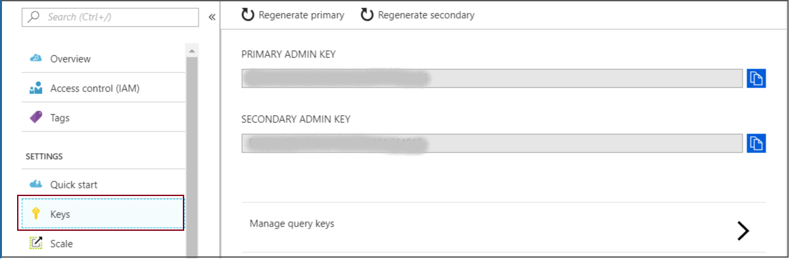
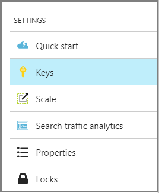
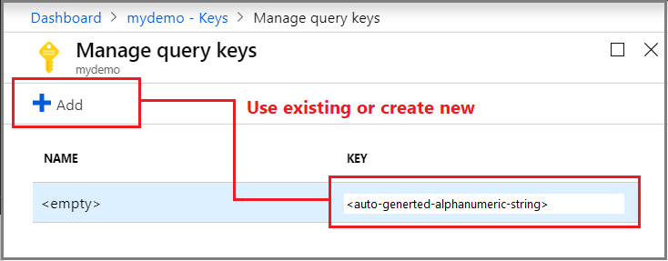

# Create and manage api-keys for an Azure Cognitive Search service

All requests to a search service need a read-only api-key that was generated specifically for your service. The api-key is the sole mechanism for authenticating access to your search service endpoint and must be included on every request. In [REST solutions](search-get-started-postman.md), the api-key is typically specified in a request header. In [.NET solutions](search-howto-dotnet-sdk.md#core-scenarios), a key is often specified as a configuration setting and then passed as [Credentials](https://docs.microsoft.com/dotnet/api/microsoft.azure.search.searchserviceclient.credentials) (admin key) or [SearchCredentials](https://docs.microsoft.com/dotnet/api/microsoft.azure.search.searchserviceclient.searchcredentials) (query key) on [SearchServiceClient](https://docs.microsoft.com/dotnet/api/microsoft.azure.search.searchserviceclient).

Keys are created with your search service during service provisioning. You can view and obtain key values in the [Azure portal](https://portal.azure.com).

## What is an api-key

An api-key is a string composed of randomly generated numbers and letters. Through [role-based permissions](search-security-rbac.md), you can delete or read the keys, but you can't replace a key with a user-defined password or use Active Directory as the primary authentication methodology for accessing search operations. 

Two types of keys are used to access your search service: admin (read-write) and query (read-only).

|Key|Description|Limits|  
|---------|-----------------|------------|  
|Admin|Grants full rights to all operations, including the ability to manage the service, create and delete indexes, indexers, and data sources.   Two admin keys, referred to as *primary* and *secondary* keys in the portal, are generated when the service is created and can be individually regenerated on demand. Having two keys allows you to roll over one key while using the second key for continued access to the service.   Admin keys are only specified in HTTP request headers. You cannot place an admin api-key in a URL.|Maximum of 2 per service|  
|Query|Grants read-only access to indexes and documents, and are typically distributed to client applications that issue search requests.   Query keys are created on demand. You can create them manually in the portal or programmatically via the [Management REST API](https://docs.microsoft.com/rest/api/searchmanagement/).   Query keys can be specified  in an HTTP request header for search, suggestion, or lookup operation. Alternatively, you can pass a query key  as a parameter on a URL. Depending on how your client application formulates the request, it might be easier to pass the key as a query parameter:   `GET /indexes/hotels/docs?search=*&$orderby=lastRenovationDate desc&api-version=2020-06-30&api-key=[query key]`|50 per service|  

 Visually, there is no distinction between an admin key or query key. Both keys are strings composed of 32 randomly generated alpha-numeric characters. If you lose track of what type of key is specified in your application, you can [check the key values in the portal](https://portal.azure.com) or use the [REST API](https://docs.microsoft.com/rest/api/searchmanagement/) to return the value and key type.  

> [!NOTE]  
>  It is considered a poor security practice to pass sensitive data such as an `api-key` in the request URI. For this reason, Azure Cognitive Search only accepts a query key as an `api-key` in the query string, and you should avoid doing so unless the contents of your index should be publicly available. As a general rule, we recommend passing your `api-key` as a request header.  

## Find existing keys

You can obtain access keys in the portal or through the [Management REST API](https://docs.microsoft.com/rest/api/searchmanagement/). For more information, see [Manage admin and query api-keys](search-security-api-keys.md).

1. Sign in to the [Azure portal](https://portal.azure.com).
2. List the [search services](https://portal.azure.com/#blade/HubsExtension/BrowseResourceBlade/resourceType/Microsoft.Search%2FsearchServices)  for your subscription.
3. Select the service and on the Overview page, click **Settings** >**Keys** to view admin and query keys.

   

## Create query keys

Query keys are used for read-only access to documents within an index for operations targeting a documents collection. Search, filter, and suggestion queries are all operations that take a query key. Any read-only operation that returns system data or object definitions, such as an index definition or indexer status, requires an admin key.

Restricting access and operations in client apps is essential to safeguarding the search assets on your service. Always use a query key rather than an admin key for any query originating from a client app.

1. Sign in to the [Azure portal](https://portal.azure.com).
2. List the [search services](https://portal.azure.com/#blade/HubsExtension/BrowseResourceBlade/resourceType/Microsoft.Search%2FsearchServices)  for your subscription.
3. Select the service and on the Overview page, click **Settings** >**Keys**.
4. Click **Manage query keys**.
5. Use the query key already generated for your service, or create up to 50 new query keys. The default query key is not named, but additional query keys can be named for manageability.

    

> [!Note]
> A code example showing query key usage can be found in [Query an Azure Cognitive Search index in C#](search-query-dotnet.md).

## Regenerate admin keys

Two admin keys are created for each service so that you can rotate a primary key, using the secondary key for business continuity.

1. In the **Settings** >**Keys** page, copy the secondary key.
2. For all applications, update the api-key settings to use the secondary key.
3. Regenerate the primary key.
4. Update all applications to use the new primary key.

If you inadvertently regenerate both keys at the same time, all client requests using those keys will fail with HTTP 403 Forbidden. However, content is not deleted and you are not locked out permanently. 

You can still access the service through the portal or the management layer ([REST API](https://docs.microsoft.com/rest/api/searchmanagement/), [PowerShell](https://docs.microsoft.com/azure/search/search-manage-powershell), or Azure Resource Manager). Management functions are operative through a subscription ID not a service api-key, and thus still available even if your api-keys are not. 

After you create new keys via portal or management layer, access is restored to your content (indexes, indexers, data sources, synonym maps) once you have the new keys and provide those keys on requests.

## Secure api-keys
Key security is ensured by restricting access via the portal or Resource Manager interfaces (PowerShell or command-line interface). As noted, subscription administrators can view and regenerate all api-keys. As a precaution, review role assignments to understand who has access to the admin keys.

+ In the service dashboard, click **Access control (IAM)** and then the **Role assignments** tab to view role assignments for your service.

Members of the following roles can view and regenerate keys: Owner, Contributor, [Search Service Contributors](https://docs.microsoft.com/azure/role-based-access-control/built-in-roles#search-service-contributor)

> [!Note]
> For identity-based access over search results, you can create security filters to trim results by identity, removing documents for which the requestor should not have access. For more information, see [Security filters](search-security-trimming-for-azure-search.md) and [Secure with Active Directory](search-security-trimming-for-azure-search-with-aad.md).

## See also

+ [Role-based access control in Azure Cognitive Search](search-security-rbac.md)
+ [Manage using PowerShell](search-manage-powershell.md) 
+ [Performance and optimization article](search-performance-optimization.md)