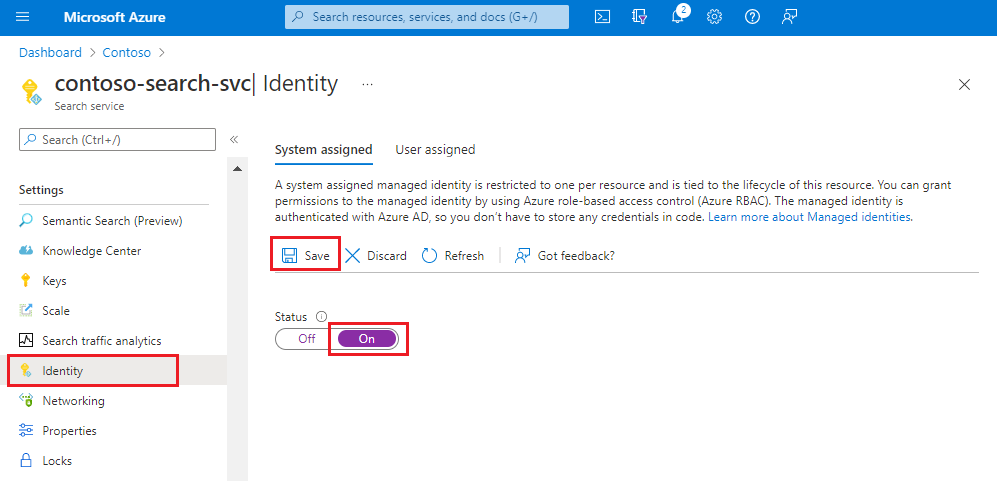

# Configure customer-managed keys for data encryption in Azure Cognitive Search

Azure Cognitive Search automatically encrypts indexed content at rest with [service-managed keys](../security/fundamentals/encryption-atrest.md#azure-encryption-at-rest-components). If more protection is needed, you can supplement default encryption with an additional encryption layer using keys that you create and manage in Azure Key Vault. This article walks you through the steps of setting up customer-managed key encryption.

Customer-managed key encryption is dependent on [Azure Key Vault](../key-vault/general/overview.md). You can create your own encryption keys and store them in a key vault, or you can use Azure Key Vault's APIs to generate encryption keys. With Azure Key Vault, you can also audit key usage if you [enable logging](../key-vault/general/logging.md).  

Encryption with customer-managed keys is applied to individual indexes or synonym maps when those objects are created, and is not specified on the search service level itself. Only new objects can be encrypted. You cannot encrypt content that already exists.

Keys don't all need to be in the same key vault. A single search service can host multiple encrypted indexes or synonym maps, each encrypted with their own customer-managed encryption keys, stored in different key vaults. You can also have indexes and synonym maps in the same service that are not encrypted using customer-managed keys.

>[!Important]
> If you implement customer-managed keys, be sure to follow strict procedures during routine rotation of key vault keys and Active Directory application secrets and registration. Always update all encrypted content to use new secrets and keys before deleting the old ones. If you miss this step, your content cannot be decrypted.

## Double encryption

For services created after August 1, 2020 and in specific regions, the scope of customer-managed key encryption includes temporary disks, achieving [full double encryption](search-security-overview.md#double-encryption), currently available in these regions: 

+ West US 2
+ East US
+ South Central US
+ US Gov Virginia
+ US Gov Arizona

If you are using a different region, or a service created prior to August 1, then managed key encryption is limited to just the data disk, excluding the temporary disks used by the service.

## Prerequisites

The following tools and services are used in this scenario.

+ [Azure Cognitive Search](search-create-service-portal.md) on a [billable tier](search-sku-tier.md#tier-descriptions) (Basic or above, in any region).
+ [Azure Key Vault](../key-vault/general/overview.md), you can create key vault using [Azure portal](../key-vault//general/quick-create-portal.md), [Azure CLI](../key-vault//general/quick-create-cli.md), or [Azure PowerShell](../key-vault//general/quick-create-powershell.md). in the same subscription as Azure Cognitive Search. The key vault must have **soft-delete** and **purge protection** enabled.
+ [Azure Active Directory](../active-directory/fundamentals/active-directory-whatis.md). If you don't have one, [set up a new tenant](../active-directory/develop/quickstart-create-new-tenant.md).

You should have a search application that can create the encrypted object. Into this code, you'll reference a key vault key and Active Directory registration information. This code could be a working app, or prototype code such as the [C# code sample DotNetHowToEncryptionUsingCMK](https://github.com/Azure-Samples/search-dotnet-getting-started/tree/master/DotNetHowToEncryptionUsingCMK).

> [!TIP]
> You can use [Postman](search-get-started-rest.md), [Visual Studio Code](search-get-started-vs-code.md), or [Azure PowerShell](./search-get-started-powershell.md), to call REST APIs that create indexes and synonym maps that include an encryption key parameter. There is no portal support for adding a key to indexes or synonym maps at this time.

## 1 - Enable key recovery

Due to the nature of encryption with customer-managed keys, no one can retrieve your data if your Azure Key vault key is deleted. To prevent data loss caused by accidental Key Vault key deletions, soft-delete and purge protection must be enabled on the key vault. Soft-delete is enabled by default, so you will only encounter issues if you purposely disabled it. Purge protection is not enabled by default, but it is required for customer-managed key encryption in Cognitive Search. For more information, see [soft-delete](../key-vault/general/soft-delete-overview.md) and [purge protection](../key-vault/general/soft-delete-overview.md#purge-protection) overviews.

You can set both properties using the portal, PowerShell, or Azure CLI commands.

### Using Azure portal

1. [Sign in to Azure portal](https://portal.azure.com) and open your key vault overview page.

1. On the **Overview** page under **Essentials**, enable **Soft-delete** and **Purge protection**.

### Using PowerShell

1. Run `Connect-AzAccount` to  set up your Azure credentials.

1. Run the following command to connect to your key vault, replacing `<vault_name>` with a valid name:

   ```powershell
   $resource = Get-AzResource -ResourceId (Get-AzKeyVault -VaultName "<vault_name>").ResourceId
   ```

1. Azure Key Vault is created with soft-delete enabled. If it's disabled on your vault, run  the following command:

   ```powershell
   $resource.Properties | Add-Member -MemberType NoteProperty -Name "enableSoftDelete" -Value 'true'
   ```

1. Enable purge protection:

   ```powershell
   $resource.Properties | Add-Member -MemberType NoteProperty -Name "enablePurgeProtection" -Value 'true'
   ```

1. Save your updates:

   ```powershell
   Set-AzResource -resourceid $resource.ResourceId -Properties $resource.Properties
   ```

### Using Azure CLI

+ If you have an [installation of Azure CLI](/cli/azure/install-azure-cli), you can run the following command to enable the required properties.

   ```azurecli-interactive
   az keyvault update -n <vault_name> -g <resource_group> --enable-soft-delete --enable-purge-protection
   ```

## 2 - Create a key in Key Vault

Skip this step if you already have a key in Azure Key Vault.

1. [Sign in to Azure portal](https://portal.azure.com) and open your key vault overview page.

1. Select **Keys** on the left, and then select **+ Generate/Import**.

1. In the **Create a key** pane, from the list of **Options**, choose the method that you want to use to create a key. You can **Generate** a new key, **Upload** an existing key, or use **Restore Backup** to select a backup of a key.

1. Enter a **Name** for your key, and optionally select other key properties.

1. Select **Create** to start the deployment.

1. Make a note of the Key Identifier – it's composed of the **key value Uri**, the **key name**, and the **key version**. You will need the identifier to define an encrypted index in Azure Cognitive Search.

   :::image type="content" source="media/search-manage-encryption-keys/cmk-key-identifier.png" alt-text="Create a new key vault key":::

## 3 - Register an app in Active Directory

1. In [Azure portal](https://portal.azure.com), find the Azure Active Directory resource for your subscription.

1. On the left, under **Manage**, select **App registrations**, and then select **New registration**.

1. Give the registration a name, perhaps a name that is similar to the search application name. Select **Register**.

1. Once the app registration is created, copy the Application ID. You will need to provide this string to your application. 

   If you are stepping through the [DotNetHowToEncryptionUsingCMK](https://github.com/Azure-Samples/search-dotnet-getting-started/tree/master/DotNetHowToEncryptionUsingCMK), paste this value into the **appsettings.json** file.

   :::image type="content" source="media/search-manage-encryption-keys/cmk-application-id.png" alt-text="Application ID in the Essentials section":::

1. Next, select **Certificates & secrets** on the left.

1. Select **New client secret**. Give the secret a display name and select **Add**.

1. Copy the application secret. If you are stepping through the sample, paste this value into the **appsettings.json** file.

   :::image type="content" source="media/search-manage-encryption-keys/cmk-application-secret.png" alt-text="Application secret":::

## 4 - Grant key access permissions

In this step, you will create an access policy in Key Vault. This policy gives the application you registered with Active Directory permission to use your customer-managed key.

Access permissions could be revoked at any given time. Once revoked, any search service index or synonym map that uses that key vault will become unusable. Restoring Key vault access permissions at a later time will restore index\synonym map access. For more information, see [Secure access to a key vault](../key-vault/general/security-features.md).

1. Still in the Azure portal, open your key vault **Overview** page. 

1. Select the **Access policies** on the left, and select **+ Add Access Policy**.

   :::image type="content" source="media/search-manage-encryption-keys/cmk-add-access-policy.png" alt-text="Add new key vault access policy":::

1. Choose **Select principal** and select the application you registered with Active Directory. You can search for it by name.

   :::image type="content" source="media/search-manage-encryption-keys/cmk-access-policy-permissions.png" alt-text="Select key vault access policy principal":::

1. In **Key permissions**, choose *Get*, *Unwrap Key* and *Wrap Key*.

1. In **Secret Permissions**, select *Get*.

1. In **Certificate Permissions**, select *Get*.

1. Select **Add** and then **Save**.

> [!Important]
> Encrypted content in Azure Cognitive Search is configured to use a specific Azure Key Vault key with a specific **version**. If you change the key or version, the index or synonym map must be updated to use the new key\version **before** deleting the previous key\version. 
> Failing to do so will render the index or synonym map unusable, at you won't be able to decrypt the content once key access is lost.

<a name="encrypt-content"></a>

## 5 - Encrypt content

To add a customer-managed key on an index, data source, skillset, indexer, or synonym map, you must use the [Search REST API](/rest/api/searchservice/) or an SDK. The portal does not expose synonym maps or encryption properties. When you use a valid API indexes, data sources, skillsets, indexers, and synonym maps support a top-level **encryptionKey** property.

This example uses the REST API, with values for Azure Key Vault and Azure Active Directory:

```json
{
  "encryptionKey": {
    "keyVaultUri": "https://demokeyvault.vault.azure.net",
    "keyVaultKeyName": "myEncryptionKey",
    "keyVaultKeyVersion": "eaab6a663d59439ebb95ce2fe7d5f660",
    "accessCredentials": {
      "applicationId": "00000000-0000-0000-0000-000000000000",
      "applicationSecret": "myApplicationSecret"
    }
  }
}
```

> [!Note]
> None of these key vault details are considered secret and could be easily retrieved by browsing to the relevant Azure Key Vault key page in Azure portal.

## Example: Index encryption

Create an encrypted index using the [Create Index Azure Cognitive Search REST API](/rest/api/searchservice/create-index). Use the `encryptionKey` property to specify which encryption key to use.
> [!Note]
> None of these key vault details are considered secret and could be easily retrieved by browsing to the relevant Azure Key Vault key page in Azure portal.

## REST examples

This section shows the full JSON for an encrypted index and synonym map

### Index encryption

The details of creating a new index via the REST API could be found at [Create Index (REST API)](/rest/api/searchservice/create-index), where the only difference here is specifying the encryption key details as part of the index definition:

```json
{
 "name": "hotels",
 "fields": [
  {"name": "HotelId", "type": "Edm.String", "key": true, "filterable": true},
  {"name": "HotelName", "type": "Edm.String", "searchable": true, "filterable": false, "sortable": true, "facetable": false},
  {"name": "Description", "type": "Edm.String", "searchable": true, "filterable": false, "sortable": false, "facetable": false, "analyzer": "en.lucene"},
  {"name": "Description_fr", "type": "Edm.String", "searchable": true, "filterable": false, "sortable": false, "facetable": false, "analyzer": "fr.lucene"},
  {"name": "Category", "type": "Edm.String", "searchable": true, "filterable": true, "sortable": true, "facetable": true},
  {"name": "Tags", "type": "Collection(Edm.String)", "searchable": true, "filterable": true, "sortable": false, "facetable": true},
  {"name": "ParkingIncluded", "type": "Edm.Boolean", "filterable": true, "sortable": true, "facetable": true},
  {"name": "LastRenovationDate", "type": "Edm.DateTimeOffset", "filterable": true, "sortable": true, "facetable": true},
  {"name": "Rating", "type": "Edm.Double", "filterable": true, "sortable": true, "facetable": true},
  {"name": "Location", "type": "Edm.GeographyPoint", "filterable": true, "sortable": true},
 ],
  "encryptionKey": {
    "keyVaultUri": "https://demokeyvault.vault.azure.net",
    "keyVaultKeyName": "myEncryptionKey",
    "keyVaultKeyVersion": "eaab6a663d59439ebb95ce2fe7d5f660",
    "accessCredentials": {
      "applicationId": "00000000-0000-0000-0000-000000000000",
      "applicationSecret": "myApplicationSecret"
    }
  }
}
```

You can now send the index creation request, and then start using the index normally.

### Synonym map encryption

Create an encrypted synonym map using the [Create Synonym Map Azure Cognitive Search REST API](/rest/api/searchservice/create-synonym-map). Use the `encryptionKey` property to specify which encryption key to use.

```json
{
  "name" : "synonymmap1",
  "format" : "solr",
  "synonyms" : "United States, United States of America, USA\n
  Washington, Wash. => WA",
  "encryptionKey": {
    "keyVaultUri": "https://demokeyvault.vault.azure.net",
    "keyVaultKeyName": "myEncryptionKey",
    "keyVaultKeyVersion": "eaab6a663d59439ebb95ce2fe7d5f660",
    "accessCredentials": {
      "applicationId": "00000000-0000-0000-0000-000000000000",
      "applicationSecret": "myApplicationSecret"
    }
  }
}
```

You can now send the synonym map creation request, and then start using it normally.

## Example: Data source encryption

Create an encrypted data source using the [Create Data Source (Azure Cognitive Search REST API)](/rest/api/searchservice/create-data-source). Use the `encryptionKey` property to specify which encryption key to use.

```json
{
  "name" : "datasource1",
  "type" : "azureblob",
  "credentials" :
  { "connectionString" : "DefaultEndpointsProtocol=https;AccountName=datasource;AccountKey=accountkey;EndpointSuffix=core.windows.net"
  },
  "container" : { "name" : "containername" },
  "encryptionKey": {
    "keyVaultUri": "https://demokeyvault.vault.azure.net",
    "keyVaultKeyName": "myEncryptionKey",
    "keyVaultKeyVersion": "eaab6a663d59439ebb95ce2fe7d5f660",
    "accessCredentials": {
      "applicationId": "00000000-0000-0000-0000-000000000000",
      "applicationSecret": "myApplicationSecret"
    }
  }
}
```

You can now send the data source creation request, and then start using it normally.

## Example: Skillset encryption

Create an encrypted skillset using the [Create Skillset Azure Cognitive Search REST API](/rest/api/searchservice/create-skillset). Use the `encryptionKey` property to specify which encryption key to use.

```json
{
  "name" : "datasource1",
  "type" : "azureblob",
  "credentials" :
  { "connectionString" : "DefaultEndpointsProtocol=https;AccountName=datasource;AccountKey=accountkey;EndpointSuffix=core.windows.net"
  },
  "container" : { "name" : "containername" },
  "encryptionKey": {
    "keyVaultUri": "https://demokeyvault.vault.azure.net",
    "keyVaultKeyName": "myEncryptionKey",
    "keyVaultKeyVersion": "eaab6a663d59439ebb95ce2fe7d5f660",
    "accessCredentials": {
      "applicationId": "00000000-0000-0000-0000-000000000000",
      "applicationSecret": "myApplicationSecret"
    }
  }
}
```

You can now send the skillset creation request, and then start using it normally.

## Example: Indexer encryption

Create an encrypted indexer using the [Create Indexer Azure Cognitive Search REST API](/rest/api/searchservice/create-indexer). Use the `encryptionKey` property to specify which encryption key to use.

```json
{
  "name": "indexer1",
  "dataSourceName": "datasource1",
  "skillsetName": "skillset1",
  "parameters": {
      "configuration": {
          "imageAction": "generateNormalizedImages"
      }
  },
  "encryptionKey": {
    "keyVaultUri": "https://demokeyvault.vault.azure.net",
    "keyVaultKeyName": "myEncryptionKey",
    "keyVaultKeyVersion": "eaab6a663d59439ebb95ce2fe7d5f660",
    "accessCredentials": {
      "applicationId": "00000000-0000-0000-0000-000000000000",
      "applicationSecret": "myApplicationSecret"
    }
  }
}
```

You can now send the indexer creation request, and then start using it normally.

>[!Important]
> While `encryptionKey` cannot be added to existing search indexes or synonym maps, it may be updated by providing different values for any of the three key vault details (for example, updating the key version). 
> When changing to a new Key Vault key or a new key version, any search index or synonym map that uses the key must first be updated to use the new key\version **before** deleting the previous key\version. 
> Failing to do so will render the index or synonym map unusable, as it won't be able to decrypt the content once key access is lost. Although restoring Key vault access permissions at a later time will restore content access.

## Simpler alternative: Trusted service

Depending on tenant configuration and authentication requirements, you might be able to implement a simpler approach for accessing a key vault key. Instead of creating and using an Active Directory application, you can make a search service a trusted service by enabling a system-managed identity for it. You would then use the trusted search service as a security principle, rather than an AD-registered application, to access the key vault key.

This approach allows you to omit the steps for application registration and application secrets, and simplifies an encryption key definition to just the key vault components (URI, vault name, key version).

In general, a managed identity enables your search service to authenticate to Azure Key Vault without storing credentials (ApplicationID or ApplicationSecret) in code. The lifecycle of this type of managed identity is tied to the lifecycle of your search service, which can only have one managed identity. For more information about how managed identities work, see [What are managed identities for Azure resources](../active-directory/managed-identities-azure-resources/overview.md).

1. Make your search service a trusted service.
   

1. When setting up an access policy in Azure Key Vault, choose the trusted search service as the principle (instead of the AD-registered application). Assign the same permissions (multiple GETs, WRAP, UNWRAP) as instructed in the grant access key permissions step.

1. Use a simplified construction of the `encryptionKey` that omits the Active Directory properties.

    ```json
    {
      "encryptionKey": {
        "keyVaultUri": "https://demokeyvault.vault.azure.net",
        "keyVaultKeyName": "myEncryptionKey",
        "keyVaultKeyVersion": "eaab6a663d59439ebb95ce2fe7d5f660"
      }
    }
    ```

Conditions that will prevent you from adopting this simplified approach include:

+ You cannot directly grant your search service access permissions to the Key vault (for example, if the search service is in a different Active Directory tenant than the Azure Key Vault).

+ A single search service is required to host multiple encrypted indexes\synonym maps, each using a different key from a different Key vault, where each key vault must use **a different identity** for authentication. Because a search service can only have one managed identity, a requirements for multiple identities disqualifies the simplified approach for your scenario.  

## Work with encrypted content

With customer-managed key encryption, you will notice latency for both indexing and queries due to the extra encrypt/decrypt work. Azure Cognitive Search does not log encryption activity, but you can monitor key access through key vault logging. We recommend that you [enable logging](../key-vault/general/logging.md) as part of key vault configuration.

Key rotation is expected to occur over time. Whenever you rotate keys, it's important to follow this sequence:

1. [Determine the key used by an index or synonym map](search-security-get-encryption-keys.md).
1. [Create a new key in key vault](../key-vault/keys/quick-create-portal.md), but leave the original key available.
1. [Update the encryptionKey properties](/rest/api/searchservice/update-index) on an index or synonym map to use the new values. Only objects that were originally created with this property can be updated to use a different value.
1. Disable or delete the previous key in the key vault. Monitor key access to verify the new key is being used.

For performance reasons, the search service caches the key for up to several hours. If you disable or delete the key without providing a new one, queries will continue to work on a temporary basis until the cache expires. However, once the search service cannot decrypt content, you will get this message: "Access forbidden. The query key used might have been revoked - please retry." 

## Next steps

If you are unfamiliar with Azure security architecture, review the [Azure Security documentation](../security/index.yml), and in particular, this article:

> [!div class="nextstepaction"]
> [Data encryption-at-rest](../security/fundamentals/encryption-atrest.md)