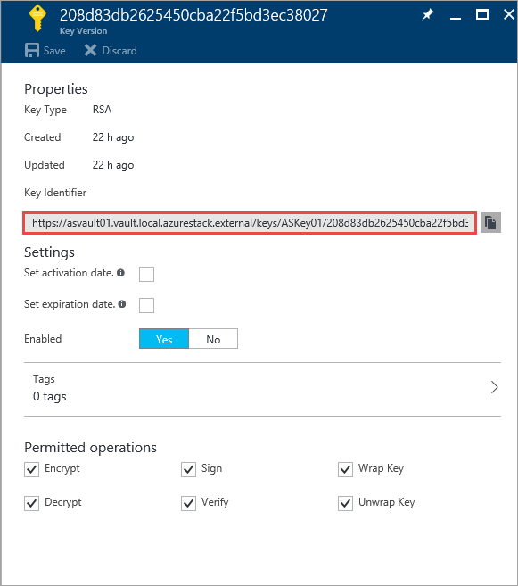
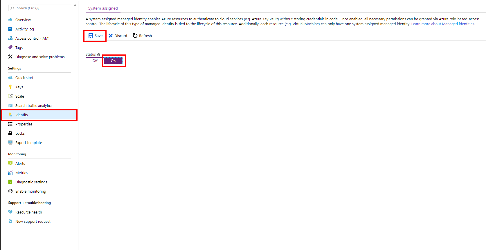
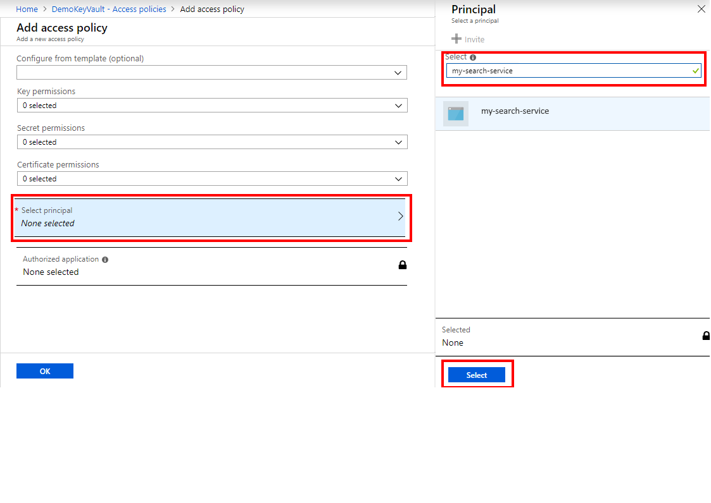
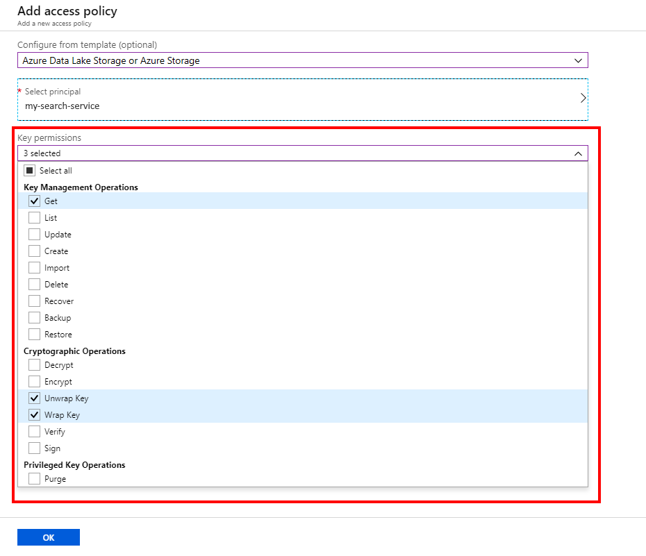

# Azure Search encryption using customer-managed keys in Azure Key Vault

> [!Note]
> Encryption with customer-managed keys is in preview and not intended for production use. The [REST API version 2019-05-06-Preview](search-api-preview.md) provides this feature. You can also use the .NET SDK version 8.0-preview.
>
> This feature is not available for free services. You must use a billable search service created on or after 2019-01-01. There is no portal support at this time.

By default, Azure Search encrypts user content at rest with [service-managed keys](https://docs.microsoft.com/azure/security/azure-security-encryption-atrest#data-encryption-models). 
You can supplement default encryption with an additional encryption layer using keys that you create and manage in Azure Key Vault. This article walks you through the steps.

Server-side encryption is supported through integration with [Azure Key Vault](https://docs.microsoft.com/azure/key-vault/key-vault-overview). You can create your own encryption keys and store them in a key vault, or you can use Azure Key Vault's APIs to generate encryption keys. With Azure Key Vault, you can also audit key usage. 

Encryption with customer-managed keys is configured at the index or synonym map level when those objects are created, and not on the search service level. You cannot encrypt content that already exists. 

You can use different keys from different Key vaults. This means a single search service can host multiple encrypted indexes\synonym maps, each encrypted potentially using a different customer-managed key, alongside indexes\synonym maps that are not encrypted using customer-managed keys. 

## Prerequisites

The following services are used in this example. 

+ [Create an Azure Search service](search-create-service-portal.md) or [find an existing service](https://ms.portal.azure.com/#blade/HubsExtension/BrowseResourceBlade/resourceType/Microsoft.Search%2FsearchServices) under your current subscription. You can use a free service for this tutorial.

+ [Create an Azure Key Vault resource](https://docs.microsoft.com/azure/key-vault/quick-create-portal#create-a-vault) or find an existing vault under your subscription.

+ [Azure PowerShell](https://docs.microsoft.com/powershell/azure/overview) or [Azure CLI](https://docs.microsoft.com/cli/azure/install-azure-cli) is used for configuration tasks.

+ [Postman](search-get-started-postman.md), [Azure PowerShell](search-create-index-rest-api.md) and [Azure Search SDK](https://aka.ms/search-sdk-preview) can be used to call the preview REST API. There is no portal or .NET SDK support for customer-managed encryption at this time.

## 1 - Enable key recovery

This step is optional but highly recommended. After creating the Azure Key Vault resource, enable **Soft Delete** and **Purge Protection** in the selected Key vault by executing the following PowerShell or Azure CLI commands:   

```powershell
$resource = Get-AzResource -ResourceId (Get-AzKeyVault -VaultName "<vault_name>").ResourceId

$resource.Properties | Add-Member -MemberType NoteProperty -Name "enableSoftDelete" -Value 'true'

$resource.Properties | Add-Member -MemberType NoteProperty -Name "enablePurgeProtection" -Value 'true'

Set-AzResource -resourceid $resource.ResourceId -Properties $resource.Properties
```

```azurecli-interactive
az keyvault update -n <vault_name> -g <resource_group> --enable-soft-delete --enable-purge-protection
```

>[!Note]
> Due to the very nature of the encryption with customer-managed keys feature, Azure Search will not be able to retrieve your data if your Azure Key vault key is deleted. To prevent data loss caused by accidental Key Vault key deletions, it is highly recommended that you enable Soft Delete and Purge Protection on the selected key vault. For more information, see [Azure Key Vault soft-delete](https://docs.microsoft.com/azure/key-vault/key-vault-ovw-soft-delete).   

## 2 - Create a new key

If you are using an existing key to encrypt Azure Search content, skip this step.

1. [Sign in to Azure portal](https://portal.azure.com) and navigate to the key vault dashboard.

1. Select the **Keys** setting from the left navigation pane, and click **+ Generate/Import**.

1. In the **Create a key** pane, from the list of **Options**, choose the method that you want to use to create a key. You can **Generate** a new key, **Upload** an existing key, or use **Restore Backup** to select a backup of a key.

1. Enter a **Name** for your key, and optionally select other key properties.

1. Click on the **Create** button to start the deployment.

Make a note of the Key Identifier – this is composed from the **key value Uri**, the **key name**, and the **key version**. You will need these to define an encrypted index in Azure Search.
 


## 3 - Create a service identity

Assigning an identity to your search service enables you to grant Key Vault access permissions to your search service. Your search service will use its identity to authenticate with Azure Key vault.

Azure Search supports two ways for assigning identity: a managed identity or an externally-managed Azure Active Directory application. 

If possible, use a managed identity. It is the simplest way of assigning an identity to your search service and should work in most scenarios. If you are using multiple keys for indexes and synonym maps, or if your solution is in a distributed architecture that disqualifies identity-based authentication, use the advanced [externally-managed Azure Active Directory approach](#aad-app) described at the end of this article.

 In general, a managed identity enables your search service to authenticate to Azure Key Vault without storing credentials in code. The lifecycle of this type of managed identity is tied to the lifecycle of your search service, which can only have one managed identity. [Learn more about Managed identities](https://docs.microsoft.com/azure/active-directory/managed-identities-azure-resources/overview).

1. To create a managed identity, [sign in toAzure portal](https://portal.azure.com) and open your search service dashboard. 

1. Click **Identity** in the left navigation pane, change its status to **On**, and click **Save**.



## 4 - Grant key access permissions

To enable your search service to use your Key Vault key, you'll need to grant your search service certain access permissions.

Access permissions could be revoked at any given time. Once revoked, any search service index or synonym map that uses that key vault will become unusable. Restoring Key vault access permissions at a later time will restore index\synonym map access. For more information, see [Secure access to a key vault](https://docs.microsoft.com/azure/key-vault/key-vault-secure-your-key-vault).

1. [Sign in to Azure portal](https://portal.azure.com) and open your key vault overview page. 

1. Select the **Access policies** setting from the left navigation pane, and click **+Add new**.

   

1. Click **Select principal** and select your Azure Search service. You can search for it by name or by the object ID that was displayed after enabling managed identity.

   

1. Click on **Key permissions** and select *Get*, *Unwrap Key* and *Wrap Key*. You can use the *Azure Data Lake Storage or Azure Storage* template to quickly select the required permissions.

   Azure search must be granted with the following [access permissions](https://docs.microsoft.com/azure/key-vault/about-keys-secrets-and-certificates#key-operations):

   * *Get* - allows your search service to retrieve the public parts of your key in a Key Vault
   * *Wrap Key* - allows your search service to use your key to protect the internal encryption key
   * *Unwrap Key* - allows your search service to use your key to unwrap the internal encryption key

   

1. Click **OK** and **Save** the access policy changes.

> [!Important]
> Encrypted content in Azure search is configured to use a specific Azure Key Vault key with a specific **version**. If you change the key or version, the index or synonym map must be updated to use the new key\version **before** deleting the previous key\version. 
> Failing to do so will render the index or synonym map unusable, at you won't be able to decrypt the content once key access is lost.   

## 5 - Encrypt content

Creating an index or synonym map encrypted with customer-managed key is not yet possible using Azure portal. Use Azure Search REST API to create such an index or synonym map.

Both index and synonym map support a new top-level **encryptionKey** property used to specify the key. 

Using the **key vault Uri**, **key name** and the **key version** of your Key vault key, we can create an **encryptionKey** definition:

```json
{
  "encryptionKey": {
    "keyVaultUri": "https://demokeyvault.vault.azure.net",
    "keyVaultKeyName": "myEncryptionKey",
    "keyVaultKeyVersion": "eaab6a663d59439ebb95ce2fe7d5f660"
  }
}
```
> [!Note] 
> None of these key vault details are considered secret and could be easily retrieved by browsing to the relevant Azure Key Vault key page in Azure portal.

If you are using an AAD application for Key Vault authentication instead of using a managed identity, add the AAD application **access credentials** to your encryption key: 
```json
{
  "encryptionKey": {
    "keyVaultUri": "https://demokeyvault.vault.azure.net",
    "keyVaultKeyName": "myEncryptionKey",
    "keyVaultKeyVersion": "eaab6a663d59439ebb95ce2fe7d5f660",
    "accessCredentials": {
      "applicationId": "00000000-0000-0000-0000-000000000000",
      "applicationSecret": "myApplicationSecret"
    }
  }
}
```

## Example: Index encryption
The details of creating a new index via the REST API could be found at [Create Index (Azure Search Service REST API)](https://docs.microsoft.com/rest/api/searchservice/create-index), where the only difference here is specifying the encryption key details as part of the index definition: 

```json
{
 "name": "hotels",  
 "fields": [
  {"name": "HotelId", "type": "Edm.String", "key": true, "filterable": true},
  {"name": "HotelName", "type": "Edm.String", "searchable": true, "filterable": false, "sortable": true, "facetable": false},
  {"name": "Description", "type": "Edm.String", "searchable": true, "filterable": false, "sortable": false, "facetable": false, "analyzer": "en.lucene"},
  {"name": "Description_fr", "type": "Edm.String", "searchable": true, "filterable": false, "sortable": false, "facetable": false, "analyzer": "fr.lucene"},
  {"name": "Category", "type": "Edm.String", "searchable": true, "filterable": true, "sortable": true, "facetable": true},
  {"name": "Tags", "type": "Collection(Edm.String)", "searchable": true, "filterable": true, "sortable": false, "facetable": true},
  {"name": "ParkingIncluded", "type": "Edm.Boolean", "filterable": true, "sortable": true, "facetable": true},
  {"name": "LastRenovationDate", "type": "Edm.DateTimeOffset", "filterable": true, "sortable": true, "facetable": true},
  {"name": "Rating", "type": "Edm.Double", "filterable": true, "sortable": true, "facetable": true},
  {"name": "Location", "type": "Edm.GeographyPoint", "filterable": true, "sortable": true},
 ],
 "encryptionKey": {
   "keyVaultUri": "https://demokeyvault.vault.azure.net",
   "keyVaultKeyName": "myEncryptionKey",
   "keyVaultKeyVersion": "eaab6a663d59439ebb95ce2fe7d5f660"
 }
}
```
You can now send the index creation request, and then start using the index normally.

## Example: Synonym map encryption

The details of creating a new synonym map via the REST API can be found at [Create Synonym Map (Azure Search Service REST API)](https://docs.microsoft.com/rest/api/searchservice/create-synonym-map), where the only difference here is specifying the encryption key details as part of the synonym map definition: 

```json
{   
  "name" : "synonymmap1",  
  "format" : "solr",  
  "synonyms" : "United States, United States of America, USA\n
  Washington, Wash. => WA",
  "encryptionKey": {
    "keyVaultUri": "https://demokeyvault.vault.azure.net",
    "keyVaultKeyName": "myEncryptionKey",
    "keyVaultKeyVersion": "eaab6a663d59439ebb95ce2fe7d5f660"
  }
}
```
You can now send the synonym map creation request, and then start using it normally.

>[!Important] 
> While **encryptionKey** cannot be added to existing Azure Search indexes or synonym maps, it may be updated by providing different values for any of the three key vault details (for example, updating the key version). 
> When changing to a new Key Vault key or a new key version, any Azure Search index or synonym map that uses the key must first be updated to use the new key\version **before** deleting the previous key\version. 
> Failing to do so will render the index or synonym map unusable, as it won't be able to decrypt the content once key access is lost.   
> Restoring Key vault access permissions at a later time will restore content access.

## <a name="aad-app"></a> Advanced: Use an externally managed Azure Active Directory application

When a managed identity is not possible, you can create an Azure Active Directory application with a security principal for your Azure Search service. Specifically, a managed identity is not viable under these conditions:

* You cannot directly grant your search service access permissions to the Key vault (for example, if the search service is in a different Active Directory tenant than the Azure Key Vault).

* A single search service is required to host multiple encrypted indexes\synonym maps, each using a different key from a different Key vault, where each key vault must use **a different identity** for authentication. If using a different identity to manage different Key vaults is not a requirement, consider using the managed identity option above.  

To accommodate such topologies, Azure search supports using Azure Active Directory (AAD) applications for authentication between your search service and Key Vault.    
To create an AAD application in the portal:

1. [Create an Azure Active Directory application](https://docs.microsoft.com/azure/active-directory/develop/howto-create-service-principal-portal#create-an-azure-active-directory-application).

1. [Get the application ID and authentication key](https://docs.microsoft.com/azure/active-directory/develop/howto-create-service-principal-portal#get-values-for-signing-in) as those will be required for creating an encrypted index. Values you will need to provide include **application ID** and **authentication key**.

>[!Important]
> When deciding to use an AAD application of authentication instead of a managed identity, consider the fact that Azure Search is not authorized to manage your AAD application on your behalf, and it is up to you to manage your AAD application, such as periodic rotation of the application authentication key.
> When changing an AAD application or its authentication key, any Azure Search index or synonym map that uses that application must first be updated to use the new application ID\key **before** deleting the previous application or its authorization key, and before revoking your Key Vault access to it.
> Failing to do so will render the index or synonym map unusable, as it won't be able to decrypt the content once key access is lost.   

## Next steps

If you are unfamiliar with Azure security architecture, review the [Azure Security documentation](https://docs.microsoft.com/azure/security/), and in particular, this article:

> [!div class="nextstepaction"]
> [Data encryption-at-rest](https://docs.microsoft.com/azure/security/azure-security-encryption-atrest)
