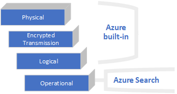

# Security and controlled access in Azure Search

Azure Search is [SOC 2 compliant](https://servicetrust.microsoft.com/ViewPage/MSComplianceGuide?command=Download&downloadType=Document&downloadId=93292f19-f43e-4c4e-8615-c38ab953cf95&docTab=4ce99610-c9c0-11e7-8c2c-f908a777fa4d_SOC%20%2F%20SSAE%2016%20Reports), with a comprehensive security architecture spanning physical security, encrypted transmissions, encrypted storage, and platform-wide software safeguards. Operationally, Azure Search only accepts authenticated requests. Optionally, you can add per-user access controls on content. This article touches on security at each layer, but is primarily focused on how data and operations are secured in Azure Search.

## Physical security

Microsoft data centers provide industry-leading physical security and are compliant with an extensive portfolio of standards and regulations. To learn more, go to the [Global data centers](https://www.microsoft.com/cloud-platform/global-datacenters) page or watch a short video on data center security.

> [!VIDEO https://www.youtube.com/embed/r1cyTL8JqRg]

## Encrypted transmission and storage

Encryption extends throughout the entire indexing pipeline: from connections, through transmission, and down to indexed data stored in Azure Search.

| Security layer | Description |
|----------------|-------------|
| Encryption in transit | Azure Search listens on HTTPS port 443. Across the platform, connections to Azure services are encrypted. |
| Encryption at rest | Encryption is fully internalized in the indexing process, with no measurable impact on indexing time-to-completion or index size. It occurs automatically on all indexing, including on incremental updates to an index that is not fully encrypted (created before January 2018).  Internally, encryption is based on [Azure Storage Service Encryption](https://docs.microsoft.com/azure/storage/common/storage-service-encryption), using 256-bit [AES encryption](https://en.wikipedia.org/wiki/Advanced_Encryption_Standard).|
| [SOC 2 compliance](https://www.aicpa.org/interestareas/frc/assuranceadvisoryservices/aicpasoc2report.html) | All search services are fully AICPA SOC 2 compliant, in all data centers providing Azure Search. To review the full report, go to [Azure - and Azure Government SOC 2 Type II Report](https://servicetrust.microsoft.com/ViewPage/MSComplianceGuide?command=Download&downloadType=Document&downloadId=93292f19-f43e-4c4e-8615-c38ab953cf95&docTab=4ce99610-c9c0-11e7-8c2c-f908a777fa4d_SOC%20%2F%20SSAE%2016%20Reports). |

Encryption is internal to Azure Search, with certificates and encryption keys managed internally by Microsoft, and universally applied. You cannot turn encryption on or off, manage or substitute your own keys, or view encryption settings in the portal or programmatically. 

Encryption at rest was announced in January 24, 2018 and applies to all service tiers, including shared (free) services, in all regions. For full encryption, indexes created prior to that date must be dropped and rebuilt in order for encryption to occur. Otherwise, only new data added after January 24 is encrypted.

## Azure-wide logical security

Several security mechanisms are available across the Azure Stack, and thus automatically available to the Azure Search resources you create.

+ [Locks at the subscription or resource level to prevent deletion](../azure-resource-manager/resource-group-lock-resources.md)
+ [Role-based Access Control (RBAC) to control access to information and administrative operations](../active-directory/role-based-access-control-what-is.md)

All Azure services support role-based access controls (RBAC) for setting levels of access consistently across all services. For example, viewing sensitive data, such as the admin key, is restricted to the Owner and Contributor roles, whereas viewing service status is available to members of any role. RBAC provides Owner, Contributor, and Reader roles. By default, all service administrators are members of the Owner role.

## Service access and authentication

While Azure Search inherits the security safeguards of the Azure platform, it also provides its own key-based authentication. An api-key is a string composed of randomly generated numbers and letters. The type of key (admin or query) determines the level of access. Submission of a valid key is considered proof the request originates from a trusted entity. 
Two types of keys are used to access your search service:

* Admin (valid for any read-write operation against the service)
* Query (valid for read-only operations such as queries against an index)

Admin keys are created when the service is provisioned. There are two admin keys, designated as *primary* and *secondary* to keep them straight, but in fact they are interchangeable. Each service has two admin keys so that you can roll one over without losing access to your service. You can regenerate either admin key, but you cannot add to the total admin key count. There is a maximum of two admin keys per search service.

Query keys are created as-needed and are designed for client applications that call Search directly. You can create up to 50 query keys. In application code, you specify the search URL and a query api-key to allow read-only access to the service. Your application code also specifies the index used by your application. Together, the endpoint, an api-key for read-only access, and a target index define the scope and access level of the connection from your client application.

Authentication is required on each request, where each request is composed of a mandatory key, an operation, and an object. When chained together, the two permission levels (full or read-only) plus the context (for example, a query operation on an index) are sufficient for providing full-spectrum security on service operations. For more information about keys, see [Create and manage api-keys](search-security-api-keys.md).

## Index access

In Azure Search, an individual index is not a securable object. Instead, access to an index is determined at the service layer (read or write access), along with the context of an operation.

In the case of end-user access, you can structure query requests in your application to connect using a query key, which makes any request read-only, and include the specific index used by your app. In a query request, there is no concept of joining indexes or accessing multiple indexes simultaneously so all requests target a single index by definition. As such, the structure of the query request itself (a key plus a single target index) defines the security boundary.

Administrator and developer access to indexes is undifferentiated: both need write access to create, delete, and update objects managed by the service. Anyone with an admin key to your service can read, modify, or delete any index in the same service. For protection against accidental or malicious deletion of indexes, your in-house source control for code assets is the remedy for reversing an unwanted index deletion or modification. Azure Search has failover within the cluster to ensure availability, but it does not store or execute your proprietary code used to create or load indexes.

For multitenancy solutions requiring security boundaries at the index level, such solutions typically include a middle tier, which customers use to handle index isolation. For more information about the multitenant use case, see [Design patterns for multitenant SaaS applications and Azure Search](search-modeling-multitenant-saas-applications.md).

## Admin access from client apps

The Azure Search Management REST API is an extension of the Azure Resource Manager and shares its dependencies. As such, Active Directory is a prerequisite to service administration of Azure Search. All administrative requests from client code must be authenticated using Azure Active Directory before the request reaches the Resource Manager.

Data requests against the Azure Search service endpoint, such as Create Index (Azure Search Service REST API) or Search Documents (Azure Search Service REST API), use an api-key in the request header.

If your application code handles service administration operations as well as data operations on search indexes or documents, implement two authentication approaches in your code: the access key native to Azure Search, and the Active Directory authentication methodology required by Resource Manager. 

For information about structuring a request in Azure Search, see [Azure Search Service REST](https://docs.microsoft.com/rest/api/searchservice/). For more information about authentication requirements for Resource Manager, see [Use Resource Manager authentication API to access subscriptions](../azure-resource-manager/resource-manager-api-authentication.md).

## User access to index content

Per-user access to the contents of an index is implemented through security filters on your queries, returning documents associated with a given security identity. Instead of predefined roles and role assignments, identity-based access control is implemented as a filter that trims search results of documents and content based on identities. The following table describes two approaches for trimming search results of unauthorized content.

| Approach | Description |
|----------|-------------|
|[Security trimming based on identity filters](search-security-trimming-for-azure-search.md)  | Documents the basic workflow for implementing user identity access control. It covers adding security identifiers to an index, and then explains filtering against that field to trim results of prohibited content. |
|[Security trimming based on Azure Active Directory identities](search-security-trimming-for-azure-search-with-aad.md)  | This article expands on the previous article, providing steps for retrieving identities from Azure Active Directory (AAD), one of the [free services](https://azure.microsoft.com/free/) in the Azure cloud platform. |

## Table: Permissioned operations

The following table summarizes the operations allowed in Azure Search and which key unlocks access a particular operation.

| Operation | Permissions |
|-----------|-------------------------|
| Create a service | Azure subscription holder|
| Scale a service | Admin key, RBAC Owner or Contributor on the resource  |
| Delete a service | Admin key, RBAC Owner or Contributor on the resource |
| Create, modify, delete objects on the service:  Indexes and component parts (including analyzer definitions, scoring profiles, CORS options), indexers, data sources, synonyms, suggesters. | Admin key, RBAC Owner or Contributor on the resource  |
| Query an index | Admin or query key (RBAC not applicable) |
| Query system information, such as returning statistics, counts, and lists of objects. | Admin key, RBAC on the resource (Owner, Contributor, Reader) |
| Manage admin keys | Admin key, RBAC Owner or Contributor on the resource. |
| Manage query keys |  Admin key, RBAC Owner or Contributor on the resource.  |

## See also

+ [Get started .NET (demonstrates using an admin key to create an index)](search-create-index-dotnet.md)
+ [Get started REST (demonstrates using an admin key to create an index)](search-create-index-rest-api.md)
+ [Identity-based access control using Azure Search filters](search-security-trimming-for-azure-search.md)
+ [Active Directory identity-based access control using Azure Search filters](search-security-trimming-for-azure-search-with-aad.md)
+ [Filters in Azure Search](search-filters.md)