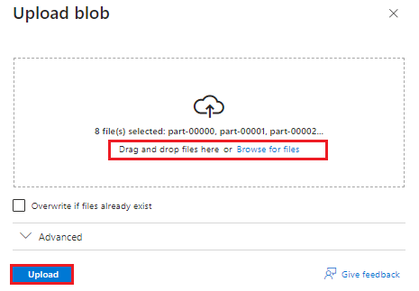
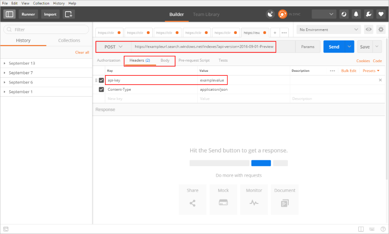
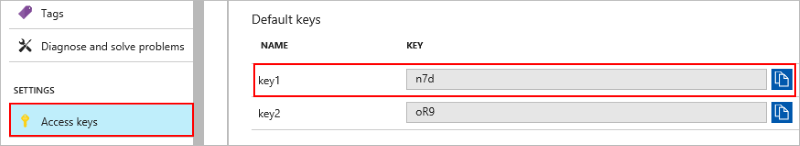
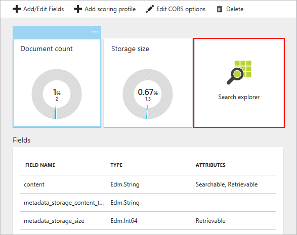
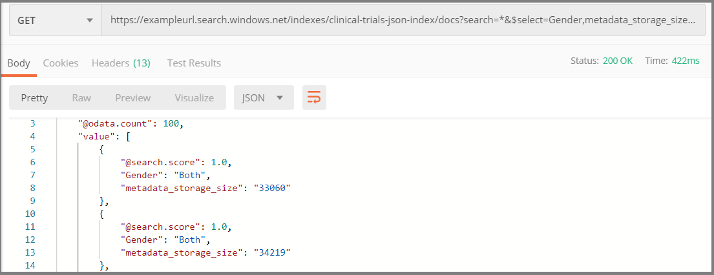
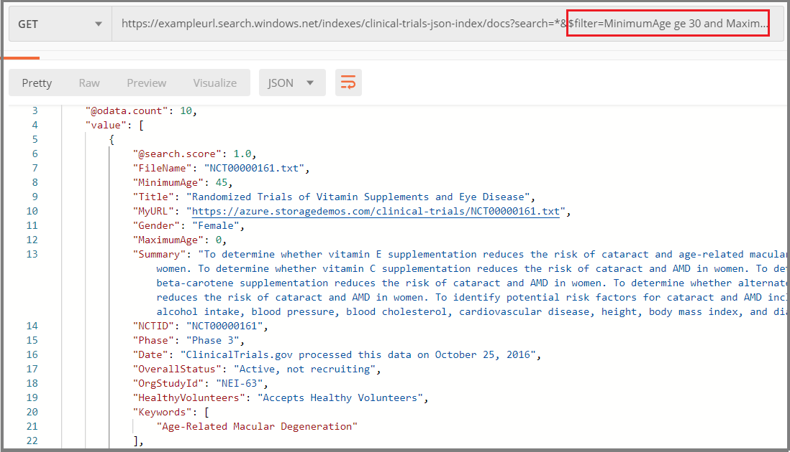

# REST Tutorial: Index and search semi-structured data (JSON blobs) in Azure Search

Azure Search can index JSON documents and arrays in Azure blob storage using an [indexer](search-indexer-overview.md) that knows how to read semi-structured data. Semi-structured data contains tags or markings which separate content within the data. It splits the difference between unstructured data, which must be fully indexed, and formally structured data that adheres to a data model, such as a relational database schema, that can be indexed on a per-field basis.

In this tutorial, use the [Azure Search REST APIs](https://docs.microsoft.com/rest/api/searchservice/) and a REST client to perform the following tasks:

> [!div class="checklist"]
> * Configure an Azure Search data source for an Azure blob container
> * Create an Azure Search index to contain searchable content
> * Configure and run an indexer to read the container and extract searchable content from Azure blob storage
> * Search the index you just created

## Prerequisites

The following services, tools, and data are used in this quickstart. 

[Create an Azure Search service](search-create-service-portal.md) or [find an existing service](https://ms.portal.azure.com/#blade/HubsExtension/BrowseResourceBlade/resourceType/Microsoft.Search%2FsearchServices) under your current subscription. You can use a free service for this tutorial. 

[Create an Azure storage account](https://docs.microsoft.com/azure/storage/common/storage-quickstart-create-account) for storing the sample data.

[Postman desktop app](https://www.getpostman.com/) for sending requests to Azure Search.

[Clinical-trials-json.zip](https://github.com/Azure-Samples/storage-blob-integration-with-cdn-search-hdi/raw/master/clinical-trials-json.zip) contains the data used in this tutorial. Download and unzip this file to its own folder. Data originates from [clinicaltrials.gov](https://clinicaltrials.gov/ct2/results), converted to JSON for this tutorial.

## Get a key and URL

REST calls require the service URL and an access key on every request. A search service is created with both, so if you added Azure Search to your subscription, follow these steps to get the necessary information:

1. [Sign in to the Azure portal](https://portal.azure.com/), and in your search service **Overview** page, get the URL. An example endpoint might look like `https://mydemo.search.windows.net`.

1. In **Settings** > **Keys**, get an admin key for full rights on the service. There are two interchangeable admin keys, provided for business continuity in case you need to roll one over. You can use either the primary or secondary key on requests for adding, modifying, and deleting objects.


All requests require an api-key on every request sent to your service. Having a valid key establishes trust, on a per request basis, between the application sending the request and the service that handles it.

## Prepare sample data

1. [Sign in to the Azure portal](https://portal.azure.com), navigate to your Azure storage account, click **Blobs**, and then click **+ Container**.

1. [Create a Blob container](https://docs.microsoft.com/azure/storage/blobs/storage-quickstart-blobs-portal) to contain sample data. You can set the Public Access Level to any of its valid values.

1. After the container is created, open it and select **Upload** on the command bar.

   

1. Navigate to the folder containing the sample files. Select all of them and then click **Upload**.

   

After the upload completes, the files should appear in their own subfolder inside the data container.

## Set up Postman

Start Postman and set up an HTTP request. If you are unfamiliar with this tool, see [Explore Azure Search REST APIs using Postman](search-get-started-postman.md).

The request method for every call in this tutorial is **POST**. The header keys are "Content-type" and "api-key." The values of the header keys are "application/json" and your "admin key" (the admin key is a placeholder for your search primary key) respectively. The body is where you place the actual contents of your call. Depending on the client you're using, there may be some variations on how you construct your query, but those are the basics.

  

We are using Postman to make three API calls to your search service in order to create a data source, an index, and an indexer. The data source includes a pointer to your storage account and your JSON data. Your search service makes the connection when loading the data.

Query strings must specify an api-version and each call should return a **201 Created**. The generally available api-version for using JSON arrays is `2019-05-06`.

Execute the following three API calls from your REST client.

## Create a data source

The [Create Data Source API](https://docs.microsoft.com/rest/api/searchservice/create-data-source)creates an Azure Search object that specifies what data to index.

The endpoint of this call is `https://[service name].search.windows.net/datasources?api-version=2019-05-06`. Replace `[service name]` with the name of your search service. 

For this call, the request body must include the name of your storage account, storage account key, and blob container name. The storage account key can be found in the Azure portal inside your storage account's **Access Keys**. The location is shown in the following image:

  

Make sure to replace `[storage account name]`, `[storage account key]`, and `[blob container name]` in the body of your call before executing the call.

```json
{
    "name" : "clinical-trials-json",
    "type" : "azureblob",
    "credentials" : { "connectionString" : "DefaultEndpointsProtocol=https;AccountName=[storage account name];AccountKey=[storage account key];" },
    "container" : { "name" : "[blob container name]"}
}
```

The response should look like:

```json
{
    "@odata.context": "https://exampleurl.search.windows.net/$metadata#datasources/$entity",
    "@odata.etag": "\"0x8D505FBC3856C9E\"",
    "name": "clinical-trials-json",
    "description": null,
    "type": "azureblob",
    "subtype": null,
    "credentials": {
        "connectionString": "DefaultEndpointsProtocol=https;AccountName=[mystorageaccounthere];AccountKey=[[myaccountkeyhere]]];"
    },
    "container": {
        "name": "[mycontainernamehere]",
        "query": null
    },
    "dataChangeDetectionPolicy": null,
    "dataDeletionDetectionPolicy": null
}
```

## Create an index
    
The second call is [Create Index API](https://docs.microsoft.com/rest/api/searchservice/create-indexer), creating an Azure Search index that stores all searchable data. An index specifies all the parameters and their attributes.

The URL for this call is `https://[service name].search.windows.net/indexes?api-version=2019-05-06`. Replace `[service name]` with the name of your search service.

First replace the URL. Then copy and paste the following code into your body and run the query.

```json
{
  "name": "clinical-trials-json-index",  
  "fields": [
  {"name": "FileName", "type": "Edm.String", "searchable": false, "retrievable": true, "facetable": false, "filterable": false, "sortable": true},
  {"name": "Description", "type": "Edm.String", "searchable": true, "retrievable": false, "facetable": false, "filterable": false, "sortable": false},
  {"name": "MinimumAge", "type": "Edm.Int32", "searchable": false, "retrievable": true, "facetable": true, "filterable": true, "sortable": true},
  {"name": "Title", "type": "Edm.String", "searchable": true, "retrievable": true, "facetable": false, "filterable": true, "sortable": true},
  {"name": "URL", "type": "Edm.String", "searchable": false, "retrievable": false, "facetable": false, "filterable": false, "sortable": false},
  {"name": "MyURL", "type": "Edm.String", "searchable": false, "retrievable": true, "facetable": false, "filterable": false, "sortable": false},
  {"name": "Gender", "type": "Edm.String", "searchable": false, "retrievable": true, "facetable": true, "filterable": true, "sortable": false},
  {"name": "MaximumAge", "type": "Edm.Int32", "searchable": false, "retrievable": true, "facetable": true, "filterable": true, "sortable": true},
  {"name": "Summary", "type": "Edm.String", "searchable": true, "retrievable": true, "facetable": false, "filterable": false, "sortable": false},
  {"name": "NCTID", "type": "Edm.String", "key": true, "searchable": true, "retrievable": true, "facetable": false, "filterable": true, "sortable": true},
  {"name": "Phase", "type": "Edm.String", "searchable": false, "retrievable": true, "facetable": true, "filterable": true, "sortable": false},
  {"name": "Date", "type": "Edm.String", "searchable": false, "retrievable": true, "facetable": false, "filterable": false, "sortable": true},
  {"name": "OverallStatus", "type": "Edm.String", "searchable": false, "retrievable": true, "facetable": true, "filterable": true, "sortable": false},
  {"name": "OrgStudyId", "type": "Edm.String", "searchable": true, "retrievable": true, "facetable": false, "filterable": true, "sortable": false},
  {"name": "HealthyVolunteers", "type": "Edm.String", "searchable": false, "retrievable": true, "facetable": true, "filterable": true, "sortable": false},
  {"name": "Keywords", "type": "Collection(Edm.String)", "searchable": true, "retrievable": true, "facetable": true, "filterable": false, "sortable": false},
  {"name": "metadata_storage_last_modified", "type":"Edm.DateTimeOffset", "searchable": false, "retrievable": true, "filterable": true, "sortable": false},
  {"name": "metadata_storage_size", "type":"Edm.String", "searchable": false, "retrievable": true, "filterable": true, "sortable": false},
  {"name": "metadata_content_type", "type":"Edm.String", "searchable": true, "retrievable": true, "filterable": true, "sortable": false}
  ],
  "suggesters": [
  {
    "name": "sg",
    "searchMode": "analyzingInfixMatching",
    "sourceFields": ["Title"]
  }
  ]
}
```

The response should look like:

```json
{
    "@odata.context": "https://exampleurl.search.windows.net/$metadata#indexes/$entity",
    "@odata.etag": "\"0x8D505FC00EDD5FA\"",
    "name": "clinical-trials-json-index",
    "fields": [
        {
            "name": "FileName",
            "type": "Edm.String",
            "searchable": false,
            "filterable": false,
            "retrievable": true,
            "sortable": true,
            "facetable": false,
            "key": false,
            "indexAnalyzer": null,
            "searchAnalyzer": null,
            "analyzer": null,
            "synonymMaps": []
        },
        {
            "name": "Description",
            "type": "Edm.String",
            "searchable": true,
            "filterable": false,
            "retrievable": false,
            "sortable": false,
            "facetable": false,
            "key": false,
            "indexAnalyzer": null,
            "searchAnalyzer": null,
            "analyzer": null,
            "synonymMaps": []
        },
        ...
          "scoringProfiles": [],
    "defaultScoringProfile": null,
    "corsOptions": null,
    "suggesters": [],
    "analyzers": [],
    "tokenizers": [],
    "tokenFilters": [],
    "charFilters": []
}
```

## Create and run an indexer

An indexer connects the data source, imports data into the target search index, and optionally provides a schedule to automate the data refresh. The REST API is [Create Indexer](https://docs.microsoft.com/rest/api/searchservice/create-indexer).

The URL for this call is `https://[service name].search.windows.net/indexers?api-version=2019-05-06`. Replace `[service name]` with the name of your search service.

First replace the URL. Then copy and paste the following code into your body and send the request. The request is processed immediately. When the response comes back, you will have an index that is full-text searchable.

```json
{
  "name" : "clinical-trials-json-indexer",
  "dataSourceName" : "clinical-trials-json",
  "targetIndexName" : "clinical-trials-json-index",
  "parameters" : { "configuration" : { "parsingMode" : "jsonArray" } }
}
```

The response should look like:

```json
{
    "@odata.context": "https://exampleurl.search.windows.net/$metadata#indexers/$entity",
    "@odata.etag": "\"0x8D505FDE143D164\"",
    "name": "clinical-trials-json-indexer",
    "description": null,
    "dataSourceName": "clinical-trials-json",
    "targetIndexName": "clinical-trials-json-index",
    "schedule": null,
    "parameters": {
        "batchSize": null,
        "maxFailedItems": null,
        "maxFailedItemsPerBatch": null,
        "base64EncodeKeys": null,
        "configuration": {
            "parsingMode": "jsonArray"
        }
    },
    "fieldMappings": [],
    "enrichers": [],
    "disabled": null
}
```

## Search your JSON files

You can start searching as soon as the first document is loaded. For this task, use [**Search explorer**](search-explorer.md) in the portal.

In Azure portal, open the search service **Overview** page, find the index you created in the **Indexes** list.

Be sure to choose the index you just created. 

  

### User-defined metadata search

As before, the data can be queried in a number of ways: full text search, system properties, or user-defined metadata. Both system properties and user-defined metadata may only be searched with the `$select` parameter if they were marked as **retrievable** during creation of the target index. Parameters in the index may not be altered once they are created. However, additional parameters may be added.

An example of a basic query is `$select=Gender,metadata_storage_size`, which limits the return to those two parameters.

  

An example of more complex query would be `$filter=MinimumAge ge 30 and MaximumAge lt 75`, which returns only results where the parameters MinimumAge is greater than or equal to 30 and MaximumAge is less than 75.

  

If you'd like to experiment and try a few more queries yourself, feel free to do so. Know that you can use Logical operators (and, or, not) and comparison operators (eq, ne, gt, lt, ge, le). String comparisons are case-sensitive.

The `$filter` parameter only works with metadata that were marked filterable at the creation of your index.

## Clean up resources

The fastest way to clean up after a tutorial is by deleting the resource group containing the Azure Search service. You can delete the resource group now to permanently delete everything in it. In the portal, the resource group name is on the Overview page of Azure Search service.

## Next steps

There are several approaches and multiple options for indexing JSON blobs. As a next step, review and test the various options to see what works best for your scenario.

> [!div class="nextstepaction"]
> [How to index JSON blobs using Azure Search Blob indexer](search-howto-index-json-blobs.md)
