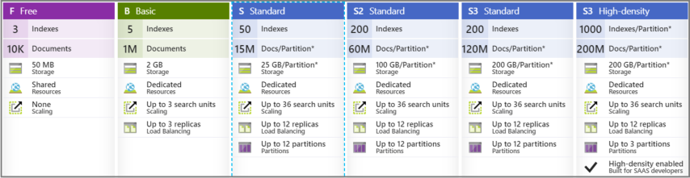

# Choose a pricing tier for Azure Cognitive Search

When you create an Azure Cognitive Search service, a [resource is created](search-create-service-portal.md) at a pricing tier (or SKU) that's fixed for the lifetime of the service. Tiers include Free, Basic, Standard, and Storage Optimized. Standard and Storage Optimized are available with several configurations and capacities.

Most customers start with the Free tier so they can evaluate the service. Post-evaluation, it's common to create a second service at one of the higher tiers for development and production deployments.

## Feature availability by tier

Almost every feature is available on every tier, including Free, but a feature or workflow that is resource intensive might not work well unless you give it sufficient capacity. For example, [AI enrichment](cognitive-search-concept-intro.md) has long-running skills that time out on a free service unless the dataset is small.

The following table describes tier-related feature constraints.

| Feature | Limitations |
|---------|-------------|
| [indexers](search-indexer-overview.md) | Indexers are not available on S3 HD. |
| [Customer-managed encryption keys](search-security-manage-encryption-keys.md) | Not available on the Free tier. |

## Tiers (SKUs)

Tiers are differentiated by:

+ Quantity of indexes and indexers you can create
+ Size and speed of partitions (physical storage)

The tier you select determines the billable rate. The following screenshot from Azure portal shows the available tiers, minus pricing (which you can find in the portal and on the [pricing page](https://azure.microsoft.com/pricing/details/search/). **Free**, **Basic**, and **Standard** are the most common tiers.

**Free** creates a limited search service for smaller projects, including quickstarts and tutorials. Internally, replicas and partitions are shared among multiple subscribers. You cannot scale a free service or run significant workloads.

**Basic** and **Standard** are the most commonly used billable tiers, with **Standard** being the default. With dedicated resources under your control, you can deploy larger projects, optimize performance, and set the capacity.

Some tiers are optimized for certain types of work. For example, **Standard 3 High Density (S3 HD)** is a *hosting mode* for S3, where the underlying hardware is optimized for a large number of smaller indexes and is intended for multitenancy scenarios. S3 HD has the same per-unit charge as S3, but the hardware is optimized for fast file reads on a large number of smaller indexes.

**Storage Optimized** tiers offer larger storage capacity at a lower price per TB than the Standard tiers. The primary tradeoff is higher query latency, which you should validate for your specific application requirements.  To learn more about the performance considerations of this tier, see [Performance and optimization considerations](search-performance-optimization.md).

You can find out more about the various tiers on the [pricing page](https://azure.microsoft.com/pricing/details/search/), in the [Service limits in Azure Cognitive Search](search-limits-quotas-capacity.md) article, and on the portal page when you're provisioning a service.

## Billable events

A solution built on Azure Cognitive Search can incur costs in the following ways:

+ Fixed cost of the service itself, running 24x7, at minimum configuration (one partition and replica)
+ Incremental cost when scaling up (add replicas or partitions)
+ Bandwidth charges (outbound data transfer) 
+ Cognitive search (attaching Cognitive Services for AI enrichment, or using Azure storage for knowledge store)

### Service costs

Unlike virtual machines or other resources that can be "paused" to avoid charges, an Azure Cognitive Search service is always available on hardware dedicated for your exclusive use. As such, creating a service is a billable event that starts when you create the service, and ends when you delete the service. 

The minimum charge is the first search unit (one replica x one partition) at the billable rate. This minimum is fixed for the lifetime of the service because the service can't run on anything less than this configuration. Beyond the minimum, you can add replicas and partitions independently of each other. Incremental increases in capacity through replicas and partitions will increase your bill based on the following formula: [(replicas x partitions x rate)](#search-units), where the rate you're charged depends on the pricing tier you select.

When you're estimating the cost of a search solution, keep in mind that pricing and capacity aren't linear. (Doubling capacity more than doubles the cost.) For an example of how of the formula works, see [How to allocate replicas and partitions](search-capacity-planning.md#how-to-allocate-replicas-and-partitions).

### Bandwidth charges

Using [Azure Cognitive Search indexers](search-indexer-overview.md) might affect billing, depending on the location of your services. You can eliminate data egress charges entirely if you create the Azure Cognitive Search service in the same region as your data. Here's some information from the [bandwidth pricing page](https://azure.microsoft.com/pricing/details/bandwidth/):

+ Microsoft doesn't charge for any inbound data to any service on Azure, or for any outbound data from Azure Cognitive Search.
+ In multiservice solutions, there's no charge for data crossing the wire when all services are in the same region.

Charges do apply for outbound data if services are in different regions. These charges aren't actually part of your Azure Cognitive Search bill. They're mentioned here because if you're using data or AI-enriched indexers to pull data from different regions, you'll see costs reflected in your overall bill.

### AI enrichment with Cognitive Services

For [AI enrichment](cognitive-search-concept-intro.md), you should plan to [attach a billable Azure Cognitive Services resource](cognitive-search-attach-cognitive-services.md), in the same region as Azure Cognitive Search, at the S0 pricing tier for pay-as-you-go processing. There's no fixed cost associated with attaching Cognitive Services. You pay only for the processing you need.

| Operation | Billing impact |
|-----------|----------------|
| Document cracking, text extraction | Free |
| Document cracking, image extraction | Billed according to the number of images extracted from your documents. In an [indexer configuration](https://docs.microsoft.com/rest/api/searchservice/create-indexer#indexer-parameters), **imageAction** is the parameter that triggers image extraction. If **imageAction** is set to "none" (the default), you won't be charged for image extraction. The rate for image extraction is documented on the [pricing details](https://azure.microsoft.com/pricing/details/search/) page for Azure Cognitive Search.|
| [Built-in cognitive skills](cognitive-search-predefined-skills.md) | Billed at the same rate as if you had performed the task by using Cognitive Services directly. |
| Custom skills | A custom skill is functionality you provide. The cost of using a custom skill depends entirely on whether custom code is calling other metered services. |

The [incremental enrichment (preview)](cognitive-search-incremental-indexing-conceptual.md) feature allows you to provide a cache that enables the indexer to be more efficient at running only the cognitive skills that are necessary if you modify your skillset in the future, saving you time and money.

## Billing formula (R x P = SU)

The most important billing concept to understand for Azure Cognitive Search operations is the *search unit* (SU). Because Azure Cognitive Search depends on both replicas and partitions for indexing and queries, it doesn't make sense to bill by just one or the other. Instead, billing is based on a composite of both.

SU is the product of the *replicas* and *partitions* used by a service: **(R x P = SU)**.

Every service starts with one SU (one replica multiplied by one partition) as the minimum. The maximum for any service is 36 SUs. This maximum can be reached in multiple ways: 6 partitions x 6 replicas, or 3 partitions x 12 replicas, for example. It's common to use less than total capacity (for example, a 3-replica, 3-partition service billed as 9 SUs). See the [Partition and replica combinations](search-capacity-planning.md#chart) chart for valid combinations.

The billing rate is hourly per SU. Each tier has a progressively higher rate. Higher tiers come with larger and speedier partitions, and this contributes to an overall higher hourly rate for that tier. You can view the rates for each tier on the [pricing details](https://azure.microsoft.com/pricing/details/search/) page.

Most customers bring just a portion of total capacity online, holding the rest in reserve. For billing, the number of partitions and replicas that you bring online, calculated by the SU formula, determines what you pay on an hourly basis.

## How to manage costs

The following suggestions can help you keep costs at a minimum:

+ Create all resources in the same region, or in as few regions as possible, to minimize or eliminate bandwidth charges.

+ Consolidate all services into one resource group, such as Azure Cognitive Search, Cognitive Services, and any other Azure services used in your solution. In the Azure portal, find the resource group and use the **Cost Management** commands for insight into actual and projected spending.

+ Consider Azure Web App for your front-end application so that requests and responses stay within the data center boundary.

+ Scale up for resource-intensive operations like indexing, and then readjust downwards for regular query workloads. Start with the minimum configuration for Azure Cognitive Search (one SU composed of one partition and one replica), and then monitor user activity to identify usage patterns that would indicate a need for more capacity. If there is a predictable pattern, you might be able to synchronize scale with activity (you would need to write code to automate this).

Additionally, visit [Billing and cost management](https://docs.microsoft.com/azure/billing/billing-getting-started) for built-in tools and features related to spending.

Shutting down a search service on a temporary basis is not possible. Dedicated resources are always operational, allocated for your exclusive use for the lifetime of your service. Deleting a service is permanent and also deletes its associated data.

In terms of the service itself, the only way to lower your bill is to reduce replicas and partitions to a level that still provides acceptable performance and [SLA compliance](https://azure.microsoft.com/support/legal/sla/search/v1_0/), or create a service at a lower tier (S1 hourly rates are lower than S2 or S3 rates). Assuming you provision your service at the lower end of your load projections, if you outgrow the service, you can create a second larger-tiered service, rebuild your indexes on the second service, and then delete the first one.

## How to evaluate capacity requirements

In Azure Cognitive Search, capacity is structured as *replicas* and *partitions*.

+ Replicas are instances of the search service. Each replica hosts one load-balanced copy of an index. For example, a service with six replicas has six copies of every index loaded in the service.

+ Partitions store indexes and automatically split searchable data. Two partitions split your index in half, three partitions split it into thirds, and so on. In terms of capacity, *partition size* is the primary differentiating feature among tiers.

> [!NOTE]
> All Standard and Storage Optimized tiers support [flexible combinations of replicas and partitions](search-capacity-planning.md#chart) so you can [optimize your system for speed or storage](search-performance-optimization.md) by changing the balance. The Basic tier offers up to three replicas for high availability but has only one partition. Free tiers don't provide dedicated resources: computing resources are shared by multiple subscribers.

### Evaluating capacity

Capacity and the costs of running the service go hand in hand. Tiers impose limits on two levels: storage and resources. You should think about both because whichever limit you reach first is the effective limit.

Business requirements typically dictate the number of indexes you'll need. For example, you might need a global index for a large repository of documents. Or you might need  multiple indexes based on region, application, or business niche.

To determine the size of an index, you have to [build one](search-create-index-portal.md). Its size will be based on imported data and index configuration such as whether you enable suggesters, filtering, and sorting. For more information about configuration impact on size, see [Create a basic index ](search-what-is-an-index.md).

For full text search, the primary data structure is an [inverted index](https://en.wikipedia.org/wiki/Inverted_index) structure, which has different characteristics than source data. For an inverted index, size and complexity are determined by content, not necessarily by the amount of data that you feed into it. A large data source with high redundancy could result in a smaller index than a smaller dataset that contains highly variable content. So it's rarely possible to infer index size based on the size of the original dataset.

> [!NOTE] 
> Even though estimating future needs for indexes and storage can feel like guesswork, it's worth doing. If a tier's capacity turns out to be too low, you'll need to provision a new service at a higher tier and then [reload your indexes](search-howto-reindex.md). There's no in-place upgrade of a service from one SKU to another.
>

### Estimate with the Free tier

One approach for estimating capacity is to start with the Free tier. Remember that the Free service offers up to three indexes, 50 MB of storage, and 2 minutes of indexing time. It can be challenging to estimate a projected index size with these constraints, but these are the steps:

+ [Create a free service](search-create-service-portal.md).
+ Prepare a small, representative dataset.
+ [Build an initial index in the portal](search-create-index-portal.md) and note its size. Features and attributes have an impact on storage. For example, adding suggesters (search-as-you-type queries) will increase storage requirements. Using the same data set, you might try creating multiple versions of an index, with different attributes on each field, to see how storage requirements vary. For more information, see ["Storage implications" in Create a basic index](search-what-is-an-index.md#index-size).

With a rough estimate in hand, you might double that amount to budget for two indexes (development and production) and then choose your tier accordingly.

### Estimate with a billable tier

Dedicated resources can accommodate larger sampling and processing times for more realistic estimates of index quantity, size, and query volumes during development. Some customers jump right in with a billable tier and then re-evaluate as the development project matures.

1. [Review service limits at each tier](https://docs.microsoft.com/azure/search/search-limits-quotas-capacity#index-limits) to determine whether lower tiers can support the number of indexes you need. Across the Basic, S1, and S2 tiers, index limits are 15, 50, and 200, respectively. The Storage Optimized tier has a limit of 10 indexes because it's designed to support a low number of very large indexes.

1. [Create a service at a billable tier](search-create-service-portal.md):

    + Start low, at Basic or S1, if you're not sure about the projected load.
    + Start high, at S2 or even S3, if you know you're going to have large-scale indexing and query loads.
    + Start with Storage Optimized, at L1 or L2, if you're indexing a large amount of data and query load is relatively low, as with an internal business application.

1. [Build an initial index](search-create-index-portal.md) to determine how source data translates to an index. This is the only way to estimate index size.

1. [Monitor storage, service limits, query volume, and latency](search-monitor-usage.md) in the portal. The portal shows you queries per second, throttled queries, and search latency. All of these values can help you decide if you selected the right tier. 

Index number and size are equally important to your analysis. This is because maximum limits are reached through full utilization of storage (partitions) or by maximum limits on resources (indexes, indexers, and so forth), whichever comes first. The portal helps you keep track of both, showing current usage and maximum limits side by side on the Overview page.

> [!NOTE]
> Storage requirements can be inflated if documents contain extraneous data. Ideally, documents contain only the data that you need for the search experience. Binary data isn't searchable and should be stored separately (maybe in an Azure table or blob storage). A field should then be added in the index to hold a URL reference to the external data. The maximum size of an individual document is 16 MB (or less if you're bulk uploading multiple documents in one request). For more information, see [Service limits in Azure Cognitive Search](search-limits-quotas-capacity.md).
>

**Query volume considerations**

Queries per second (QPS) is an important metric during performance tuning, but it's generally only a tier consideration if you expect high query volume at the outset.

The Standard tiers can provide a balance of replicas and partitions. You can increase query turnaround by adding replicas for load balancing or add partitions for parallel processing. You can then tune for performance after the service is provisioned.

If you expect high sustained query volumes from the outset, you should consider higher Standard tiers, backed by more powerful hardware. You can then take partitions and replicas offline, or even switch to a lower-tier service, if those query volumes don't occur. For more information on how to calculate query throughput, see [Azure Cognitive Search performance and optimization](search-performance-optimization.md).

The Storage Optimized tiers are useful for large data workloads, supporting more overall available index storage for when query latency requirements are less important. You should still use additional replicas for load balancing and additional partitions for parallel processing. You can then tune for performance after the service is provisioned.

**Service-level agreements**

The Free tier and preview features don't provide [service-level agreements (SLAs)](https://azure.microsoft.com/support/legal/sla/search/v1_0/). For all billable tiers, SLAs take effect when you provision sufficient redundancy for your service. You need to have two or more replicas for query (read) SLAs. You need to have three or more replicas for query and indexing (read-write) SLAs. The number of partitions doesn't affect SLAs.

## Tips for tier evaluation

+ Allow metrics to build around queries, and collect data around usage patterns (queries during business hours, indexing during off-peak hours). Use this data to inform service provisioning decisions. Though it's not practical at an hourly or daily cadence, you can dynamically adjust partitions and resources to accommodate planned changes in query volumes. You can also accommodate unplanned but sustained changes if levels hold long enough to warrant taking action.

+ Remember that the only downside of under provisioning is that you might have to tear down a service if actual requirements are greater than your predictions. To avoid service disruption, you would create a new service at a higher tier and run it side by side until all apps and requests target the new endpoint.

## Next steps

Start with a Free tier and build an initial index by using a subset of your data to understand its characteristics. The data structure in Azure Cognitive Search is an inverted index structure. The size and complexity of an inverted index is determined by content. Remember that highly redundant content tends to result in a smaller index than highly irregular content. So content characteristics rather than the size of the dataset determine index storage requirements.

After you have an initial estimate of your index size, [provision a billable service](search-create-service-portal.md) on one of the tiers discussed in this article: Basic, Standard, or Storage Optimized. Relax any artificial constraints on data sizing and [rebuild your index](search-howto-reindex.md) to include all the data that you want to be searchable.

[Allocate partitions and replicas](search-capacity-planning.md) as needed to get the performance and scale you require.

If performance and capacity are fine, you're done. Otherwise, re-create a search service at a different tier that more closely aligns with your needs.

> [!NOTE]
> If you have questions, post to [StackOverflow](https://stackoverflow.com/questions/tagged/azure-search) or [contact Azure support](https://azure.microsoft.com/support/options/).
