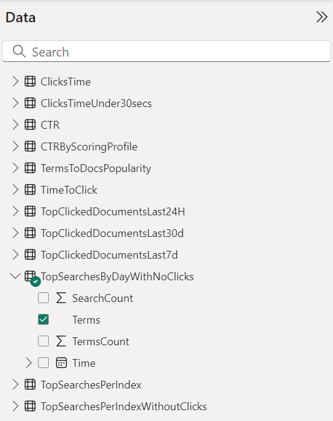

# Implement search traffic analytics in Azure Search
Search traffic analytics is a pattern for implementing a feedback loop for your search service. This pattern describes the necessary data and how to collect it using Application Insights, an industry leader for monitoring services in multiple platforms.

Search traffic analytics lets you gain visibility into your search service and unlock insights about your users and their behavior. By having data about what your users choose, it's possible to make decisions that further improve your search experience, and to back off when the results are not what expected.

Azure Search offers a telemetry solution that integrates Azure Application Insights and Power BI to provide in-depth monitoring and tracking. Because interaction with Azure Search is only through APIs, the telemetry must be implemented by the developers using search, following the instructions in this page.

## Identify relevant search data

To have useful search metrics, it's necessary to log some signals from the users of the search application. These signals signify content that users are interested in and that they consider relevant to their needs.

There are two signals Search Traffic Analytics needs:

1. User generated search events: only search queries initiated by a user are interesting. Search requests used to populate facets, additional content or any internal information, are not important and they skew and bias your results.

2. User generated click events: By clicks in this document, we refer to a user selecting a particular search result returned from a search query. A click generally means that a document is a relevant result for a specific search query.

By linking search and click events with a correlation id, it's possible to analyze the behaviors of users on your application. These search insights are impossible to obtain with only search traffic logs.

## Add search traffic analytics

The signals mentioned in the preceding section must be gathered from the search application as the user interacts with it. Application Insights is an extensible monitoring solution, available for multiple platforms, with flexible instrumentation options. Usage of Application Insights lets you take advantage of the Power BI search reports created by Azure Search to make the analysis of data easier.

In the [portal](https://portal.azure.com) page for your Azure Search service, the Search Traffic Analytics blade contains a cheat sheet for following this telemetry pattern. You can also select or create an Application Insights resource, and see the necessary data, all in one place.

![Search Traffic Analytics instructions][1]

## 1 - Select a resource

You need to select an Application Insights resource to use or create one if you don't have one already. You can use a resource that's already in use to log the required custom events.

When creating a new Application Insights resource, all application types are valid for this scenario. Select the one that best fits the platform you are using.

You need the instrumentation key for creating the telemetry client for your application. You can get it from the Application Insights portal dashboard, or you can get it from the Search Traffic Analytics page, selecting the instance you want to use.

## 2 - Add instrumentation

This phase is where you instrument your own search application, using the Application Insights resource your created in the step above. There are four steps to this process:

**Step 1: Create a telemetry client**
This is the object that sends events to the Application Insights Resource.

*C#*

    private TelemetryClient telemetryClient = new TelemetryClient();
    telemetryClient.InstrumentationKey = "<YOUR INSTRUMENTATION KEY>";

*JavaScript*

    

For other languages and platforms, see the complete [list](https://docs.microsoft.com/azure/application-insights/app-insights-platforms).

**Step 2: Request a Search ID for correlation**
To correlate search requests with clicks, it's necessary to have a correlation id that relates these two distinct events. Azure Search provides you with a Search Id when you request it with a header:

*C#*

    // This sample uses the Azure Search .NET SDK https://www.nuget.org/packages/Microsoft.Azure.Search

    var client = new SearchIndexClient(<SearchServiceName>, <IndexName>, new SearchCredentials(<QueryKey>)
    var headers = new Dictionary<string, List<string>>() { { "x-ms-azs-return-searchid", new List<string>() { "true" } } };
    var response = await client.Documents.SearchWithHttpMessagesAsync(searchText: searchText, searchParameters: parameters, customHeaders: headers);
    IEnumerable<string> headerValues;
    string searchId = string.Empty;
    if (response.Response.Headers.TryGetValues("x-ms-azs-searchid", out headerValues)){
     searchId = headerValues.FirstOrDefault();
    }

*JavaScript*

    request.setRequestHeader("x-ms-azs-return-searchid", "true");
    request.setRequestHeader("Access-Control-Expose-Headers", "x-ms-azs-searchid");
    var searchId = request.getResponseHeader('x-ms-azs-searchid');

**Step 3: Log Search events**

Every time that a search request is issued by a user, you should log that as a search event with the following schema on an Application Insights custom event:

**SearchServiceName**: (string) search service name
**SearchId**: (guid) unique identifier of the search query (comes in the search response)
**IndexName**: (string) search service index to be queried
**QueryTerms**: (string) search terms entered by the user
**ResultCount**: (int) number of documents that were returned (comes in the search response)
**ScoringProfile**: (string) name of the scoring profile used, if any

> [!NOTE]
> Request count on user generated queries by adding $count=true to your search query. See more information [here](https://docs.microsoft.com/rest/api/searchservice/search-documents#request)
>

> [!NOTE]
> Remember to only log search queries that are generated by users.
>

*C#*

    var properties = new Dictionary <string, string> {
    {"SearchServiceName", <service name>},
    {"SearchId", <search Id>},
    {"IndexName", <index name>},
    {"QueryTerms", <search terms>},
    {"ResultCount", <results count>},
    {"ScoringProfile", <scoring profile used>}
    };
    telemetryClient.TrackEvent("Search", properties);

*JavaScript*

    appInsights.trackEvent("Search", {
    SearchServiceName: <service name>,
    SearchId: <search id>,
    IndexName: <index name>,
    QueryTerms: <search terms>,
    ResultCount: <results count>,
    ScoringProfile: <scoring profile used>
    });

**Step 4: Log Click events**

Every time that a user clicks on a document, that's a signal that must be logged for search analysis purposes. Use Application Insights custom events to log these events with the following schema:

**ServiceName**: (string) search service name
**SearchId**: (guid) unique identifier of the related search query
**DocId**: (string) document identifier
**Position**: (int) rank of the document in the search results page

> [!NOTE]
> Position refers to the cardinal order in your application. You are free to set this number, as long as it's always the same, to allow for comparison.
>

*C#*

    var properties = new Dictionary <string, string> {
    {"SearchServiceName", <service name>},
    {"SearchId", <search id>},
    {"ClickedDocId", <clicked document id>},
    {"Rank", <clicked document position>}
    };
    telemetryClient.TrackEvent("Click", properties);

*JavaScript*

    appInsights.trackEvent("Click", {
    	SearchServiceName: <service name>,
    	SearchId: <search id>,
    	ClickedDocId: <clicked document id>,
    	Rank: <clicked document position>
    });

## 3 - Analyze in Power BI

After you have instrumented your app and verified your application is correctly connected to Application Insights, you can use a predefined template created by Azure Search for Power BI desktop. 

Azure search provides a monitoring [Power BI Content Pack](https://app.powerbi.com/getdata/services/azure-search) so that you can analyze log data. T The content pack adds predefined charts and tables useful for analyzing the additional data captured for search traffic analytics. For more information, see the [content pack help page](https://powerbi.microsoft.com/documentation/powerbi-content-pack-azure-search/). 

1. In the Azure Search dashboard left-navigation pane, under **Settings**, click **Search traffic analytics**.

2. On the **Search traffic analytics** page, in step 3, click **Get Power BI Desktop** to install Power BI.

   

2. On the same page, click **Download PowerBI report**.

3. The report opens in Power BI Desktop, and you are prompted to connect to Application Insights. You can find this information in the Azure portal pages for you Application Insights resource.

   

4. Click **Load**.

The report contains charts and tables that help you make more informed decisions to improve your search performance and relevance.

Metrics included the following items:

* Click through Rate (CTR): ratio of users who click on a specific document to the number of total searches.
* Searches without clicks: terms for top queries that register no clicks
* Most clicked documents: most clicked documents by ID in the last 24 hours, 7 days, and 30 days.
* Popular term-document pairs: terms that result in the same document clicked, ordered by clicks.
* Time to click: clicks bucketed by time since the search query

The following screenshot shows the built-in reports and charts for analyzing search traffic analytics.

## Next steps
Instrument your search application to get powerful and insightful data about your search service.

You can find more information on [Application Insights](https://docs.microsoft.com/azure/azure-monitor/app/app-insights-overview) and visit the [pricing page](https://azure.microsoft.com/pricing/details/application-insights/) to learn more about their different service tiers.

Learn more about creating amazing reports. See [Getting started with Power BI Desktop](https://powerbi.microsoft.com/documentation/powerbi-desktop-getting-started/) for details

<!--Image references-->
[1]: ./media/search-traffic-analytics/AzureSearch-TrafficAnalytics.png
[2]: ./media/search-traffic-analytics/AzureSearch-AppInsightsData.png
[3]: ./media/search-traffic-analytics/AzureSearch-PBITemplate.png
