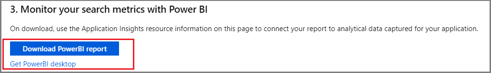
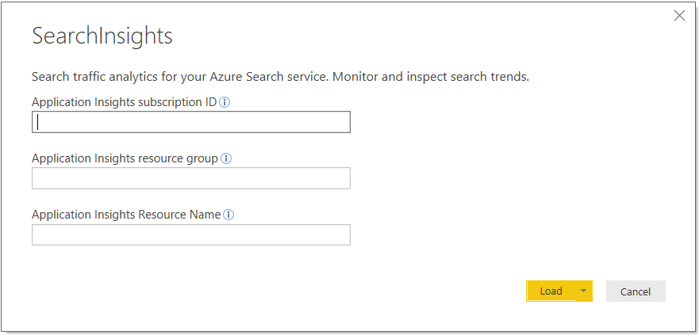

# Collect telemetry data for search traffic analytics

Search traffic analytics is a pattern for collecting telemetry about user interactions with your Azure AI Search application, such as user-initiated click events and keyboard inputs. Using this information, you can determine the effectiveness of your search solution, including popular search terms, clickthrough rate, and which query inputs yield zero results.

This pattern takes a dependency on [Application Insights](../azure-monitor/app/app-insights-overview.md) (a feature of [Azure Monitor](../azure-monitor/index.yml)) to collect user data. It requires that you add instrumentation to your client code, as described in this article. Finally, you will need a reporting mechanism to analyze the data. We recommend Power BI, but you can use the Application Dashboard or any tool that connects to Application Insights.

> [!NOTE]
> The pattern described in this article is for advanced scenarios and clickstream data generated by code you add to your client. In contrast, service logs are easy to set up, provide a range of metrics, and can be done in the portal with no code required. Enabling logging is recommended for all scenarios. For more information, see [Collect and analyze log data](monitor-azure-cognitive-search.md).

## Identify relevant search data

To have useful metrics for search traffic analytics, it's necessary to log some signals from the users of your search application. These signals signify content that users are interested in and that they consider relevant. For search traffic analytics, these include:

+ User-generated search events: Only search queries initiated by a user are interesting. Other search requests, such as those used to populate facets or retrieve internal information, are not important. Be sure to only instrument user-initiated events to avoid skew or bias in your results.

+ User-generated click events: On a search results page, a click event generally means that a document is a relevant result for a specific search query.

By linking search and click events with a correlation ID, you'll gain a deeper understanding of how well your application's search functionality is performing.

## Add search traffic analytics

In the [portal](https://portal.azure.com) page for your Azure AI Search service, open the Search Traffic Analytics page to access a cheat sheet for following this telemetry pattern. From this page, you can select or create an Application Insights resource, get the instrumentation key, copy snippets that you can adapt for your solution, and download a Power BI report that's built over the schema reflected in the pattern.


## 1 - Set up Application Insights

Select an existing Application Insights resource or [create one](/previous-versions/azure/azure-monitor/app/create-new-resource) if you don't have one already. If you use the Search Traffic Analytics page, you can copy the instrumentation key your application needs to connect to Application Insights.

Once you have an Application Insights resource, you can follow [instructions for supported languages and platforms](../azure-monitor/app/app-insights-overview.md#supported-languages) to register your app. Registration is simply adding the instrumentation key from Application Insights to your code, which sets up the association. You can find the key in the portal, or from the Search Traffic Analytics page when you select an existing resource.

A shortcut that works for some Visual Studio project types is reflected in the following steps. It creates a resource and registers your app in just a few clicks.

1. For Visual Studio and ASP.NET development, open your solution and select **Project** > **Add Application Insights Telemetry**.

1. Click **Get Started**.

1. Register your app by providing a Microsoft account, Azure subscription, and an Application Insights resource (a new resource is the default). Click **Register**.

At this point, your application is set up for application monitoring, which means all page loads are tracked with default metrics. For more information about the previous steps, see [Enable Application Insights server-side telemetry](../azure-monitor/app/asp-net-core.md#enable-application-insights-server-side-telemetry-visual-studio).

## 2 - Add instrumentation

This step is where you instrument your own search application, using the Application Insights resource your created in the step above. There are four steps to this process, starting with creating a telemetry client.

### Step 1: Create a telemetry client

Create an object that sends events to Application Insights. You can add instrumentation to your server-side application code or client-side code running in a browser, expressed here as C# and JavaScript variants (for other languages, see the complete list of [supported platforms and frameworks](../azure-monitor/app/app-insights-overview.md#supported-languages). Choose the approach that gives you the desired depth of information.

Server-side telemetry captures metrics at the application layer, for example in applications running as a web service in the cloud, or as an on-premises app on a corporate network. Server-side telemetry captures search and click events, the position of a document in results, and query information, but your data collection will be scoped to whatever information is available at that layer.

On the client, you might have additional code that manipulates query inputs, adds navigation, or includes context (for example, queries initiated from a home page versus a product page). If this describes your solution, you might opt for client-side instrumentation so that your telemetry reflects the additional detail. How this additional detail is collected goes beyond the scope of this pattern, but you can review [Application Insights for web pages](../azure-monitor/app/javascript.md#explore-browserclient-side-data) for more direction. 

**Use C#**

For C#, the **InstrumentationKey** should be defined in your application configuration, such as appsettings.json if your project is ASP.NET. Refer back to the registration instructions if you are unsure of the key location.

```csharp
private static TelemetryClient _telemetryClient;

// Add a constructor that accepts a telemetry client:
public HomeController(TelemetryClient telemetry)
{
    _telemetryClient = telemetry;
}
```

**Use JavaScript**

To create an object that sends events to Application Insights by using the JavaScript (Web) SDK Loader Script, see [Microsoft Azure Monitor Application Insights JavaScript SDK](../azure-monitor/app/javascript-sdk.md?tabs=javascriptwebsdkloaderscript#get-started).


### Step 2: Request a Search ID for correlation

To correlate search requests with clicks, it's necessary to have a correlation ID that relates these two distinct events. Azure AI Search provides you with a search ID when you request it with an HTTP header.

Having the search ID allows correlation of the metrics emitted by Azure AI Search for the request itself, with the custom metrics you are logging in Application Insights.

**Use C# (newer v11 SDK)**

The latest SDK requires the use of an Http Pipeline to set the header as detailed in this [sample](https://github.com/Azure/azure-sdk-for-net/blob/master/sdk/core/Azure.Core/samples/Pipeline.md#implementing-a-syncronous-policy).

```csharp
// Create a custom policy to add the correct headers
public class SearchIdPipelinePolicy : HttpPipelineSynchronousPolicy
{
    public override void OnSendingRequest(HttpMessage message)
    {
        message.Request.Headers.SetValue("x-ms-azs-return-searchid", "true");
    }
}
```

```csharp
// This sample uses the .NET SDK https://www.nuget.org/packages/Azure.Search.Documents

SearchClientOptions clientOptions = new SearchClientOptions();
clientOptions.AddPolicy(new SearchIdPipelinePolicy(), HttpPipelinePosition.PerCall);

var client = new SearchClient("<SearchServiceName>", "<IndexName>", new AzureKeyCredential("<QueryKey>"), options: clientOptions);

Response<SearchResults<SearchDocument>> response = await client.SearchAsync<SearchDocument>(searchText: searchText, searchOptions: options);
string searchId = string.Empty;
if (response.GetRawResponse().Headers.TryGetValues("x-ms-azs-searchid", out IEnumerable<string> headerValues))
{
    searchId = headerValues.FirstOrDefault();
}
```

**Use C# (older v10 SDK)**

```csharp
// This sample uses the .NET SDK https://www.nuget.org/packages/Microsoft.Azure.Search

var client = new SearchIndexClient(<SearchServiceName>, <IndexName>, new SearchCredentials(<QueryKey>));

// Use HTTP headers so that you can get the search ID from the response
var headers = new Dictionary<string, List<string>>() { { "x-ms-azs-return-searchid", new List<string>() { "true" } } };
var response = await client.Documents.SearchWithHttpMessagesAsync(searchText: searchText, searchParameters: parameters, customHeaders: headers);
string searchId = string.Empty;
if (response.Response.Headers.TryGetValues("x-ms-azs-searchid", out IEnumerable<string> headerValues))
{
    searchId = headerValues.FirstOrDefault();
}
```

**Use JavaScript (calling REST APIs)**

```javascript
request.setRequestHeader("x-ms-azs-return-searchid", "true");
request.setRequestHeader("Access-Control-Expose-Headers", "x-ms-azs-searchid");
var searchId = request.getResponseHeader('x-ms-azs-searchid');
```

### Step 3: Log Search events

Every time that a search request is issued by a user, you should log that as a search event with the following schema on an Application Insights custom event. Remember to log only user-generated search queries.

+ **SearchServiceName**: (string) search service name
+ **SearchId**: (guid) unique identifier of the search query (comes in the search response)
+ **IndexName**: (string) search service index to be queried
+ **QueryTerms**: (string) search terms entered by the user
+ **ResultCount**: (int) number of documents that were returned (comes in the search response)
+ **ScoringProfile**: (string) name of the scoring profile used, if any

> [!NOTE]
> Request the count of user generated queries by adding $count=true to your search query. For more information, see [Search Documents (REST)](/rest/api/searchservice/search-documents#query-parameters).
>

**Use C#**

```csharp
var properties = new Dictionary <string, string> 
{
    {"SearchServiceName", <service name>},
    {"SearchId", <search Id>},
    {"IndexName", <index name>},
    {"QueryTerms", <search terms>},
    {"ResultCount", <results count>},
    {"ScoringProfile", <scoring profile used>}
};
_telemetryClient.TrackEvent("Search", properties);
```

**Use JavaScript**

```javascript
appInsights.trackEvent("Search", {
  SearchServiceName: <service name>,
  SearchId: <search id>,
  IndexName: <index name>,
  QueryTerms: <search terms>,
  ResultCount: <results count>,
  ScoringProfile: <scoring profile used>
});
```

### Step 4: Log Click events

Every time that a user clicks on a document, that's a signal that must be logged for search analysis purposes. Use Application Insights custom events to log these events with the following schema:

+ **ServiceName**: (string) search service name
+ **SearchId**: (guid) unique identifier of the related search query
+ **DocId**: (string) document identifier
+ **Position**: (int) rank of the document in the search results page

> [!NOTE]
> Position refers to the cardinal order in your application. You are free to set this number, as long as it's always the same, to allow for comparison.
>

**Use C#**

```csharp
var properties = new Dictionary <string, string> 
{
    {"SearchServiceName", <service name>},
    {"SearchId", <search id>},
    {"ClickedDocId", <clicked document id>},
    {"Rank", <clicked document position>}
};
_telemetryClient.TrackEvent("Click", properties);
```

**Use JavaScript**

```javascript
appInsights.trackEvent("Click", {
    SearchServiceName: <service name>,
    SearchId: <search id>,
    ClickedDocId: <clicked document id>,
    Rank: <clicked document position>
});
```

## 3 - Analyze in Power BI

After you have instrumented your app and verified your application is correctly connected to Application Insights, you download a predefined report template to analyze data in Power BI desktop. The report contains predefined charts and tables useful for analyzing the additional data captured for search traffic analytics.

1. In the Azure AI Search dashboard left-navigation pane, under **Settings**, click **Search traffic analytics**.

1. On the **Search traffic analytics** page, in step 3, click **Get Power BI Desktop** to install Power BI.

   

1. On the same page, click **Download Power BI report**.

1. The report opens in Power BI Desktop, and you are prompted to connect to Application Insights and provide credentials. You can find connection information in the Azure portal pages for your Application Insights resource. For credentials, provide the same user name and password that you use for portal sign-in.

   

1. Click **Load**.

The report contains charts and tables that help you make more informed decisions to improve your search performance and relevance.

Metrics included the following items:

+ Search volume and most popular term-document pairs: terms that result in the same document clicked, ordered by clicks.
+ Searches without clicks: terms for top queries that register no clicks

The following screenshot shows what a built-in report might look like if you have used all of the schema elements.


## Next steps

Instrument your search application to get powerful and insightful data about your search service.

You can find more information on [Application Insights](../azure-monitor/app/app-insights-overview.md) and visit the [pricing page](https://azure.microsoft.com/pricing/details/application-insights/) to learn more about their different service tiers.

Learn more about creating amazing reports. See [Getting started with Power BI Desktop](/power-bi/fundamentals/desktop-getting-started) for details.
