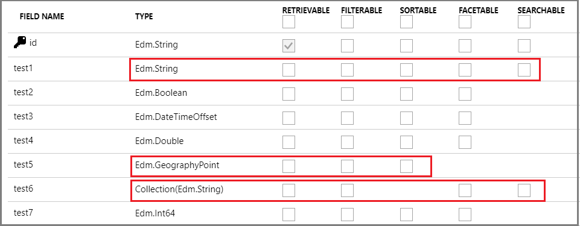

# Create a basic index in Azure Cognitive Search

In Azure Cognitive Search, an *index* is a persistent store of *documents* and other constructs used for filtered and full text search on an Azure Cognitive Search service. Conceptually, a document is a single unit of searchable data in your index. For example, an e-commerce retailer might have a document for each item they sell, a news organization might have a document for each article, and so forth. Mapping these concepts to more familiar database equivalents: an *index* is conceptually similar to a *table*, and *documents* are roughly equivalent to *rows* in a table.

When you add or upload an index, Azure Cognitive Search creates physical structures based on the schema you provide. For example, if a field in your index is marked as searchable, an inverted index is created for that field. Later, when you add or upload documents, or submit search queries to Azure Cognitive Search, you are sending requests to a specific index in your search service. Loading fields with document values is called *indexing* or data ingestion.

You can create an index in the portal, [REST API](search-create-index-rest-api.md), or [.NET SDK](search-create-index-dotnet.md).

## Recommended workflow

Arriving at the right index design is typically achieved through multiple iterations. Using a combination of tools and APIs can help you finalize your design quickly.

1. Determine whether you can use an [indexer](search-indexer-overview.md#supported-data-sources). If your external data is one of the supported data sources, you can prototype and load an index using the [**Import data**](search-import-data-portal.md) wizard.

2. If you can't use **Import data**, you can still [create an initial index in the portal](search-create-index-portal.md), adding fields, data types, and assigning attributes using controls on the **Add Index** page. The portal shows you which attributes are available for different data types. If you're new to index design, this is helpful.

   
  
   When you click **Create**, all of the physical structures supporting your index are created in your search service.

3. Download the index schema using [Get Index REST API](https://docs.microsoft.com/rest/api/searchservice/get-index) and a web testing tool like [Postman](search-get-started-postman.md). You now have a JSON representation of the index you created in the portal. 

   You are switching to a code-based approach at this point. The portal is not well suited for iteration because you cannot edit an index that is already created. But you can use Postman and REST for the remaining tasks.

4. [Load your index with data](search-what-is-data-import.md). Azure Cognitive Search accepts JSON documents. To load your data programmatically, you can use Postman with JSON documents in the request payload. If your data is not easily expressed as JSON, this step will be the most labor intensive.

5. Query your index, examine results, and further iterate on the index schema until you begin to see the results you expect. You can use [**Search explorer**](search-explorer.md) or Postman to query your index.

6. Continue using code to iterate over your design.  

Because physical structures are created in the service, [dropping and recreating indexes](search-howto-reindex.md) is necessary whenever you make material changes to an existing field definition. This means that during development, you should plan on frequent rebuilds. You might consider working with a subset of your data to make rebuilds go faster. 

Code, rather than a portal approach, is recommended for iterative design. If you rely on the portal for index definition, you will have to fill out the index definition on each rebuild. As an alternative, tools like [Postman and the REST API](search-get-started-postman.md) are helpful for proof-of-concept testing when development projects are still in early phases. You can make incremental changes to an index definition in a request body, and then send the request to your service to recreate an index using an updated schema.

## Components of an index

Schematically, an Azure Cognitive Search index is composed of the following elements. 

The [*fields collection*](#fields-collection) is typically the largest part of an index, where each field is named, typed, and attributed with allowable behaviors that determine how it is used. Other elements include [suggesters](#suggesters), [scoring profiles](#scoring-profiles), [analyzers](#analyzers) with component parts to support customization, [CORS](#cors) and [encryption key](#encryption-key) options.

```json
{
  "name": (optional on PUT; required on POST) "name_of_index",
  "fields": [
    {
      "name": "name_of_field",
      "type": "Edm.String | Collection(Edm.String) | Edm.Int32 | Edm.Int64 | Edm.Double | Edm.Boolean | Edm.DateTimeOffset | Edm.GeographyPoint",
      "searchable": true (default where applicable) | false (only Edm.String and Collection(Edm.String) fields can be searchable),
      "filterable": true (default) | false,
      "sortable": true (default where applicable) | false (Collection(Edm.String) fields cannot be sortable),
      "facetable": true (default where applicable) | false (Edm.GeographyPoint fields cannot be facetable),
      "key": true | false (default, only Edm.String fields can be keys),
      "retrievable": true (default) | false,
      "analyzer": "name_of_analyzer_for_search_and_indexing", (only if 'searchAnalyzer' and 'indexAnalyzer' are not set)
      "searchAnalyzer": "name_of_search_analyzer", (only if 'indexAnalyzer' is set and 'analyzer' is not set)
      "indexAnalyzer": "name_of_indexing_analyzer", (only if 'searchAnalyzer' is set and 'analyzer' is not set)
      "synonymMaps": [ "name_of_synonym_map" ] (optional, only one synonym map per field is currently supported)
    }
  ],
  "suggesters": [
    {
      "name": "name of suggester",
      "searchMode": "analyzingInfixMatching",
      "sourceFields": ["field1", "field2", ...]
    }
  ],
  "scoringProfiles": [
    {
      "name": "name of scoring profile",
      "text": (optional, only applies to searchable fields) {
        "weights": {
          "searchable_field_name": relative_weight_value (positive #'s),
          ...
        }
      },
      "functions": (optional) [
        {
          "type": "magnitude | freshness | distance | tag",
          "boost": # (positive number used as multiplier for raw score != 1),
          "fieldName": "...",
          "interpolation": "constant | linear (default) | quadratic | logarithmic",
          "magnitude": {
            "boostingRangeStart": #,
            "boostingRangeEnd": #,
            "constantBoostBeyondRange": true | false (default)
          },
          "freshness": {
            "boostingDuration": "..." (value representing timespan leading to now over which boosting occurs)
          },
          "distance": {
            "referencePointParameter": "...", (parameter to be passed in queries to use as reference location)
            "boostingDistance": # (the distance in kilometers from the reference location where the boosting range ends)
          },
          "tag": {
            "tagsParameter": "..." (parameter to be passed in queries to specify a list of tags to compare against target fields)
          }
        }
      ],
      "functionAggregation": (optional, applies only when functions are specified) 
        "sum (default) | average | minimum | maximum | firstMatching"
    }
  ],
  "analyzers":(optional)[ ... ],
  "charFilters":(optional)[ ... ],
  "tokenizers":(optional)[ ... ],
  "tokenFilters":(optional)[ ... ],
  "defaultScoringProfile": (optional) "...",
  "corsOptions": (optional) {
    "allowedOrigins": ["*"] | ["origin_1", "origin_2", ...],
    "maxAgeInSeconds": (optional) max_age_in_seconds (non-negative integer)
  },
  "encryptionKey":(optional){
    "keyVaultUri": "azure_key_vault_uri",
    "keyVaultKeyName": "name_of_azure_key_vault_key",
    "keyVaultKeyVersion": "version_of_azure_key_vault_key",
    "accessCredentials":(optional){
      "applicationId": "azure_active_directory_application_id",
      "applicationSecret": "azure_active_directory_application_authentication_key"
    }
  }
}
```

<a name="fields-collection"></a>

## Fields collection and field attributes

As you define your schema, you must specify the name, type, and attributes of each field in your index. The field type classifies the data that is stored in that field. Attributes are set on individual fields to specify how the field is used. The following tables enumerate the types and attributes you can specify.

### Data types
| Type | Description |
| --- | --- |
| *Edm.String* |Text that can optionally be tokenized for full-text search (word-breaking, stemming, and so forth). |
| *Collection(Edm.String)* |A list of strings that can optionally be tokenized for full-text search. There is no theoretical upper limit on the number of items in a collection, but the 16 MB upper limit on payload size applies to collections. |
| *Edm.Boolean* |Contains true/false values. |
| *Edm.Int32* |32-bit integer values. |
| *Edm.Int64* |64-bit integer values. |
| *Edm.Double* |Double-precision numeric data. |
| *Edm.DateTimeOffset* |Date time values represented in the OData V4 format (for example, `yyyy-MM-ddTHH:mm:ss.fffZ` or `yyyy-MM-ddTHH:mm:ss.fff[+/-]HH:mm`). |
| *Edm.GeographyPoint* |A point representing a geographic location on the globe. |

You can find more detailed information about Azure Cognitive Search's [supported data types here](https://docs.microsoft.com/rest/api/searchservice/Supported-data-types).

### Index attributes

Exactly one field in your index must be the designated as a **key** field that uniquely identifies each document.

Other attributes determine how a field is used in an application. For example, the **searchable** attribute is assigned to every field that should be included in a full text search. 

The APIs you use to build an index have varying default behaviors. For the [REST APIs](https://docs.microsoft.com/rest/api/searchservice/Create-Index), most attributes are enabled by default (for example, **searchable** and **retrievable** are true for string fields) and you often only need to set them if you want to turn them off. For the .NET SDK, the opposite is true. On any property you do not explicitly set, the default is to disable the corresponding search behavior unless you specifically enable it.

| Attribute | Description |
| --- | --- |
| `key` |A string that provides the unique ID of each document, used for document lookup. Every index must have one key. Only one field can be the key, and its type must be set to Edm.String. |
| `retrievable` |Specifies whether a field can be returned in a search result. |
| `filterable` |Allows the field to be used in filter queries. |
| `Sortable` |Allows a query to sort search results using this field. |
| `facetable` |Allows a field to be used in a [faceted navigation](search-faceted-navigation.md) structure for user self-directed filtering. Typically fields containing repetitive values that you can use to group multiple documents together (for example, multiple documents that fall under a single brand or service category) work best as facets. |
| `searchable` |Marks the field as full-text searchable. |

## Index size

The size of an index is determined by the size of the documents you upload, plus index configuration, such as whether you include suggesters, and how you set attributes on individual fields. The following screenshot illustrates index storage patterns resulting from various combinations of attributes.

The index is based on the [built-in real estate sample](search-get-started-portal.md) data source, which you can index and query in the portal. Although the index schemas are not shown, you can infer the attributes based on the index name. For example, *realestate-searchable* index has the **searchable** attribute selected and nothing else, *realestate-retrievable* index has the **retrievable** attribute selected and nothing else, and so forth.


Although these index variants are artificial, we can refer to them for broad comparisons of how attributes affect storage. Does setting **retrievable** increase index size? No. Does adding fields to a **Suggester** increase index size? Yes.

Indexes that support filter and sort are proportionally larger than those supporting just full text search. Filter and sort operations scan for exact matches, requiring the presence of intact documents. In contrast, searchable fields supporting full-text and fuzzy search use inverted indexes, which are populated with tokenized terms that consume less space than whole documents. 

> [!Note]
> Storage architecture is considered an implementation detail of Azure Cognitive Search and could change without notice. There is no guarantee that current behavior will persist in the future.

## Suggesters
A suggester is a section of the schema that defines which fields in an index are used to support auto-complete or type-ahead queries in searches. Typically, partial search strings are sent to the [Suggestions (REST API)](https://docs.microsoft.com/rest/api/searchservice/suggestions) while the user is typing a search query, and the API returns a set of suggested documents or phrases. 

Fields added to a suggester are used to build type-ahead search terms. All of the search terms are created during indexing and stored separately. For more information about creating a suggester structure, see [Add suggesters](index-add-suggesters.md).

## Scoring profiles

A [scoring profile](index-add-scoring-profiles.md) is a section of the schema that defines custom scoring behaviors that let you influence which items appear higher in the search results. Scoring profiles are made up of field weights and functions. To use them, you specify a profile by name on the query string.

A default scoring profile operates behind the scenes to compute a search score for every item in a result set. You can use the internal, unnamed scoring profile. Alternatively, set **defaultScoringProfile** to use a custom profile as the default, invoked whenever a custom profile is not specified on the query string.

## Analyzers

The analyzers element sets the name of the language analyzer to use for the field. For more information about the range of analyzers available to you, see [Adding analyzers to an Azure Cognitive Search index](search-analyzers.md). Analyzers can only be used with searchable fields. Once the analyzer is assigned to a field, it cannot be changed unless you rebuild the index.

## CORS

Client-side JavaScript cannot call any APIs by default since the browser will prevent all cross-origin requests. To allow cross-origin queries to your index, enable CORS (Cross-Origin Resource Sharing) by setting the **corsOptions** attribute. For security reasons, only query APIs support CORS. 

The following options can be set for CORS:

+ **allowedOrigins** (required): This is a list of origins that will be granted access to your index. This means that any JavaScript code served from those origins will be allowed to query your index (assuming it provides the correct api-key). Each origin is typically of the form `protocol://<fully-qualified-domain-name>:<port>` although `<port>` is often omitted. See [Cross-origin resource sharing (Wikipedia)](https://en.wikipedia.org/wiki/Cross-origin_resource_sharing) for more details.

  If you want to allow access to all origins, include `*` as a single item in the **allowedOrigins** array. *This is not recommended practice for production search services* but it is often useful for development and debugging.

+ **maxAgeInSeconds** (optional): Browsers use this value to determine the duration (in seconds) to cache CORS preflight responses. This must be a non-negative integer. The larger this value is, the better performance will be, but the longer it will take for CORS policy changes to take effect. If it is not set, a default duration of 5 minutes will be used.

## Encryption Key

While all Azure Cognitive Search indexes are encrypted by default using Microsoft-managed keys, indexes can be configured to be encrypted with **customer-managed keys** in Key Vault. To learn more, see [Manage encryption keys in Azure Cognitive Search](search-security-manage-encryption-keys.md).

## Next steps

With an understanding of index composition, you can continue in the portal to create your first index.

> [!div class="nextstepaction"]
> [Add an index (portal)](search-create-index-portal.md)
