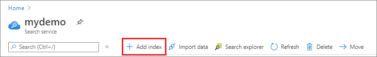
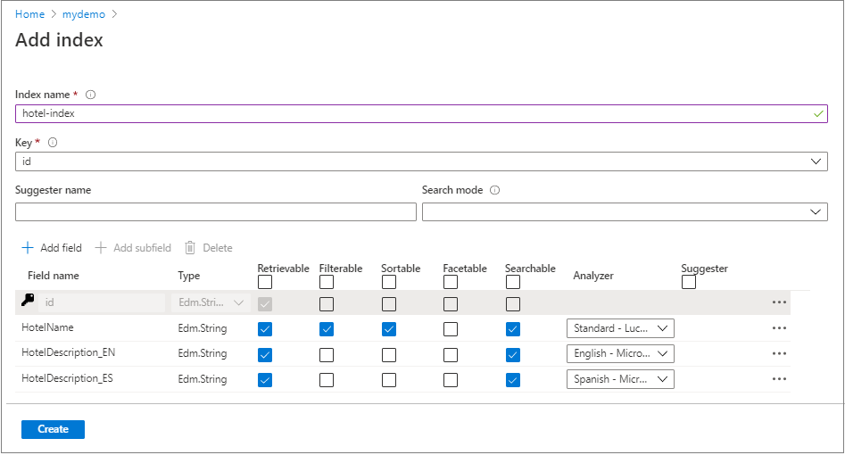
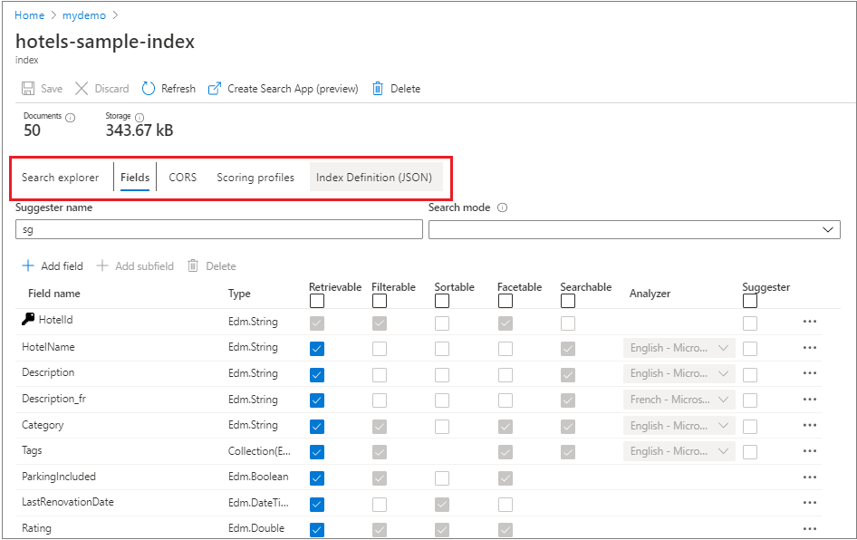
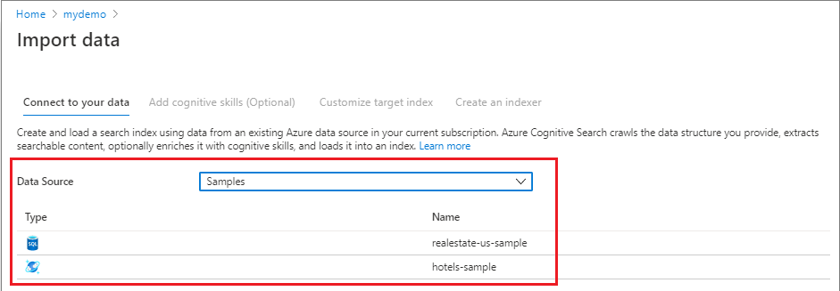

# Create a basic search index in Azure Cognitive Search

In Azure Cognitive Search, a *search index* stores searchable content used for full text and filtered queries. An index is defined by a schema and saved to the service, with data import following as a second step. 

Indexes contain *documents*. Conceptually, a document is a single unit of searchable data in your index. A retailer might have a document for each product, a news organization might have a document for each article, and so forth. Mapping these concepts to more familiar database equivalents: a *search index* equates to a *table*, and *documents* are roughly equivalent to *rows* in a table.

The physical structure of an index is determined by the schema, with fields marked as "searchable" resulting in an inverted index created for that field. 

You can create an index with the following tools and APIs:

* In the Azure portal, use **Add Index** or **Import data** wizard
* Using the [Create Index (REST API)](/rest/api/searchservice/create-index)
* Using the [.NET SDK](./search-get-started-dotnet.md)

It's easier to learn with a portal tool. The portal enforces requirements and schema rules for specific data types, such as disallowing full text search capabilities on numeric fields. Once you have a workable index, you can transition to code by retrieving the JSON definition from the service using [Get Index (REST API)](/rest/api/searchservice/get-index) and adding it to your solution.

## Recommended workflow

Arriving at a final index design is an iterative process. It's common to start with the portal to create the initial index and then switch to code to place the index under source control.

1. Determine whether you can use [**Import data**](search-import-data-portal.md). The wizard performs all-in-one indexer-based indexing if the source data is from a [supported data source type in Azure](search-indexer-overview.md#supported-data-sources).

1. If you can't use **Import data**, start with **Add Index** to define the schema.

   

1. Provide a name and key used to uniquely identify each search document in the index. The key is mandatory and must be of type Edm.String. During import, you should plan on mapping a unique field in source data to this field. 

   The portal gives you an `id` field for the key. To override the default `id`, create a new field  (for example, a new field definition called `HotelId`) and then select it in **Key**.

   

1. Add more fields. The portal shows you which [field attributes](#index-attributes) are available for different data types. If you're new to index design, this is helpful.

   If incoming data is hierarchical in nature, assign the [complex type](search-howto-complex-data-types.md) data type to represent the nested structures. The built-in sample data set, Hotels, illustrates complex types using an Address (contains multiple sub-fields) that has a one-to-one relationship with each hotel, and a Rooms complex collection, where multiple rooms are associated with each hotel. 

1. Assign any [Analyzers](#analyzers) to string fields before the index is created. Do the same for [suggesters](#suggesters) if you want to enabled autocomplete on specific fields.

1. Click **Create** to build the physical structures in your search service.

1. After an index is created, use additional commands to review definitions or add more elements.

   

1. Download the index schema using [Get Index (REST API)](/rest/api/searchservice/get-index) and a web testing tool like [Postman](search-get-started-postman.md). You now have a JSON representation of the index that you can adapt for code.

1. [Load your index with data](search-what-is-data-import.md). Azure Cognitive Search accepts JSON documents. To load your data programmatically, you can use Postman with JSON documents in the request payload. If your data is not easily expressed as JSON, this step will be the most labor intensive. 

    Once an index is loaded with data, most edits to existing fields will require that you drop and rebuild an index.

1. Query your index, examine results, and further iterate on the index schema until you begin to see the results you expect. You can use [**Search explorer**](search-explorer.md) or Postman to query your index.

During development, plan on frequent rebuilds. Because physical structures are created in the service, [dropping and recreating indexes](search-howto-reindex.md) is necessary for most modifications to an existing field definition. You might consider working with a subset of your data to make rebuilds go faster. 

> [!Tip]
> Code, rather than a portal approach, is recommended for working on index design and data import simultaneously. As an alternative, tools like [Postman and the REST API](search-get-started-postman.md) are helpful for proof-of-concept testing when development projects are still in early phases. You can make incremental changes to an index definition in a request body, and then send the request to your service to recreate an index using an updated schema.

## Index schema

An index is required to have a name and one designated key field (of Edm.string) in the fields collection. The [*fields collection*](#fields-collection) is typically the largest part of an index, where each field is named, typed, and attributed with allowable behaviors that determine how it is used. 

Other elements include [suggesters](#suggesters), [scoring profiles](#scoringprofiles), [analyzers](#analyzers) used to process strings into tokens according to linguistic rules or other characteristics supported by the analyzer, and [cross-origin remote scripting (CORS)](#corsoptions) settings.

```json
{
  "name": (optional on PUT; required on POST) "name_of_index",
  "fields": [
    {
      "name": "name_of_field",
      "type": "Edm.String | Collection(Edm.String) | Edm.Int32 | Edm.Int64 | Edm.Double | Edm.Boolean | Edm.DateTimeOffset | Edm.GeographyPoint",
      "searchable": true (default where applicable) | false (only Edm.String and Collection(Edm.String) fields can be searchable),
      "filterable": true (default) | false,
      "sortable": true (default where applicable) | false (Collection(Edm.String) fields cannot be sortable),
      "facetable": true (default where applicable) | false (Edm.GeographyPoint fields cannot be facetable),
      "key": true | false (default, only Edm.String fields can be keys),
      "retrievable": true (default) | false,
      "analyzer": "name_of_analyzer_for_search_and_indexing", (only if 'searchAnalyzer' and 'indexAnalyzer' are not set)
      "searchAnalyzer": "name_of_search_analyzer", (only if 'indexAnalyzer' is set and 'analyzer' is not set)
      "indexAnalyzer": "name_of_indexing_analyzer", (only if 'searchAnalyzer' is set and 'analyzer' is not set)
      "synonymMaps": [ "name_of_synonym_map" ] (optional, only one synonym map per field is currently supported)
    }
  ],
  "suggesters": [
    {
      "name": "name of suggester",
      "searchMode": "analyzingInfixMatching",
      "sourceFields": ["field1", "field2", ...]
    }
  ],
  "scoringProfiles": [
    {
      "name": "name of scoring profile",
      "text": (optional, only applies to searchable fields) {
        "weights": {
          "searchable_field_name": relative_weight_value (positive #'s),
          ...
        }
      },
      "functions": (optional) [
        {
          "type": "magnitude | freshness | distance | tag",
          "boost": # (positive number used as multiplier for raw score != 1),
          "fieldName": "...",
          "interpolation": "constant | linear (default) | quadratic | logarithmic",
          "magnitude": {
            "boostingRangeStart": #,
            "boostingRangeEnd": #,
            "constantBoostBeyondRange": true | false (default)
          },
          "freshness": {
            "boostingDuration": "..." (value representing timespan leading to now over which boosting occurs)
          },
          "distance": {
            "referencePointParameter": "...", (parameter to be passed in queries to use as reference location)
            "boostingDistance": # (the distance in kilometers from the reference location where the boosting range ends)
          },
          "tag": {
            "tagsParameter": "..." (parameter to be passed in queries to specify a list of tags to compare against target fields)
          }
        }
      ],
      "functionAggregation": (optional, applies only when functions are specified) 
        "sum (default) | average | minimum | maximum | firstMatching"
    }
  ],
  "analyzers":(optional)[ ... ],
  "charFilters":(optional)[ ... ],
  "tokenizers":(optional)[ ... ],
  "tokenFilters":(optional)[ ... ],
  "defaultScoringProfile": (optional) "...",
  "corsOptions": (optional) {
    "allowedOrigins": ["*"] | ["origin_1", "origin_2", ...],
    "maxAgeInSeconds": (optional) max_age_in_seconds (non-negative integer)
  },
  "encryptionKey":(optional){
    "keyVaultUri": "azure_key_vault_uri",
    "keyVaultKeyName": "name_of_azure_key_vault_key",
    "keyVaultKeyVersion": "version_of_azure_key_vault_key",
    "accessCredentials":(optional){
      "applicationId": "azure_active_directory_application_id",
      "applicationSecret": "azure_active_directory_application_authentication_key"
    }
  }
}
```

<a name="fields-collection"></a>

## Fields collection and field attributes

Fields have a name, a type that classifies the stored data, and attributes that specify how the field is used.

### Data types

| Type | Description |
|------|-------------|
| Edm.String |Text that can optionally be tokenized for full-text search (word-breaking, stemming, and so forth). |
| Collection(Edm.String) |A list of strings that can optionally be tokenized for full-text search. There is no theoretical upper limit on the number of items in a collection, but the 16 MB upper limit on payload size applies to collections. |
| Edm.Boolean |Contains true/false values. |
| Edm.Int32 |32-bit integer values. |
| Edm.Int64 |64-bit integer values. |
| Edm.Double |Double-precision numeric data. |
| Edm.DateTimeOffset |Date time values represented in the OData V4 format (for example, `yyyy-MM-ddTHH:mm:ss.fffZ` or `yyyy-MM-ddTHH:mm:ss.fff[+/-]HH:mm`). |
| Edm.GeographyPoint |A point representing a geographic location on the globe. |

For more information, see [supported data types](/rest/api/searchservice/Supported-data-types).

<a name="index-attributes"></a>

### Attributes

Field attributes determine how a field is used, such as whether it is used in full text search, faceted navigation, sort operations, and so forth. 

String fields are often marked as "searchable" and "retrievable". Fields used to narrow search results include "sortable", "filterable", and "facetable".

|Attribute|Description|  
|---------------|-----------------|  
|"searchable" |Full-text searchable, subject to lexical analysis such as word-breaking during indexing. If you set a searchable field to a value like "sunny day", internally it will be split into the individual tokens "sunny" and "day". For details, see [How full text search works](search-lucene-query-architecture.md).|  
|"filterable" |Referenced in $filter queries. Filterable fields of type `Edm.String` or `Collection(Edm.String)` do not undergo word-breaking, so comparisons are for exact matches only. For example, if you set such a field f to "sunny day", `$filter=f eq 'sunny'` will find no matches, but `$filter=f eq 'sunny day'` will. |  
|"sortable" |By default the system sorts results by score, but you can configure sort based on fields in the documents. Fields of type `Collection(Edm.String)` cannot be "sortable". |  
|"facetable" |Typically used in a presentation of search results that includes a hit count by category (for example, hotels in a specific city). This option cannot be used with fields of type `Edm.GeographyPoint`. Fields of type `Edm.String` that are filterable, "sortable", or "facetable" can be at most 32 kilobytes in length. For details, see [Create Index (REST API)](/rest/api/searchservice/create-index).|  
|"key" |Unique identifier for documents within the index. Exactly one field must be chosen as the key field and it must be of type `Edm.String`.|  
|"retrievable" |Determines whether the field can be returned in a search result. This is useful when you want to use a field (such as *profit margin*) as a filter, sorting, or scoring mechanism, but do not want the field to be visible to the end user. This attribute must be `true` for `key` fields.|  

Although you can add new fields at any time, existing field definitions are locked in for the lifetime of the index. For this reason, developers typically use the portal for creating simple indexes, testing ideas, or using the portal pages to look up a setting. Frequent iteration over an index design is more efficient if you follow a code-based approach so that you can rebuild the index easily.

> [!NOTE]
> The APIs you use to build an index have varying default behaviors. For the [REST APIs](/rest/api/searchservice/Create-Index), most attributes are enabled by default (for example, "searchable" and "retrievable" are true for string fields) and you often only need to set them if you want to turn them off. For the .NET SDK, the opposite is true. On any property you do not explicitly set, the default is to disable the corresponding search behavior unless you specifically enable it.

## `analyzers`

The analyzers element sets the name of the language analyzer to use for the field. For more information about the range of analyzers available to you, see [Adding analyzers to an Azure Cognitive Search index](search-analyzers.md). Analyzers can only be used with searchable fields. Once the analyzer is assigned to a field, it cannot be changed unless you rebuild the index.

## `suggesters`

A suggester is a section of the schema that defines which fields in an index are used to support auto-complete or type-ahead queries in searches. Typically, partial search strings are sent to the [Suggestions (REST API)](/rest/api/searchservice/suggestions) while the user is typing a search query, and the API returns a set of suggested documents or phrases. 

Fields added to a suggester are used to build type-ahead search terms. All of the search terms are created during indexing and stored separately. For more information about creating a suggester structure, see [Add suggesters](index-add-suggesters.md).

## `corsOptions`

Client-side JavaScript cannot call any APIs by default since the browser will prevent all cross-origin requests. To allow cross-origin queries to your index, enable CORS (Cross-Origin Resource Sharing) by setting the **corsOptions** attribute. For security reasons, only query APIs support CORS. 

The following options can be set for CORS:

+ **allowedOrigins** (required): This is a list of origins that will be granted access to your index. This means that any JavaScript code served from those origins will be allowed to query your index (assuming it provides the correct api-key). Each origin is typically of the form `protocol://<fully-qualified-domain-name>:<port>` although `<port>` is often omitted. See [Cross-origin resource sharing (Wikipedia)](https://en.wikipedia.org/wiki/Cross-origin_resource_sharing) for more details.

  If you want to allow access to all origins, include `*` as a single item in the **allowedOrigins** array. *This is not recommended practice for production search services* but it is often useful for development and debugging.

+ **maxAgeInSeconds** (optional): Browsers use this value to determine the duration (in seconds) to cache CORS preflight responses. This must be a non-negative integer. The larger this value is, the better performance will be, but the longer it will take for CORS policy changes to take effect. If it is not set, a default duration of 5 minutes will be used.

## `scoringProfiles`

A [scoring profile](index-add-scoring-profiles.md) is a section of the schema that defines custom scoring behaviors that let you influence which items appear higher in the search results. Scoring profiles are made up of field weights and functions. To use them, you specify a profile by name on the query string.

A default scoring profile operates behind the scenes to compute a search score for every item in a result set. You can use the internal, unnamed scoring profile. Alternatively, set **defaultScoringProfile** to use a custom profile as the default, invoked whenever a custom profile is not specified on the query string.

<a name="index-size"></a>

## Attributes and index size (storage implications)

The size of an index is determined by the size of the documents you upload, plus index configuration, such as whether you include suggesters, and how you set attributes on individual fields. 

The following screenshot illustrates index storage patterns resulting from various combinations of attributes. The index is based on the **real estate sample index**, which you can create easily using the Import data wizard. Although the index schemas are not shown, you can infer the attributes based on the index name. For example, *realestate-searchable* index has the "searchable" attribute selected and nothing else, *realestate-retrievable* index has the "retrievable" attribute selected and nothing else, and so forth.


Although these index variants are artificial, we can refer to them for broad comparisons of how attributes affect storage. Does setting "retrievable" increase index size? No. Does adding fields to a **suggester** increase index size? Yes.

Indexes that support filter and sort are proportionally larger than indexes supporting just full text search. This is because filter and sort operations scan for exact matches, requiring the presence of verbatim text strings. In contrast, searchable fields supporting full-text queries use inverted indexes, which are populated with tokenized terms that consume less space than whole documents. 

> [!Note]
> Storage architecture is considered an implementation detail of Azure Cognitive Search and could change without notice. There is no guarantee that current behavior will persist in the future.

## Next steps

With an understanding of index composition, you can continue in the portal to create your first index. We recommend starting with **Import data** wizard, choosing either the *realestate-us-sample* or *hotels-sample* hosted data sources.

> [!div class="nextstepaction"]
> [Import data wizard (portal)](search-get-started-portal.md)

For both data sets, the wizard can infer an index schema, import the data, and output a searchable index that you can query using Search Explorer. Find these data sources in the **Connect to your data** page of the **Import data** wizard.

   