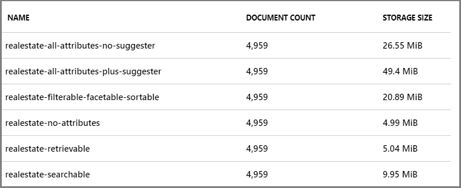

# Indexes in Azure AI Search

In Azure AI Search, a *search index* is your searchable content, available to the search engine for indexing, full text search, and filtered queries. An index is defined by a schema and saved to the search service, with data import following as a second step. This content exists within your search service, apart from your primary data stores, which is necessary for the millisecond response times expected in modern applications. Except for specific indexing scenarios, the search service will never connect to or query your local data.

If you're creating and managing a search index, this article helps you understand the following:

+ Content (documents and schema)
+ Physical representation
+ Basic operations

Prefer to be hands-on right away? See [Create a search index](search-how-to-create-search-index.md) instead.

## Content of a search index

In Azure AI Search, indexes contain *search documents*. Conceptually, a document is a single unit of searchable data in your index. For example, a retailer might have a document for each product, a news organization might have a document for each article, a travel site might have a document for each hotel and destination, and so forth. Mapping these concepts to more familiar database equivalents: a *search index* equates to a *table*, and *documents* are roughly equivalent to *rows* in a table.

The structure of a document is determined by the index schema, as illustrated below. The "fields" collection is typically the largest part of an index, where each field is named, assigned a [data type](/rest/api/searchservice/Supported-data-types), and attributed with allowable behaviors that determine how it's used.

```json
{
  "name": "name_of_index, unique across the service",
  "fields": [
    {
      "name": "name_of_field",
      "type": "Edm.String | Collection(Edm.String) | Edm.Int32 | Edm.Int64 | Edm.Double | Edm.Boolean | Edm.DateTimeOffset | Edm.GeographyPoint",
      "searchable": true (default where applicable) | false (only Edm.String and Collection(Edm.String) fields can be searchable),
      "filterable": true (default) | false,
      "sortable": true (default where applicable) | false (Collection(Edm.String) fields cannot be sortable),
      "facetable": true (default where applicable) | false (Edm.GeographyPoint fields cannot be facetable),
      "key": true | false (default, only Edm.String fields can be keys),
      "retrievable": true (default) | false,
      "analyzer": "name_of_analyzer_for_search_and_indexing", (only if 'searchAnalyzer' and 'indexAnalyzer' are not set)
      "searchAnalyzer": "name_of_search_analyzer", (only if 'indexAnalyzer' is set and 'analyzer' is not set)
      "indexAnalyzer": "name_of_indexing_analyzer", (only if 'searchAnalyzer' is set and 'analyzer' is not set)
      "synonymMaps": [ "name_of_synonym_map" ] (optional, only one synonym map per field is currently supported)
    }
  ],
  "suggesters": [ ],
  "scoringProfiles": [ ],
  "analyzers":(optional)[ ... ],
  "charFilters":(optional)[ ... ],
  "tokenizers":(optional)[ ... ],
  "tokenFilters":(optional)[ ... ],
  "defaultScoringProfile": (optional) "...",
  "corsOptions": (optional) { },
  "encryptionKey":(optional){ }
  }
}
```

Other elements are collapsed for brevity, but the following links can provide the detail: 

+ [Suggesters](index-add-suggesters.md) support type-ahead queries like autocomplete
+ [Scoring Profiles](index-add-scoring-profiles.md) are used for relevance tuning
+ [Analyzers](search-analyzers.md) are used to process strings into tokens according to linguistic rules or other characteristics supported by the analyzer
+ [Cross-origin remote scripting (CORS)](search-how-to-create-search-index.md#corsoptions) is used for apps that issues requests from different domains
+ [Encryption key](search-security-manage-encryption-keys.md) is used for double-encryption of sensitive content in the index.

### Field definitions

A search document is defined by the "fields" collection in the body of [Create Index request](/rest/api/searchservice/create-index). You need fields for document identification (keys), storing searchable text, and fields for supporting filters, facets, and sorts. You might also need fields for data that a user never sees. For example, you might want fields for profit margins or marketing promotions that you can use to modify search rank.

If incoming data is hierarchical in nature, you can represent it within an index as a [complex type](search-howto-complex-data-types.md), used to represent nested structures. The built-in sample data set, Hotels, illustrates complex types using an Address (contains multiple subfields) that has a one-to-one relationship with each hotel, and a Rooms complex collection, where multiple rooms are associated with each hotel. 

<a name="index-attributes"></a>

### Field attributes

Field attributes determine how a field is used, such as whether it's used in full text search, faceted navigation, sort operations, and so forth. 

String fields are often marked as "searchable" and "retrievable". Fields used to narrow search results include "sortable", "filterable", and "facetable".

|Attribute|Description|  
|---------------|-----------------|  
|"searchable" |Full-text searchable, subject to lexical analysis such as word-breaking during indexing. If you set a searchable field to a value like "sunny day", internally it's split into the individual tokens "sunny" and "day". For details, see [How full text search works](search-lucene-query-architecture.md).|  
|"filterable" |Referenced in $filter queries. Filterable fields of type `Edm.String` or `Collection(Edm.String)` don't undergo word-breaking, so comparisons are for exact matches only. For example, if you set such a field f to "sunny day", `$filter=f eq 'sunny'` finds no matches, but `$filter=f eq 'sunny day'` will. |  
|"sortable" |By default the system sorts results by score, but you can configure sort based on fields in the documents. Fields of type `Collection(Edm.String)` can't be "sortable". |  
|"facetable" |Typically used in a presentation of search results that includes a hit count by category (for example, hotels in a specific city). This option can't be used with fields of type `Edm.GeographyPoint`. Fields of type `Edm.String` that are filterable, "sortable", or "facetable" can be at most 32 kilobytes in length. For details, see [Create Index (REST API)](/rest/api/searchservice/create-index).|  
|"key" |Unique identifier for documents within the index. Exactly one field must be chosen as the key field and it must be of type `Edm.String`.|  
|"retrievable" |Determines whether the field can be returned in a search result. This is useful when you want to use a field (such as *profit margin*) as a filter, sorting, or scoring mechanism, but don't want the field to be visible to the end user. This attribute must be `true` for `key` fields.|  

Although you can add new fields at any time, existing field definitions are locked in for the lifetime of the index. For this reason, developers typically use the portal for creating simple indexes, testing ideas, or using the portal pages to look up a setting. Frequent iteration over an index design is more efficient if you follow a code-based approach so that you can rebuild the index easily.

> [!NOTE]
> The APIs you use to build an index have varying default behaviors. For the [REST APIs](/rest/api/searchservice/Create-Index), most attributes are enabled by default (for example, "searchable" and "retrievable" are true for string fields) and you often only need to set them if you want to turn them off. For the .NET SDK, the opposite is true. On any property you do not explicitly set, the default is to disable the corresponding search behavior unless you specifically enable it.

<a name="index-size"></a>

## Physical structure and size

In Azure AI Search, the physical structure of an index is largely an internal implementation. You can access its schema, query its content, monitor its size, and manage capacity, but the clusters themselves (indices, [shards](search-capacity-planning.md#concepts-search-units-replicas-partitions-shards), and other files and folders) are managed internally by Microsoft.

You can monitor index size in the Indexes tab in the Azure portal, or by issuing a [GET INDEX request](/rest/api/searchservice/get-index) against your search service. You can also issue a [Service Statistics request](/rest/api/searchservice/get-service-statistics) and check the value of storage size.

The size of an index is determined by:

+ Quantity and composition of your documents
+ Attributes on individual fields
+ Index configuration (specifically, whether you include suggesters)

Document composition and quantity are determined by what you choose to import. Remember that a search index should only contain searchable content. If source data includes binary fields, omit those fields unless you're using AI enrichment to crack and analyze the content to create text searchable information.

Field attributes determine behaviors. To support those behaviors, the indexing process creates the necessary data structures. For example, "searchable" invokes [full text search](search-lucene-query-architecture.md), which scans inverted indices for the tokenized term. In contrast, a "filterable" or "sortable" attribute supports iteration over unmodified strings. The example in the next section shows variations in index size based on the selected attributes.

[**Suggesters**](index-add-suggesters.md) are constructs that support type-ahead or autocomplete queries. As such, when you include a suggester, the indexing process creates the data structures necessary for verbatim character matches. Suggesters are implemented at the field level, so choose only those fields that are reasonable for type-ahead.

### Example demonstrating the storage implications of attributes and suggesters

The following screenshot illustrates index storage patterns resulting from various combinations of attributes. The index is based on the **real estate sample index**, which you can create easily using the Import data wizard and built-in sample data. Although the index schemas aren't shown, you can infer the attributes based on the index name. For example, *realestate-searchable* index has the "searchable" attribute selected and nothing else, *realestate-retrievable* index has the "retrievable" attribute selected and nothing else, and so forth.



Although these index variants are somewhat artificial, we can refer to them for broad comparisons of how attributes affect storage:

+ "retrievable" has no effect on index size.
+ "filterable", "sortable", "facetable" consume more storage.
+ **suggester** has a large potential for increasing index size, but not as much as the screenshot would indicate (all fields that could be made suggester-aware were selected, which isn't a likely scenario in most indexes).

Also not reflected in the above table is the effect of [analyzers](search-analyzers.md). If you're using the edgeNgram tokenizer to store verbatim sequences of characters (`a, ab, abc, abcd`), the size of the index will be larger than if you used a standard analyzer.

## Basic operations and interaction

Now that you have a better idea of what an index is, this section introduces index run time operations, including connecting to and securing a single index.

> [!NOTE]
> When managing an index, be aware that there is no portal or API support for moving or copying an index. Instead, customers typically point their application deployment solution at a different search service (if using the same index name), or revise the name to create a copy on the current search service, and then build it.

### Index isolation
  
In Azure AI Search, you'll work with one index at a time, where all index-related operations target a single index. There's no concept of related indexes or the joining of independent indexes for either indexing or querying. 

### Continuously available

An index is immediately available for queries as soon as the first document is indexed, but won't be fully operational until all documents are indexed. Internally, a search index is [distributed across partitions and executes on replicas](search-capacity-planning.md#concepts-search-units-replicas-partitions-shards). The physical index is managed internally. The logical index is managed by you.

An index is continuously available, with no ability to pause or take it offline. Because it's designed for continuous operation, any updates to its content, or additions to the index itself, happen in real time. As a result, queries might temporarily return incomplete results if a request coincides with a document update.

Notice that query continuity exists for document operations (refreshing or deleting) and for modifications that don't affect the existing structure and integrity of the current index (such as adding new fields). If you need to make structural updates (changing existing fields), those are typically managed using a drop-and-rebuild workflow in a development environment, or by creating a new version of the index on production service.

To avoid an [index rebuild](search-howto-reindex.md), some customers who are making small changes choose to "version" a field by creating a new one that coexists alongside a previous version. Over time, this leads to orphaned content in the form of obsolete fields or obsolete custom analyzer definitions, especially in a production index that is expensive to replicate. You can address these issues on planned updates to the index as part of index lifecycle management.

### Endpoint connection and security

All indexing and query requests target an index. Endpoints are usually one of the following:

| Endpoint | Connection and access control |
|----------|-------------------------------|
| `<your-service>.search.windows.net/indexes` | Targets the indexes collection. Used when creating, listing, or deleting an index. Admin rights are required for these operations, available through admin [API keys](search-security-api-keys.md) or a [Search Contributor role](search-security-rbac.md#built-in-roles-used-in-search). |
| `<your-service>.search.windows.net/indexes/<your-index>/docs` | Targets the documents collection of a single index. Used when querying an index or data refresh. For queries, read rights are sufficient, and available through query API keys or a data reader role. For data refresh, admin rights are required. |

## Next steps

You can get hands-on experience creating an index using almost any sample or walkthrough for Azure AI Search. For starters, you could choose any of the quickstarts from the table of contents.

But you'll also want to become familiar with methodologies for loading an index with data. Index definition and data import strategies are defined in tandem. The following articles provide more information about creating and loading an index.

+ [Create a search index](search-how-to-create-search-index.md)

+ [Create an index alias](search-how-to-alias.md)

+ [Data import overview](search-what-is-data-import.md)

+ [Add, Update or Delete Documents (REST)](/rest/api/searchservice/addupdate-or-delete-documents) 
