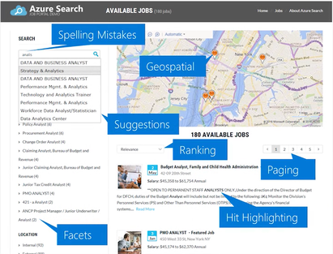

# What is Azure Search?

Azure Search offers a dedicated and programmable search engine with intelligent search behaviors to power the search bar for content on your website, in your apps, and in corporate file or data stores. 

Auto-correct and auto-complete, synonyms and suggestions, boosting and tuned ranking, filtering and sorting, built-in navigation and paging support: all of these features contribute to an intuitive search experience typical of what users now expect, and are easy to implement using Azure Search.

## How it works

To use Azure Search, provision a free or paid service in your Azure subscription, create and load an index containing your searchable content, and then call APIs to issue search requests and handle results. A paid service is required if you want dedicated resources at scale.

|Tier |Description |
|-----|------------|
|Free | A shared service readily available for learning and evaluation |
|billable | A dedicated service at graduated levels of capacity to accommodate a range of deployment scenarios at different pricing tiers|

Azure Search runs in the cloud as a managed service from Microsoft, and is easily integrated with custom code on any application platform. Your fully managed service and private content is globally available, programmable, scalable, and recoverable. Services run 24-7 with service level agreements backed by Microsoft Azure.

## How it compares

Google, Bing, and other cloud service providers offer custom search engines with features that power a search bar in custom apps. Most vendors offer comparable baseline features. Typically, it's a specialized feature, or the ease and simplicity of APIs, tools, and management that determines the best fit.

In a discussion of features, Azure Search is differentiated by deep integration with other Azure services. Developers already using Azure App services or other Microsoft products find it easy to incrementally add additional capability like search into custom apps running on Microsoft's cloud platform.

The Azure portal offers centralized oversight for all services. You can monitor and scale your service in the same tool used to manage all of your cloud services. In Azure Search, wizards and query exploration provide tooling for data import and simple testing and validation.

At the data layer, there is automated indexing on Azure table storage, blob storage, DocumentDB, SQL Database, SQL Server on Azure VMs. You have full programmatic control over data ingestion. Synchronization between search and inventory databases, for example during Black Friday or Cyber Monday sales, is a business requirement that's not easily met by every vendor.

A common question is why does Azure Search store its own copy of your searchable content. Storing data in the cloud offers the most reliable and high-performance throughput, with no impact on transactional data stores. You only store searchable data such as text and numeric data that users search for. It is rare to store a fully redundant copy of existing data.

### Feature summary

Azure Search offers the advantages of a cloud solution, but customers often choose it for efficiency of its APIs and breadth of features:

+ APIs for building indexes and search constructs with minimal code. Faceting and filter constructs make it easy to build out categories and navigation for self-directed search. 
+ Indexer components automate index definition, data import, and refresh for Azure data stores: DocumentDB, SQL Database, SQL Server on Azure VMs, Table storage, Blob storage for unstructured and semi-structured documents.
+ Query parsing and lexical analysis provide intelligent full text search, with support for language analyzers from Lucene and Microsoft natural language processing. Custom analyzers offer deep control over linguistic analysis, tokenization, and filters.
+ Auto-complete, suggested queries, synonyms, fuzzy search for incomplete or misspelled keywords, hit-highlighting, moreLikeThis.
+ Geo-search support for find-near-me searches.
+ Scoring profiles and field boosting to tune search rankings based on business logic or context.

### Feature drilldown

**Query Features** 
Queries can be formulated using the [simple query syntax](https://msdn.microsoft.com/library/azure/dn798920.aspx), which offers logical operators, phrase search operators, suffix operators, precedence operators. Additionally, the [Lucene query syntax](https://msdn.microsoft.com/library/azure/mt589323.aspx) can enable fuzzy search, proximity search, term boosting, and regular expressions. Azure Search also supports custom lexical analyzers to allow your application to handle complex search queries using phonetic matching and regular expressions.

**Language support** is [included for 56 different languages](https://msdn.microsoft.com/library/azure/dn879793.aspx). Using both Lucene analyzers and Microsoft analyzers (refined by years of natural language processing in Office and Bing), Azure Search can analyze text in your application's search box to intelligently handle language-specific linguistics including verb tenses, gender, irregular plural nouns (for example, 'mouse' vs. 'mice'), word de-compounding, word-breaking (for languages with no spaces), and more.

**Search suggestions** can be enabled for autocompleted search bars and type-ahead queries. [Actual documents in your index are suggested](https://msdn.microsoft.com/library/azure/dn798936.aspx) as users enter partial search input.

**Hit highlighting** [allows](https://msdn.microsoft.com/library/azure/dn798927.aspx) users to see the snippet of text in each result that contains the matches for their query. You can choose which fields return highlighted snippets.

**Faceted navigation** is easily added to your search results page with Azure Search. Using [just a single query parameter](https://msdn.microsoft.com/library/azure/dn798927.aspx), Azure Search returns all the necessary information to construct a faceted search experience in your app's UI to allow users to drill down and filter search results (for example, filter catalog items by price-range or brand).

**Geo-spatial** support allows you to intelligently process, filter, and display geographic locations. Azure Search enables users to explore data based on the proximity of a search result to a specified location or based on a specific geographic region. This video explains how it works: [Channel 9: Azure Search and Geospatial data](https://channel9.msdn.com/Shows/Data-Exposed/Azure-Search-and-Geospatial-Data).

**Filters** can be used to easily incorporate faceted navigation into your application's UI, enhance query formulation, and filter based on user- or developer-specified criteria. Create powerful filters using the [OData syntax](https://msdn.microsoft.com/library/azure/dn798921.aspx).

**High availability** ensures an extremely reliable search service experience. When scaled properly, [Azure Search offers a 99.9% SLA](https://azure.microsoft.com/support/legal/sla/search/v1_0/).

**Fully managed** as an end-to-end solution, Azure Search requires absolutely no infrastructure management. Your service can be easily tailored to your needs by scaling in two dimensions to handle more document storage, higher query loads, or both.

**Data integration** using [indexers](https://msdn.microsoft.com/library/azure/dn946891.aspx) allows Azure Search to automatically crawl Azure SQL Database, Azure DocumentDB, or [Azure Blob storage](search-howto-indexing-azure-blob-storage.md) to sync your search index's content with your primary data store.

**Document cracking** enables [indexing of major file formats](search-howto-indexing-azure-blob-storage.md) including Microsoft Office as well as PDF and HTML documents.

**Search traffic analytics** are [easily collected and analyzed](search-traffic-analytics.md) to unlock insights from what users are typing into the search box.

**Simple scoring** is a key benefit of Azure Search. [Scoring profiles](https://msdn.microsoft.com/library/azure/dn798928.aspx) are used to allow organizations to model relevance as a function of values in the documents themselves. For example, you might want newer products or discounted products to appear higher in the search results. You can also build scoring profiles using tags for personalized scoring based on customer search preferences you've tracked and stored separately.

**Sorting** is offered for multiple fields via the index schema and then toggled at query-time with a single search parameter.

**Paging** and throttling your search results is [straightforward with the finely tuned control](search-pagination-page-layout.md) that Azure Search offers over your search results.  

**Search explorer** allows you to issue queries against all of your indexes right from your account's Azure portal so you can easily test queries and refine scoring profiles.

## APIs: REST | .Net

|Platform |Description |
|-----|------------|
|REST | HTTP commands supported by any programming platform and language, including Xamarin, Java, and JavaScript|
|.NET SDK | .NET wrapper for the REST API for more efficient coding in C# and other managed-code languages targeting the .NET Framework |

## How to get started

Start with a free service and then create and query an index using sample built-in data. You can use the portal for all tasks, which is a quick way to try out Azure Search before having to write a single line of code.

Azure subscribers can [provision a service in the Free tier](search-create-service-portal.md).

If you aren't a subscriber, you can [open an Azure account for free](https://azure.microsoft.com/pricing/free-trial/?WT.mc_id=A261C142F): You get credits you can use to try out paid Azure services, and even after they're used up you can keep the account and use free Azure services, such as Websites. Your credit card will never be charged, unless you explicitly change your settings and ask to be charged.

Alternatively, you can [activate MSDN subscriber benefits](https://azure.microsoft.com/pricing/member-offers/msdn-benefits-details/?WT.mc_id=A261C142F): Your MSDN subscription gives you credits every month that you can use for paid Azure services. 

## Watch a short video

Search engines are the preeminent methodology for finding information on mobile apps, on the web, and in corporate data stores.  

Watch this [Azure Search Overview video](https://channel9.msdn.com/Events/Connect/2016/138) (Channel9, 9-minute video) from program manager, Liam Cavanagh for a visual introduction into how Azure Search can meet your serach requirements. The first three minutes cover important features and search scenarios, followed by code demonstrations.

